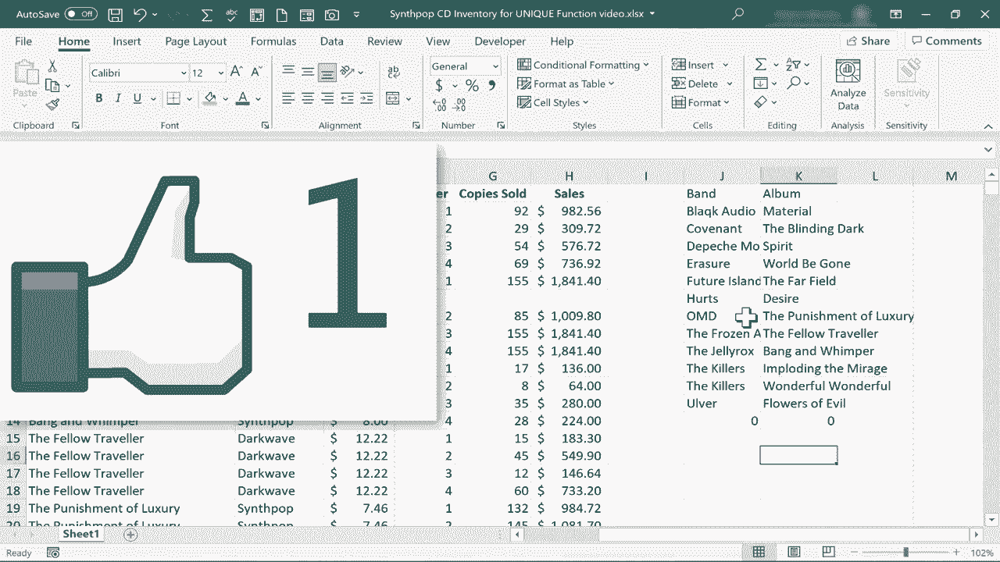

# 【双语字幕+速查表下载】Excel正确打开方式！提效技巧大合集！(持续更新中) - P45：45）两个动态数组函数：UNIQUE 和 SORT - ShowMeAI - BV1Jg411F7cS

In this video， we're going to look at two of Excel's new dynamic array functions。

 the unique function and the sort function。 and we'll look at how you can use the two together to do some pretty exciting things。

 So here I have a spreadsheet with a list of bands albums and some more information about those albums。

 But as you can see the bands are repeated。 and so are the albums why because it's listed out by quarter each quarter of the year。

  different sales results， things like that。 So now what if I want to generate just a list of all of the bands。

 That's it， I don't need duplicates， I just need a list of every single band。 Well。

 I can do that now by using the fairly new unique function in Microsoft Excel。

 and you should be able to use this function if you have the Microsoft 365 version of Excel。

 So I'm going click here on cell J2 and then I'll type equals unique and you'll notice as I start typing unique Excel suggests some possible functions that I might want to use but unique is。

What I want， I put in my left parenthesis。 Now， what comes next。 Excel is asking for an array。

 So what's the array that I want Excel to look for unique items in。 Well， it's this。 It's column B。

 Now I could select the whole column just by left clicking on B。 You can see what Excel does。

 it puts in B colon B。 In other words， the entire B column。 I should put in my right parenthesis。

 I don't really have to。 I'll tap enter。 and you'll notice what it did。

 It found every unique word or phrase in that column and reproduced it over here in J2。

 Now it couldn't fit all of the data in J2。 And so it spilled the results。

 Hopefully you watched my previous video on spilled results in Excel。 Now， these results are dynamic。

 We've spilled a dynamic array or range。 So now watch what happens。

 if I change the data that that's based upon。 For example， let's say I delete the jelly rocks。

 They're a really fun band。 If I remove all reference。to them out of the band list。

 you'll notice that my spilled results change to reflect that。 I'm gonna undo that。 Okay。

 let's try it again。 but this time I want to not only get the bands。

 but I also want to get the albums。 Let's try that。 I'll click on J 2。

 and I could click on J1 doesn't really matter。 Actually， I think I'll go with J1 this time。

 equals unique left parenthesis。 I'll click and drag from B to C， write parenthesis tap enter。

 and look at the spilled results。 it spilled both the album and the band。

 but only the ones that are unique。 So take a look at what happens。 if I insert another record。

 let's say the killers， wonderful wonderful， I tap enter。

 look what happened to my dynamic range or dynamic array。

 the spilled results change to reflect what I've added。 Now， you might say， but wait， the band。

 the killers is not unique from the band。 the killers。 Well， that's true。 But in my formula。

 I said I wanted。What's unique in columns B and C。 So it takes into account the data in B and the data in C to decide what is unique and what is not。

 So because the band and album together are unique。 it is listed here in my results。

 the next thing I'd like to try is I would like to not only filter out the things that are not unique。

 but I also want to sort the results based on the band name。 let's see if we can do that。

 So I'll click on J1， I'll delete the contents of that cell。 and as you know。

 all of this spilled data is generated based on the formula in J1。

 So when I delete that it gets rid of all the spilled data。

 So here in J1 this time I'll type equals unique left parenthesis and then I'll type in sort。

 So is another dynamic array function。 Left parenthesis。

 and then I'll go over and choose B and C let's take a look at my formula so far。

 and often it's best to look in the formula bar for this。

Look up there at this point I'm going to put a right parenthesis and then another right parenthesis tapap enter on the keyboard and just take a look at those results here at the right not only did it produce the unique albums together with the bands but they're all alphabetized based on the band name Now it's also possible to do a sort just by typing equals sort left parenthesis and picking a range in this case a whole column tapping enter so you can just use the sort function to sort any range and spill the results below and sometimes to the right so you can do it that way。

 but I think it's particularly exciting to do it the way I showed to combine sort with unique in this case but you can also combine it with other dynamic array functions to do two things at once to produce only the unique data and then to sort it Thanks for watching this tutorial。

 I hope you found it to be helpful if you did please check out my other dynamic array function videos and also my video on spilled results but if you did find it to be helpful please。

Follow and subscribe and when you do click the bell so you'll be notified when I posted another video if you'd like to support my channel you can do that through my Patreon account and by buying channel mech and you'll see links to those opportunities in the description below the video。

