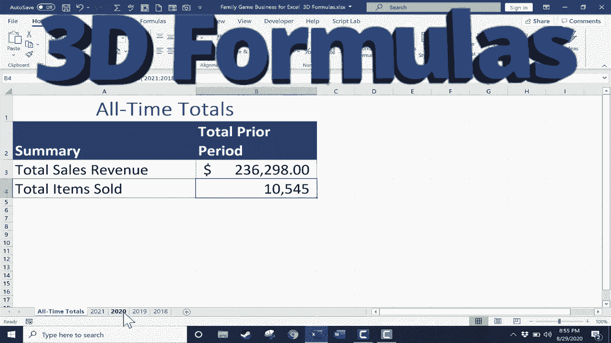

# 【双语字幕+速查表下载】Excel高级教程（持续更新中） - P17：17）3D 公式 - ShowMeAI - BV1sQ4y1B71N

In this video， we will look at how to create what are called 3D formulas in Excel。

 And the reason these are called 3D formulas is because they help you pull information that is not on the X axis or the Y axis。

 but is actually on the Z axis going deeper into a workbook。 So hopefully that makes sense。

 And as you can see here， I have a workbook made up of several spreadsheets。

 and each of these spreadsheets tracks game sales for a hypothetical board game and card game store。

 You can see that it goes back to 2018。 and each of these sheets tracks the sales for each month of that particular year。

 And each year's sales figures are totaled here in green。 Now。

 it's important to notice this that each of these spreadsheets is set up exactly the same way。

 The data is different。 but the layout and where the information is stored is in the same place。

 That's a huge advantage when you're trying to do。3D formulas in Excel。

 So let's say I manage the books and the numbers for this small business。

 and maybe my supervisor or my boss asks for alltime totals。

 What is the total amount of revenue brought in by this company since it began in 2018。

 and also what are the total number of items sold alltime by this company。

 So there are a couple of different ways we could do this。

 let's look at a way that just links the data from these other spreadsheets to this cover sheet。

 Okay， so the first method would be to click on the cell where you want to display In this case。

 the total sales revenue and then you would type equals and you could just type the function sum left parenthesis and then with the parenthesis open with just the left parenthesis typed in you can click on the next spreadsheet down here by clicking on the tab and you can see the formula is still active here at the top in the formula bar and then I could click on。

Grand totalal sales for the year，2021 in this case。 you'll notice it changed the formula。

 And then here in the formula bar， I'm just going to click and then type a plus sign。

 and then I'll go to 2020 and select the cell with the grand total sales。

 and then go back up here to the formula bar。 tapap a plus sign。

 I could go to 2019 and do the same thing and then type a plus sign and 2018。

 click on the grand total sales for 2018。 and then I can simply go up here to the formula bar。

 put in a right parenthesis and tap enter on the keyboard and that formula returns the grand total alltime sales revenue so that I can see that。

 So that's one way to do this。 Just link the data from each of these other spreadsheets to the front cover sheet。

 But that was kind of a pane。 Let's look at how to do it a much easier way。

 And let's see if we get the same results。 This time I'm going to use a 3D formula。

 So I'll delete the number that was there。 tap enter。 Okay。Once again。

 I'll click on the cell where I want to display the alltime total sales revenue， and again。

 I'll type equals， and I'll type sum left parentheesis， and again， I'll click on 2021。

 and I'll click on the cell where the total sales for 2021 are listed。 So that's B16。 Now。

 the trick to make this a 3D formula is you just hold the shift key on the keyboard and go down here。

 and because I want to add up all four of the grand total sales for each of these years。

 holding the shift key， I just click on 2018 and look。

 it highlighted all four of those tabs all four of those spreadsheets basically。

 and now I'll tap enter on the keyboard and look， it produced the same result， but much easier。

 much quicker。 Now， keep in mind the only reason that worked is because all of these spreadsheets follow the same format。

 the same layout。 The information in B。16， in each case deals with grand total sales for that particular year。

 Let's try it again。 But this time with just the total items sold all time。

 I've clicked on the cell where I want to display the data。 I type equals sum left parentheesis。 Now。

 in my example， I want to add up things。 So I'm using some a lot。 But keep in mind。

 you can do the same kind of 3D formula with max min large， small average。

 Just about any function just about any formula。 you can turn into a 3D formula。 Okay。

 so what do I want to some。 Well， I'll start with 2021。 total items sold in a year。 And of course。

 that shouldn't have a dollar sign。 That's a mistake on my part。 It should just be total units sold。

 I'll click there on the cell。 And then going down to the tabs for each of the spreadsheets。

 I hold the shift key。 And notice if I were to stop at 2019。 it only highlights 2021，2020，2019。

But I want to go all the way to 2018。 so I'll click on that as well。

 Now I can release the shift key and tap enter on the keyboard totalal items sold 10。

545 Now like I said， those aren't really dollars so I'm going to change this just to general and I'll add in a comma there and I can get rid of the decimals using this button here and I will fix this in the practice sheet so that you won't have to make these changes yourself so hopefully you can see the advantages of using 3D formulas to pull in data from more than one sheet and bring it together onto one sheet。

