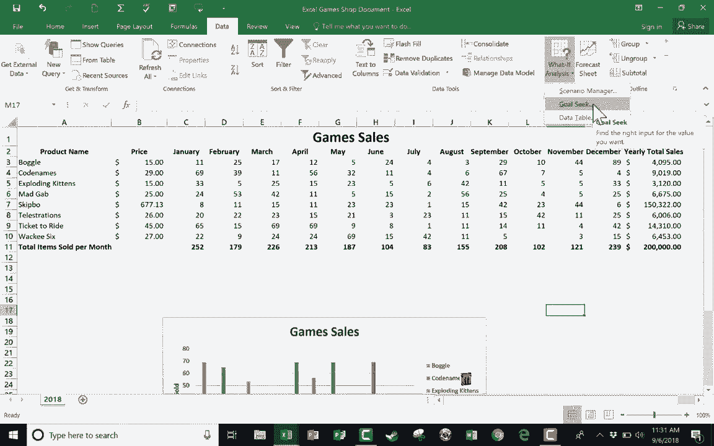

# 【双语字幕+速查表下载】Excel高级教程（持续更新中） - P1：1）What If 使用场景管理器和目标搜索进行分析 - ShowMeAI - BV1sQ4y1B71N

In this tutorial I'm going to show you two of the what if analysis features in Microsoft Excel。

 First， we'll look at scenario manager and then we'll look at goalse。

 And both of these what they help us to do is to envision what could happen if some things fall into place。

 And the spreadsheet that we're going to use for this is this games sales spreadsheet。

 and it's a spreadsheet for a hypothetical board and card game store。

 And you can see there's some board games and card games here at the left with their price here and the 12 months of the year。

 Now you can see over here to the right。 We have the yearly total sales for each of these board games。

 and these are dollars。 So if you look at the formula for these。 If I double click on that sell。

 It says that it's the sum of these numbers multiplied by the cost of the item and then we have a grand total amount of money earned this year by selling these game。

But let's say I want to dream a little bit and look forward to next year。 and I want to ask myself。

 what could I do to get this number here of grand total amount of money taken in by this small business。

 What if I want to get that to1 hundred000 or a million or even more Well。

 I can use the what if analysis features that are found here on the data tab the data ribbon over here on the right where it says forecast So I'm going to click where it says what if analysis and it pops up with three options。

 scenario manager goalse and data table。 We're gonna look at the first two in this tutorial。

 So I'll click on scenario manager and it pops open with a kind of wizard here。

 this will help me to make my scenarios and to compare them and I get to create those scenarios。

 Now this can be a little tricky the first time you do it。

 So hopefully this video will help with that。 What you'll do is you'll click here to add a new scenario and maybe I want to first start with just acknowledging where。

We stand right now。 So I'll type in something like current year。 That's the name of this scenario。

 And then next， it wants me to establish what is it that we're gonna to be looking at in these scenarios。

 What might hypothetically change And so let's say with this small business。

 I want to make a push for Christmas time。 I want to try to sell more than I ever have at Christmas time of these games。

 Well， here where it says changing cells， I can just click this button here。

 and then click and drag to select the December numbers for each of the games。

 And then I can tap enter on the keyboard。 and it puts in that range。 Next。

 I can put in some comments。 so I can say actual current year numbers。 click O。

 And here it wants me to put in some hypothetical numbers that we might be able to achieve。

 But remember， in this case， this is just the actual current numbers。

 This is what I'm gonna be comparing against。 And so I don't really want to change these。

 I'll just click O。 And now I've got。The current year actual information stored here in this first scenario。

 Now， I'm going to add a second scenario。 and this is gonna to be the optimistic scenario。

 And here for comment， I'm going to put best case scenario for December sales。 and then I'll click O。

 And now for this one， I'm going say all right， best case scenario。

 Maybe we sell 100 of each of these items。 and then I click O。 Now I've got the optimistic scenario。

 Finally， I'm going to add the pessimistic scenario。 It's the same sales and3 through N 10。

 and this is the worst case scenario。 I click O。 and let's say the worst case scenario is three sales each。

 I click O。 And so now at this point， I have three scenarios。 Of course， I could add more。

 But now all I have to do is click on one of these scenarios and click show and look the numbers I'll update。

 Now I realized I didn't update all of the numbers like I should have。

So I need to go in and fix that。 So here in pessimistic scenario， I'm going to edit。

 and I'm going to click O and notice the mistake I made。 I just typed in the number3 down to here。

 record number 5。 but notice that there is a scroll bar and I need to scroll down to change the other hypothetical numbers。

 Click O， Give me a minute to do so with the optimistic scenario， and then I'll resume the video。

 Okay， now that I've fixed that mistake。 let's take a look at our  three scenarios。

 We have the current scenario。 I just clicked on it and then clicked show。

 You can also double click to get the same result。 So the current year $51000 taken in by the small business。

 in the optimistic scenario of a strong December。 If I double click there。 It updates the numbers。

 and that takes us to $64000。 What about the pessimistic scenario。 I double click there。

 and we could drop down to $46000。Now， hopefully you can see the reason why I like to have a scenario that reflects the actual data。

 the real data it's because that way I can easily compare and contrast I can go back and forth between the different options。

 Now I'm going to click close and notice that I'm purposefully leaving the setting to be optimistic scenario I click close and notice that now my spreadsheet shows that optimistic scenario。

 so it is important that when you're done with a scenario manager that you go back to the real data click close and then you'll be back where you need to be。

Next， let's look at the what if analysis goal seek。 And this is similar。 It's kind of related。

 Let's say I want to set a goal of not 51000 in sales， but rather 200000。

 So I'm going click here on sell 011， That's the place for the goal。 And then what is the goal。

 Let's say 200000。 So I type in 200000。 And hell am I going to get to that goal。

 What number is going to change that's going to get us to this point。

 Now this is going to be a little bit outlandish。 but let's say I want to get us to 200000 in sales just by selling the game ticket to ride。

 So I could click this sell for the December sales of ticket to ride。 click O。

 and it calculates in order for us to get to the goal of 200000 in sales just by improving what we sell for ticket to ride in December。

 It's going to take us selling 303047 or 8 ticket to ride。In the month of December。 So like I said。

 that's a little bit outlandish of an example。 but hopefully you see the purpose here。

 you put in the goal that you want to reach， and then you say。

 what is it that's going to change to get you to that goal。

 Maybe it's the number of sales of a particular game。

 And then it tells you how many you would need to sell in this case to get to that number。Now。

 I could do this again。 I'm going to undo the goalse that we've already done just by using the undo button here or control Z on the keyboard。

 And then this time， when I go to what if analysis， goalse， Yes， I want it to be this cell。 Yes。

 I want the number to be 200000。 But this time， what if we just changed the price of a particular game。

 like skipkbo， Skbo is a pretty inexpensive card game。

 But what if we raised the price a little bit and the sales stayed the same kind of doubtful。

 But let's try it， if I click O， it gets us to 200000， how by us charging $677。

13 for each pack of skipkbo cards。 It's kind of fun to run some of these scenarios and these goals。

 So I find these what if analysis scenario manager and goalse tools to be really helpful。

 really fun to kind of imagine what could be， and what would happen if we reached some goals and some benchmarks。

