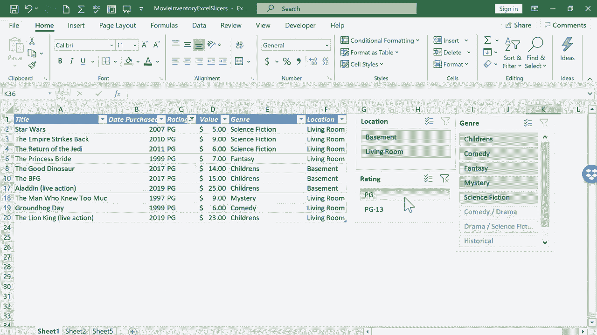

# 【双语字幕+速查表下载】Excel高级教程（持续更新中） - P9：9）使用切片器筛选数据 - ShowMeAI - BV1sQ4y1B71N

In this tutorial， I will show you how to use slicers in Excel to show the exact data that you want to see。

 Now， what are slicers。 Basically， a slicer is an alternative to a filter。 So in a previous video。

 I showed how you can sort and filter in Excel。 And I demonstrated how you can just select the row that has the column headings。

 and you can go to the home tab home ribbon。 go here to sort and filter and click filter。

 and that makes it so that you can filter out specific data。 For example。

 let's say I don't want to see any of the Pg13 movies in this list。 I just uncheck Pg13。

 click O and all of the Pg13 results are now hidden because of that filter。

 So that's one way to show just the data that you want to show in a spreadsheet。 But in some cases。

 filters are not ideal。 They can end up hiding data so that other people that might use the same spreadsheet。

Might not know that that data even exists。 They might miss it。 And also。

 filters can sometimes be a little bit clunky and difficult to use。

 So I want to show you slicers as an alternative to filters。 Now， if you're going to use slicers。

 The first thing you've got to do is clean up your spreadsheet。

 And this is a spreadsheet that I used way back in my very first Excel video。

 The beginner's guide to Excel。 but I need to clean some things up。 First。

 I want to get rid of this movie inventory heading here at the top。 I don't really need that。

 that's in the name of the spreadsheet up here。 So I don't really need that。

 it's actually going get in the way of what I want to do。 So I'm going delete that。

 all I have to do is right click on row number one and select delete it gets rid of the entire row。

 Another thing I need to do to clean up this spreadsheet is notice at the bottom of the data here。

 I have some extra information。 But in order to create slicers and do em properly。

 You don't want to have。Da underneath the main data of your spreadsheet。

 So I'm going to clear that out， and one way to do that is just to select the data right click and choose clear contents。

And I'm even going to go over here on the right and do the same thing with this extra data here。

 Just select it。 right click， clear contents。 And I'll also go ahead and clear this out as well。

 I'll select no borders to get rid of that。 Now， the reason for cleaning up the spreadsheet like this is that I want to turn this into a table right now。

 it's just a bunch of data all in one range。 This is a range of data。

 But I want to make it a formal table to do that。 all I have to do is click somewhere inside the data。

 How about right there。 And then I'll go here to the insert tab on the insert ribbon。

 There's the option for table。 So I click table。 and Excel looks at the data and tries to guess where I want the table to be。

 I think it guess correctly。 I'll just click O， and look what it did It formatted this data as a table。

 Now， if I don't like the formatting that it did。 I could go up here to table design。

 And I could make some changes。pick different colors and things like that。

 But this is fine for what I want to do。 All right。

 the next step in order to add slicers that will help me to more easily and more visually filter my data。

 All I have to do is click inside the table。 And when I do that， I get the table design tab。

 I'll click there。 And then here in the tools group， it says insert slicer。 So I'll click that。

 And Excel gives me the option of choosing which slicers to use in the spreadsheet。

 And here what you do is you just pick the data that you care about the most。

 that's the most important to you。 So， for example， with movies， I think genre is pretty important。

 I might want to watch a fantasy movie。 I might want to watch a mystery。

 And so that's a pretty important type of data。 The location in the house where it's stored。

 That's pretty important。 And how about the movie rating like P G P G 13， that kind of thing。

 So I'm gonna go with those three。 And then I'll click O。 And look what it does。 It gives me。

3 slicers， kindin of a weird name for it。 But these three boxes really give me a lot of control over what is shown in my spreadsheet。

 I'm gonna shrink them down a little bit。 So they're easier to place on the screen。

 This one is just gonna have trouble fitting。 I guess I could shrink the view down here in the lower right。

 And that should make it easier to fit everything。 I'll just put it there。

 and I'll zoom in a little bit more。 So with these slicers now activated。

 all I have to do is click some of these buttons that it created。

 So let's say there's a family coming over to visit my family。 There's some friends of ours。

 and we're inviting them over to watch a movie with us。 And let's say we want to watch a comedy。

 All I have to do is click comedy。 And look， it shows me there's only two options。 Now。

 because both of those two options are stored in the living room。 Notice what happened to basement。

 Basement is grayed out。 I can't pick that because there's no results that will happen。

 I could also now filter by rating。 let's say。The kids are gonna be watching。

 and we don't want P G 13。 I could click P G。 So now I know what movie we're gonna watch again。

 Great movie， though。 Okay， so that worked great for me。 But now let's say I want to run it again。

 What I have to do is clear the filters。 You can't just click to deselect living room and deselect Pg。

 You have to click this button， which clears the filter clears the filter clears the filter。

 Now we're back to the full list of movies。 Now， some of you may have noticed a little problem that I had there。

 When I clicked on comedy， it excluded comedy dramas。 Well， those are also comedies。

 So there's a little button here that you need to be aware of。 It's called multi selectlect。

 If you want to be able to click more than one of these buttons。

 you actually need to click this button to allow you to select more than one。

 So if I want to see comedy dramas and comedies listed here。 Watch what you do。 First。

 you click one of the two。 let's say comedies。 Again， it only。Give me two results。

 And then I try to click comedy drama， but that switches off of comedy。

 So that's where you need to click the multi selectlect to allow you to select a second option。

 All right， so now I see the list of three movies to watch。

 So I hope that you see the usefulness of slicers in Excel。

 It's a great way to generate a list of just the specific data that you want to see and that you want to show。

😊。

