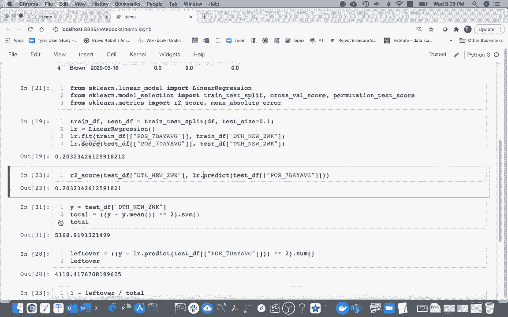
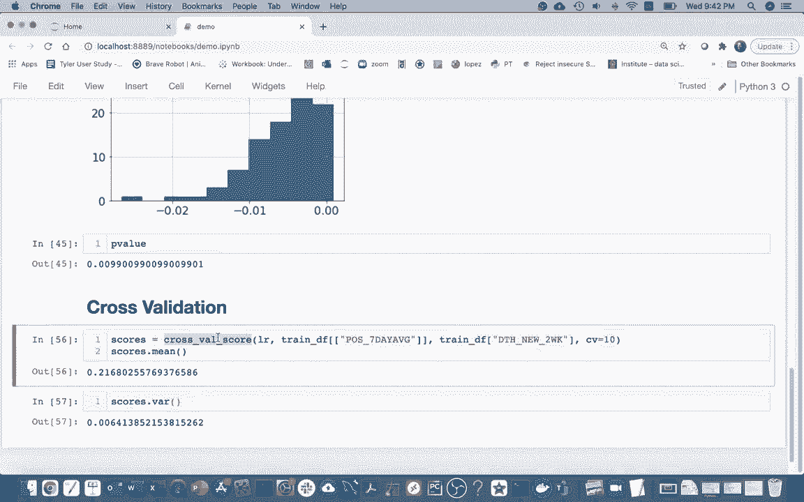

# 使用 Scikit-learn 进行机器学习，4小时实战视角刷新知识框架，初学者进阶必备！＜实战教程系列＞ - P4：4）模型评估 

我们谈到了我们的平方得分，我们谈到了绝对平方误差。这是我们可以衡量误差的不同方式。接下来我想讨论的是，如果我们的得分尝试中等，比如0.2满分1，我如何知道这实际上是增长，而不仅仅是运气。

答案是我们要做的是使用我们原始的数据，并用我们的模型对其进行评分。我们能够训练一个模型，使得x和y能够评分。所以假设我的得分是0.8，这并不是那么糟糕。我将打乱数据，因此我知道y和x之间没有关系。

好的，我要做的是把这个y列随机打乱。而这个词就是“排列”。当我得到这个列的排列版本时，你可以看到。例如，5曾经是第一个数字，而现在这里的5变成了下面的数字。所以我只是随意地打乱了一下，然后在这个数据上训练模型，试图寻找y和x之间的关系。

显然应该没有关系，因为我只是把所有东西都打乱了，但我可以尝试训练一个模型并对此进行评分。所以如果我看到在垃圾数据上训练模型时，如果我的得分比最初的得分更高。

嗯，这可能意味着我最初没有任何显著的结果，所以我可能没有任何有意义的模型。这就是这个函数的粗略想法，它将为我们打乱数据。

它将获取一个得分，然后尝试再次打乱数据，获取一个得分，试图根据这些打乱的数据得到100或100个不同的得分。然后基于此我们可以估计并真正看到这个得分。

这是否有点不寻常地好，还是感觉这可能与垃圾数据相符，基于此我们基本上可以说，嘿，我信任这个模型还是那个？那么我去这里回到笔记本？

所以，可能我只是想在这里做一些笔记，以便我们所做的事情更清楚。这部分是关于指标的。

然后这部分将会讨论排列测试。

所以让我来看看，我实际上已经导入了它，这很好，所以所有与模型评估相关的东西都在这个模型选择下，因为我们经常会有几种不同的模型，我们尝试使用不同的工具来说出我们认为最好的模型，并推荐给人们。所以我看到我有这个置换检验分数。

我可能会把这个粘贴在这里，我可以看到我需要三样东西。至少。我必须有我的模型，也就是 L R。🤧我必须有我自己的。

我的 x 值，然后最后是我的 y 值。所以我这里要做的就是，因为。嗯。因为我有这个 testF。对于我的 x 和 y，我就直接抓这些对吧。这个是我的 x，根据七天的平均值，我想预测这里的值。我会抓取这个。结果表明这将返回一个长度为三的元组。

所以我只需要运行它，这需要一点时间。这个元组中的三样东西将是我模块模型的原始分数。

你知道，当我可能只是在告诉垃圾分数时，会有一些其他分数。因为我在打乱数据。我不期望有任何模式，会有一堆这样的分数。然后会有一个叫做 P 值的东西。P 值告诉我的是什么。嗯。什么是这样的好分数被一个生成所有这些垃圾分数的系统生成的概率。

对，如果这个值真的很小，那么我可以看到，这实际上比我的垃圾分数好得多。所以我实际上得到了一个显著的结果。因为这些是我返回的三样东西。😊，对，我知道 T 是一个元组。我只是把它放在这里，它会自动为我解包这些东西。

所以我来看看这个。然后我会得到我模型的一个分数。然后我可以在这里有我的垃圾分数。我看到有一大堆。如果我想的话，可以把它们放到一个系列中。

然后我可以做一个这些的直方图。

我能看到，实际上它们都在 0 或更低，对吧，所有这些。而这大约是 0.0，9，实际上。这很远。所以看起来我们离这些垃圾分数相当远。因此，这个 P 值将会很小。似乎无论什么过程。

我用来获取这些垃圾分数的方法不太可能得到这么好的分数。所以我会把这个作为一个有意义的结果。

让我再回到这里想一个主意，我们如何处理噪声。我们看到当我不断做这个时，得到了不同的分数，为此我们将使用一种叫做交叉验证的东西。

交叉验证分数。它的工作方式是我将把数据拆分，而不仅仅是有这些训练和任务。我将分成四个部分。然后这四个部分将轮流作为测试数据。所以也许我会先在这些行上训练我的数据，然后在这个上进行测试。

然后我的模型会得到，比如说，0。2 的分数。接着我会拿一块不同的数据，每一个都叫做数据的一个折叠。顺便说一下，我会先在第一、第二和第四部分上进行训练。所以我得到一个模型，然后在那个测试数据集上进行评估，假设这次我运气好一些，得到了 0。

3，再做一次，01再来一次0。2，然后我可以取这些的平均值，这样会是一个更稳定的衡量我模型表现的方式，不会太脆弱于测试或训练数据集上发生的事情，因为所有的数据在某个时候都在测试数据中。

或者训练数据。所以我过来这里做这个，对吧，所以这就叫做。

交叉验证。让我把这个称为交叉验证分数。我需要传入的内容是我的估算器。然后我必须传入我的 x 值和我的 y 值。

好的，让我把这些东西拿过来。其实，我想这和这里的内容是一样的。所以我来抓取我的模型、我的 x 值和我的 y 值。

这次，我只想在我的所有数据上进行操作。所以我可以说数据框。然后数据框，实际上最佳实践就是这样做训练数据。因此，我将这样做，然后我会得到所有这些分数，原因是默认情况下有五个折叠，所以我可以说，你知道在这张图里，有四个，这里我看到默认情况下有五个，这就是我得到五个分数的原因。我可以说我想要 10 个，这样我就能得到这些 10 个分数，这些分数看起来像之前看到的数字，比如 0。

27 0。17 另一个 0。27 是 0。304，如果我回到这里，再运行这个几次，这就是我随机拆分我的训练和测试后得到的数字。

那么，为什么这很有用呢？因为我可以在这里得到我的分数。我可以说几件事情，我的意思是分数。

所以我可以看到，平均而言，R²平方得分将是0.21。但我也可以获得一些方差的感觉，这将告诉我我对测试或训练数据集中数据发生什么是多么敏感，这可能取决于我有多少异常值，以及这些异常值的数量。评分会有什么影响？好的，这将是我们通常的做法。

所以最后一件事，对吧，当我在。

这里展示这张图片，我有点说，嘿，我有我所有的数据。然后我只是把它分成训练集和测试集。

我为什么没有在这里使用我所有的数据，原因是。尽管在这个例子中这样做是可以的，但你通常会尝试进行几个不同的模型，而你会想要在每个模型上进行交叉验证，然后你会看到哪个模型的平均得分最好，然后你就会说，这个模型是赢家，未来会使用它。

所以在做这个时存在风险，比如说我评估了20个模型，并选择最佳的那个。最好的模型可能比应该的表现得更好。对吧？如果我做了20个模型，有些模型只是因为运气而表现得更好，有些则表现得更差。因此，尽管这是选择最佳模型的正确过程，但我不应该夸耀这个交叉验证得分，因为我并不是只做一个模型。

我做了许多模型。所以我会查看每个模型的交叉验证得分，选择最佳的，然后最后我会回过头来实际使用我的真实测试数据，这些数据仍然在这里。然后我会报告我最喜欢的模型的准确性。

