# 使用 Scikit-learn 进行机器学习，4小时实战视角刷新知识框架，初学者进阶必备！＜实战教程系列＞ - P9：9）召回率和精度 - ShowMeAI - BV16u41127nr

在上一个视频中，我们学习了一些关于混淆矩阵的知识，混淆矩阵为我们提供了全貌。但我们常常希望用一两个数字来总结，而我们已经看到的最重要的数字之一是准确率。

准确率告诉我们模型出错的百分比。但当它出错时，它并没有真正告诉我们错误的类型。因此，我们将学习两个指标：召回率和精度，可以认为是数据子集上的准确率。它们的值仍会在0到1之间，但能帮助我们 pinpoint 实际出错的地方。

好的，回顾一下，这里是一个混淆矩阵。行表示数据的真实情况，列表示模型的预测情况。目前这些地方的值都是零。如果我看到一只真正的老鼠，而模型预测它是老鼠，我会在老鼠的行和老鼠的列将那个数字加一。

每当我们在混淆矩阵的对角线上增加数字时，这意味着我们做出了正确的决策。这里有一个错误决策的例子：如果我们的模型看到一张明显是狗的图片，但预测为猫，那我们会在狗的列和猫的列分别增加一次计数，这样我们可以在整个数据集上进行相同的操作。

从中，我们可能想要计算准确率，准确率就是我们正确的次数占总次数的百分比。我认为的计算方式是把对角线上的所有数字相加，那就是我们正确的数量，然后除以矩阵中的所有数字。结果是8除以10，即80%。值得注意的是，这个数字是部分占整体的比例，总是会在0到1之间，而准确率总是在分子中，所以1是最好的数字。精度和召回率具有相同的特性，但它们针对的是矩阵的不同子集，我们不会将整个对角线除以整个矩阵。

所以，精度和召回率实际上可以为每个类别计算这些指标。我有六个不同的指标，分别是狗的召回率、猫的召回率、老鼠的召回率，以及相应的狗的精度、猫的精度和老鼠的精度。有趣的是，我会查看这些指标中的几个，所以当我问猫的召回率是什么时。

我想知道的是，当我们实际有一只猫时，模型正确的概率是多少？

所以因为我在问实际情况是什么。我真正做的是在按行数字的总和进行分割。对吧，因为每一行代表了什么。数据实际上是什么。在这种情况下，分母将是这一行的总和，而分子将只是一个单一的数字，即在这个例子中我们到底多少次把猫称作猫，我们将得到2除以4，因此这实际上是记住召回率和精确度的一种更简单的方法，因为召回率有一个R，而行也有一个R。

如果我在看狗的召回率，好的，那么当我们实际上有一只狗时，模型正确的比例是多少，我只是在看那条顶部的狗行，并将狗的数量除以其他所有的总和，在这种情况下，当我们看到狗时，我们总是做得对，所以4除以4是100%的狗召回率。

精确度的问题问的是一些稍微不同的内容，我们这里问的是，假设对于狗的精确度，当模型预测它是一只狗时，正确的比例是多少？所以当我们查看所有预测时，我们实际上在谈论列，因为每个预测都沿着一列，在这种情况下我们在分割狗的左上方。

在狗的列中，我有我们预测的所有不同内容，当我们得到4除以6时。对于猫的精确度，我们通过猫的列进行分割，我们看到这里有完美的精确度，希望你能看到它们犯了不同种类的错误。对于猫，我们在精确度上表现很好，但我们有召回率问题；对于狗，则相反，我们有完美的召回率但较差的精确度，因此这两种指标实际上都展示了同一个问题，有时我们看到一只猫却认为它是一只狗。

相反的情况并不成立。我在这里不想多谈，但我只是想让你接触到这个。人们常常试图将这些数字简化为一个单一的分数。例如，有一种流行的机器学习方法叫做F1分数，许多这样的简单分数实际上只是其他指标（如精确度和召回率）的组合，因此这些可以看作是其他指标的基础构件。

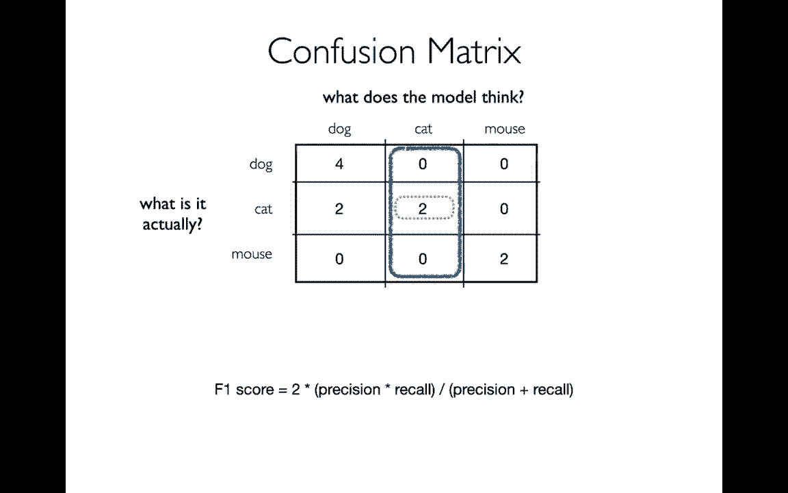

让我去写一些代码。到Jupyter笔记本块。🤧。在这种情况下。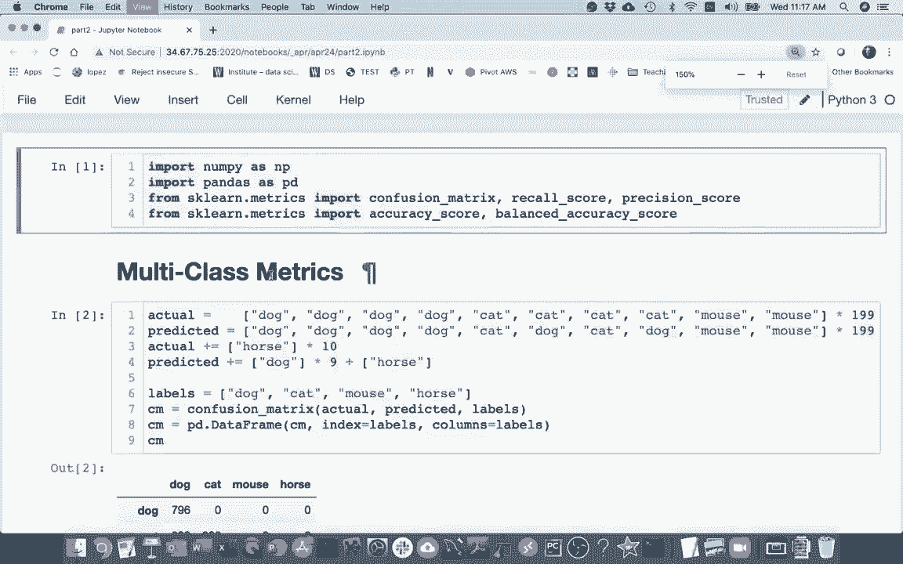

我将混淆矩阵转换为数据框，并在这里展示。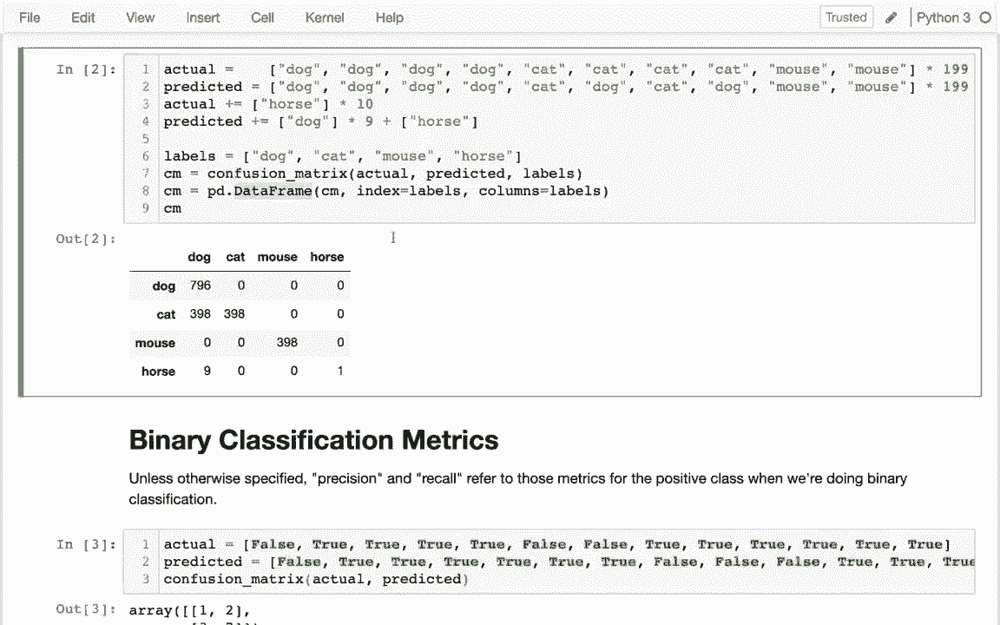

所以我和幻灯片中的一个有点相似，但现在数字更大了，我还有一匹马。所以对角线是好的，对吧？我可以看到这实际上做得还不错，对吧？我在对角线上有很多大数字。我看到有一个马的问题。当我看到一匹马时，它实际上90%的时间认为那是一只狗。这是我面临的另一个问题。

对，我看到的那个不在对角线上的大数字就在这里。大约一半的猫被错误分类为狗。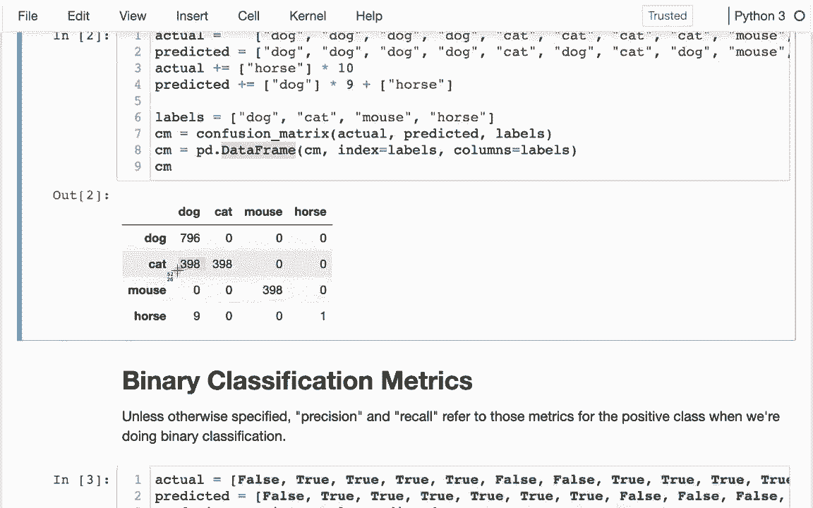

好吧，这有问题，所以我打算看看我已经生成的混淆矩阵。我想查看准确率、召回率和精确率，然后最后介绍这个新的指标——平衡得分。😊，所以首先，让我们看看准确率。我将运行准确率。

我需要输入实际值和预测值。所以我会使用实际值和预测值，这两份列表是我用来构建混淆矩阵的。我看到，哦，让我再运行一次。我看到准确率是78，嗯，大约是80%。这看起来相当不错，关键要注意的是，当我们有这么多不同的类别时，整体上似乎表现良好。

但可能会有一些情况我们犯了很多错误，比如当我们看到猫时，我们一半的时间是错的，尤其是当我们看到马时，我们90%的时间是错的，因此这些其他指标将帮助我们再次深入分析并识别这些问题。好吧，所以假设我想查看马的召回率。

我期待看到马时的准确率是10%。所以我们只知道10%的时间。可以这样做：我可以从混淆矩阵中获取马的值。对，从右下角的值。然后我可以将其除以马行中的所有值之和。对，我可以这样做。

我得到了10%，正如我预期的那样，正确的方法是使用这个精确率函数，它实际上是内置于K学习中的。对。我将调用这个函数。所以我有真实值和预测值。我会说实际值和预测值。然后我在这里实际上得到了一个错误。

它在抱怨所谓的多类与二类的问题。这些指标是为简单情况设置的，其中我们的两个类只是假和真，而不是像狗、猫、马这样的四个类别。所以我需要稍微清理一下。我可能会这样做。哦，首先。

让我稍微扩展一下，我需要更改这个平均值。有几种方式来总结信息。我将平均设置为无。我理解这样做的一些效果。与上面可能不一样。然后它实际上给了我四个召回值。每个分类一个。顺序可能与这里的不一样。

所以我实际上也要传入这些标签，以确保我可以将这些数字与不同的值进行比较。好的，我在这里看到的是，实际上我想先计算召回率，抱歉。我先计算召回率。因此，对于这个召回率，逐行检查，我发现狗的召回率是完美的，我看到一只狗。模型把它识别为狗，老鼠也是完美的，看到老鼠时，它会将其识别为老鼠。

对于猫来说，如果它看到一只猫，50% 的概率能正确识别，然后对于马，只有10%的概率能正确识别。好的，这就是我的四个召回率数字。有时我想做的是计算一个总的平均值，以了解我的整体表现。我得到65%的结果。结果发现，这个召回得分的平均值有一个特殊的名称。

这个特殊的名称是平衡准确率。对了。在这之前，准确率显示我们做得很好，达到了80%。但现在我实际上计算这个平衡准确率，它只有65%，差得多，从某种意义上说，这更有意义。我们之前的高准确率唯一的原因是我们看到的马非常少，即使我们的模型对马的识别效果很差。

我们可以简单地说，在模型中马并不多，所以当我们使用这些平衡指标时，它试图考虑到这一点。虽然我们有更多的狗，但我们实际上会把这四个类别视为同等重要，以得出我们的评分。

如果你的数据集中存在较大的不平衡，这将是一个很好的指标。在这种情况下，准确率可能会有些误导。好的，那是召回得分。让我类似地处理一下。所以我实际上要计算精确度。我想我之前已经在做了，哦。早些时候不小心这样做了。发生了什么呢？好了。

所以我将粘贴这个，然后我会得到这个精确度得分。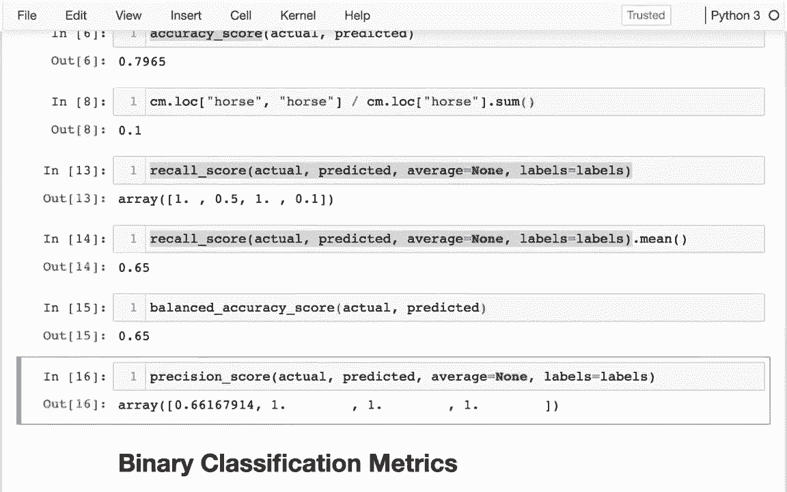

现在我看到一些不同的情况，没错，我发现实际上在所有方面我们都做得很好。除了狗。为什么会这样呢？当我谈论精确度时，我实际上是逐列检查的，我看到的确是很不错，除了对角线，我在每一列中只看到零。

这意味着如果这个模型预测的是猫、老鼠或马，它可能只在预测狗时才正确。在这种情况下，它只有三分之二的概率确实是狗。因此，这个模型非常喜欢预测狗。😊如果它预测其他东西，确保它预测的是狗，它的把握只有三分之二。

好的，所以我们谈到了准确率、召回率和平衡准确率。平衡准确率是召回率的平均值，然后是精确度。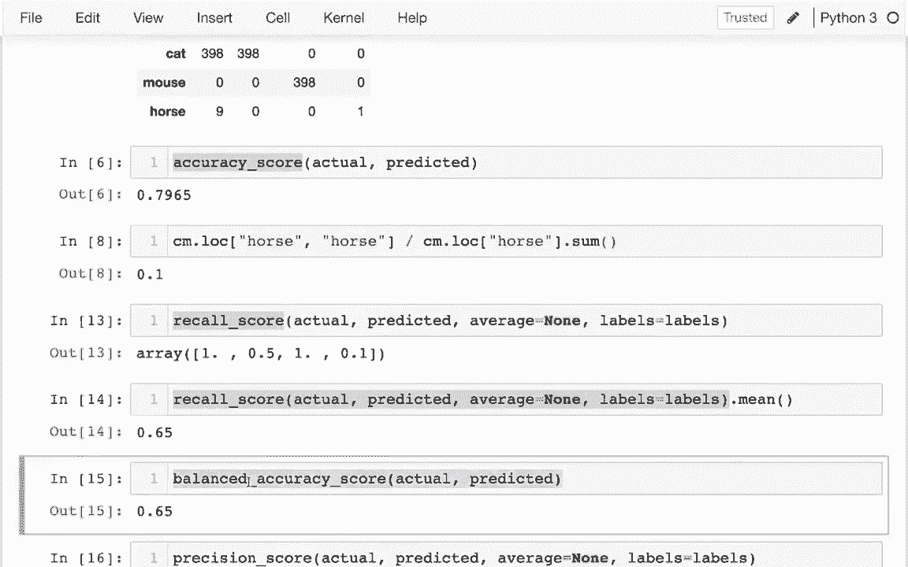

我想谈的最后一件事是二元分类，对于二元分类，我们只需使用**假**和**真**，而不是猫、狗和老鼠。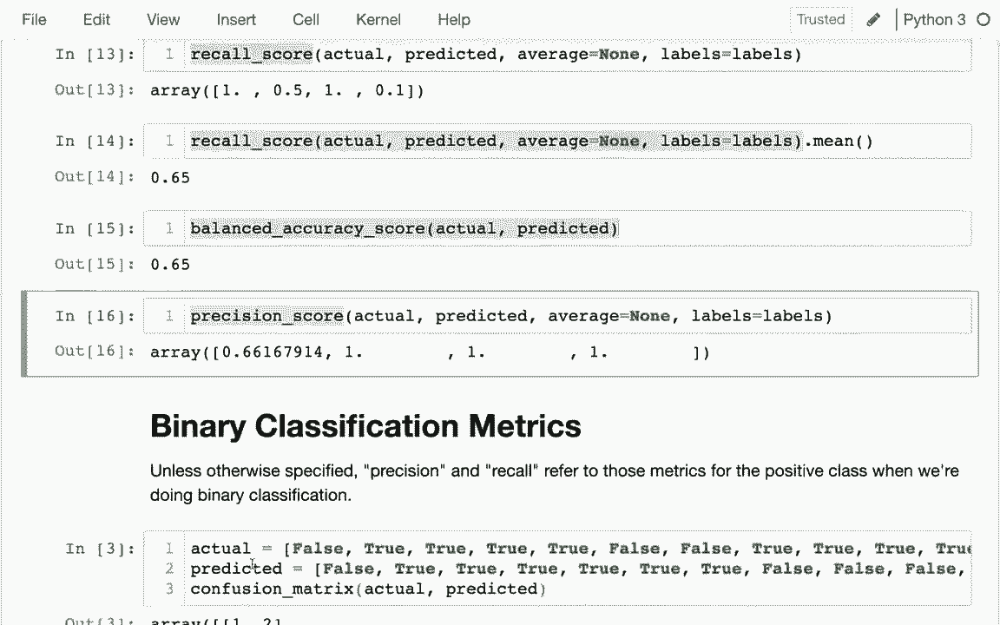

所以我在这里计算混淆矩阵，如果我想，我可以。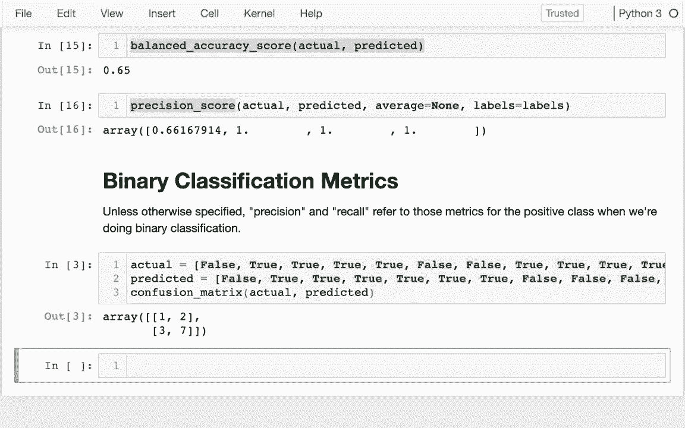

我可以像以前一样计算这些相同的指标，所以例如，如果我计算召回率。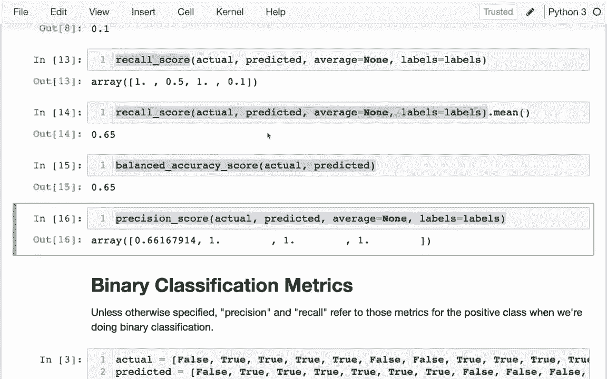

在这里，我可以将**假**和**真**作为我的标签传入。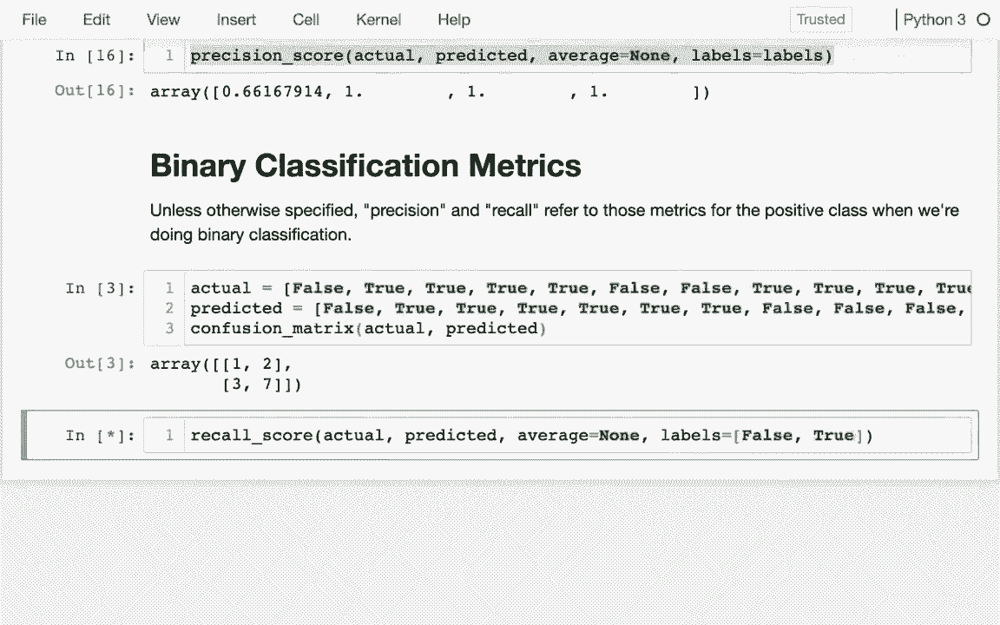

为什么那样不高兴，可能是因为我还没有运行这个，好了，我可以运行它，它告诉我，好的，逐行来看，第一行。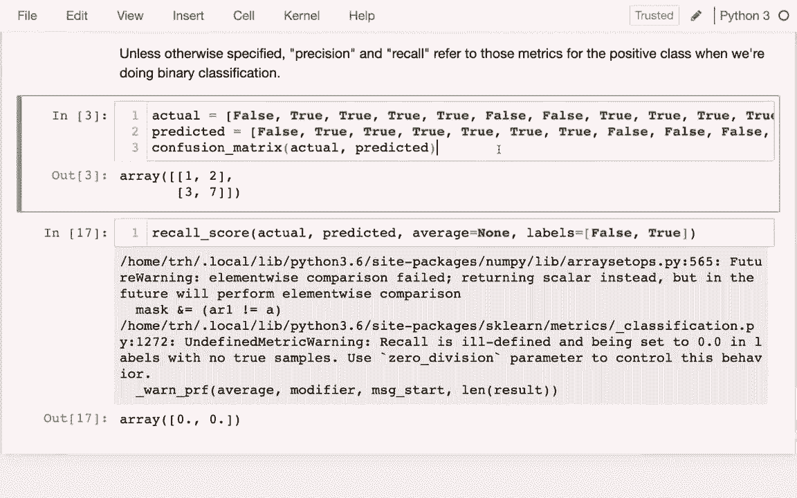

三分之一是轨道，对吧，所以第二个是70%正确，对吧，这就是我的两个召回率，所以我可以像以前一样做，但事实证明在处理二元分类指标时，人们常常只谈论预测，我很抱歉。

他们通常只谈论召回率和精确率，而没有具体说明他们指的是什么类，而当他们这样做时，他们所谈论的是正类。所以如果我仅仅谈论召回率，总的来说，哦，我不想那样，我只是想谈论召回率，总的来说看，我在谈论正类，精确率也是如此，实际上这可能是你看到的召回率和精确率的大多数特殊情况。

在进行二元分类时，请知道我们是在谈论正类。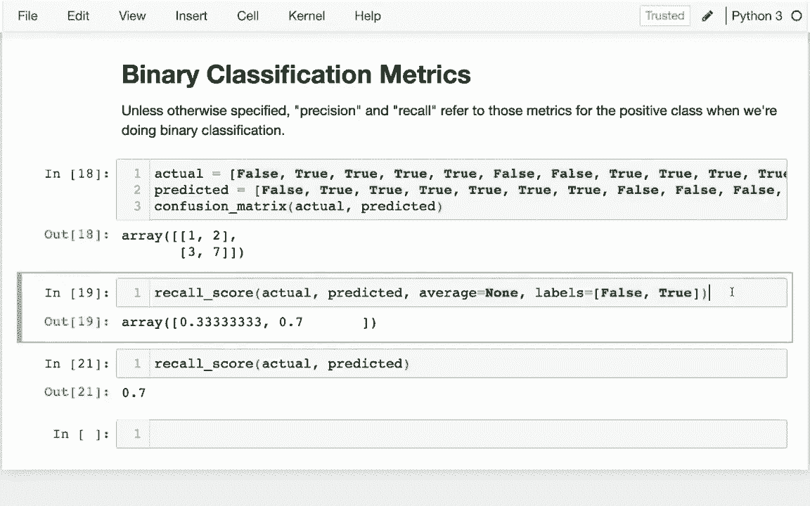
