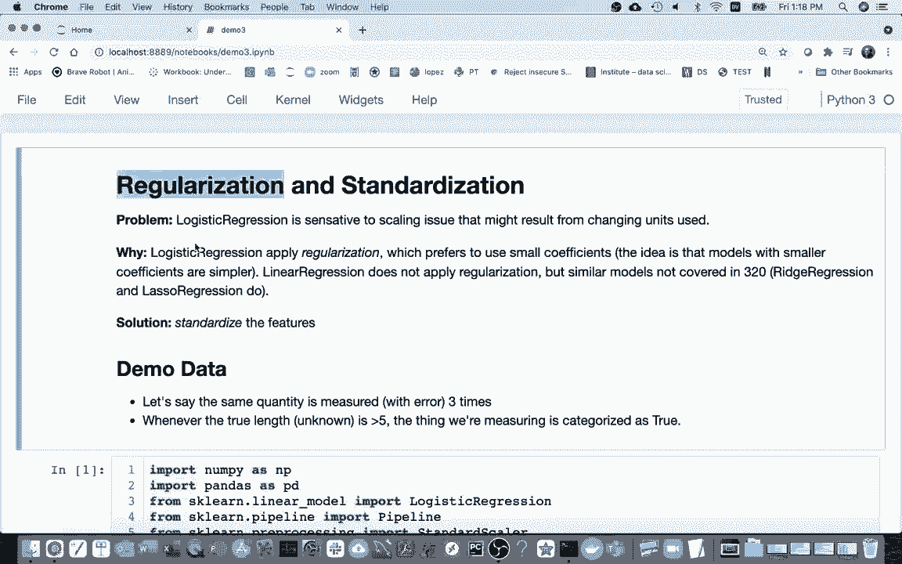
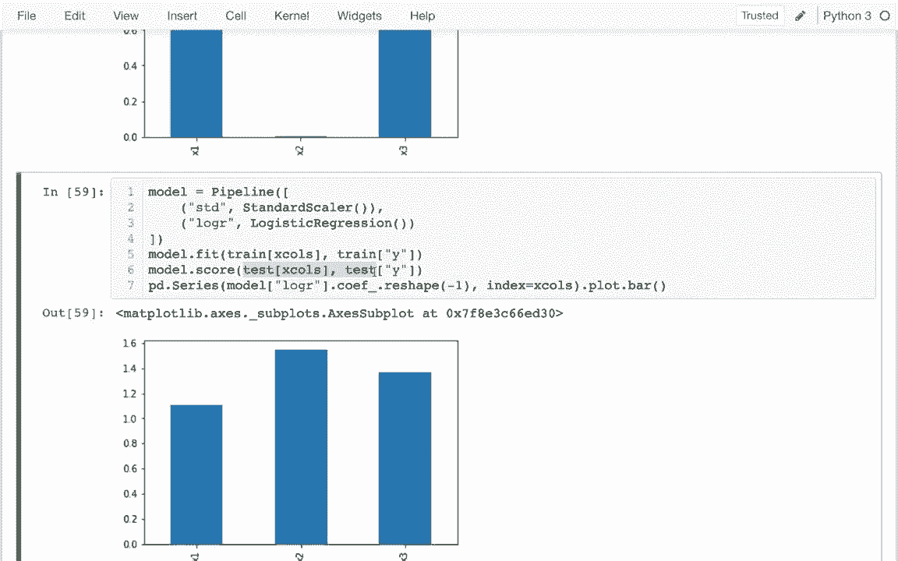

# 使用 Scikit-learn 进行机器学习，P10：10）正则化和标准化 

在这个视频中，我可能会谈论两个主题，一个是正则化，另一个是标准化。标准化是我们在本课程中经常使用并理解的内容，相对简单，但正则化是一个非常复杂的话题，可能需要更多时间和更高级的机器学习课程。

我不想深入探讨正则化的数学，我只是想给出最简单的直觉，我们不会深入研究，但希望大家知道这是一个重要且深刻的话题。至于我们已经做过的事情。

我们已经频繁使用逻辑回归，但它有一个我还没谈到的问题，那就是它对缩放非常敏感。例如，你可能有一个数据集，其中包含一些特定单位的数字。如果你改变这些单位，比如把英里换成英尺，可能会得到不同的分类结果。

这显然不是我们想要的，我们关心的是真实的信息，而不是某人随意选择的单位。为什么呢？因为逻辑回归将这种技术应用于正则化。

它试图使用较小的系数，通常不希望在某一个特征上有一个非常大的系数。你可以想象我有很多特征列，或许其中之一在训练数据上表现得比其他的好。

即使其他特征列仍然有些有用，我不希望仅仅因为运气选择了那个最好的特征，因为这样在测试数据集上效果不好。正则化基本上是提供了一种动机，使用多个特征，而不太重视其中一个，即便它在短期内表现更好。因此，逻辑回归实现了这种线性回归，而这是我们在本课程中学习的第一个模型。

但还有类似于线性回归的东西，比如岭回归和套索回归。我们在320中不打算讨论这些，但它们很重要，且经常使用，因此要知道这个正则化的概念非常重要。

那么我们真正希望的是什么呢？我们不希望我们的模型对单位敏感。我们希望以某种方式标准化，使输入的数字相同，而不管它们原来的单位是什么。以此例子，我编造了一个虚构的场景，我们在现实世界中测量某种数量三次，并根据这些数据预测它属于哪个类别，类别将是“真”或“假”。

基本规则是，当真实长度（我们不知道）大于5时，类别为真；如果小于5，类别为假。因此这三个有些嘈杂的测量值，尽管它们没有确切告诉我们真实长度是什么，但它们给我们提供了一些信息，可以帮助我们猜测它是真还是假。

在这里我有我所说的那些虚假数据，y列是类别。然后我有我的三个测量值，x1、x2和x3。让我谈谈我是如何生成这些的。在numpy的随机函数下，有许多函数可以生成随机数据，我在这里做的是正态分布。

你可以从不同的分布中抽样，如果你不知道这意味着什么，那对这门课来说没关系。但基本上，我在这里生成了1000个随机数，平均值为4，然后将它们放入这里。这将是一个数字数组。然后我在说，任何大于5的，我希望它为真，否则我就会得到假。

当我查看下面的数据框时，truefe并没有直接进入这些列，它是未知的，但类别是已知的，而类别是我们试图预测的。那么，我们如何进行预测呢？既然我们不知道真实的长度，为什么还会有另外三个列呢？它们基本上是实际长度加上一些随机噪声。所以如果我在下面查看一下。

让我看看第一个测量值。所有三个测量值都小于5。所以我预测y会小于5是非常合理的。也许我还可以查看一些其他情况。我想知道是否能看到它为真的地方。让我来做一下，这样我可以看到其他一些情况，这些情况在这个例子中都是正确的。

所有的测量值都大于5。所以我认为这是真的。这是一个更有趣的例子。这个数字非常大，对吧。一个测量值几乎是7。即使其他两个测量值小于5，这也足以让模型判断为真。好吧，总体上它是真的。

希望模型会得出相同的结论。好的，这就是我们正在处理的数据。让我们看看能否训练一个模型来尝试预测这个。因此，我将创建一个模型，我将使用线性或逻辑回归模型。我会将其拟合到我的数据中，所以我可能会有一些X和Y的值。

我将从我的训练数据中提取y列，对于我的X，我想传入一个包含所有特征列的列表，所以是x1、x2和x3。我会再次使用这些，所以我实际上会把它放入一个名为x columns的变量中。这样我就不需要每次都输入那么长的内容。

所以我进行了拟合，这很简单，很快我可能会查看这个模型的系数。但在此之前，我想顺便看看如果我想查看模型的准确率，它有多高。我可以说，不是拟合，而是评分，然后为了现实起见，我不应该在我之前没见过的数据上进行评分，而是我训练的东西，所以这是一种更好的测试，我看到它有 89% 的准确率，这样好？89% 似乎很高，我们会那么频繁地正确，但让我给你看看为什么这不一定。

如果我查看这个 Y 列，我发现它几乎总是为假，实际上如果我说值计数，我可以看到它只有少于 20% 的时间为真。我实际上可以将其除以测试的长度来看这一点。因此，这意味着即使我有一个非常简单的模型，它总是说假。

我会得到 81% 的准确率，89% 更好，但在那种情况下并不是那么惊人，因为这一列的偏差太大。好吧，所以在我查看模型的准确率后，接下来我通常想查看的是我的系数。

我喜欢以某种方式绘制这些，我的模型系数。而且我看到这些就在这里，我想要某种条形图。我知道这些与这些 x 列是成对的，所以这是 x1 的系数，以此类推。因此我通常制作这样的条形图的方法是说 PDd do series。

然后我会有我的 Y 值。然后我会有索引等于 x 值。点图，点条形图。在 x 值上，我将使用这些列名，并将系数放入其中。基本上会有量值用于 Y 轴。而且它在抱怨其中一个的长度是 1，而它应该是 3。

所以 x 列，这里非常简单，但如果我看看这个。这一数组，我看到它其实是一个二维的东西，我可以将其展平为一个包含三个数字的一维数组，或者如果我说负一，它会变成一维的，不管我有多少个数字，它都会搞定，所以我可以把它放在这里，现在我得到了这个图，这很有趣，对吧？我在谈论有时候仅仅是偶然，我们在一个问题上比另一个问题更关注，这种情况在这里发生了，对吧？x1、x2 和 x3 都是同样嘈杂的，但恰好基于训练数据，模型认为 x1 更有用，对吧？这纯粹是偶然。

所以你可以想象一个更糟糕的情况，它选择了我非常喜欢的一列，忽略了所有其他具有良好信息的列。因此模型会尽量避免这种情况。正则化意味着我们会尽量不对单一因素赋予过多权重，我们会尝试稍微分散一下，如果你将其推向极端。

你可能想象我可以有一个只看我的截距的模型。我的截距可以想象成平均值，在这种情况下，模型可以预测动物，所有我的系数都可以为零。好吧，我们都只预测同样的东西，我想我们有另一个问题，只想非常准确。好的，我有这个。所以让我回去，我将随机生成这些数据。

但这次我只是改变这一列的单位，我将单位改为英里，因此一英里有5280英尺。我在这里想做一个评论，这是英尺到英里的转换，所以我有相同类型的数据，只是单位不同。

所以我希望我的模型不会有什么不同的变化。所以我将再次运行这个。我看到这里没有太多变化。然后我想想重新运行时会发生什么。因此，在这个 x2 列中，数字现在都小得多，因为它是以英里为单位。因此，我可能期望使用这个时，x2 的系数会更大。

如果我想和以前一样。结果发现当我运行它时，我实际上看到了相反的情况。由于我之前提到的正则化因素，拥有一个列上如此大的系数是有害的。因此，它实际上决定，嘿，我将完全忽略 x2。我必须在我能够接受的情况下，给它一个更大的权重。

所以我在这里丢失了一些信息。我不再使用这两列。现在，当然，这很傻，对吧，把更大的系数放上去并没有真正增加权重。它只是抵消了我有不同单位的事实。因此，有不同的方法来解决这个问题。一种是我可以坚持所有东西都有相同的单位。

另一种方法是我可以尝试以某种方式让这个更统一。所以这就是我在这里要做的。😊，我将回到这里，让我。让我拿到我的训练数据，实际上，我想在哪里做这个？

我很快就会处理这些 x 列，实际上，不，这没问题。我打算把它留在那里。因此，我将提取我的训练数据，并想取一个切片，我想获取所有行，并提取列 x1。通过 R x2。所以这就是我的特征，现在通过 x3，抱歉，这些只是我的特征。我想以某种方式标准化它们，以便它们大致具有相同的尺度。

所以我要做的是将其提取到这个 x 变量中。我要做两件事。一是计算每列的平均值，就这样。我将从每列中减去这些数字。我会说这样。因此现在所有这些列都以零为中心，减去均值后，每列的平均值都是0。

事实证明，这对逻辑回归的运行速度也很有帮助。我并不想了解为什么这是有用的，更重要的是，我希望它们在同一尺度上。那么，哎，发生了什么事？我跳到了新的一列或新的一单元格，所以如果我查看这个，那是每列的标准差，如果我有更大的数字，那么标准差就会更高，因此标准化的关键部分是我将所有这些除以那个标准差，如果我这样做，我可能会得到一堆小数字，它们大致在同一尺度上，所以在我完成这一切后，它们都会有相同的均值和标准差为1，因此这将是更好的x数据，我实际上可以像这样把它放回我的训练数据中，所以我可以说这等于我的新x数据，所以我手动将数据标准化。

所以在我完成后，我再次运行所有这些，现在我看到x2重新发挥作用。尽管我有不同的单位，它并没有过于关注其他列的单位。因此，这是一个不错的做法，好的，这就是标准化的意义。现在结果是，要正确做到这一点，我必须在训练数据上计算这个均值和标准差。

但我必须在测试数据上使用相同的均值和标准差，我不能重新计算测试数据上的均值，因此这一方法论会变得有些复杂，所以一般我们不会这样做，我们会请K学习为我们完成，所以结果是有一个预处理步骤叫做标准化，我们将使用这个，而不是手动进行，所以我将回到这里。

你可以看到我已经导入了我的标准化器。我将在这里运行这个。这现在跳过了我的模型，对吧，我现在就先不处理这个。这将是我的糟糕模型。我将创建一个新的模型，它将是一个管道模型。在这个管道模型中。

我想要一个标准化器，后面跟着逻辑回归。就这样。这一个，我可能确实要这样创建它们。我必须给它们命名，对吧。所以我将把它称为标准化器。好的。我必须用逗号分隔这些东西。然后，我们将有这个逻辑回归。

就像这样，这是我的新模型，然后发现之前我做的所有拟合工作，比如说，它可以以相同的方式工作，我可以像以前一样进行拟合，因为这个新的模型也可以拟合，所以我可以这样做，我也可以像以前一样对它进行评分，现在让我来评分，我得到的结果非常相似，然后可能有趣的是，当我实际这样做时，当我实际尝试获取这个条形图时，它应该显示它重新发挥作用，尽管非标准化的版本现在忽略了x2。

这个版本应该会显示出来，所以记住这里会有一个小错误，问题在于管道没有系数，整个管道没有系数，但里面的逻辑回归是有系数的。

😊，那么我怎么能发现任何管道都像字典一样呢？我可以复制这些名称并用作键，这样就能从一开始获得我的标准化器，或者我可以传入这个键，这样就能得到我的逻辑回归阶段，因此我可以看到涉及的系数。我会把这个粘贴到这里，而不是我原本的内容，这样我就能看到在标准化作为变换器的情况下，它会自动执行，然后如果我在这里进行拟合，它将计算均值和标准差，而在评分时，它只会使用之前的均值和标准差，而不会考虑任务，因为那会是一个方法论错误。因此，只要没有非常特殊的情况，我们通常会这样做，尤其是在逻辑回归中。

例如，数据已经被标准化。
