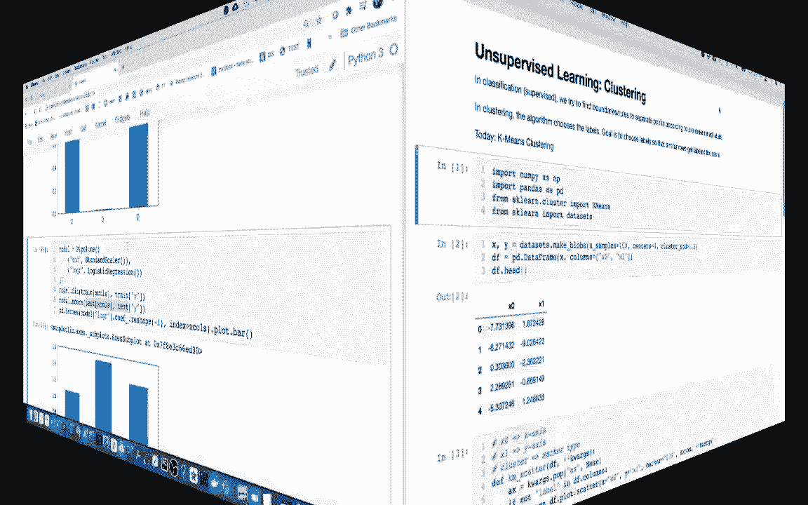
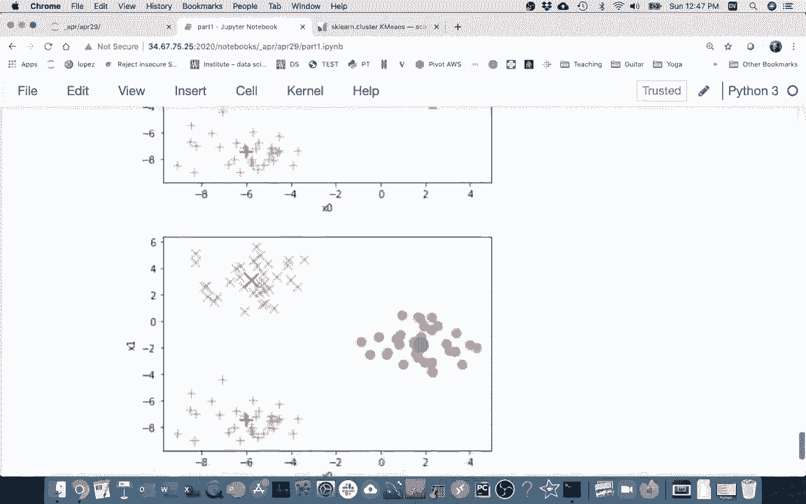
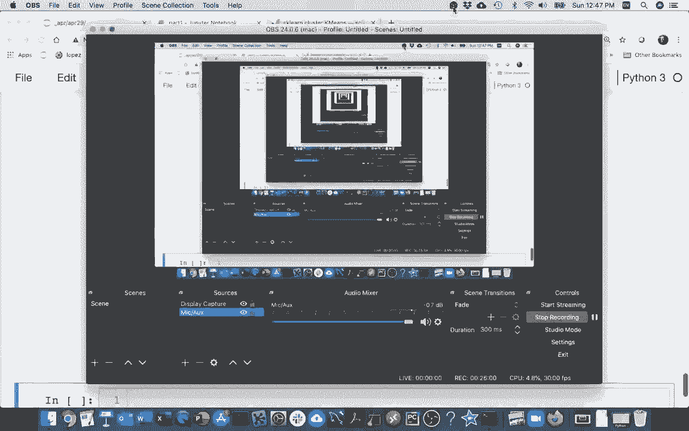

# 使用 Scikit-learn 进行机器学习，P11：11）K均值聚类 

好的。

最近我们做了很多监督学习，尤其是回归和分类，现在我将给出一个无监督学习问题的例子，即聚类。在聚类中，可能会觉得它与分类有一些相似之处，在分类中，有时我会展示这些散点图，其中有不同类型的点，而这些点是有标签的，也许有一些红点和一些蓝点。

我们试图找到一些边界或规则，以区分我们所拥有的不同类型的数据点，并且我们是基于随数据附带的一些预设标签来进行的，你知道的，这就是在指向哪个。在聚类中，我们可能会模拟一些数据的散布，或者它的多维等价物。

但不同之处在于，数据上没有预先存在的标签。这就是为什么这被称为无监督学习问题。算法本身选择标签，因此你知道，存在无数种方法可以将标签应用于现有数据集。但我们仍然有一些约束，或者我应该说一个目标，我们的目标是选择这些标签，以便将相似的数据聚集在一起，并且有方法来衡量这一点。所以聚类是这个一般问题，有许多不同的聚类算法，迄今为止最著名的是 K 均值，所以我将从这里开始。

因此，我在这里做一些导入，最终我将使用 SKL 中的 K 均值。但为了帮助你理解算法是如何工作的，我实际上会在这个视频中从头开始编写代码，而不是直接使用这个。所以在 SKlearn 中有这个数据集子模块，可以生成 blobs，或者说这些 blobs 基本上是聚类。

你告诉它你想要多少个点，围绕多少种不同的中心聚类，然后关于标准差的一些信息，返回两个东西，返回 x，实际上是两列，x0 和 x1，然后是一个 y，表示。

每个点属于哪个聚类或 blob，所以我不太关心为什么，我只是将这些丢掉。我将这两个 x 值放在这里，然后我有这个数据框，就像这里一样，我们要努力寻找的是这里是否有不同点的聚类，它们是否集中在某个地方。

所以让我在查看这段代码之前先往下滚动一下，这里是那些生成的点的图片，你可以看到它们是相当随机的，虽然它们大致集中在三个不同的点周围。我暂时在这里放一个问号，因为这些是没有标签的，对吧，没有真实的类别，我只有这两个。

X 是 x 轴上的 x0，y 轴上的 x1，作为我的坐标。因此，最终要做到这一点，我需要知道我正在做一个数据框的散点图，就像我们之前做过的很多次一样。我在这里写这个特殊的函数的原因是，kms scatter KN 代表 k 均值，我会多谈谈为什么我们有这个名字，因为我可能不想为不同的点显示不同的符号，而且没有简单的方法来指定一个列作为符号类型。因此我们必须循环遍历，这将由一个名为 label 的列决定，如果有的话，对吧，不一定是对的。所以这将自动进行绘图，我只是在这里评论一下，我将绘制 x0 在 x 轴上。

而且等等，对吧，所以我将继续使用这个方法。好的，所以你可能已经看到这里有三个集群，而我们实际上知道的是我们随机生成了数据。但我们如何找到这些集群的良好指标呢？这些指标将不会被称为质心。我们最终会尝试说，好吧，这里是这三个集群的中心。

我们发现了这些，如何自动完成呢？

而且，找到三个最佳点是一个困难的问题，通常比找到最佳答案更简单。对吧，稍微改善一个糟糕的答案，如果你知道怎么做，并且可以重复，通常会给我们一个不错的答案。这是我们在梯度下降中使用的策略，在学习中非常普遍，这是我们现在将为 K 均值使用的策略，因此我们会取一个糟糕的答案，而这个糟糕的答案看起来是这样的。

我将随机选择一些起始点，并为每个点分配一个不同的符号。目前我只是试图假设我可能有三个点，三个集群。我们最终会重新审视这个假设，然后可能在这里分散。所以你可以看到，这里是它认为的三个集群的位置，当然，这很糟糕，对吧，这并不是三个集群的位置，那么我们如何自动识别这三个集群的中心呢？

所以我们将使用的策略是，我们将在做两件事之间交替进行。首先，我们将做一个叫做分配的事情，这就是将每个点放入集群中，仅仅是说它进入了离它最近的质心所在的集群，对吧，所以这三个东西就是质心。

哦。质心是一种二维平均值，对吧，所以它是平均的 x0 和平均的 x1，作为质心。因此，K 均值是这个算法的名称，对吧，所以在这种情况下 K 只是一个变量，因此我们实际上有三个均值或三个质心，我们想要找到它们的最佳位置。所以就像我所说的，我会将这些点分配给离它最近的质心。

这是一种点分配，接下来的步骤是更新这些质心的位置，使它们更接近分配给它们的值。我们不断交替决定哪些点与哪个质心相对应，然后质心在哪里，最终希望它能收敛并尝试发现这三个点。

所以为了做到这一点，我将构建一个新类，对吧。我只是想把我的类命名为KN。我将有一个初始化方法。也许我将传入所有数据的数据框。很多这些实现中，人们会指定一些东西，比如。

好吧，简单起见，聚类有多少个？我已经创建了这个数据框。聚类就在这里，如果我查看我的聚类。我已经为这三个点准备了数据，我做了这个，所以我就暂时把它放在我的类外面，以保持代码稍微干净一点，所以我要抓住这些东西，所以我要说self的聚类等于聚类，我将对这些进行很多更改，我不想更改原始数据，所以我要复制这些数据框。

就像这样，也许我们看看这里实际上有没有东西。我只是好奇这个标签里有什么，当我说self的标签等于。self.dot clusters。我想看看那个标签列。就这样，或许我会把它转换为列表。像这样，然后我打印出self.dot labels。好的。

所以我想创建一个这样的东西。然后我需要传入我的所有点的数据框，然后是我的聚类，然后我这样做。嗯，我在那里的做法有点傻。我想把它保存在那个变量中，嗯，那是我的三个聚类，我只是选择了一些简单的聚类名称，这样我就可以轻松绘制这些，通常人们只是随便称这些聚类为一和三，记住原始数据中没有任何标签。

原始数据看起来像。看起来就像我有100行的这个东西。然后我的聚类实际上看起来也相似，对吧。我有x x值，指定减去中心，然后还有标签。好的。所以我想做的第一件事是，我可能想绘制这个。

随着我们进行的更改，我想抓住之前的代码，看看有什么绘制。就这样，我会绘制它。让我看看。我想我不能使用数据框的聚类，因为这些现在是属性。我不想要那些版本。我会说self Df。然后它有聚类。好了。

对，我们想要改进的系统的初始状态。所以记住，我提到的这两个阶段，我们会有一个分配点的步骤。这可能是我们要做的第一步，而我们在这里实际上是在从聚类中提取两点，基于我们的聚类，也许我应该告诉他们，中心点的位置在哪里。

这是试图影响我们点的分配，我们将为每个点分配一个中心点。当我有这个时，另一个我可能会有的事情是更新中心。通过交替调用这个、这个、这个，最终我们会找到这个问题的良好解决方案。好的，首先。

如何进行中心点分配，这可能是更困难的一个。这段函数可能简单一点。所以我想在这里做的是，对于这些点，我想将它们分配到一个聚类中。好的，并且需要是最近的那个。所以也许我首先要做的事情是。

让我做这个 K 和那个数据框。我会在这里添加一些列。这是我开始时复制那个数据框的原因之一。我可能会为每个聚类添加一列，指定这个点与那个聚类的接近程度，然后一旦我添加了这三列，它将再添加另一列说明。

好吧，哪个是最近的，哪个我实际上想要在里面？

好的，我要做类似这样的事情，我将遍历所有的聚类，或者说标签。然后，我可能会这样说，好的，让我遍历这个东西。就像这样，可能让我先读一下。我要遍历它的方式是我将做 E tus。🤧抱歉。这是给我命名的中心点，所以让我来做这个，已分配的点。

然后可能会遍历这些命名的中心点。所以我知道这些东西的中心在哪里。好的，所以现在我想更新，我在数据框中更新我的点。我将查看这些列，看看 x0，并且我想计算每一行在 x0 轴上与中心之间的距离。

好的，我要将那减去 x0，然后我会说那是 x0 到 F。接下来我要做同样的事情，沿着其他维度。然后我最终想要做的，让我道个歉。我最终想要做的是计算这些点之间的距离，这些点位于聚类的中心。

好的，我已经计算出了这两个维度之间的差异。所以距离将是这样，它将是 x0 的平方加上 x1 的平方，然后取所有这些的平方根，作为欧几里得距离。0.5 来取平方根。让我想想，所以这是一个单独的数字。

对，我在循环，但是对于每次通过或循环，它是一个单独的数字，这是整列。所以这是一个列，这是一个列，实际上我是在一次计算所有距离。哎。有时候我说 self D。让我回到这个。这将是我添加新列时的那些距离，而我可能会用的列名是我当前所在的聚类。

是的，我将把聚类放在这里。所以现在如果我运行这个。我现在没有打印任何东西。你知道吗，让我把这个也清理一下。我不再需要它，或者更好，直接删除它，然后让我看看在我运行后数据框发生了什么。

一些可怕的东西，也就是。好吧，它添加了这些奇怪的东西。我真正想要的是聚类名称。我这样做了。现在很好，我可以看到我的 x0 和 x1，这就是一个点，我可以说，那离所有聚类有多远？离加号聚类有多远？离 x 聚类有多远？它离所有聚类最近，所以这就是我最终想要的。所以我将做的是，在我循环并计算这三列后，我会说单元格那个数据框。

而标签。我希望它是这三者之一。你知道吗，让我先试着在这里探索一下，看看我如何能做到这一点。嗯。我真正想看的，是我想查看那三列，想弄清楚，嗯。

哪一列在每种情况下具有最小值。而且结果是有一个非常简单的 pans 函数可以做到这一点。它被称为索引。对，通常它的作用是逐列增长并告诉我。哦，旧列中的最小值位于位置 11。

加号列中的最小值位于位置 a 78。这不是我想要的，我想要水平移动。所以我想找出所有的，而不是查看右侧这些索引值。我真的想查看这里的列索引，并说，嗯，这些列中哪一列给我最小值。因此，我将粘贴这个，而不是说访问等于 0。

我要说访问，你知道它是垂直的，我要说访问等于 1，也就是水平的。然后我可以获得所有这些类，所以我将把它放回这里。我可能会再次运行这个，对吧。看看我的数据框。我运行它，我可以看到，好的，太棒了，我有我的原始数据，顺便说一下，这些数据从未改变。然后我计算与每个聚类的距离，然后根据这个我想。

好的，第一个，这是最小的数字，所以这是一个 O 集群，第二个也是同样的。第三个，这三个中最小的值在 x 列下，也就是在 X 集群中。我已经能够分配所有这些点了。那么，让我给你展示一下接下来会发生什么。对了，让我。你又在这里，所以如果我进行点的分配，这里就是这些点。

你可能会看到我有问号。它在说这些到底是什么，所以你会看到这个圆形集群真的很大。它实际上捕捉了大部分这些点，而这个则有相反的问题，我们有一个实际的集群，它在这里的加号点和 X 点之间共享，但这确实有一些聚类，而现在我们已经开始了一个不太好的答案。

我们可以改进一下，我想改进的方式是，现在我已经决定哪些点在圆形集群中。我可以找到那个圆形集群的位置，我可以看到在这个红色圆圈这里。

这不是一个很好的真实中心，因为它位于所有代表点的右侧太远。因此，那个可能更容易一些，现在我们实际上要更新这些中心点。好的，让我在那之前再做一件事，有时我注意到我在调用这个和那个，每次我说 KN。KN，KN。当人们不需要从他们的函数中返回任何东西时，对。

我这里不返回任何东西。人们通常会这样做。对，有时他们会看到这一点，他们只会返回 self。这样做的好处是，当我调用它时，它会做一些事情。然后返回 Km。因为它返回的是 KM，我可以像这样尝试链式调用。

这就是你经常看到人们在方法中只返回 self 的一个原因。最终我们在这里会做同样的事情。但让我们实际更新这些中心点，尝试做点什么。最简单的方法是进行分组，对，我想要。如果我回到这里。系咩。

让我这样做，再看看那个数据框。最终，我想做的是找到新的质心，这些质心是每个标签的这些列的平均值。我要做到这一点的方法是进行分组。

让我先暂停绘图。这让我得到一个奇怪的数据按对象分组。但接下来我可以在上面计算均值。就这样。所以，当我进行分组时，对，我会去索引。就在这里，左侧。通过对所有其他列求均值来得到它。你知道吗。

那里东西太多了，对吧，因为当我在计算中心点时，我不再关心这些的平均值。我就这样做。S a。我只想要我的X列。好的，然后最后一件有点奇怪的事情是你之前注意到了。就像我开始时，标签只是一个普通列，分组使它变成了不是一列。

它让它变成了索引。但我其实并不想这样，所以我只是在这里重置索引。对，所以这一小行代码是快速计算我想要的新聚类的方式。你会看到它与之前的标签x0和x1有相同的数据，但现在我知道我的数据最初是随机的，对吧？糟糕，现在我实际上对它有了一些意义。对，我实际上是说。好吧，让我们把我们的聚类放在数据所代表的中心或中心点上，所以这个将会简单得多，像聚类等于那个。

然后。可能让我来吧。我把这个分开，所以我只是想说聚类等于那个。然后做`dot clusters`等于。对，所以第一步是理解每个标签的均值或中心，然后试着提取我想要的列，并修复它，使其恢复到原始形状。对吧？让我这样做，我还没告诉它，我只是调用了我们之前做的那个。

这是我们通常开始的地方，但现在我可以在分配了那些点之后做这个，现在我可以运行另一个函数让它更好。所以也许让我实际上这样做，我只是在这里绘图，而不是绘图。但让我看看原始数据。首先，我什么都不知道。

这只是所有的东西都是随机的。我做了一些点的分配。这很好。然后在分配了点之后，我想更新中心。让我快速做一个实验，我想知道我是否可以把这一切放在一起，这样会让我生活更简单，太好了，我可以看到这两个东西对吧。所以数据开始看起来像这样，我要把点分配到一个聚类中，然后更新聚类的中心点，对吧，所以在这里我更新了这些点。

然后你可以看到。等一下。这里发生了什么？让我试着开始。我运行了两次。抱歉。嗯。对，所以你可以看到它做的第一件事是分配点，然后它把它移动过来。你可以看到这个第一个是分配点，第二个在更新中心点，你可以看到发生了一些事情，比如这个红色圆圈向左移动，靠近它应该在的位置，而这个加号有点靠近，没有理由让它挂得那么远。

所以如果我再次运行这两个步骤。像这样，这会变得更好，对吧。所以我会再次运行，现在你看到的，不是发生了太多。最初移动的红点不多，而左边这里没有太多发生。但你看到下面发生了什么。

这个加号。我抓住了一些更多的点在它移动之后。因此，由于驱动这些点，x 是剩余的点。我有点将重心更多地向左，所以当我再次更新时，我有点把 ax 再往左推一点，如果我继续这样运行。

它应该继续向更远处泵送，没错，如果我继续。更新这个。可能需要几次。我不知道我在那儿得到了什么。好了，所以你可以尝试实际看看，我遇到了一个问题，问题是我遇到了一个局部最小值，我能清楚地看到，如果这个红点，红圈抬到顶部会更好，然后这个 actx 抓住下面的聚类，但它没有这样做，因为基本上它必须变得更糟才能变得更好，所以尝试达到我们可能称之为局部最小值。而解决这个问题的方法是，结果并不是我的代码有bug，我只是运气不好。

我预期这一切会发生，但这是一个谈论它的好机会。我运气不好是因为这些起始聚类的位置。我有点随机决定了起始聚类的位置，它们恰好在一个不太吸引这三个实际聚类的点上，而这在每个实现中都是一个问题，如果我去真正的实现。

它会有这个东西，表示我们应该尝试运行算法的次数。每次它都会从不同的起始点开始，然后随机更新，希望它能够收敛，然后它会选择其中最好的一次。我没有预料到它会在演示中发生，因为在我之前的练习中并没有发生。

但我现在要重做，所以我要让我的数据保持不变，看看会发生什么。当我开始时，我有点随机生成我的起始点。尽管我现在可能将这三个作为我的起始点。记住，默认情况下，当我们最终使用 SK learn 时，会从 10 个不同的起始点开始，看看每次会发生什么。

当我运行 Ns。让我。你知道吗，让我。我不想有任何旧图，弄混淆了事情。我会这样做。我可能会说，这是我的起始点，我可以。标记点绘制。那就是它被称为的，标记点然后更新。第二步更新中心，所以我会这样做。

好的，我可以看到我分配了点，然后更新了中心，现在我可以看到这次我运气更好，虽然不完美，对吧，我可以看到此时仍然有一些奇怪的地方，尤其是这个在这里被重新分配了。但如果我继续进行几轮，它实际上很快就能找到三个聚类的位置，通常会在这之间，也许需要几次才能真正收敛到正确的地方。

好的。
