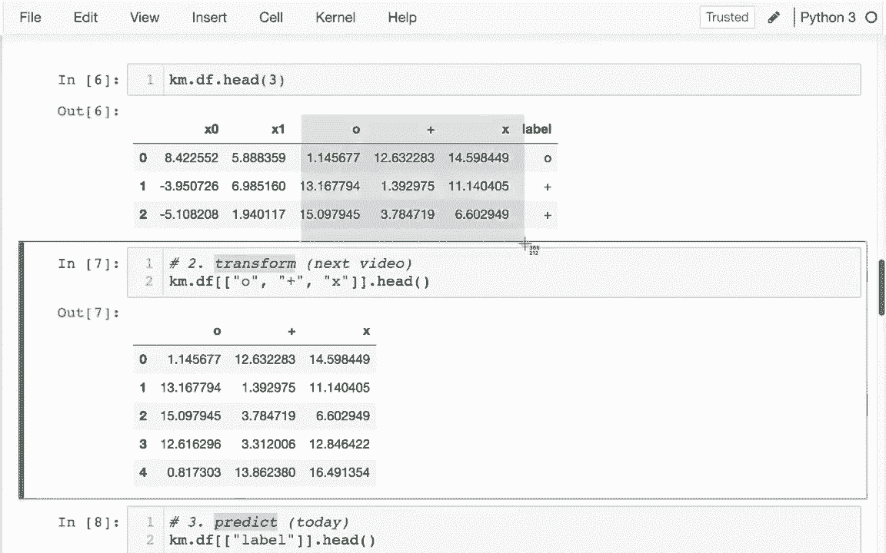
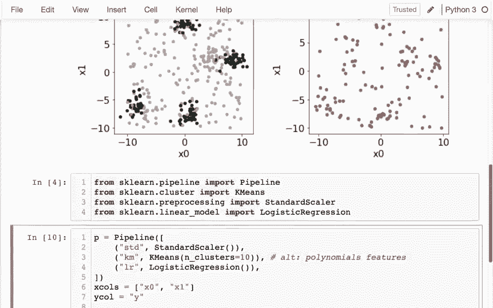

# 使用 Scikit-learn 进行机器学习，P12：12）使用 sklearn 进行 K 均值聚类 

P。在最后一段视频中，我们构建了自己的 Chas 类，而这一次我们将学习 SKL 自带的类是如何工作的。通常，你会想这样做，因为它运作良好，并且处理了所有这些棘手的细节。例如，你可以轻松地让它自动生成不同数量的起始聚类。在运行算法之前，它通常会有比纯随机选择位置更聪明的策略。

它通常有一些逻辑来判断何时更新中心足够，并且不会得到任何更好的结果，因此你可以对此设置一个上限，但它通常不会超过必要的次数。所以总的来说，你想使用 K 均值，而不是自己动手。因此，K 均值实际上有这三种我们需要了解的方法，我们有拟合，这并不奇怪，我们已经看到拟合用于变换器和估算器，奇怪的是它同时有变换和预测，这与变换器和估算器都有相似之处，尽管估算器和预测在这里的使用有点奇怪，因为我们并不是在预测某个标签，而是同时得出标签并进行预测。

所以这并不是真正的经典预测。因此，我将展示一些粗略的代码或数据，以演示这三者在我们之前编写的代码中的作用。在我们实际深入使用均值之前。之前在我们的课堂上，我们看到我们有这些分配点。

一个更新中心，这就是我们需要做的核心，以及一个拟合方法。它可能会像这样进行某种循环，对于 I 和某个范围。昨天我只是要调用这两个，它会调用标记点。它会调用更新中心，并且会多次这样做以尝试找到正确的答案，这样做多少次呢？

好吧，当我拨打那个次数时，它就是这样做的。EpoCs 的数量，所以我可能在这里说 Epos，正如我之前所说的，实际 K 是与 SK 学习一起使用的，这将是一个上限，对吧，如果它看到这没有进一步改善的话。

如果已经完成，可能会出现一些中断。如果没有得到任何改善，我不会这样做，我只是试图写一些粗略的代码，让你了解正在发生的事情。因此，当我们在我们的版本上进行时，我在最后绘制了这个图。希望，这能解决这个问题，并更新那些点，确实是这样的，它正在确定每个质心应该去哪里，这就是拟合方法。在这个过程中，我们为原始数据框创建了很多补充信息。

相比之下，我们有一个数据框，K均值类使用了额外的信息，首先是与每个聚类的距离，其次是通过查看这三种距离，我们可以确定哪个数字最小。

在这种情况下，x列中的数字最小，这一行将属于x聚类；接下来，O数字最小，因此我们将处于O聚类。当我们在使用K均值进行转换或预测时，唯一的区别在于我们是使用这些距离还是标签。

让我先做转换，给你展示我们会得到什么。我们将有效地得到这些数据。🤧。这是我们在进行tas转换时会得到的结果，最后我会谈谈在进行像逻辑回归这样的操作之前，作为预处理步骤，它是如何有用的。

然后对于预测，我们真正得到的是哪个组适合得很好。这实际上并不是真正的经典预测，因为我们既在决定标签，又在决定哪些点与每个标签匹配。好的，我要在这个相同的数据上使用K均值，从SK learn中，而不是我们自己的。因此，我会说K M等于K均值。这有很多配置选项。

例如，我们希望从多少个聚类开始，我会说我们想从三个开始，然后我们可以说KM.dot。但是，无论是进行转换还是预测，你总是需要先进行拟合。我想拟合那个数据框。让我再看一下那个数据框。

所以我想拟合那个数据。我们做到了。一旦我们这样做，那么我们可以进行这两种操作。我们可以说转换。在某些情况下，这可能是训练数据，然后我们尝试将聚类应用于另一个数据框，可能是一些测试数据，通常我们会对同一原始数据进行这样的操作。因此，当我在这里进行转换时，我看到有三个聚类，这就是为什么我在这里做了三列数字，三个距离。

或者我原始数据集中每一行。这样做是非常常见的，而不是先拟合再转换。你知道，为什么不一次性做两个？就像销售一样。这将是一个不错的做法，同样我也可以进行拟合预测。然后不是说，嗯，哪个组在里面，它在试图告诉我。具体来说，哦。你在组零，你在组二，等等。

所以我们可能想做的是，我可能想写一个原始数据框的副本。然后，添加这个预测。我将说。我很多，我，我称之为集群，对吧。我可以称之为分类，类似的东西。而且。让我现在实际看看。我可以看到这些是预测的集群。

我查看尾部以查看其他一些。对， 所以我可以绘制它，如果我想的话，我可以给不同的集群分配不同的颜色，对吧，我可以这样说。点散射x等于x0 y等于x1，对吧，我们在两个维度上都有x。

我得到了这三样东西，但我真的想看看它们的颜色。所以我要传入。颜色等于数据框2，表示你是什么集群。你会注意到其中一个消失了。所以0最终是白色。因此我应该传入一个不同的颜色映射。所以让我过去看看matpl Lib中的不同颜色映射。嗯。

集群0与集群1的相似性不如与集群2的相似性，所以我不太关心获取所谓的顺序颜色映射。像这样的东西，在哪种光谱上真的01和2是我不同的类别。因此我将关注定性颜色映射。我只是试着选择这个，使用我的颜色集，并且我不想要超过10个集群。当我这样做时。

我将说我想要tab 10颜色映射。现在我可以看到它实际上给出了这些不同的颜色。这些不同的点组。如果我想的话，我也可以看看质心并将其绘制在这里。我得到了这样的质心，我可以说数据，抱歉。进入开始。Uusster中心。我在这里得到了什么？但是每个质心的坐标就像这一行。

我有三个质心，所以我有三行。因此，我完全可以将其封装在一个数据框中。我可以绘制它，对吧，我可以说do plot.dot scatter。我可以说所有的x是x0，哦，x是0。Y是1。我可以绘制这三个点。让我把它们做得更大一些，红色，所以我要说颜色等于红色。大小等于100。

实际上。在这里使用S，我真的应该把这个和我之前的结合起来。我实际上可以看到质心。为了让它真正有效，我得说。应该使用相同的区域，对吧。你，让我在这里拆分一下。我觉得太长了。中央和停止热顶Sc，使用相同的Ax。因此，我可以做所有相同的事情。

就像我之前的版本一样。好的。让我解决一个问题，就是我怎么知道我们应该使用三个簇，答案是我只是大致估计了一下。如果有20个簇，对吧，那可能不容易做到，或者如果没有美观的二维数据。

我有x0，x1，x2，x3，x4，x5。之前不会很明显有多少个簇。所以你会采取的策略是尝试一些簇的数量，看看效果如何。而这个效果的衡量称为惯性。所以我可以像这样查看惯性。嗯，这在测量什么呢，它在测量平均值。

从点到最近的质心的距离，这是什么意思，对吧，所以例如。这个在这里实际上离那个质心有点远，所以我会对这个分数贡献很大，而这个就在质心旁边，所以希望所有东西都整齐地围绕一个质心，当然，我有的质心越多，这个数字会下降，这个惯性会下降，越低越好，这意味着所有的东西都靠近质心。所以我们会尝试不同数量的簇，看看惯性下降的速度，让我们来做这个。

所以我会回去抓取我之前所有的东西。而且。有人抓住这个。所以让我，给我做这个。这就是我真正需要的。我将有一个小循环，我甚至不在乎再做预测了。我只想知道那个惯性分数。A。Ea。哦。E平方。好的。

所以你可以看到我在这里要做的事情。对吧，我会尝试不同的数量。当然。随着我添加。更多这些东西，惯性会下降，直到小球如果我有相同数量的簇和点。那么幸运的是，每个点都命中了自己的簇。所以我可能会在这里有一个循环。我会说在范围内的4个k。我想有1到10个簇，对吧，所以K，这就是为什么它是K均值。

K是质心的数量，与质心作为其他Xy值的平均值的事实相对。我运行这个东西。我想把所有这些放在字典里，或者更好的东西，甚至是一个序列，对吧，我要说。S。这是一个序列。所以我打算这样做。我会说。K的数量等于这个东西。这，这个惯性。我会尝试运行这个。

当我完成的时候，或者我认为这里可能有一些问题时。依然。有一个实际上在pandas中相对较新的问题是，他们不喜欢你留下不明确的类型。所以我可能会在前面非常明确。这个序列将包含浮点数。然后另一个抱怨的是，嗯。

我有一个关键错误是一个。产生这个错误的原因是当我在一系列之后加上括号时，它在猜测这是索引还是整数位置。我错误地猜测了一个整数位置。所以它在猜测这个，当然如果我把它改成那样就没问题了，我可以得到我的分数。

一旦我得到了我的分数，当然我可以绘制我的分数。像这样。我还应该这样做。我应该说这里的一些标签。X 标签是 k，也就是聚类的数量。我的 Y 标签是我的 Y 标签是平均。Bd 距离。你最近的质心。对，所以当我在这里查看时，我看到有两个质心。

远比只有一个要好，所以有两个非常明显的聚类。从两个到三个。之后的另一个大改进是没有必要有四个质心，对吧，这不会给我太大的改善。我们再试一次，从头开始运行，因为有时这些聚类会相互重叠，所以仅仅因为。我在这里创建了三个聚类并不意味着最后会有三个明确的聚类。

所以让我再运行一次。🤧。在这里，是否是两个聚类或三个聚类并不那么清楚，不出所料。从 2 到 3 的收益较少。好的，那让我再试几次。再多一点直觉。好的，所以很明显我们想要去到三个。呃。我想看到一个真的重叠的情况，这在这里有点运气成分。

那个呢，从两个到三个的收益并不大，因为这两个聚类重叠得太多了，对吧？好的。所以这就是你常常想要做的事情之一，这些变换的一个使用案例是你会创建一个这样的图，以便你可以对你的数据进行一些描述。你可以说有多少种不同的聚类，当然这涉及到预测，下次我可能会谈谈我们如何做到这一点，这是我的笔记。

这些变换有什么用途，我们为什么想要获取每个聚类的距离数据？

在过去几个视频中，我们一直在研究如何使用 K 均值来识别数据中有多少个聚类，这本身就是有用的。另一个常见策略是我们会将 K 均值用作我们管道中另一个阶段的预处理。

更一般地说，你可能会应用一些无监督学习技术，如 K 均值或主成分分析，以为监督技术创建更好的输入。例如，逻辑回归。因此，我会在这里做到这一点，我真的尝试创建数据，使其能够很好地工作，所以在左侧你可以看到我的训练数据，在右侧是我的测试数据。

而你可以在训练数据中看到，我在这里创建了五个聚类。这些聚类几乎重叠在一起，在这五个聚类中，四个有黑点，一个有灰点，除此之外，它们只是灰点，随机分布在整个空间中。

然后在右侧我们想要预测的，因此显然这里有一些模式。例如，作为人类，我可能会预测这些与这里的黑点聚类在同一区域，因此我可能猜测这些是黑点，然后其他点也像如果我说在这里这个空间。

这些可能是训练数据中的灰点，那些是灰色的。😊。因此，确实很难画出一条单线将黑点与灰点分开。对于逻辑回归来说，所以我必须做某种预处理。好的。我将创建我的管道，在这里，A P是管道。

管道只是一个步骤列表。而最后一步，最重要的一步。也许是逻辑回归。就这样。在第一个步骤将是标准缩放。像这样标准缩放器，然后最终我将加入K均值作为预处理步骤，以帮助逻辑回归更好地工作。因此我将这样做，我将拟合我的模型，所以P点拟合。

而我想要拟合的对象是，我已经在这里将数据框分割为训练数据和测试数据。我可以看到我的两个输入列是x0和x1。因此我将在这里将它们放入一个变量中，并说x列是x0？和x1。那么我试图预测的y列就是y，因为我将对训练数据中的这些x列进行预测或拟合。

然后我将把它与我的进行比较。为什么，科林？然后在我这样做之后，我想要评分。这种分类器的效果如何。所以我要对我的测试数据进行评分。因此我运行这个，看到它表现不佳，正确率只有大约63%，因为很难将那些黑点与灰点分开。而且，这是因为当我只有一个普通的逻辑回归时，它只能在那儿放一条直线。

所以如果我将K均值作为预处理步骤引入。我们来试试这个。K均值在这里很好。而且，让我指定聚类的数量。我会说，聚类数等于让我们说的。先试试三个。我会运行这个。那么发生了什么？我有一个额外的右括号。只是随便加上的。好了。它应该在那儿。请原谅我。

所以这仍然不是很好，因为这里的聚类不够，对吧。我想原本有五个聚类。如果我尝试增加到5。你可以看到我的表现明显好转，但如果我再增加到10，那效果更好，对吧，我可以更好地捕捉不同的区域并意识到它们的接近程度，但是在进行这种预处理时，聚类更多通常不会像聚类太少那样成问题。那么当我将输入变量带入这个模型时，发生了什么呢？我在数据上使用了这个K均值步骤，对吧？它输出的是到每个聚类的距离，这些聚类是识别出来的。因此，我可能会知道我的一个变量，那么到这个聚类的距离是多少，当然，如果这个距离很小，那么它可能是一个黑点。我还可能遇到另一个问题，比如到这个聚类的距离是多少，如果那个距离很小，那么它实际上可能是一个灰点。

所以这是进行预处理的一种方法，另一种方法，可能同样有效，就是多项式特征，它也可以帮助我们找到黑色和绿色之间更复杂的边界。
