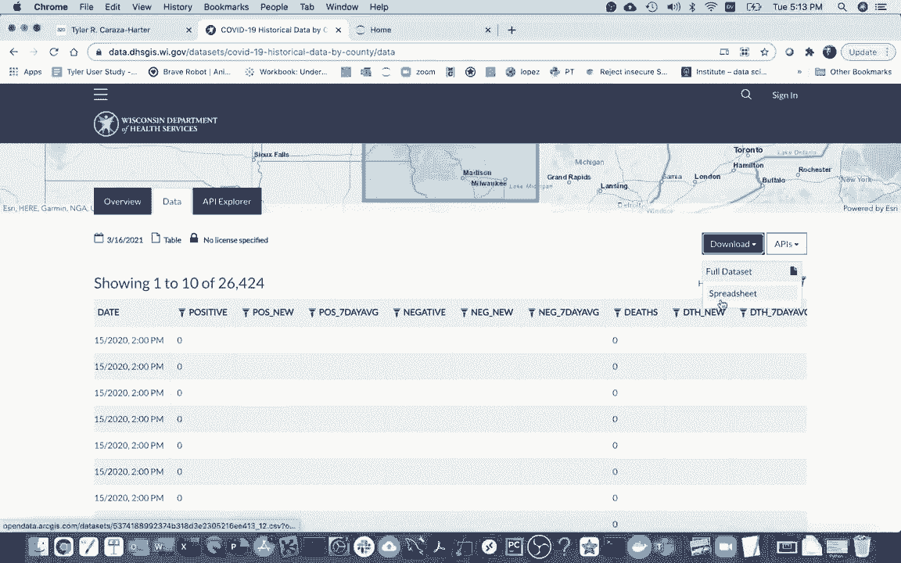
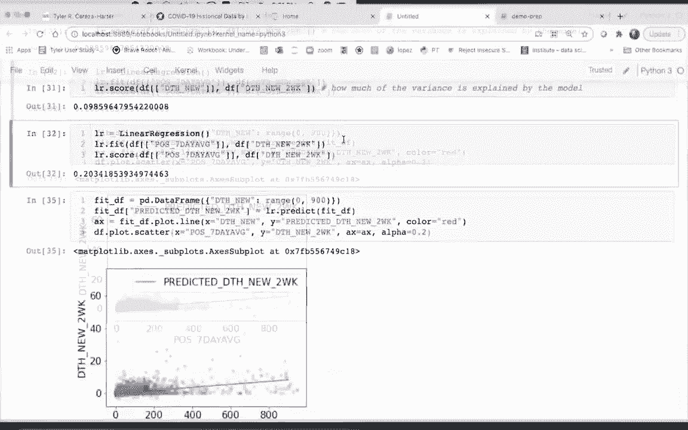

# 使用 Scikit-learn 进行机器学习，P2：2）线性回归 

好吧，在这个视频中，我将使用 Psyt Learn 训练一个回归模型，处理一些威斯康星州的 COVID 数据。现在我在卫生服务部网站上，这是一个数据门户，我可以在这里搜索 COVID。而我使用的数据集就是这个，按县的历史数据。威斯康星州大约有 70 个县。

这些数据告诉我每一天，我想知道能否在这里绘制一个数据浏览器。它显示每个县每个日期的所有不同统计数据，比如说，总共有多少阳性病例，新病例有多少。过去七天的平均水平又如何？死亡人数又有多少。

最终我们要预测的内容基于这些数据是，未来两周将有多少死亡人数，依据今天的统计数据。因此我下载了这个，没再做一次。

然后我在这里进行了相当多的数据清理。这并不是这次讲座的重点，所以我有一个笔记本来做所有的清理。我只是想快速向你们介绍我在这里做的一些事情，而不花太多时间。在这一点上，我提取了一些有趣的列，例如。

在过去七天内，平均有多少阳性病例，以及新死亡人数又有多少？

我们有很多缺失数据，所以我只是删除了所有有缺失数据的条目。然后我将日期转换为实际的时间格式，并在这个过程中去掉了小时部分。我只想获得日期，而不包含发布日期的小时。最后，这个数据集的文档说明，负 999 实际上意味着该字段的值少于 55。

所以它可以是从 0 到 4，因此我觉得为了简单起见，我把所有 0 替换掉。我们并不知道那是什么，你可以想象做得更聪明一些，比如说 2.5 在某种意义上更合理。无论如何，我得到的数据集看起来是这样的。

在很多情况下，虽然没有新的病例和新的死亡，但对于一些较小的县可能确实如此。而对于较大的县，显然不是零。因此，我再往下看一点。我还想添加一列，不仅仅是关于新死亡人数。

那么，未来两周新死亡人数有多少？因此我不得不使用一些时间差的技巧，基本上是将数据与未来两周的数据结合，如果你有兴趣可以看看。但最终我得到的数据集看起来是这样的。我知道在这一天有多少新死亡人数。

然后这个最后的字段是特定数量之后的数量，我将所有这些保存到这个 Wisconsin COVID 数据集中，这就是我可能在这里处理的内容，我只是想过来创建一个新的笔记本。来分析它。所以让我过来。然后我将做的是首先导入 pandas。

所以我将说。导入 pandas 作为 PD。也许我还会导入 matplotlib，点5 plot。嗯。作为 PLT，然后也许我可以先配置我的 matplotlib 内容。Ot，lib 和 line。然后 PRRT 那个。A C 参数。让我们把字体大小稍微调大一点。很好。现在我可以实际给我的数据框，所以我将说数据框等于 PDd。read CSv。

我想要的是什么呢，关于我从另一个笔记本生成的文件，即 Wisconsin。12vi。csv。让我先看一下。所以这就是我能做的，或许只是为了确保所有这些东西实际上不是零，我说一下数据框的意义，因此我可以看到在某一天的平均数据中，四分之一的人已经去世。我想做的是预测这个字段，我可能会将其作为特征或将其作为特征，而这将是我实际想要预测的标签列。

这是一个数量，这就是我为什么要做回归而不是分类。通常在我跳入尝试进行回归之前，我会做一个散点图，以查看我是否可以在数据中视觉上识别出任何模式，所以我可能会这样做，我可能会说数据框点图。那是散点图。然后我可以说我的 x 等于某个值，然后我的 y 等于某个值。

在这两种情况下，我试图预测的东西是我的 Y，即在给定日期之后两周会有多少死亡人数。然后我的 X，我想在第一种情况下尝试七天的平均值。就这样。所以我可以看到那里的图像，然后我想做的另一件事是，如果我查看每天的死亡人数，这将告诉我两周后会有多少死亡人数，我看到那里的模式稍微有所不同。

有时对于这些，我喜欢说 alpha 等于 0。2 或者类似的值，这样当许多点重叠在一起时，可以稍微增加一点透明度。我也会这样做。还有一个我在前进过程中非常喜欢做的事情是训练一个回归模型。

在这两个变量上，我希望你能理解当我们评分时，那个评分与这两者之间关系的强度是如何对应的。所以我将从这个开始，我们如何训练一个回归模型来拟合这个？

我首先需要做的是导入它。所以我会说从 SKLearn 导入线性模型，导入线性回归。这是我们这个学期要学习的主要回归模型，所以我会这么做。如果我想，我可以创建一个新的线性回归对象。就这样。

所以有几个，确实有几个方法是我们想要学习的。因此，一些重要的方法包括拟合、预测、F 分数和预测。我们将对我们的数据运行这些方法。对吧？所以让我在这里继续。当我拟合或训练它时，我需要提供两部分信息，我给它我的。

我的 x 值，我将给它我的 y 值。对于 y 值，如果我愿意，可以是一个序列。所以我可以直接从我的 x 值中提取那一列，它必须是一个数据框。所以让我先看看我早先的数据框。我要做的第一件事是做一个与这个图对应的模型，对吧？所以我想做的是，今天的死亡人数如何预测未来的死亡人数。

所以我需要做的是将这一列的新死亡人数绘制到一个数据框中。我要这么做，如果我这样做，只是死亡。新。那么我刚才做了一个序列，创建数据框的方式是我可以传入一个列表，我可以在这里说一些列，对吧？所以把列表放在括号内看起来有点奇怪，但这就是发生的事情。在这种情况下，我实际上只对一件事感兴趣，那就是在这一天有多少新的死亡人数。因此我这样做，得到了一个不错的数据框，对我们来说会很好，然后对于我的 y 值，我可以直接将其作为序列提取出来。

这将是死亡的新数据。两周后。所有这些将是我的 x 值。这必须是一个数据框。然后这些 y 值可以是一个序列。一般来说，为什么我在试图预测一件事时？但我可能是基于多个列来进行预测。所以我将往下走，我会复制这些内容。

我要在这里复制这个。然后让我在这里复制这个。就这样。我训练它。所以拟合意味着根据数据进行训练。因此，我没有进行很多特征和标签的示例，对吧？所以我可以这样做，这相对平淡。我希望能够可视化。这个模型看起来像什么。

如果我有新数据，它会做出什么样的预测？结果发现，由于我在做线性回归，我这里只有一列。实际上，这将非常容易可视化，因为我可以询问给定的 x 值，你预测的 y 值是多少？

我可以这样做，我可以说Lr.preect。然后我必须传入某种值。对，我想我可以传入一些东西，比如，如果有10人新的死亡，我预测两周后会有多少。我必须把这个作为一个列表的列表传入，因为这就是上面所需的形状。我可以看到还有这个数组的东西。

这是一个nuy数组，我们现在不必太担心这个。一般来说，我会创建一个数据框来帮助我展示拟合线。这是我们可以表示关系的一种方式。如果我在这里画一条线，那就可以告诉我对于我的x变量，我对y的预测是什么。

所以我将创建一个新的拟合数据框，像这样。这个数据框将有一列，记住这是今天的死亡人数。对于这一点，我只是尝试放入一些不同的值，可能我会从0到500绘制。

让我看一下。好的，这就是我的新死亡人数。然后我可以将整个内容传入我的预测中，基本上计算出那些y值。我可以说LR.t predict。如果我想，我可以像这样放入我的整个数据框，试着找出那一列，再一次。

我得到了很多这些奇怪的值，对，这个nuy数组。但是好的一点是，我可以说，我想把这些东西放入一个新列中。我将称其为“预测”。我说完这个后，可能还想强调一下这不是实际数据，而只是一个预测。所以我将把它放在这里。现在当我运行这个时，我可以看到我有。

针对今天的死亡人数，我预测两周后会有多少。对，如果今天有500人死亡，我猜测在两周后，某个特定县可能会有160人死亡。那么我现在应该怎么做呢？我可以实际绘制这个东西，我可以说 fit DF.dot plot online。

我可以说x等于这个东西。我可以说y等于另一个东西，就像这样。不同的模型会给出不同的结果，但我使用的线性回归，正试图给我一条直线。我要运行这个，那里会有某种直线，也许我会把它设置为红色，因为我即将绘制一些新点。

我常常喜欢在得到回归线后，将其与我的实际数据进行比较。记得之前我有这些类似的列，这些都在我的原始数据框中。对于我的原始数据框，我只想绘制一个散点图，展示所有那些点。在这一点上，我并不是在绘制某种预测，而是在绘制真实数据。

所以我将这样做。我想它正在这里画图。让我实际上尝试将其放在同一个上。我将说。AX等于AX。我可能会让第一个返回一个AX。然后也许。在这里我将再次设置alpha B 0.2。我为什么要把AX放在那里？好了。然后我得到了这些漂亮的图。

我可以看到这实在是太长了。也许我应该做的是，我看到我的数据大约只有。大约100，所以也许在这里我会在大约100的范围内做出预测。所以我将这样做，我可以看到那条线是如何契合的。是的。好的，那么，我做得如何，我是说。我可能会根据观察直观推测。实际上。

我正在看的每一个点。好吧，我希望大多数都靠近那条线。我可以看到很多并不是，对吧？所以我们评价这些东西的方式是，我们会看看我们试图预测的东西的方差是什么？

那么这个东西的方差是什么，方差是一种测量值，表示值通常与平均值的差异。对，所以我可以得到我的方差，这一列的方差是1.35。我们的想法是，我们将说。那么这些点与y轴上点的平均值相比，相差多少，然后我们将其与我画的红线的差异进行比较，如果这条线很好，那么相对于红线的方差可能会下降很多。

对不起，它们相对于红线的方差可能相对于平均值下降很多，我想我可以画一条水平线。于是我可以像之前那样回来拟合数据。我在哪里拟合的数据，我就在这里。我可以检查。与其拟合，不如给它打分。对， 这将告诉我模型解释了多少方差。

通常这将是一个介于0和1之间的分数，其中0是最糟糕的，而1是最好的，在某些奇怪的情况下，它甚至可能变成负数，或许我们最终会讨论这个。一般来说，它会在0和1之间。所以我看到这并不太好。好的。让我们试着对我们之前的另一个变量进行处理。对吧。

所以我这里有这个，看看这些图。我可能会期待这个表现稍微好一些。我想它大约是9%。所以我将在这里复制这些东西。然后我将创建一个新的。一个新的线性回归对象。然后我将做什么？F它。我之前在哪里拟合。

这是我之前的拟合方式。不是拟合。今天的桌子。好吧。让我尝试拟合到多少。哦，我想获取阳性病例的数量。让我再上去看看我的数据框。我想拟合过去七天的平均病例数。

所以我现在要这样做，我将根据这个其他变量训练我的新模型。我该如何使用这个来预测两周内会有多少死亡人数，也许我会立即给它打分。所以我也许会把你复制这个，然后给它打分。我可以看到它做得好多了，而不是解释9%的方差。

我在解释方差的20%如果我解释方差的100%，那么这将是非常显著的，因为每个点都会恰好在那条线上。让我试着像之前那样绘制图形，所以我将把这个复制到这里。然后我需要这个，记住这个拟合的数据框。

我必须在这里使用一系列值生成它。所以我将把这个粘贴到这里。那么我将再次生成从零到100的值。这告诉我，嗯，确实是正面的。每天平均病例。然后我将根据这个得到一个预测。然后我可以绘制这样的线。

我会这样做，我可以看到。嗯，有些地方有点奇怪，对吧，我想。我想我没有正确更改所有内容，我看到X轴仍然是今天的死亡人数，而不是我实际训练的内容，它显示的是七天平均值，对吧，所以让我修正它。再运行一次。所以这稍微好一些。我可以看到线没有延伸得太远。

这之前是有道理的，当我说，嗯，某一天有多少死亡人数时，那个数字相对较小，和确诊的Covid病例数量相比。因此，也许我会重新做这个，而不是从0到100，也许我会从零到大约900。所以我运行这个。我可以看到现在的F值更好，我在解释方差的20%，而不是只有9%。

所以我在这里做了一些不好的事情，我想在下一个视频中谈谈这个。如果我只是想给你留下一个想法。嗯。假设我在课堂上教某个东西。我演示一个例子。也许每个人都看到那个例子并尝试从中学习。如果我在任何考试中给出完全相同的答案或完全相同的例子。那么，有人能在那次考试中表现好，这意味着什么呢？我认为有两种可能性。

可能有一个人确实从那个例子中学到了东西，即使他们再次看到同样的例子，他们也理解发生了什么。另一种可能是，有人只是记住了例子的答案，然后在考试时，他们只是重复它。这就不太好了。所以这里也是一样，对吧，当我进行拟合时。

我真的在给我的线性回归模型一些例子。😊 然后当我打分时，实际上我是在使用那些相同的例子。所以如果这个分数很好，我想这里不太好，但如果它很好，我就真的不知道，嗯。模型是否有效地记住了答案，还是过度拟合。

过拟合是我们指的基本上是记住了它的情况。因此，下次我将讨论我们如何实际解决这个问题，并更好地判断它是否做得很好。
