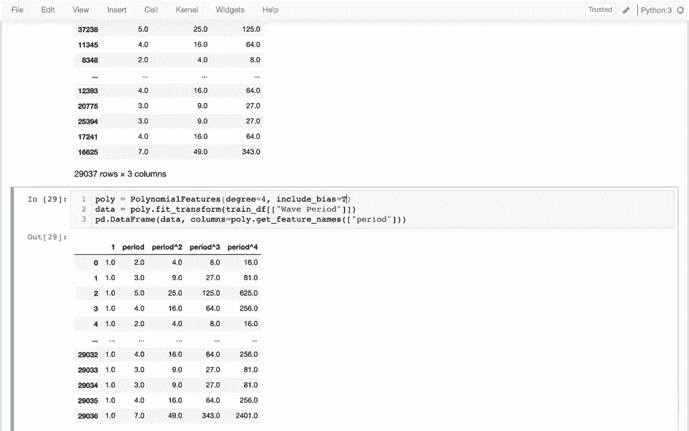
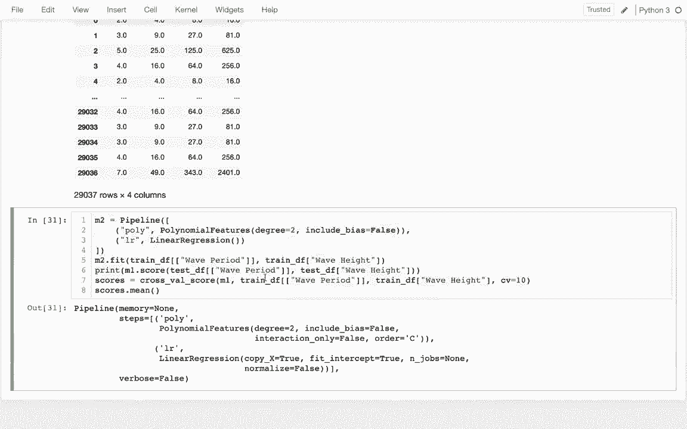
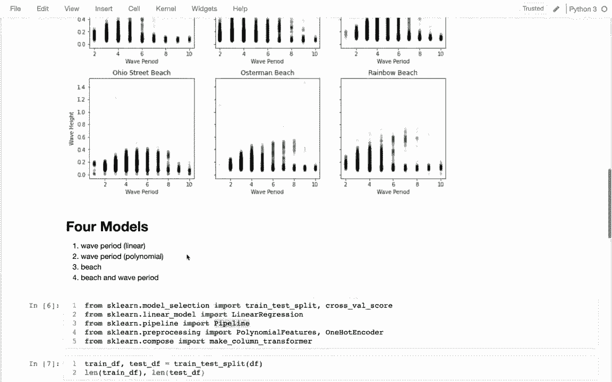
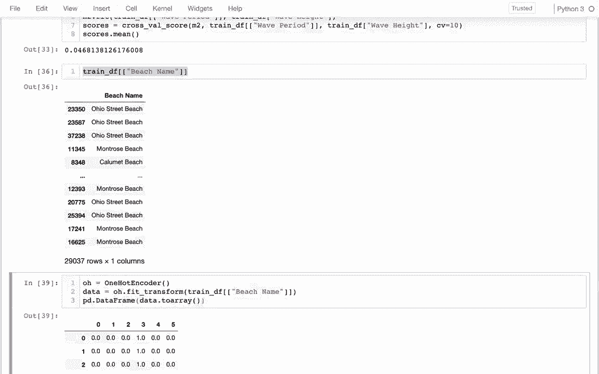

# 使用 Scikit-learn 进行机器学习，P5：5）sklearn 管道 

好吧，在这个视频中，我们将学习 Pscant Learn 管道。我们一直在学习如何使用线性回归作为模型。通常我们的模型在分析数据之前需要对数据进行某种转换。因此，我们的模型最终会形成这些管道，我们会进行一系列转换，最后使用一个估计器，PsyAL 中称之为估计器，以实际进行预测。

因此在这个例子中，我可能会使用一个稍微复杂一点的数据集，在芝加哥，正好位于密歇根湖旁边。他们在不同海滩上都有这些传感器，测量波浪的相关数据，所以我可能会查看这个数据集中的所有测量结果，我可以看到这是俄亥俄海滩，这是63街海滩。

然后我知道关于这些传感器的所有信息，比如水温、浊度等等，而我们要尝试预测的是这个海滩的波浪有多大。我们将使用波周期等因素来进行预测，或者直接看看我们所在的海滩。

所以这里有一些垃圾数据，我已经清理过了。这是所有数据的图表，X轴是波周期，Y轴是波高。

然后我也试着逐个海滩分析。因此在这里我把所有的海滩提取出来，形成一个唯一的排序列表。

根据海滩名称，然后我在这里做什么呢，我是分别绘制每个海滩。

所以我在创建一些子图。我正在循环这些子图，并基本上绘制每个海滩。对，我在 pandas 中进行一些过滤。我把每个海滩绘制在不同的 Ax 区域。所以我看着这个，有一些观察结果，通常在我建模之前，我喜欢做很多散点图，试图从中获得一些直觉。

一个是我确实看到海滩运行是一个重要变量。这些海滩在波浪方面有不同的模式。另一个我看到的是波周期和波高之间的关系并不是线性的。并不是说波周期越大，波高就越大，反之亦然。

我看到的情况是，通常在中间会有一个小隆起，因此如果我们想要得到最大的波浪，我们需要一个位于中间的波周期。

我将在这里构建四个不同的模型来分析这些数据，它们将以不同的方式使用不同的变量，第一个将与我们之前做的非常相似。我将尝试基于波周期预测波高，仅使用简单的线性回归，我们将看看它的表现如何。接下来，我们将学习如何进行多项式回归，这意味着如果我在这里画一条线，这条线就不必再是直的。

最后，我将研究，如果我只知道我在什么海滩上，我能多好地进行预测？然后最终，我将查看海滩和波周期的组合，将波周期视为多项式，看看我能在那儿预测多少。因此，在我的导入中，我有一些我们之前做过的内容，我们首先学习了如何进行线性回归。

我们会将线性回归拟合到训练数据集上，然后在最后评估测试数据集，在此过程中我们可能还会在训练数据中进行交叉验证，所以这些都是旧的内容，而下面的内容是新的。因此，为了能够。

处理这些数据时，我想以多项式方式进行，可能需要使用这个多项式特征的东西进行转换。如果我想处理像“我在什么海滩上”这样的分类数据，那不是数字，而是一个类别，我必须使用这个叫做“一热编码”的东西。如果我想使用这两者，我必须使用这个叫做“列转换器”的东西来将它们组合起来，最终我将有这个管道，在管道的最后，我仍然将进行简单的线性回归。

但我将在数据达到之前对其进行所有这些转换。这也许就是我如何构建这些更复杂模型的方式。让我们从这里开始，我可能会给这四个模型编号，分别为一、二、三、四，按照这里的编号，我可能将模型1设为简单的线性回归。

就像那样。然后我可以说M1，实际上。我可以做不同的事情，我可以说M1进行拟合，我会将其拟合到我的x值和y值上。这是大写，因为它是一个完整的数据框，而这是小写，因为它只是一个单一系列。我想在此之前，我实际上需要将我的训练数据框与测试数据框分开。我说训练测试。拆分Df。也许我会查看这两个的长度。

所以大约25%的数据用于测试，我对此没问题。因此在这里，我需要我的训练数据框，然后我可以放一个特征列表。然后在这里，我可能会再次使用我的训练数据框，我只需使用我的y列。我的y列，也就是我试图预测的，就是波高。

就这样，然后我的特征列表，首先我在这里列出了一个列表，这就是我得到这些奇怪的双括号的原因。我将首先使用波周期，如果我回去查看，我可能需要大写以匹配早先数据框中的内容。

是的，看来这些都是大写的。所以我可以这样做。现在，这个模型已经学习了模式。那么我可以说M1点预测。基于我的测试数据。所以我可以说测试数据框，只给它x值，然后它将为我预测这些y值。

所以让我叫它M2和M1。我得到了所有这些预测。接下来我可以将这些预测进行比较。

我实际上对这个波周期的数据进行比较。我可以把这些数字与下方的数字进行比较，乍一看，我看到它们并不接近。我进行比较的更简单方法是调用评分函数，这样评分函数会自动在此调用预测，然后与我的波高测试数据进行比较，告诉我我解释的方差百分比，而现在我看到结果很糟糕，实际上我没有解释任何东西。如果我总是预测平均波高，那会比我现在的结果要好。当然，这其中有些运气成分，特别是在我如何进行训练测试拆分方面。

所以这里更可靠的衡量方法是进行交叉验证。让我打印一下交叉验证得分。

然后我需要给它三个东西，我得说，嗯，我的模型是什么，我的模型是M1。我的x值和y值是什么，我将在这里进行处理。当我进行交叉验证时，我通常会在训练数据中完成这一切，我只是尝试将测试数据保留到项目的最后进行最终分析，我发现我实际上得到了各种分数，有时运气不好我做得甚至还不如零，大多数情况下我可以说我想将数据分成多少块，记住我会循环遍历每一块或折叠，它都有机会成为测试数据集，所以我可以在这里获得更多数字，也许我只会说分数等于这个，我可以说分数没有意义。

所以这可能是我模型表现的更好指示。我解释了1/10的1%的模式，这并不令人惊讶，对吧，我用的只是波周期，我试图将一条直线拟合到这里，我能看到，嗯，是的。

毫不奇怪，我无法将一条直线拟合到它上面。

好吧，如果我想要，我先复制一下这个，我很快就会删掉。如果我想做更多的列，那将是一件简单的事情。例如，如果我想包括，比如说水温。我可以很容易地将其作为另一列添加，对吧，有多个x值非常简单。所以我可以在这里做到。

然后在这里，也许我会得到一个稍微不同的分数，还是不太好，对吧，试着把这个删掉。 但是添加这些不同的东西非常简单，为什么呢？因为当我这样做并把那个列表放在这里时。我只是展示了一个我想用来进行预测的简单数据框，包含X列。

好吧，这就是我们如何添加东西，实际上让我们考虑一下现在该怎么做，如果我想要有一个多项式拟合。那么我们要做的是，实际上让我把这一切都删掉。😊。

我只是想创建一个演示，这将是我的训练DF的副本，而我的训练DF可能只是一个波周期。

让我看一下这个数据框，但我们要做的事情是，如果我想要有一个二次拟合。我想在这里添加一些列，这些列将包含平方数据。

所以我可以做这样的事情，我可以说演示。我可以说周期。平方。等于demo。波期。那我可以有像这样的一个是立方体。

这是为什么不开心，哦，因为我在一个比较上做一个分配。所以我只是假设那'已经存在。

所以如果我这样做，那么。

而且你知道，我实际上想要复制这个，以免抱怨。我可以看到我会做的事情是，这一列而二平方是2，2立方体是8。3平方体线。33的立方体是27。所以我实际上可以做的是对这些东西进行线性回归，即使第二次线性回归试图像二次或三次回归一样。

因为我只是把这些视为常规列，我可以对这些东西的重要性进行加权，所以我怎么能做到这一点呢，这里我只是手动添加这些东西，如果我想的话，我可以使用这个多项式特征的东西。

所以在这里，我可以说波利。等于多项式特征，我可以说poly点fit transform。我想在这里转换我的数据，这是我以前有的。

所以我要运行这个东西。我看到我得到了所有这些不同的列。如果我想的话，让我在数据中捕捉这些，对，这是其中一个nuy数组。我们最终会学到的，直到我们学到为止。我只是想把它放在熊猫数据框中，这样我就能更好地看到发生了什么。

所以我要说熊猫数据框。

然后我要把我的数据放在那里，然后我想知道这些列的列名是什么，结果这件事也会告诉我。所以我可以说，抱歉Polly会告诉我，所以我可以说多项式处理。

就像那样的特征名称，我必须说的列等于。

现在我可以看到，我有V x然后x平方。我实际上必须告诉我的原始名字才能起作用。

我实际上必须有像这样的一个列表，请原谅我。

所以我能看到，好的，我有一个周期和一个周期的平方，如果我想出现。我可以说像这样的事情，我想要它成为一个四次的对吧，所以我可以有一个周期周期的平方周期的立方周期的四次。

你可以看到它也给我提供了一个零的列，这实际上是一列全是1的值。所以我通常会禁用这个称为偏置列的东西。所以我会说我不想要那个东西。

现在我实际上有一些与我之前手动所做的非常相似的东西，我可以使用我的数据进行这个转换。如果我想的话，我可以对我的训练数据和测试数据都进行这个转换，然后这就是我将要进行所有建模的基础。现在，我认为为了简化，我们想要自动进行转换，然后立即应用线性回归，事实证明，这里的管道（pipelines）也被我导入了。

让这一切变得非常简单，所以我可以在这里创建一个管道。

就像这样，也许我会在这里画出这个，它将成为我的第二个模型。它将是一个管道，我们必须在这里传入一个列表。

列表的工作方式是我会有像转换器（transformers）这样的东西。我可能会有一个或多个这样的东西。然后在最后，我可能会有一个估计器。所以所有这些东西都将以某种方式修改我的数据，可能会添加更多的列，然后在最后我可能实际上会进行我的真实模型，而我的真实模型只是一个线性模型。

就是这样的回归。那么这里，我的转换器是什么呢？我只是想像这样做多项式特征。我认为二次的程度对于我们现在来说是合适的，所以我有这两个东西，关于这个管道的后续细节是，我们必须给每个阶段命名，而它想让我们这样做的方式是将这些东西放在括号内以创建一个元组，然后将名称放在元组的第一部分。

所以我将这个转换器称为poly，因为它是一个多项式转换器，然后这个我不知道，我就称它为LR的缩写。其实这并不重要。

好吧，让我看一下M2，它向我展示了所有这些细节。但是现在M2只是一个模型，它与简单的线性回归非常相似，我可以用同样的方法进行。比如说，如果我回到这里，所有之前做的事情。

我刚刚创建了M1作为我的模型，并且我在它上面做了所有这些事情。我可以在这里做所有那些相同的事情，所以如果我在这里运行，只需说M2 dofi，也许我会为简化起见删除这个，一切都是一样的，我可以看到也许我现在的表现稍微好一点。那么我之前的分数是多少呢？

实际上，这完全是一样的。我本来期望表现得稍微好一点。为什么我表现得没有更好，可能是因为我在评估我的同一个模型。这就是复制粘贴的诅咒。好吧，在此之前让我看看这个。我解释的是0.1%。

嗯，我想接近0.2%的方差，现在我解释的是差不多4.6%，所以我可以看到模型2相比模型1有了巨大的改进，而我真正做的就是我仍在进行线性回归，但我通过给它这些额外的列，提供了更多的信息。我有一列大概是“波周期的平方”，在这里绘制。

直觉是，我在这里拟合一条线。

而且那条线不必再是直线。它可以是一个弯曲的二次曲线。

好的，我们有这两个模型。我们有这个，真的是很糟糕，它几乎告诉我没有什么。有时这个模型，取决于你的训练测试数据集，实际上会让你离真相更远。如果你总是猜测平均值，这个模型实际上表现得相当不错。

好吧，它几乎解释了5%的方差。让我们试试海滩，看看我们能做到什么。这将是我的第三个模型。所以如果我下来这里，我想对这个模型做第一次尝试。

也许我应该在这里加些注释，对吧，这个是。这是波周期。

然后这个在上面是什么，模型1，这只是基于周期的线性分析。

然后我会尝试进行线性分析，海滩就是我现在想做的事情。所以如果我有这个模型，我将把这个模型称为模型3。也许我会再次删除这个，以保持干净。可能会在这里做这个。

我想做的主要事情是，想要将其改为海滩名称，而不是波周期。如果我把它放在这里，我就能看到所有的海滩名称。

好的，我要下去，我想要预测。

波浪高度基于沙滩名称，对吧，就像这样。而且这也是下面的沙滩名称。

这将会给我抱怨，它说无法将俄亥俄街名称沙滩转换为浮点数，这确实没有被转换为浮点数，这很有道理。因此，如果我看一下这个东西。

这是分类数据，事实证明线性回归最终会学习到原因。但它希望一切都是数字的。

所以这是个问题。那么我该如何处理呢，我的意思是，也许学生有时想到的一个主意是，我可以编码这些。我可以说，1代表俄亥俄沙滩，2代表卡拉梅特沙滩，然后3可能代表蒙特罗斯沙滩。

问题是，如果我把这些数字放成这样。嗯，线性回归模型会假设它们是有意义的。这意味着，如果模型学习到关于俄亥俄沙滩的某些东西，然后学习到关于蒙特罗斯沙滩的东西。它错误地认为它了解一些关于卡拉梅特沙滩的信息，我觉得这就像是所有其他沙滩的平均值，当然这不是真的。

我只是有点任意地把这些数字放在这里。没有理由相信这个沙滩有其他两个沙滩的平均特征，所以那样是行不通的，我不能那样编码。

我们要使用的想法叫做独热编码（one hot encoding），独热编码看起来是这样的。独热编码。这将是这样的，我可以说112那个脚。转换。我将把这个数据在这里进行转换。然后我得到了这个奇怪的东西，嗯，无论那是什么，那就像是稀疏矩阵。

我们最终会学到更多，但我可以把它转换成这个东西，这是一个NumPy数组，然后这个东西我实际上可以放进， 我会简化一下。这个东西我实际上可以放入数据框，或者有时称为pandas数据框。

就像这样，然后就像之前那样，我想弄清楚这些列是什么，所以就像多项式变换器一样。我可以说获取特征名称，情况也是一样，对吧，我可以说什么热点获取特征名称。就这样，然后我必须告诉它，我最初是用什么操作的，我想我是在沙滩上。

那为什么这样不高兴呢？所以过去的值的形状是这样的，索引暗示了。类似的东西，我在想那里发生了什么。我认为我的承诺是我需要说像列等于那个。

好的，那么这是如何工作的，第一行是俄亥俄海滩。你看到我实际上为每个不同的海滩都有一列。我们要做的是设置在其中。如果是俄亥俄海滩，我们会设为1。然后其他都是0。如果我再往下几行。

我看到我在第4个位置有蒙特罗斯海滩。

所以那个口味，我会在蒙特罗斯海滩下放一个1，然后在其他地方放0。这就是我们所称的“一热编码”。对吧，所以我想热的地方是我们有1的地方，而其他地方是0。所以如果我有这个。

尽管我一开始有一些分类数据，但我最终可能会得到一些数字的东西。所以如果我整理一下。

让我回到这个。我可能会删除所有这些，因为这有点走入死胡同。对吧， 更接近的灵感是我之前使用的管道。

由于多项式特征，因为就像多项式特征作为变换器一样。所以一热编码也是对的，我要调整一下，现在我们在模型3。这就是一热编码。在这里我可以直接放弃这个，然后我可以说一热编码。就这样。然后我可以在这里做线性回归。然后我可以在这里说。

我可以说。

我想这像是海滩名称，对吧。海滩名称。然后。实际上，我甚至不需要这个。对，我有点这会自动为我进行拟合，并告诉我效果如何。呃。我想知道为什么这在这里抱怨。我有点紧张，不过它可能会很快告诉我。我可以在这里说海滩名称。

然后让我试一下，果然，这是无效的语法。因为我那里没有匹配。

所以这比之前更好，对吧，我想仅仅查看海滩名称就比知道波周期更好。

对，所以我的模型越来越好。对，首先。我一开始只是用线性模型看波周期。然后那太糟糕了，我现在甚至只能解释1%。

我说，嗯，让我们对波浪周期进行多项式拟合，我大约解释了5%，而且差不多是4.5%。然后我只看海滩，得到5.5%。接下来自然而然要做的事情是，让我们对海滩和波浪周期的多项式进行回归，也许我可以做得更好，或许这两者都为我提供了一些信息。

这就是我面临挑战的地方，对吧，因为我想对海滩名称进行独热编码。我还想做多项式特征。

另外一列对吧，我必须有某种方式来组合这些东西，结果发现这就是我在这里导入的最后一部分。创建列转换器将让我将多个转换器组合在一起，每个转换器应用于不同的列，所以我会在这里往下走，可能会复制这个以获取我对模型4的灵感。

我现在有模型4了。我将要做什么？所以这就是必须改变的，对吧？

不知怎么的，我必须要有一些东西。在这里。能够同时捕获两个列，对吧。因为我接下来要做的事情是，我可能会传入海滩名称和波浪周期。为了预测我的波浪高度。那么我该怎么做呢，嗯。我称之为我导入的东西，就是创建列转换器。

当我调用那个东西时，我会有一系列的转换器。我会有转换器一，然后是转换器二，如果我想的话，可以有更多，但在这种情况下我不需要。每一个。

每个转换器将是一个元组，元组将是转换器。然后将是它适用的列的列表，所以这两者都将是这样的，对吧，我有这些元组，或许我只需在这里换行。

所以我们有这两个转换器。然后是一列列名。因此，我认为我想做的事情是对海滩名称进行独热编码，所以我会在这里复制我的独热编码器。那么这个适用于哪个列呢？嗯，它适用于海滩名称列。然后我的另一个是多项式特征，我应该直接从上面复制。

就是这个东西。

多项式特征。这是我的另一个引入者。这仅适用于波周期。好的，所以我现在有这个模型，然后我可以尝试运行它，现在我看到我解释了高达9.5%的方差，这实际上，我想我希望能解释100%。但我可以通过考虑这两个因素看到，我解释的方差比我原本要多得多。

在我结束这个视频之前，我想做的最后一件事是讨论一下这些名称的意义，我可以利用这个。我们可以把管道像字典一样使用。对，所以例如，这意味着我可以把两个都放在这里，这样会给我什么呢？这会给我我创建的这个列转换器。

就在这里。如果我想，我可以窥视一下这个东西的工作方式，以便调试我的模型。我可以说拟合，转换。

然后我可以在这里说，这就是我正在处理的数据，所以我可以看到。

那么我想我实际上需要一些列名在这里。不过我可以看到，这是我正在处理的，让我做一个数据框。

在这里。我看到这里有所有这些列，这些列进行了独热编码。然后我有这些列对其他事物进行了多项式特征处理。所以这是我用来预测波高的数据。因此，即使我最开始只有这两列，在我完成所有这些转换后。

实际上，我在管道的最后给线性回归提供了更多的信息，这就是为什么我们能够在这里做得更好。因此，作为最后一步，我想做的是，我看到Model4显然是最好的，所以我会推荐这个。可能如果我在做四个不同的模型，其中一个恰好表现更好，这就是为什么我保留了我的训练数据，我只在测试数据上使用，并且会将训练数据用于交叉验证。

验证评分。所以在最后，我可能会将这些数据适配到这些内容上。就这样。

那么让我运行一下，然后我可以用它来进行预测。让我记住如何做到这一点，因为这很有用。我可以用这个在我的测试数据框上进行预测。就这样。我可以做出所有这些关于波浪可能性的预测。

或者我可以方便地评估这些预测在我的测试数据框中关于波高的准确性。我现在看到，我能够解释8.4%的方差，所以我确实有一点运气，但我仍然可以说这显然比我的其他模型要好。

