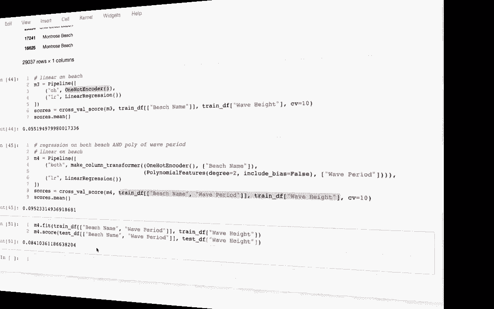

# 使用 Scikit-learn 进行机器学习，P6：6）逻辑回归 

嗯，大家好，当我们开始学习机器学习时，首先讨论的问题是回归。在学习了回归之后，我们了解了一些其基础的线性代数，现在我们将转向第二种机器学习问题，那就是分类。所以我想回顾一下机器学习的主要类别。

主要有三个类别，有些人会说是四个。但有强化学习，这与多阶段决策有关。在 320 课程中我们并不涉及这一点。我们真正感兴趣的是监督学习，也就是我们尝试对未来或其他未知事物进行某种预测。

然后还有无监督学习，那里没有我们想要预测的特定事物。但我们在寻找数据中的某种模式或简化。我们一直在学习回归，这是我们想要预测一个数量的地方。所以我们将学习另一种最常见的监督学习，这就是。

那么我们如何预测一个类别呢，这被称为分类。所以简单回顾一下这两者之间的区别。我这里有一个大数据框，所有这些东西都是特征，而在这些特征中，我有混合的数量和类别。在查看我的特征以确定我面临什么样的问题时，这实际上并不相关。我要考虑我处理的问题类型时，我会查看这个标签。

我试图预测的是定量的。或者在这种情况下，是定量的。所以这是一个回归问题。那么我们会怎么做呢？我可能在这里有一些数据，其中我的特征和标签都是已知的。因此我会将一个模型拟合到这些数据上，然后我会用同一个模型进行预测。

或许这个标签是未知的，或者我可能假装它是未知的，以便我可以基本上测试我的模型的有效性。如果这是某种测试数据集。分类问题看起来又非常相似。我可能有一些数量或类别的混合作为我的特征。现在主要的区别是我有一个分类的 y 或标签列。

否则我仍然会将我的特征与标签相匹配，然后尝试对此进行某种预测。所以如我所提到的，我们有这四个大类，而 S KL 针对每一类都有许多不同的算法或实现。

到目前为止我们学到的是线性回归。这就是我们一直用于回归的内容。所以线性回归模型被称为回归模型。非常令人困惑的是，我们现在要学习的叫做逻辑回归，它实际上不是回归，而是一个分类器。名字虽然是线性回归，但它是分类器。所以不要搞混，尽管我们正在学习逻辑回归的线性回归。

我正在教你一个回归模型，以及一个分类模型。所以我将退出这里，前往我的笔记本，试着介绍一下这个。

让我看看。这是我的笔记本。我有一些自以为是。也许我稍后会回到这个话题。现在让我先跳到这里。我有这个数据框，它包含了一些来自一个非常著名的机器学习数据集的数据，叫做IIS数据集。IIS数据集的理念是关于鸢尾花的所有这些测量。

比如说，花瓣的大小是多少，萼片的长度或宽度是多少，我想它就像花瓣之间的叶子。鸢尾花有不同的品种，所以我把品种放在最右边的这一列。现在我看到的整个内容是一个测试数据集，它只有10个样本，这个数量非常少，通常我们会有更大的测试数据。

我只是想保持简单和小巧。在这种情况下，我传入这个随机状态。尽管它有点随机，我的意思是每次运行时，结果都会相同。如果我在这里放一个不同的数字，我会得到不同的随机结果。而且我每次都很小心地使用随机数。所以这样做只是为了让我可以复现。

即便它希望我基本上是随机的。我想要随机，但可复现。所以我已经进行了训练和测试，但我这里只放了10个样本。因此我们将要做的是将不同的模型拟合到训练数据上，然后看看它们在这个非常小的测试数据集上的表现。看这一点时，有三个特征我可能会感兴趣，当我们查看萼片的维度时。

然后我有这个常量列，记住有时当你有这些模型时，你可能会有单独的截距系数，或者你可能只会有系数。而最后一个系数应该乘以这一列，这就是我在这里所做的。我想我会把后面的例子做得简单一些。这些就是我的特征。

我实际上这里有多个y列。我只是想看看我能否预测不同的东西。我能否预测花瓣的宽度？我能否预测特定品种是否为Ctosa？实际上总共有三种品种，所以我能否预测任何一种品种。你可以看到每当我有Ctosa时，它对案例是真实的。

这是 false，对吧，因为它不是 Setosa，所以这就是我将要做的。我将看看是否可以根据这三个不同的特征预测这三个不同的列。我想这实际上是两个特征。因此我们将进行四件事。我将在花瓣宽度上进行回归，这实际上只是复习。

我们将对 Setosa 列进行二元分类，因此我们将尝试预测。是否为真或假，二元意味着两个，这就是为什么这里只有两个东西。要么是真的，要么是假的。我将使用同一个模型不仅告诉我它是否为真或假。我将询问模型它为真的概率和为假的概率。

与其说，嘿，是真的，我想看看是否有人说，哦。这有 95% 的机会是真的。最后，多重二元意味着两个。多类意味着我想更多于两个，所以我们将在这里进行，你可以看到我有三个不同的类别，在这种情况下事情会变得复杂一点。好吧，所以我会在这里，然后我首先要开始一个回归，我要说回归等于线性回归。

这只是之前的复习。我在这里有所有这些选项。而这个 fit intercept 一定要确保我设置为 false，所以 fit intercept 是 false。如果它为真，通常会为我添加这一列，因为我已经手动完成了。所以这样可以让我稍后得到更干净的示例。因此我有这个东西。

我想将其适配一些数据，所以我将使用回归 dot fit。当我拟合时，我的 x 和 y 是什么，然后我可以使用回归 dot predict。也许一些其他的 x，然后那将返回一个 y，对吧，所以我会有这样的东西。也许我会说 y，y 2 和 x2。在我的特定示例中。

我有我的训练和测试数据，所以我现在试图预测什么。我试图预测花瓣湿度。对吧，我将复制这个列名。当我进行拟合时，我会从我的训练数据中提取它。所以我将把它放在这里，并用引号包裹。这就是我的 y。然后我的 x，嗯，它将是。

这将再次是我的训练数据，然后我需要一些列。我想应该有一个列的列表。因此我实际上已经在这里创建了，我有这些 x 列。这些是花萼长度，花萼宽度，以及常量。因此这将是我放在这里的列表。我基本上会得到这三列。

让我这样做。如果有人在可视化上有困难。我只是在从我更大的数据框中获取这三列。而当我这样做时。我是在处理一个包含花瓣宽度列的pandas系列，所以我会尝试根据这三件事来预测。好的，所以我正在这样做，现在我想在这里进行一些预测，这将是一样的。

我将基本上采用相同的格式，只是现在我将使用我的测试数据。也许不捕获那个变量，而只是看看现在的样子。这些是我的预测。或者我应该在这个花瓣宽度列中绘制的内容。所以如果我想的话，我甚至可以将它们添加到我的训练数据框，或者我的测试数据框中。

我可以说我的预测等于那个。然后我可以查看我的测试数据框。它抱怨的事情是，我试图将一些值添加到另一个数据集的切片中。所以当我在这里做的时候，这些都是我大数据框中行的切片。如果我在尝试向其中之一添加列时感到困惑。

这不是原始成功的简单修复。我可以说像test等于test的复制，然后test将完全与我的数据框脱离，我可以向它添加列。没有抱怨。所以让我运行这个。现在我可以看到这里有这个预测列。我可以看看这些预测如何，如果我预测1。3，实际上是1。2。

我预测1。59，实际上是1。4。哦。所以我有时能看到预测不错，有时则不太好，反正这就是回归。哦，让我继续这个部分。让我继续尝试下一个部分。我想做一个二元分类。在这一列上。所以代码实际上会和之前非常相似。对吧，我在这里写下。

我会改变一些东西，首先。我想进行逻辑回归。记住，它是一个分类器。尽管名字如此，所以我可以处理像这样的类别。然后对于我的目标，我将只使用Ctosa列，它是Setosa品种还是不是？所以我这样做。我也可能会重新命名这个，以便记住它是一个分类器，我将把它称为CLS。

然后在这里我也需要CLS。我这样做。现在我可以在这里看到我的预测，我可以看到。这一列告诉我花是什么，另一列告诉我模型预测的结果。实际上，我想我们在这里做得相当不错，每一个预测都是完全准确的，这很好。好的，让我回到这里，转到我们想要做的事情。

所以我们使用线性回归进行了回归，使用逻辑回归进行了二元分类。然后基本上说，好吧，我现在是否有一个真或假，我实际上想知道获取一个真实的概率是多少。

所以我可以像这样做，我可以说。哦。这有额外的功能，非常类似于产品。但它会像这样，它会是predict。概率A，然后我们得到一个所有概率的非均匀数组。因此，我的解释是，这里有94%的概率是假的，5%的概率是真的。这就是为什么它最终将其减少到假的原因。97。

9%的假概率和仅有2%的真概率。这就是你知道它们是假的原因。让我看看这个。这一项有93%的概率是真的，这就是为什么我有真的，真的在那里。如果我愿意，我甚至可以试着提取最后一列。我可以说类似于，我想要某种切片，就像真正的切片。

然后，在做这个列切片时，我想要所有行。我想要第二列。这些只是它为真的概率。如果我想，我可以说像test.T。的概率等于这个，然后我可以再看看。在每种情况下，我可以根据这些维度看到。

模型认为它有多大概率是Setoa，有时我对此不太确定。我可以识别出模型不太自信的案例，然后识别出那些明显的案例。因此，我不需要为此创建一个新模型。我只需要调用预测概率A，而不是predict。好的。

让我继续，现在我们要做最后这一部分。如何对多类别进行分类？而多样性稍微复杂一点，因为我有三个不同的类别，我想这在实际的数学运算中会更复杂，但在运行代码方面并没有更复杂。

所以如果我实际上在这里复制这个。然后我往下走。我只叫它salt multi，这样我就可以记住我的三个不同模型。然后我说multi。然后，我还需要更改什么，我这次在做一个不同的列。所以我可以这样做，现在它会告诉我我的预测是什么。

我会说我的预测仍然是假的和真的。这是从这里得出的。所以这是返回真和假，因为我所有的新模型被称为multi，而我使用的是旧模型。我将这样做，现在我可以看到，我们正在写这个。我可以看到它为这一项预测了什么，那一项预测得不错，而这里确实出错了，模型会犯错，这并不令人惊讶，因为我猜这只是数据集中唯一的错误。

当然，这个概率列是之前的，所以我想忽略它。我继续运行这个概率或这个预测列，针对我的四个示例。好的，我们看到了一些不同的东西，对吧，我们看到了一次回归。然后我们看到了这两种不同的分类。

让我们尝试深入了解这些示例背后的线性代数。所以在我这里记住我有R EG，那是我之前的模型。在这里，我有系数。我还有。Hetercepted。而截距是0，因为之前发生了什么。我将截距设置为false传入了所有这些。如果我没有这样做。

那么会发生什么呢，我的coi fishers我只会在这里有这两列或这两个数字，对应于这两列的权重。然后不是这个基本上是我的interap。那将转到这里的单独变量。所以基本上这些是我在真实列上的权重。

然后这是我的1列的截距或权重，好的，所以我有那个东西。我想做的是。我会重塑它。这样可以。我希望它是需要的行数和一列，所以它将是垂直的。另一个我想做的是获取我的x数据，这将是我的测试数据框。

然后它将是这些x列。也许我会说，神值。所以我会看看这个。所以我把这里的前三列提取出来。好的。我有三列在这里，然后这里的列基本上有三个条目。如果我想，我可以把它与下面这些做点积。

这正是线性回归进行预测的方式。所以如果我来到这里，我可以说找到回归预测。如果我这里有一些x值，我可以返回x点。哦，基本上这些东西，对吧，所以我可以说。也许我会把它称为向量1，或者称它为tro efficient。你知道我实际上要做什么。

为什么不直接把它放在这里呢，我不需要为此单独创建一个变量。所以我会看看这个回归预测。我会在我的X数据上做这个，我得到了这些预测1.32，1.59。让我实际上早些时候在这里画一下。然后，我看到了这个。

这些正是我之前的线性回归做出的预测，1.32和1.59。所以这个常规回归确实像这样进行预测。它所做的只是这里的数学，对吧。好的。让我们试着看看逻辑回归在做什么。所以它实际上会非常相似。

所以前面我在做什么，我在说CLS。我是分类器还是预测。我可以这样做，这些是我从分类器中得到的值。这个数学在做什么，实际上几乎与这个相同。让我复制这个，实际上我只是稍微调整一下。我将有我的CLS。Pect。然后我说CLS。Proect。す。

还有我的X数据。还有。区别在于，对吧，我现在有这些所有的数字，实际上，抱歉。我想要我其他那个的系数。所以我的CS系数。在我跳入这个之前，我也应该看看那些。我可能有不同的玩具鱼，因为我叫它们，为什么所有的数字都一样。这没有意义。

我得到了所有这些数字。记住，我们的目标是预测真假。方法是我们为每个条目获取一个分数。如果分数大于0，我们预测为真，否则预测为假。所以这里的形状有点不同。也许我可以重新调整形状，这样更明显。

不过，除此之外，这就是它的功能。上面的所有数字都是相同的。下面也是。我想这也许就是他们为什么称之为**逻辑回归**。尽管它是一个分类器，但数学上与我们之前的线性回归基本相同。因为我们只是做了一个点积。我们之前做的线性回归和现在的逻辑回归之间的唯一区别在于。

我们只是检查某个数字是否大于0。好吧，我们来做下一部分。所以下一部分是，我有点回顾之前的例子。在我们进行预测之后，试图说我们是否预测为假，我们想获得这个概率。这个概率是什么呢？

如果我回到这里，你会发现，在我添加这个大于号之前，我有一个数字课程。我打算回到那个地方。现在我要预测概率A。我只需回到这里。并且。通过概率进行预测。我会这样做。我看到我有所有这些分数。当然，这些并不是概率，因为概率应该在0到1之间。

但事实证明，有一个非常简单的函数可以将其转换为概率，而这个函数叫做**sigmoid**函数。我在笔记本的开头提到过它，但我还没有谈论过。我只是简要提及一下，当我讨论sigmoid函数以及我们将如何使用它时。

我们不需要深入数学的细节。我不在乎你是否记得，我当然不记得。重要的是输入的x值可以大也可以小。但是如果我得到非常负的数字，我实际上接近于0；如果我得到非常大的数字，我实际上接近于1。所以好的一点是，我可以输入任何种数值分数，它会返回一个在0和1之间的结果。

基本上，我可以将某种分数转换为至少看起来像概率的东西。所以我要调用这个smoid函数。在这里对吗？因此，代替拥有所有这些数字，比如负2.76或2.57。

我只是想把所有这些点汇总。然后这些数字都会在0和1之间，事实证明，这就是我们实际上如何计算概率的方式。因此，就像之前我试图说我将预测X的类别一样，在这里也是这样。

也许我会在这里做这个。在这里上方，Rece 预测了概率。让我看看这里发生了什么，这些数字。就是它为真的概率。这一列就是我写的代码中为真的概率。我并没有计算为假的概率，因为那样太无聊了，对吧，我需要加起来等于一。所以为什么我要做两个，但你可以看到这些数字是完全相同的。

这就是概率，非常简单，我仍然只是在做那个核心的点积，然后我对结果中的每个数字都进行了 sigmoid 处理。到目前为止，我们已经看到了所有这些情况。这个点积是非常重要的，我正在对一个矩阵进行点积。与一个垂直向量。让我上去谈谈我们在多类模型中做的第四个模型。

这里的多类模型，我试图预测品种，品种可以是这三种中的任何一种，结果是我的品种系数将会复杂得多。如果我查看。这是我的二元模型。如果我查看我的二元模型的系数，我只有这三个数字。

但是如果我查看我的多类回归的系数，我实际上并没有一个向量，而是一个包含所有这些数字的完整矩阵。所以，让我现在使用这些。我们将要做的是，我想就像它们被设置的那样。我们必须对它们进行转置。我们将这样做。让我抓一下这个。

这将再次非常相似。但是。与仅仅将 xs 乘以一个垂直向量不同。我将把它乘以这里的整个东西。我将它乘以那个整体。然后我得到这个结果。有些人可能会迅速称之为。抱歉。目前这是乘法。好吧，我预测。我可能会称之为。Mie。预测 Xs。

而且在这个时候我实际上不再进行 soid。我很抱歉。那么我该如何解释这个呢？

基本上，这些列中的每一个都是对这三种品种之一的响应。如果我有更多的品种，我在这里会有更多的列，但我在这个系数矩阵中仍然会有三行。所以你可能想象，我不知道哪个是哪个，但你可以想象这是 atosa 品种。

结果是，当我拿到我的大数据矩阵，并将其乘以这里的所有列时。实际上，它是逐列操作。它取这列。是我的数据矩阵，并用它来产生这个输出列。所以这些可能是它看起来像 sattosa 的分数。

那么，也许我们说这些是versicolor的系数，那么这些将是。versicolor的分数，如果这些是virginica的系数，那么这些可能是virginica的分数。因此，我可以做到的是，这些行中的每一行对应于我原始数据中的一行。这意味着这一行对应于一朵特定的花，一种特定的鸢尾花。

因此，对于那一特定的鸢尾花，我有一个分数，它有多少像sattosa。它有多少像versicolor，它有多少像virginica，因此我可以尝试把这些分数拿出来，看看哪个分数最高，在这种情况下是中间的那个，所以与中间列对应的鸢尾花类型就是我想要预测的。

所以我可以检查这个，我可以说。如果我回到这个，我可以说。我认为这是类。我可以看到，好吧，我想这应该是Setosa，而第一个应该是。相反的颜色。并且我可以实际做到这一点的方法之一。结果发现确实有一个弧。哦。困难的人们。

让我尝试在这里做这个，并确保我做对了。我是对的，好吧。那么，我想Agon max这将做的是，它将给我哪个索引。基本上是在给我最大的值，但我必须指定如何访问，0是纵向的，1是横向的，我说1。这告诉我什么，我将要重塑。它也更明显一些。

真实负1，1。这意味着。在索引1，我在第一个位置有最大的数字。第二个位置，最大的数字在这里。是真的吗？是的，是真的。这个数字比其他的都大。让我检查第四个。那意味着a0位置更大，所以这是更大。并且这些，所以这绝对是真的。

所以，如果我有这样的一个对象，酷的地方在于。我可以把它放进另一个这样的数组里。我可以把这些类放进去，并且我可以把这个数字数组放进这里。然后我基本上会得到，所有这些类别是什么。所以我会把这一切都拿走。并且。我会把它放回这里。并且。

我可以看到，然后我将为我所有的花朵得到预测。对，我可以看到。对于每一个，它的预测结果是什么，这将与我之前的预测相对应。对，所以再次强调。点积是核心。但现在，因为我有不同的可能类别。我必须有系数来为每个类别获得分数。这就是原因。

我们必须用完整矩阵乘以数据，而不是一个子矩阵。这是我们在这门课程中看到的第一个这样的真实应用案例。
