# 使用 Scikit-learn 进行机器学习，P8：8）混淆矩阵 

嗨，在这个视频中，我可能会谈谈如何在训练数据上给我们的模型打分，打分将涉及学习一些新的指标和术语。事实证明有不同种类的错误，有时我们可能会更关心某种错误而不是另一种。

我们可能想用不同的指标来处理这个问题。为此，我有一些非常简单的虚拟数据。基本上我有这个数据框，其中有一列 x，x 列是数字，然后 y 列是布尔值，当 x 为正时为真，当 x 为负时为假，所以数据不多。为了简化，我试图将其分成前半部分和后半部分，我通常不会这样做，因为数据可能没有洗牌，可能我在尝试获取两半非常不同的数据，所以这只是一个示例，我得到了我的训练数据。

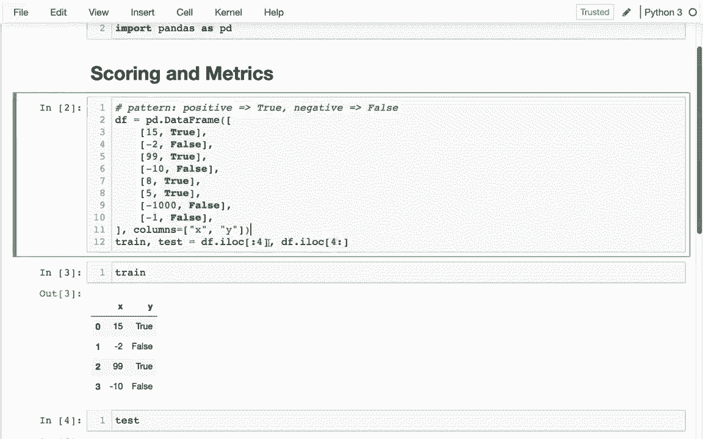

我在这里有我的测试数据，如果我想弄清楚 Y 和 x 之间的关系，然后衡量模型对该关系的理解，我将使用某种打分函数。对，我会做整个逻辑回归，记住这实际上并不是回归。

这实际上是一个分类器，因为我有这类分类数据要预测。所以我会训练其中一个，然后我想给它打分。第一步，没错，我会说 LR 等于逻辑回归。

对，然后我们说 Lr.t fit。当我拟合时，让我尝试运行这个。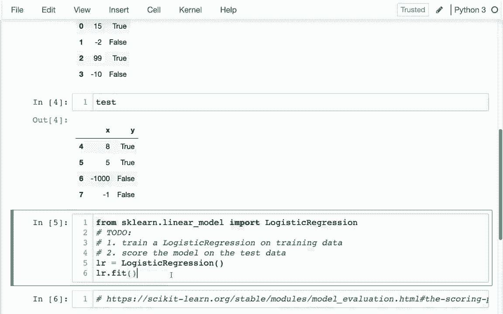

一旦我运行，我实际上可以按 Shift + Tab 来获取提示。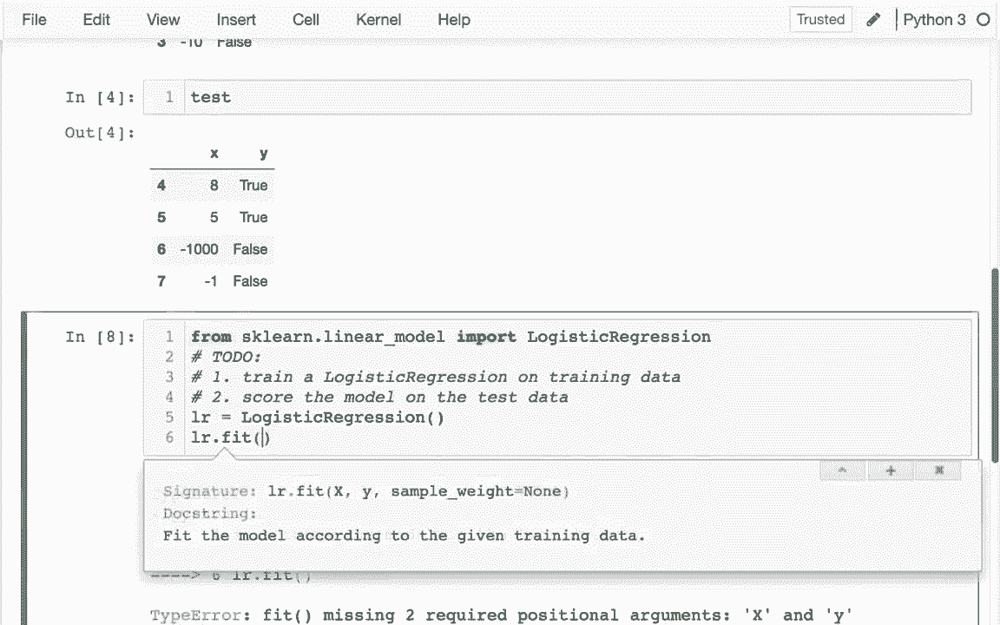

我需要给它 X 数据和 y 数据，所以我会先从训练数据中提供这两样东西。

所以我会说训练数据，然后我想要的列就是 acts。然后我想要预测的其他东西就是为什么，哇，简直就是这样。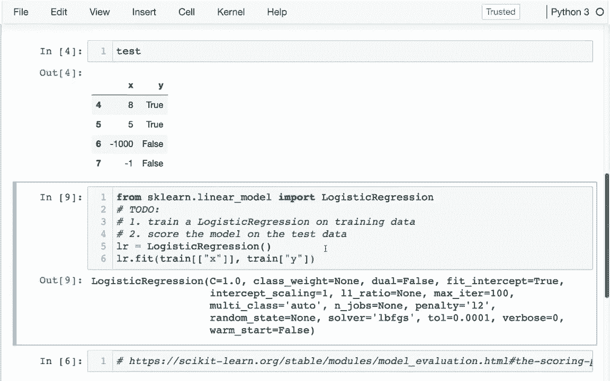

然后在我做完这些之后，我基本上可以运行一个很相似的命令，这个命令就是 score。我可以评估它在测试数据上的表现，得分是 0.75。那么这个 score 函数到底在做什么呢？事实证明它是一个快捷方式，我将给你展示一下文档里它的作用。我在这里看到 score 函数。

逻辑回归给了我平均准确率。如果你查看其他估计器，它们可能会使用其他类型的指标来评分。好的，所以平均准确率是这里的默认值，但实际上我们可以使用很多不同的指标，所以如果我去PsyKt学习的指标页面，我可以看到有一堆与分类聚类相关的指标，我们还没有讨论过，还有一堆与回归相关的指标，所以我现在使用的默认是准确率分数，你看到它是如何说的，我们只是得到了准确率，准确率很简单，就是在多少情况下？

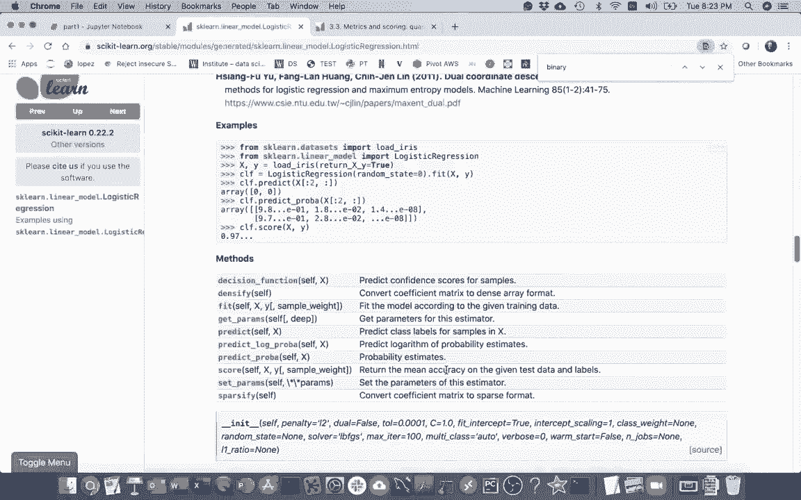

我们做对了吗？所以我当然可以不用那个评分函数，我可以自己使用这个函数，我认为现在这样做是个好主意，因为一旦你理解如何手动使用这个而不依赖快捷方式，那么我们也将理解如何使用其他函数。好的，所以我可以看到这是我的指标子模块，因此当我回到这里时，我将这样做。

这是我刚才所在的页面。我将从SK学习指标开始导入。

准确率分数。好的，让我来运行一下我称之为准确率分数的内容。我在这里按下shift和tab。基本上，我在问，真正的值是什么？

我的模型预测了什么。好的，所以我可以用不同的方式来做这件事。我可以说，真正的值是A和B，但我实际预测了A和C。如果我这样做，结果我只对了50%。这是我的实际值和预测值。所以让我从上面获取这些值，之前我在尝试这个评分的东西。

然后我给出了我的x值和y值，所以我要从中提取一些内容。我将做的第一件事是确定预测值是什么。所以这些将是我实际必须调用的预测值，而不是评分。当我在预测时，我没有给它任何y值，预测告诉我y值是什么。

然后我还必须有我的实际值，对吧，我的实际值。刚好是之前的第二部分。在那一列。所以也许让我就这样做，我要看一下实际值和预测值。作为最后一步。好的。我可以看到实际是正确的，正确的，错误的，错误的。但我实际上得到的是正确的，错误的，错误的。

错误。所以第二个是错误，对吧，我将错误25%的时间。因此，准确率实际上将是70.5%，这就是我们之前看到的，当我们实际传入这些东西时。我传入了实际值和那些预测值。我得到的是75%。

好的，现在这样运作得很好，但有些情况下，我们不仅想知道自己对的频率，还想知道我们犯了什么样的错误。因此，举个例子，让我们想象这个Y列可能代表的不同事物，假设这个Y列意味着这是一个好的投资。

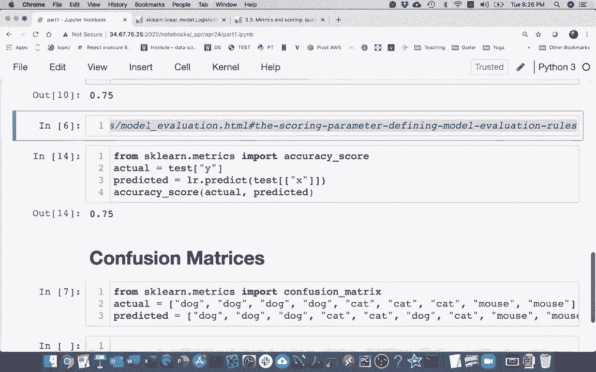

也许这是关于某个股票或其他东西。我不需要了解每一个好的投资。但如果我有某种系统，能告诉我“嘿，这些是一些不错的投资”，而且它总是正确的，尽管不告诉我每一个好的投资，那就是一个相当不错的系统。

也许这在告诉我，我不知道某人是否感染了新冠病毒之类的。在这种情况下，错误地说他们是感染者会更安全，即使他们实际上不是。因此，有不同类型的错误，假阳性和假阴性。因此，有许多基于此的指标，最简单的地方是从叫做混淆矩阵的东西开始，混淆矩阵。

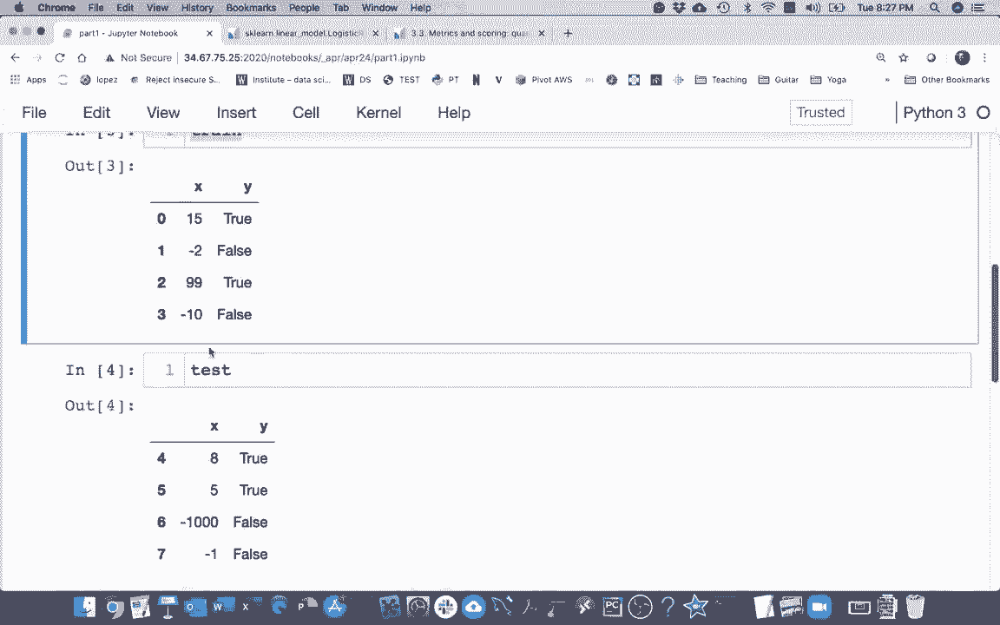

显示了事物实际上属于的类别，以及它们是如何被错误分类为其他事物的。😊。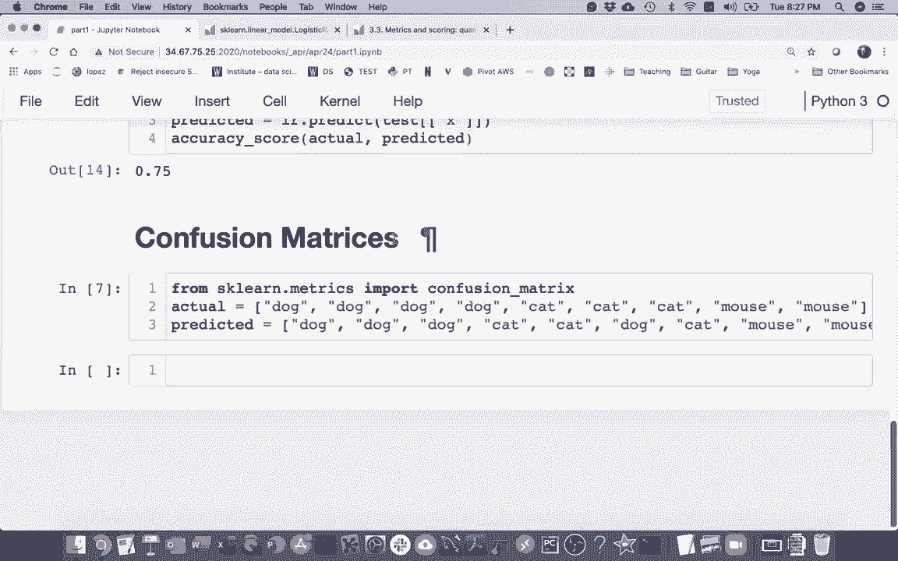

就像之前一样，我们有实际列表和预测列表，并且有混淆矩阵，我们将做同样的事情。想象一下，我有动物的图片，我有四只狗，三只猫和两只老鼠。但我有一些机器学习系统正在查看这些图片。

也许在预测这些其他事物时，我可以使用Psyit learn读取混淆矩阵，对吧，这也在指标下，和准确度分数一样。因此，我可以创建一个这样的矩阵。和准确度分数一样，我可以放入真实值和预测值，有时我说实际。

并且预测。这有点令人困惑，因为这些值每一个都在告诉我们，有多少类别落入特定的实际类别和预测类别中。并且不太清楚如何对齐，对吧，第一只狗是错的，还是猫？因此，人们通常会这样做，即他们会说标签。

并且为了控制顺序。例如，我想说像“狗”。“鼠标”，就这样。如果我传入这些标签，结果会有一点不同，对吧？而如果我说“狗”，你会看到这些数字稍微切换了一下，除了控制顺序以外，另一个原因是，我可能知道一些存在但在数据中没有出现的东西，对吧，比如没有马。

对吧？

所以，让我实际上。我真的想谈谈这些数字的含义，我觉得把它放入数据框会简单一些，我将把这放入混淆矩阵中。现在我需要将其放入数据框。一个PD数据框。混淆矩阵。

然后，当我从中打印数据框时，索引和列标签将是相同的，对吧，我将会有。E就像这样。

当我查看这个混淆矩阵时，这是什么意思呢？行表示实际情况。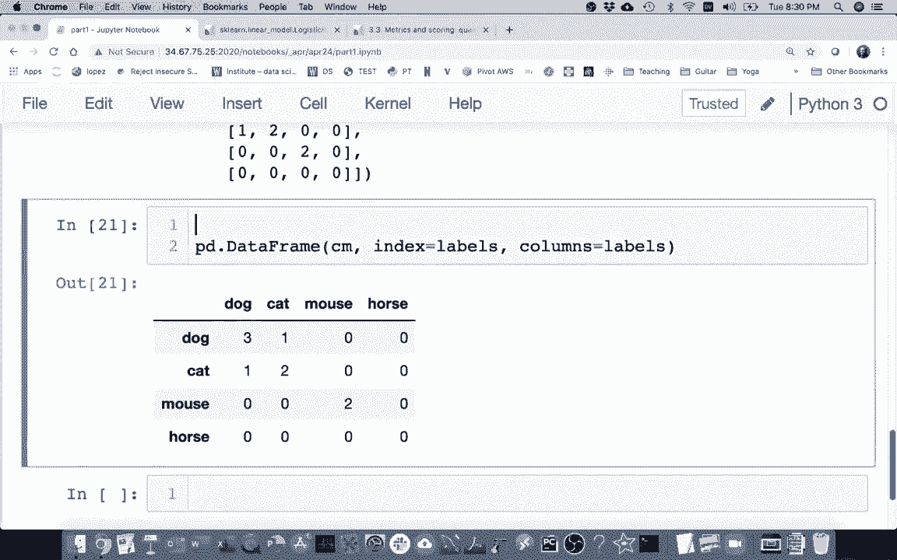

而列将是它被分类的结果，所以我可以看到这里。对，有四只狗。在这四只狗中，它正确分类了三只，但其中一只狗被错误地识别为猫。好的。看起来系统中有三只猫，其中两只被正确识别为猫。

一只被认为是狗。我可以看到其他情况，比如系统对老鼠非常准确，它总是正确识别老鼠，而不会与其他任何东西混淆，所以这很有用。对，当我有这个时间矩阵时，我可以看到分类器在哪些方面存在混淆，因为它被称为混淆矩阵，显示了模型如何混淆。

好的，希望这对你有帮助，现在我们经常会遇到这些混淆矩阵。😊。

当类别不是不同的动物时，而是可能只是对和错，这将是二进制类别的火焰，我只有这些真实和虚假的值，所以让我回到之前计算准确性得分的内容。

让我在这里创建一个混淆矩阵，也许我只需复制一些内容。

在这里，你可能会抓住这个。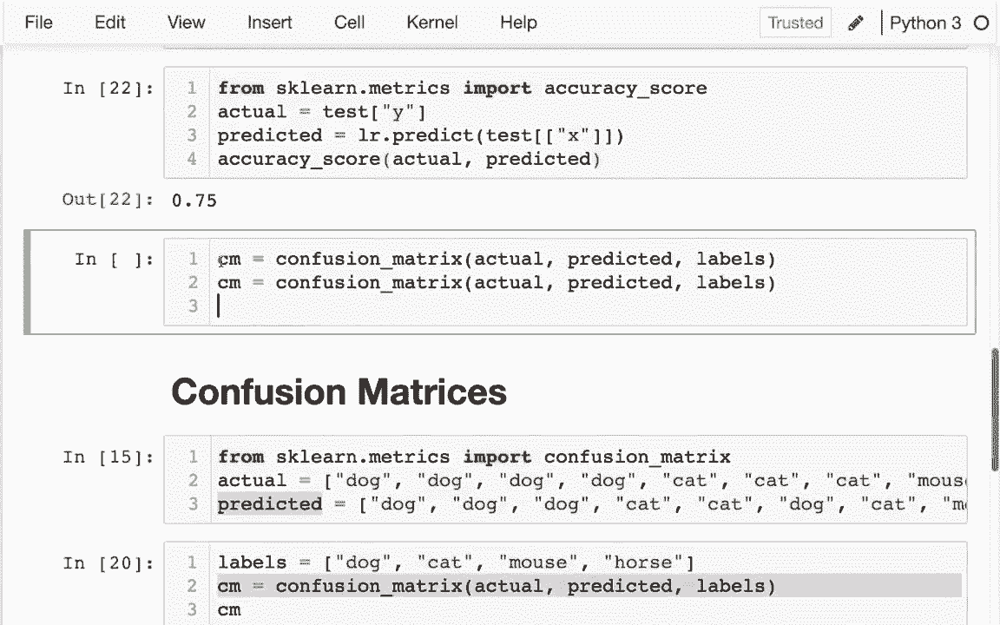

在这种情况下，标签是虚假和真实的。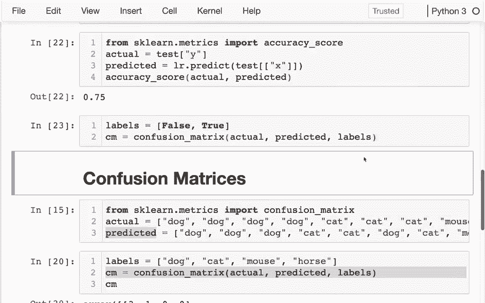

这没有什么用，我有不同的类别，就像之前一样。我觉得将其放入数据框会很有帮助。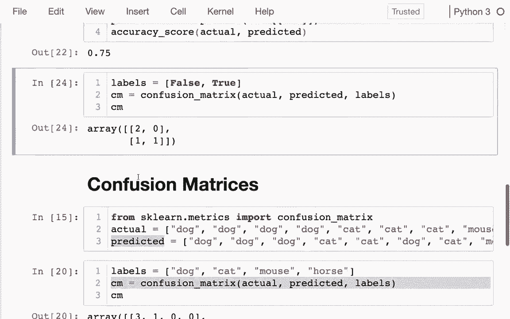

对。

我将这里放入一个数据框，就像这样。所以这里再次，行告诉我实际是什么，列告诉我这些是如何被分类的，理想情况下在完美的世界中，一切都将在对角线上，对吧，这意味着没有错误，也没有混淆。

好的，我有这些信息，结果这四个值各有特定名称，所以我会快速浏览一下。

呃。左上角的那个，实际上，让我们从右下角开始，所以如果我去，我去。让我把这个放在一个真实的数据框中。我的混淆矩阵现在是一个数据框。

好的，我去，我喜欢。1，1，这将是右下角。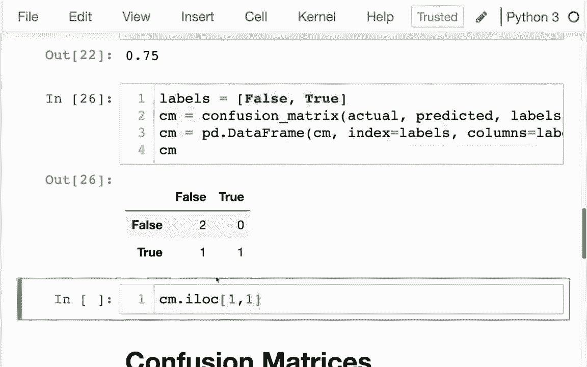

这将被称为通过。你在实践中记住这些词的积极方面是重要术语。所以我将这样做，如果我在这个例子中聪明一点，我会确保所有这些数字都是不同的，这样我们可以更容易地识别。对，还有一个数字在左上角，那些是真阴性。对。

所以“真”意味着模型在正确地执行这个任务，好的，在这种情况下，我有。一个。你知道我真正应该做的是这样做。通过积极的。通过阴性。对，人们通常这样简写。然后是错误，好的。错误是假的，对，所以我会说是假。和假。

那么这些被称为什么？假阳性？好吧，那些在哪里？所以假阳性意味着。这一列是正确的，所以它应该是假的，这实际上在数据中是这样的。但是它被分类为真的，所以这意味着我在第0行第1列。然后我坐在这里，好的？有时。它实际上是真的，但模型说它是假的。

这是一个假阴性。

而且假阴性就是这样，所以这些是我会有的四种不同情况，接下来我们要看的很多统计数据是这些的组合，我会更多地讨论它们为什么有意义。
