# 使用Scikit-learn进行机器学习，4小时实战视角刷新知识框架，初学者进阶必备！＜实战教程系列＞ - P7：7）决策边界 

是的。大家好，在这个视频中，我想谈谈如何可视化分类器在进行回归时所做的决策或预测。我们通常通过绘制拟合线来可视化，而这里的等效方法是，当我们有两个特征时，我们通常会在X轴和Y轴上绘制这两个特征，然后将区域分成两个不同的区域，一个是我们预测为真的区域，另一个是我们预测为假的区域。因此，我们在Mapllib中使用的函数叫做contour F，它可以做到这种绘图，因此我们想要评估CLS，想法是我们想要输入一些不同的值。

对于Sepple a，我会把它放在y轴上，而SPL宽度则放在X轴上。因此，获取每种组合的最简单方法可能是使用numpy的网格。

我使用meshcr的原因是它创建了一些不同组合的数组，正好是我稍后需要的形式。因此，创建了数组并为Contour ath所需的形式做好准备。所以让我在这里留个评论。它将返回什么呢？它试图返回两个数组。它将返回一个。即。

我其中一个变量将在另一个变量中。所以也许我会先把sel宽度放在前面，然后是sepel长度。然后我在这里要做的是需要一个范围，所以我会有range1和range2。实际上，网格代码将给我这两个范围的每种组合。

所以在这里我会说NP范围。也许它们会从0到10，可能是0.1的步长。然后这里也是同样的情况。好的，我有这两个，让我看看这些东西的样子。

我看到这两个都是一个2x2的矩阵，显示每种组合。所以让我再看看另一个。这些形状完全相同，其中的值只是给出坐标，因此第一个给我的是x坐标，基本上是Sepple宽度，另一个则是y坐标或sepple长度。

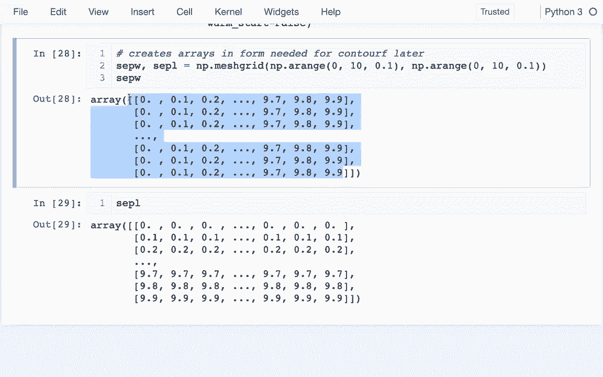

如果我想的话，我可以调用Plt。cont F。

这涉及到三个方面，它必须有我的x坐标矩阵，并且必须有我的y坐标矩阵。然后有一个指示颜色的变量。这样可以作为某种替代表达。因此我可以说，如果我想要sple W，这将显示从左到右的一些条纹。

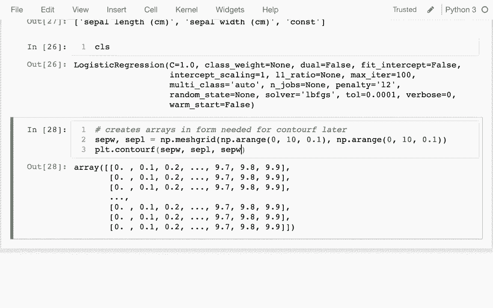

或者我可以做SL，这将向我显示垂直，或者我可以有某种数学表达式，就像这样。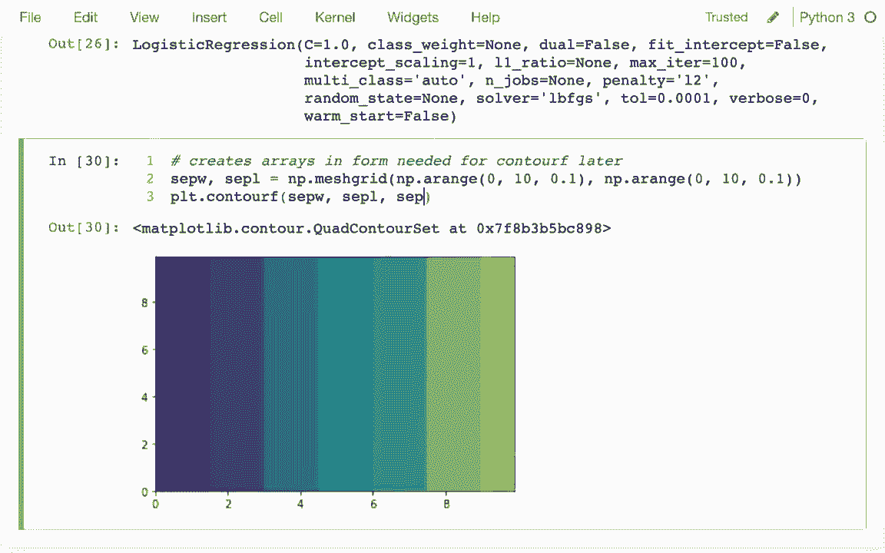

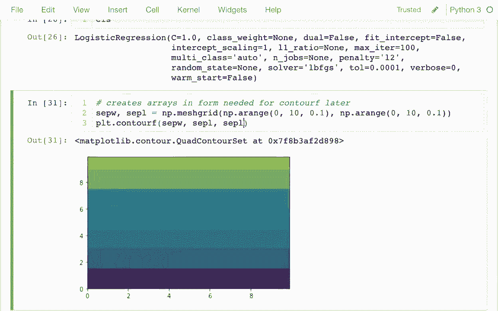

在每一个点上，它向我展示如果我将其中一个值与另一个值相乘会发生什么。所以我可以得到这些漂亮的轮廓图。现在我真正想做的是只拥有两个级别，两个数字。我想让我给你展示一下现在的情况。

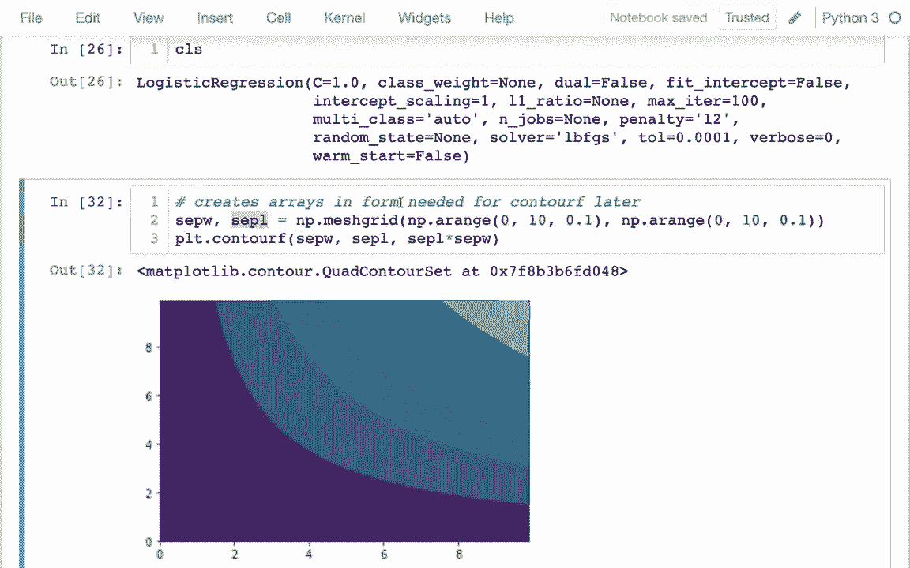

哦。很多不同的数字，我只想在这里有两个数字。基本上是一个和零，分别对应于预测。所以我的x轴将是宽度，y轴将是长度。

所以我必须将所有这些数据放入一个格式中，以便我可以进行一些预测。让我暂时把这留在这里，可能会回来看看。这是我努力的目标。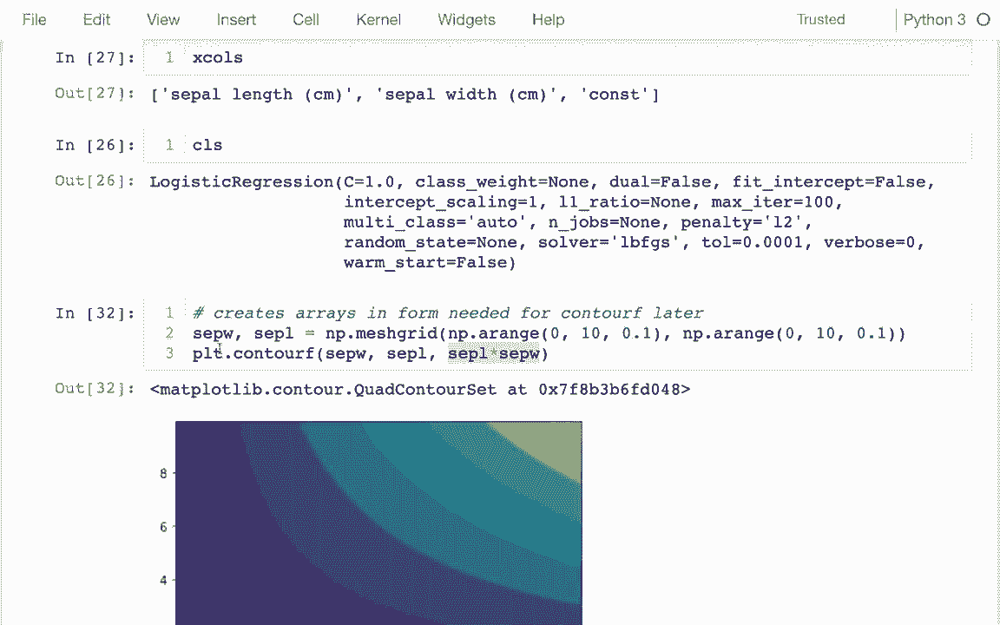

哦。

我想做的是将这些东西放入一个数据框中。所以我将说这将是我的轮廓数据框，我将说PD数据框。我的数据框必须包含所有这些内容。因为我想对它进行预测，这些是我的X列。

而且有人会为此准备一些东西。哦。让我为此准备一些东西。然后我先处理我的内容，这很简单，只有一个。这些值。我可以从这些中提取，所以我可以把它放在这里。然后我可以把它放在这里。如果我想的话，我可以放上Sap W。现在这并不太有效，因为这些是那些。

基本上是平方矩阵。在这里，我要把所有这些放入数据框中，以便可以进行预测。它必须只是一个简单的列，所以我需要将其展平。所以这只是某种一维的，我可以这样做，然后我可以查看我的CDF。如果我愿意的话。我可以看到这里发生的事情是我确实拥有每个长度和宽度的组合。

然后我有我的常量列。所以这并不是一个适合我进行预测的格式，因为我可以说它包含了我预测所需的所有内容。我可以说CLS。predict。就这样。然后我会得到所有这些值。

如果我愿意，我也可以将它们添加到那个数据框中，我可以说CDF。我可以说预测，也许我只会说一个预测。我记得那是我试图预测的踏板湿度。我可以说，或者对不起，那是类别，它是Sentosa还是不是，对吧，所以这就是我试图做的。好的。

所以我有了这个。现在我想继续进行我的工作。

哦。在我下面的轮廓图中，对吧，所以我可以这样。让我仔细想一下，所以如果我有我的集W。让我看看这些的形状。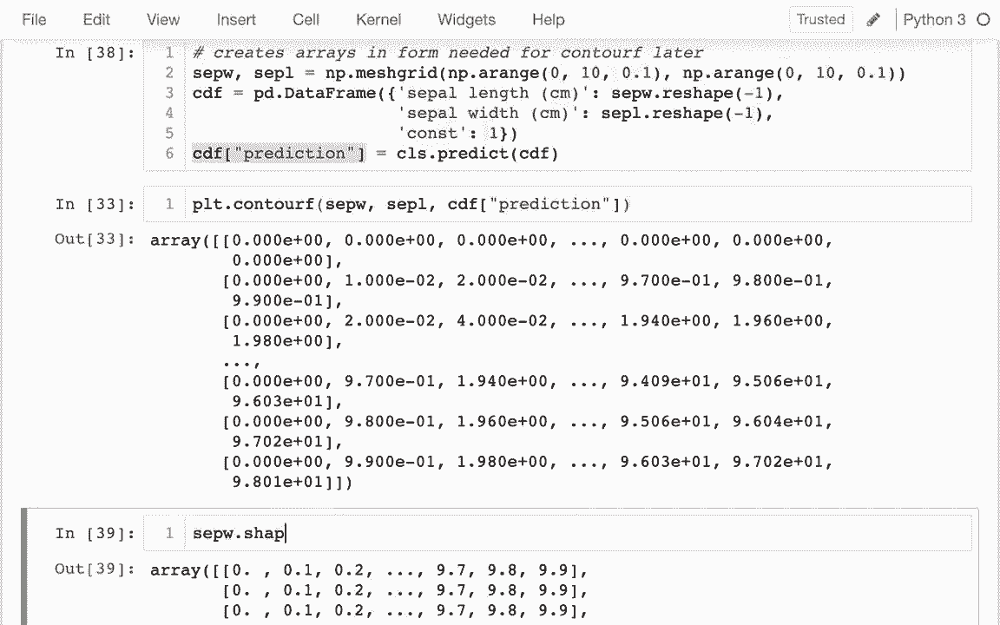

这是一个100乘100的矩阵。因为这是我绘制超过100个数字的范围。这个100乘100的矩阵，这个100乘100的矩阵现在只是一个长列，所以就像我必须把这些矩阵转换成列一样，现在我必须朝相反的方向进行，我必须提取值并重塑它。

为了与这些格式匹配，正确，所以我实际上可以直接使用这些。并且说，我的预测应该与我的x值的形状一致，我会很好地对齐。所以我可以这样做，现在我可以看到这两侧都对应于它是全为sattosa或非sattosa的预测。

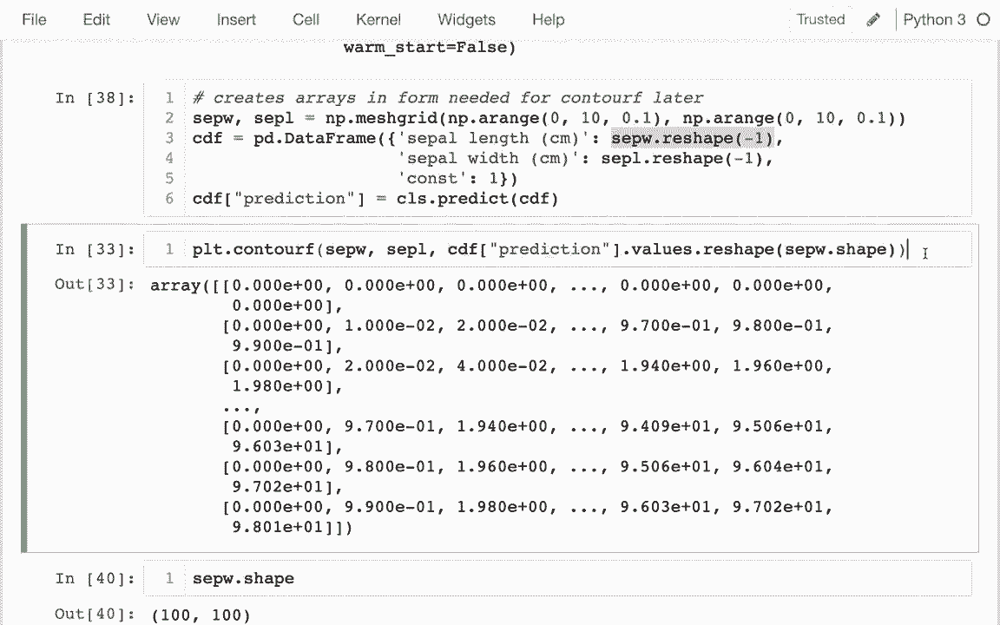

让我在这里的顶部用散点图绘制这些。

我这里有我的所有原始花朵的数据框，我可以绘制所有这些。理想情况下，我只会在此基础上绘制训练数据，这样我可以更好地了解出现的错误。但是我只有大约10行的测试数据，所以我将绘制整个内容。因此，我将说点绘制散点图，实际上我想做的是将其分开，所以我将会有像sattosa。点绘图。tcatter，然后我将会有像其他点绘图。散点图。

然后我可以通过一些过滤器获得这些。现在，我会说Sotosa等于数据框。我们的数据框的种类。R等于Ctosa。然后我的其他项基本上是那些不是的。所以我会说它不是sattosa。好的，我将在这里做什么呢？好吧，我可以说我的x值将会是。哦。好吧。

我在这里放了sple宽度，所以我最好在我的X轴上放这个。然后我的Y轴应该是sepple长度。好的，我将这样做，并且我将对这里的同样事情做一会儿，我看到好吧，我有我的决策边界，然后我在下面有两个单独的图。

我希望这些都在同一个图上。通常我们处理这种情况的方法是，我们会说AI X等于这个，然后把它传递下去。让我快速展示一下，如果我这样做，Ax的类型会是什么。这就是这里的东西。这种四重轮廓集，我们可以在其上绘图。所以如果我想重复使用相同的aupplot区域，我实际上可以说matplotlib执行当前坐标轴，这将给我一个我可以在其他地方传递的子图。

好吧，我可以在这里说，我可以说。啊。也许我会继续下一行，说 AX 等于那个和。

这里也是一样，所以它们都会进入同一区域。让我这样做，所以我有了所有这些点。

和。

现在我喜欢做的事情是，嗯，奇怪的是它没有重叠。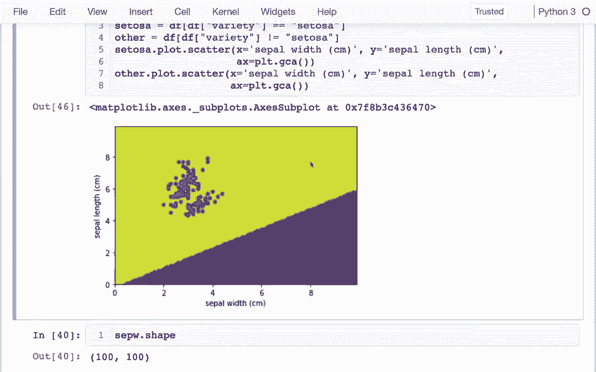

那个边界。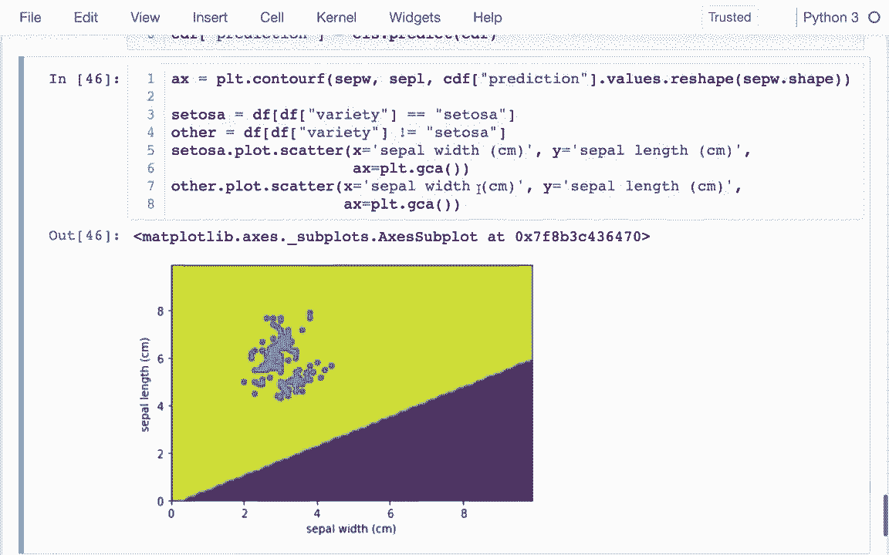

我搞混了我的坐标轴吗？我确实搞混了。所以这里是一个带有分隔光的示例。好的，很好。那么让我把这个切换回来。

所以这应该是 Sple A，而这应该是 Sple width。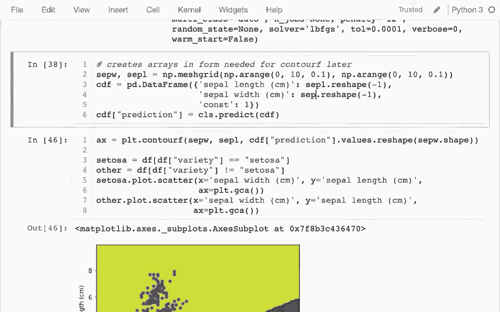

现在我实际上可以看到如何尝试分开那些与那些不同的东西，所以为了让这个工作，我应该让颜色在某种程度上有所不同，所以我会让 Sattosa 为 R。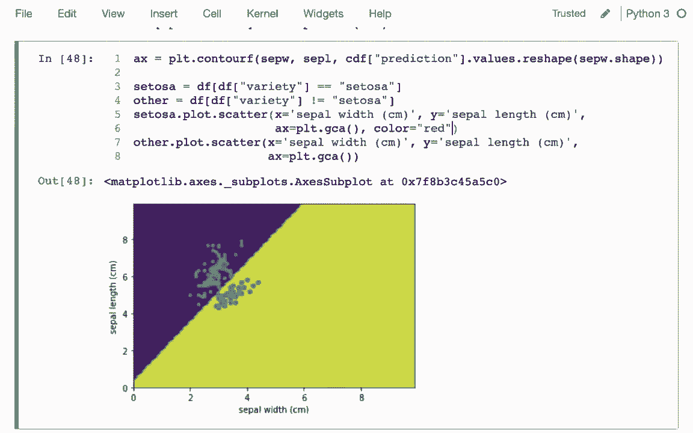

然后也许我会让其他的变成。我不知道，也许它可以很好。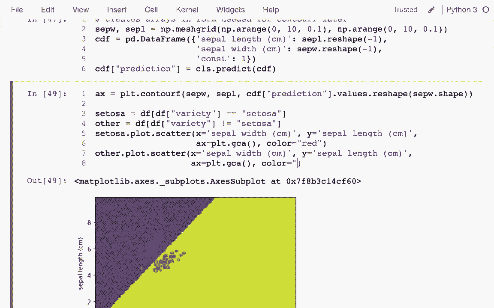

就这样，现在我可以开始看到会犯哪些错误。我可以看到有一个 Sattosa 不会被识别为 Sattosa，因为它在这个边界的错误一侧。我可能还应该在这里加上一些标签，所以我们可以说像 label 等于 Sattosa，然后在这里我可能会说 label 等于。

Equs 其他。

就这样，我现在可以看到这里发生了什么，所以这有几个步骤，也许我可以删除这些额外的东西，这样我可以有一个最小的示例。我必须创建一个网格。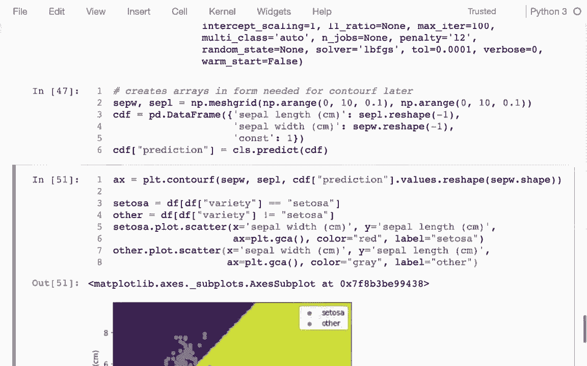

基本上，对于每个点，一个网格有 x 值，另一个有 y 值。我必须把它们重新形状并转换成数据框列。到那时，我实际上在某一行中有这些的每一种组合。一旦我这样做了，我可以为我们的推荐系统添加预测。

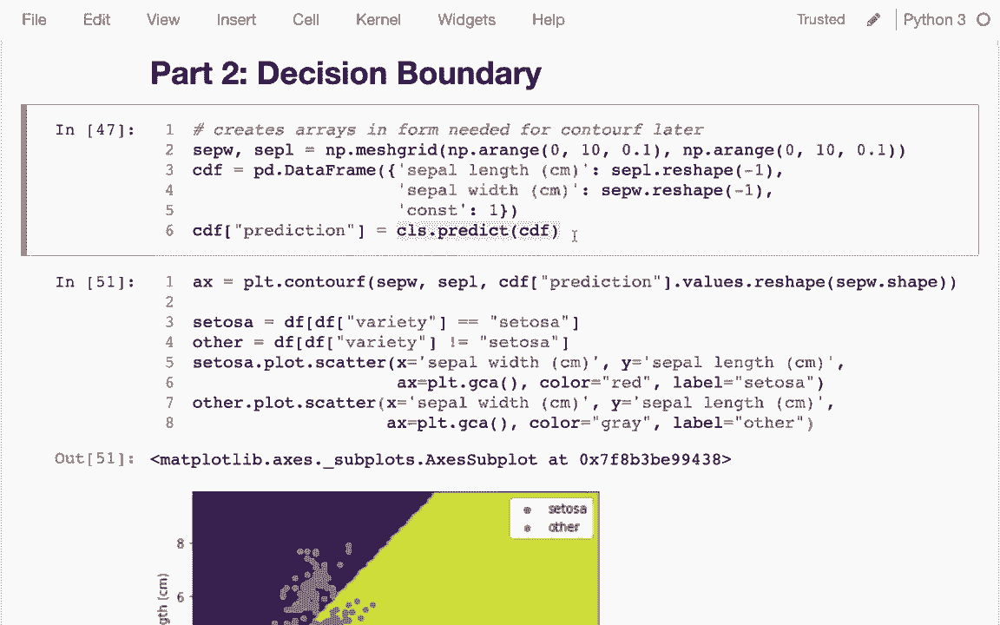

然后，如果我把我的预测转换回网格公式，就像这两个有的那样。我就可以进行我的等高线绘制。

这就是我如何创建这个地图的方式。然后在这之上，我可以绘制我的散点图，看看发生了什么。我想做的最后一件事是，我想尝试做一些多项式特征。所以就像我们可以使用多项式特征一样。

或者常规回归，我也可以将它们用于分类。所以让我导入一些。我可能会说，从SK学习。

Dot pipeline导入pipeline，我可能会说从SKL做预处理。我将说导入多项式特征。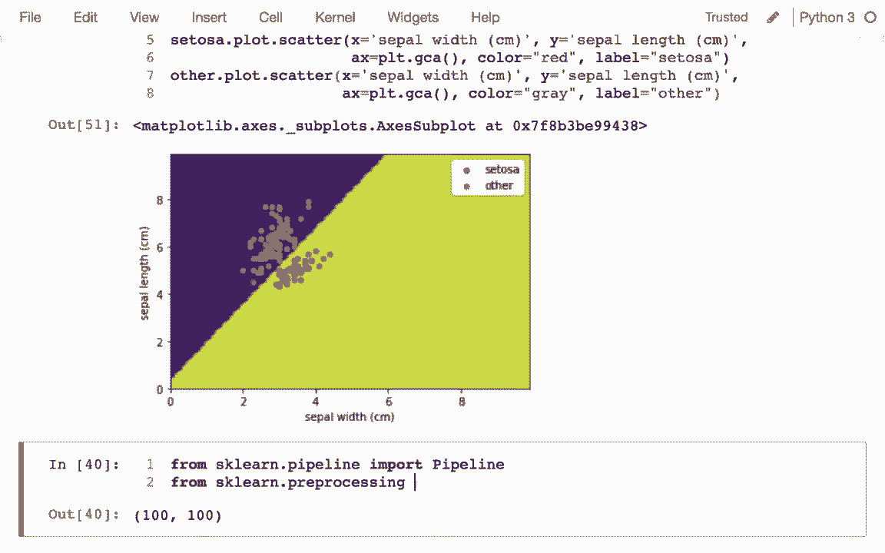

好的，那么之前我有什么呢，我有，我只是有一个这样的逻辑回归。嗯。好吧，那是什么呢，之前是什么。

我只是想在之前的页面中搜索一下，我想那是一个拟合截距的东西。

我把它都关闭了，抱歉。所以我之前的模型是这样的。这将是管道的一部分，对吧？所以现在我要说pipe。等于pipeline。而管道将是这组阶段的列表。就像这样。因此，这将是第一阶段。抱歉，这将是最后阶段，然后在那之前我想要我的多项式特征。

就这样。然后另一个技巧是，我的管道每个状态都必须是一个元组。之所以必须是元组，是因为我必须给它一个名字，对吧。所以我想我就叫它polyly。然后我会叫这个LR。所以我就把它直观化了。因此，就像之前一样，我可以有我的，之前我有类似于F的东西。然后我有。

X列的训练，然后训练我的Y列，我想那是。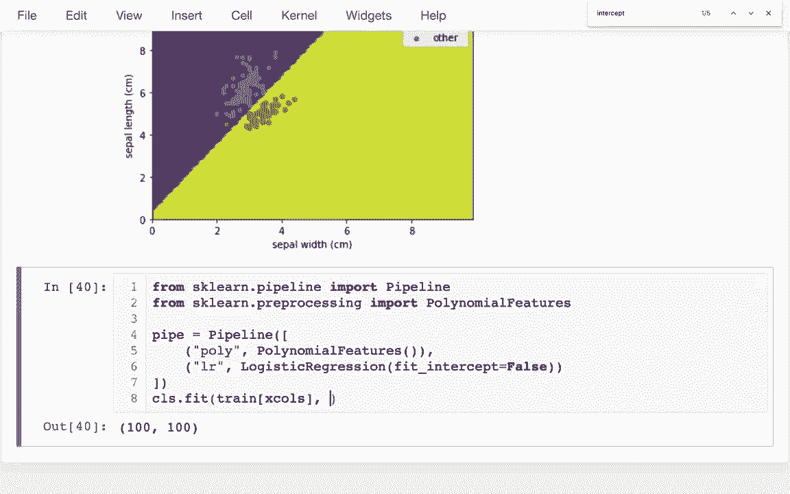

我想这将是我的花瓣宽度，所以让我就复制给你。

就是这样，但它是petedal we。这是我之前做的。我可以把我的逻辑回归替换为这个管道。让我试试这个，我得到了某种错误。

未知标签类型为连续。哦，抱歉。我正在尝试预测它是否是Sctosa。对，它抱怨是因为它是连续的。所以它在说，嘿，你在试图做分类。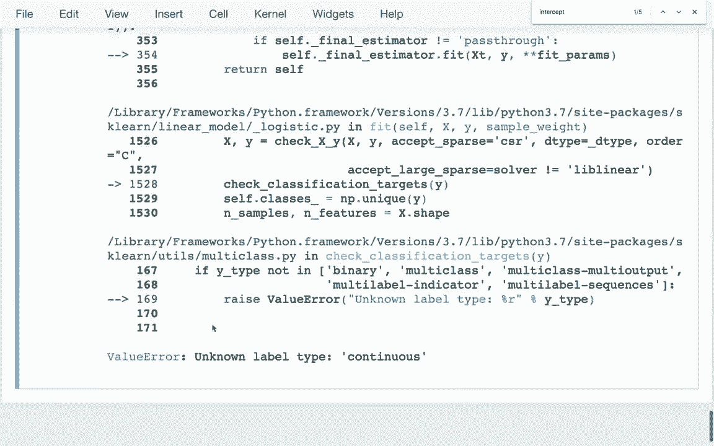

在一个我们不进行分类的量上，我们对数量进行回归。所以我想说的是Ctosa，它是sattosa吗，这正是我关心的。

然后我训练它，这一切都很好。现在如果我想的话，我可以回到这里，重复这些步骤，所以如果我愿意，可能我只是想把这一切都移动到这里。

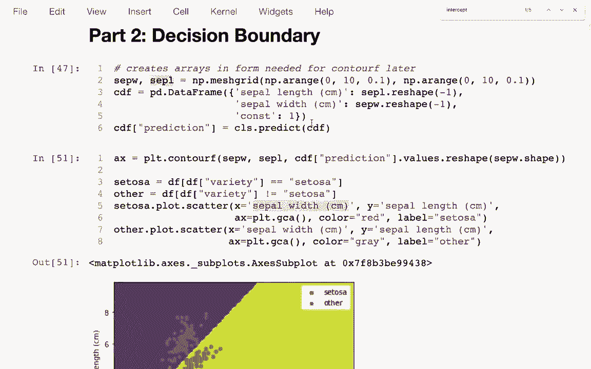

然后当我绘制这个图时，当我想查看那些带有决策边界的图时，不再使用我之前简单的分类器，而是可以使用我的管道分类器。而且这条边界线在它们之间只是稍微弯曲了一些。

这并没有太大帮助，因为红点仍在错误的一侧。

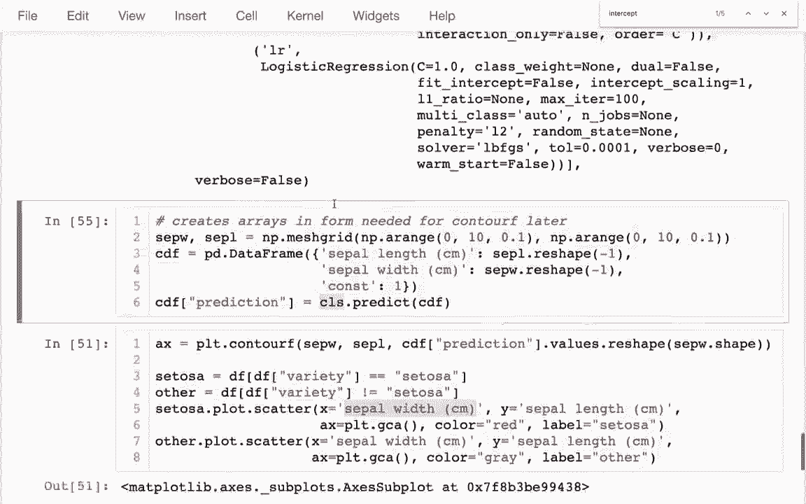

但是你可以看到，依据模型的复杂性和我之前的流程，我可以得到不同的形状。

