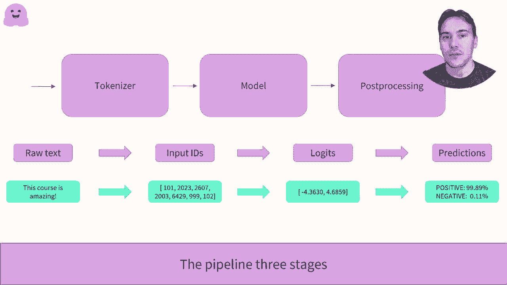

# 官方教程来了！5 位 Hugging Face 工程师带你了解 Transformers 原理细节及 NLP 任务应用！P8：L2.1- 管道函数内部会发生什么？(PyTorch) 

函数内部发生了什么？在这个视频中，我们将看看当使用 Transforms 库的管道函数时实际发生了什么。现在特别地，我们将看看情感分析管道，然后它从以下两个句子中得出正负标签的相应分数。

正如我们在管道计划演示中看到的，管道中有三个阶段。首先，我们将一个顶点转换为模型可以使用的数字，通过 tokenizer。然后这些数字通过模型输出。最后，第一处理步骤将 Vo gate 转换为标签和分数。

让我们详细看看这三步以及如何复制它们在 Transformers 库中的音乐。首先从第一个阶段的标记化开始。所以组织过程有几个步骤，首先将文本拆分为称为标记的小块。它们可以是单词、单词的一部分或标点符号。然后，tokenizer 如果模型预期会添加一些特殊标记。

模型期待在句子的开头有一个 seal token，在句子的结尾有一个 sep token 进行分类。最后，tokenazer 将每个 token 匹配到所描绘模型词汇中的唯一 ID。要加载这样的 tokenizer，Transformers 库提供了 Utokenizer API。这个类最重要的方法是 from Pretrained。

这将下载并缓存与给定检查点相关的配置和词汇。这里，情感分析管道默认使用的检查点是基于 distber 的微调 SS2 英文。这有点冗长。我们实例化与检查点相关的 token，并将其输入到两个句子中。由于这两个句子的大小不同。

我们需要填充最后一个以便能够构建一个数组。这是通过 tokenizer 完成的，选项填充为 true。通过 truation 等于 2，我们确保任何比最大中间长度长的句子都会被截断。最后，返回 tensil 选项告诉 tokenizer 返回批处理 tensil。看结果。

我们看到我们有一个包含两个键的字典，输入 ID 包含两个句子的想法，填充应用的位置为零。第二个键注意掩码指示了填充的位置，以便模型不关注它。这就是标记步骤中的所有内容。现在让我们看看第二步。三もど。也如同一个。

有一个 notomod API，使用 pretrain 方法。它将下载并缓存模型的配置以及预训练权重。然而，Automod API 只会实例化模型的主体，也就是在去掉预训练头之后剩下的部分。

它将输出一个高维张量，即句子过去的表示，但对于我们的分类程序来说并不直接有用。在这里，张量包含两个句子，每个句子有16个标记，最后一个维度是我们模型的印度大小，768。为了得到与我们的分类问题相关的输出。

我们需要使用Automodal进行序列分类类。它的工作方式与模型类完全相同，除了它构建了一个带有分类头的模型。😊在transformers库中，每个常见的NLP任务都有一个自动类。在这里，在给出两个句子的所有模型后，我们得到一个大小为2乘2的张量。

每个句子和每个可能级别的一个结果。这些输出尚未是概率，我们可以看到它们的总和不为1。这是因为每个transformers库的模型返回的是这样的结果。要理解这些结果，我们需要深入探讨管道的第三个也是最后一个步骤，处理。为了将其转化为概率，我们需要对它们应用softmax层。

正如我们所看到的，这将它们转换为正数，最多为1。最后一步是知道其中哪个对应于正标签或负标签。这是通过模型的I2lipol字段给出的。第一个概率ba的索引0对应于负级别，第二个索引1对应于正级别。

这就是我们的分类器如何通过管道函数构建，带有标签并计算这些分数。😊现在你知道每个步骤是如何工作的，你可以轻松调整它们以满足你的需求。

。
