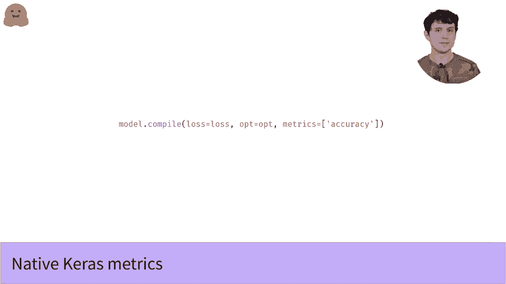

# 官方教程来了！5位 Hugging Face 工程师带你了解 Transformers 原理细节及 NLP 任务应用！P29：L4.6- TensorFlow 预测和评估指标 

在我们其他的视频中，和往常一样，如果你想查看这些，下面会有链接。我们展示了如何在 Tensorflow 中初始化和微调一个 transformer 模型。那么现在的问题是，训练后我们可以用这个模型做什么？显然要尝试的是用它对新数据进行预测。那么让我们看看怎么做，再次，如果你熟悉 Kais。

好消息是，因为这些只是标准 caris 模型，我们可以使用标准的 Keis 预测方法，如此处所示。😊。你只需将标记化的文本传递给这个方法，就像你从标记器中得到的结果一样，你就能获得你的结果。我们的模型可以根据你设置的选项输出几种不同的内容。

但大多数时候，你想要的东西是输出 logts。如果你之前没有遇到过，它们有时被称为 logits，因为没有人确定，它们是网络最后一层的输出，因为在应用 softm 之前。所以如果你想将 logics 转换为模型的概率输出。

你只需像这样应用一个 softm。那么如果我们想把这些概率转化为类预测呢？再次，这非常简单。我们只需为每个输出选择最大的概率，并且你可以立即通过 Argm 函数获得这一结果。Argmax 将返回每一行中最大概率的索引。

这意味着它将得到一个整数向量，如果最大概率在第零位置，则为 0，在第一位置则为 1，依此类推。因此这些是我们的类预测，表示类 0，类 1 等。实际上，如果你只想要类预测，你可以完全跳过 softm 步骤，因为最大 logits 总是最大概率。

😊，所以如果你只想要概率和类预测，那么此时你已经看到了所有需要的内容。但如果你对基准测试你的模型或用于研究感兴趣，你可能想深入探讨一下你得到的结果，计算模型预测的一些指标是一种方法。

如果你正在跟随我们数据集和微调视频，我们的数据来自 MRRPC 数据集，它是 blue 基准的一部分。每个 blue 数据集，以及我们数据集灯塔中的许多其他数据集都有一些预定义的指标，我们可以使用数据集的加载指标函数轻松加载它们。

对于 M 或 PC 数据集，内置指标是准确率，衡量模型预测正确的时间百分比，以及 F1 分数，这是一种稍微复杂的度量，衡量模型在精确率和召回率之间的权衡。为了计算这些指标来基准我们的模型，我们只需将模型的预测与真实标签进行对比，便能简单地得到结果。

😊，不过如果你熟悉 Keras，你可能会注意到，这是一种计算指标的稍微奇怪的方法，因为我们只在训练结束时计算指标。但在 Keras 中，你可以在训练过程中实时计算多种指标。

这让你对训练进展有非常有用的洞察。所以如果你想使用内置指标，这非常简单，你再次使用标准的 Keras 方法。你只需将指标参数传递给编译方法。与损失和优化器类似，你可以通过字符串指定所需的指标，或者导入实际的指标对象并传递具体参数给它们。

但请注意，与损失和准确率不同，你必须将指标作为列表提供。即使你只想要一个指标。一旦模型编译了一个指标，它将报告该指标用于训练、验证和预测。假设有标签传递给预测，你甚至可以编写自己的指标类。

虽然这有点超出本课程的范围，但我会在下面链接相关的 TensorFlow 文档，因为如果你想要一个在 Caris 中不受支持的指标（如 F1 分数），这将非常方便。

。

