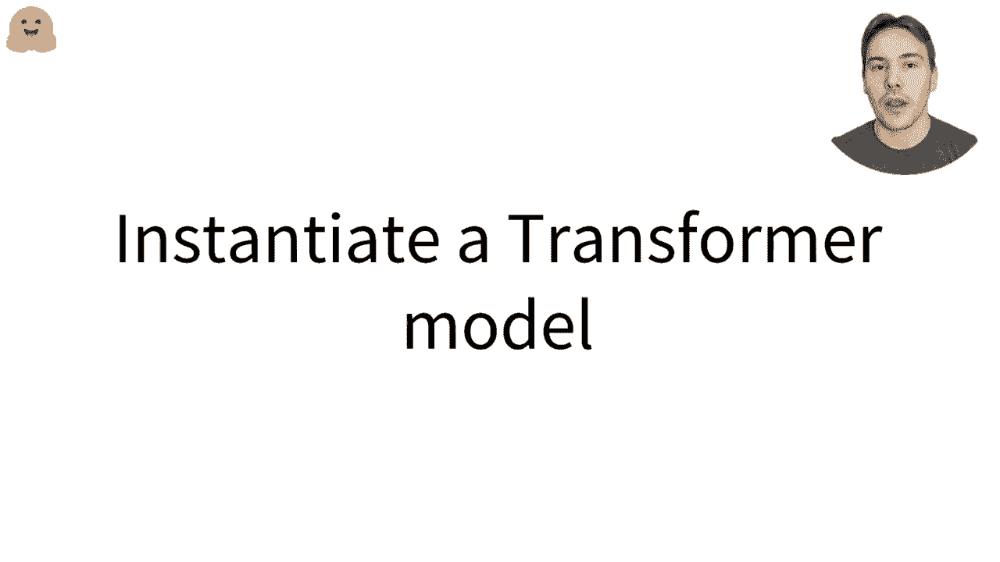
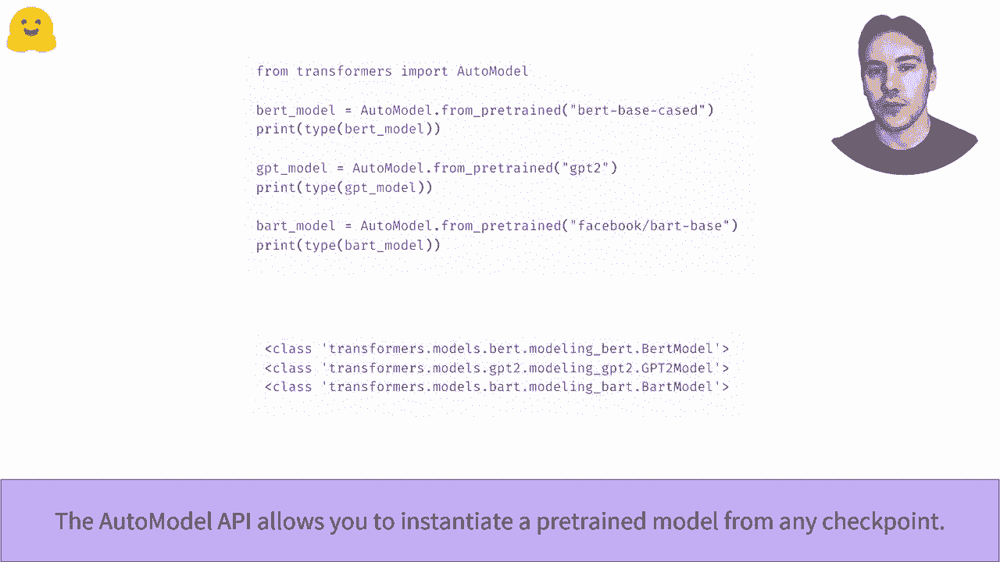
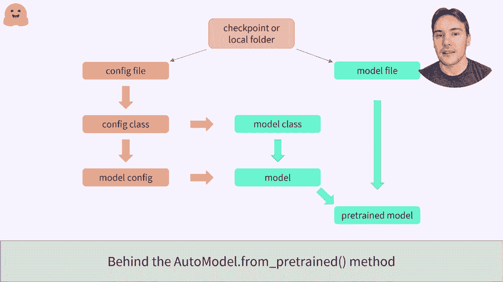
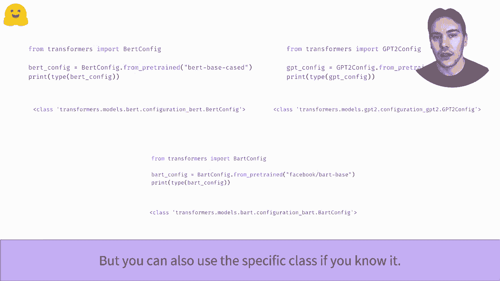

# 官方教程来啦！5位 Hugging Face 工程师带你了解 Transformers 原理细节及 NLP 任务应用！＜官方教程系列＞ - P10：L2.3- 实例化 transformer 模型 (PyTorch) - ShowMeAI - BV1Jm4y1X7UL

如何实例化一个变换模型。在这个视频中，我们将看看如何从 Transformers 库创建和使用模型。

正如我们之前所见，Automodal 类允许你从 I face 应用程序中的任何检查点实例化一个表现出的模型。它会从库中选择正确的模型类，以即时构建合适的架构并加载预训练模型的权重。

正如我们所见，当给定一个鸟类检查点时，我们最终得到一个鸟类模型，GPT2 或其他模型也是如此！

在幕后，这个 API 可以接受地球上检查点的名称，在这种情况下，它将下载并缓存配置文件以及模型权重文件。你还可以指定包含有效配置文件和模型权重文件的本地文件夹路径。要实例化模型，Automodal API 将首先打开配置文件，查看应该使用的配置类。

配置类依赖于模型的类型，比如 B、GPT2 或 Bt。一旦有了合适的配置类，它就可以实例化该配置，作为创建模型的蓝图。它还使用这个配置类来找到合适的模型类。

当与加载的配置结合时，就可以加载模型。它的模型还不是专业模型，因为它刚刚用随机权重初始化。最后一步是从模型文件中加载权重到这个模型中。

为了轻松地从任何检查点或包含配置文件的文件夹加载模型的配置，我们可以使用 autoconfig 类。像 Automod 类一样，它将从库中选择正确的配置类。

我们还可以使用一个特定的类，针对一个检查点，每次想尝试不同的模型架构时都需要更改代码。

正如我们之前所说，模型的配置是一个包含创建模型架构所需的所有信息的蓝图。例如，与基于鸟类检查点相关的鸟类模型有 12 层，隐藏层大小为 768，词汇量大小为 28996。

一旦我们添加了配置，就可以创建一个具有与检查点相同架构的模型，但它是随机初始化的。我们可以像任何其他模型一样从头开始训练它。我们还可以通过使用关键字参数来更改配置的任何部分。因此，这段代码片段会即时生成一个具有 10 层而不是 12 层的随机初始化布局模型。

一旦模型的趋势微调完成，保存模型非常简单。我们只需使用“Sa between”方法。在这里，模型将保存在当前工作目录下名为“My beltt model”的文件夹中。这样的模型可以通过“from between”方法重新使用。要了解如何轻松将该模型接入网络，请查看“push to video”。

。
