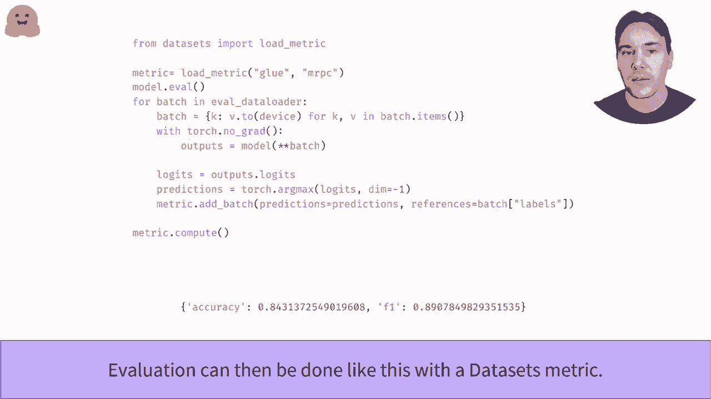

# 官方教程来啦！5位 Hugging Face 工程师带你了解 Transformers 原理细节及 NLP 任务应用！＜官方教程系列＞ - P22：L3.5- 使用 PyTorch 编写训练流程 

按部就班地编写你自己的训练循环。在这个视频中，沿着 Kaar 的思路，我们可以实现与训练视频中相同的功能，但不依赖于网络课堂。这样，你将能够轻松定制每种类型的训练循环，以满足你的需求。这对于手动调试训练 API 中出现的问题也非常有用。

在我们深入代码之前，这里是一个训练循环的草图。我们取一批训练数据并将其馈送给模型。通过标签，我们可以计算出较少的值。这个数字本身并没有用处，但用于计算我们模型权重的梯度；

这是关于每个模型权重的导数。这些梯度随后被优化器用来更新模型权重，使其变得更好。然后我们用一批新的训练数据重复这个过程。如果其中任何一项出现问题，请不要犹豫，重新复习你的深度学习课程。

我们将在这里再次使用 G MRRPC 数据集，并建议使用动态填充的数据集库来处理数据。如果你还没有看过，请查看下面的视频链接。完成这些后，我们只需要定义 PyTorch 数据加载器，它将负责将数据集的元素转换为补丁。我们使用我们的数据填充器作为正确函数，并对训练集进行处理，以确保我们不会按照便宜的顺序遍历样本。

为了检查一切是否按预期工作，我们尝试抓取一批数据并进行检查。就像该资产集元素一样，它是一个字典。但这次值不是单一的整数列表，而是按序列长度划分的形状大小。

下一步是将训练数据发送到我们的模型中。现在需要实际创建一个模型。正如在模型 API 视频中所见，我们使用前训练的方法，并将标签的数量调整为该数据集中的类别数量。同样，为了确保一切顺利，我们将批次传递给我们的模型，并检查是否没有错误。

如果提供了标签，Transence 库的模型总是会直接返回列表。我们将能够进行更少的步骤来计算所有的梯度。然后我们需要优化器来进行训练步骤。我们在这里使用 Adam W 优化器，它是具有适当权重衰减的 Adam 变体。

但是你可以选择任何你喜欢的优化器。利用之前的损失并计算我们所列出的梯度反向传播，我们检查能否在没有错误的情况下执行优化器步骤。不要忘记在之后将梯度归零，否则下一步将会加到你计算的梯度上。我们已经有了基本的训练循环，但我们添加了两项内容，使其尽可能完善。

第一个是学习率调度器，用于逐步降低学习率到0。Transformer库中的GtSched函数只是一个便利函数，用于轻松构建搜索器Sch。你也可以使用任何Pythto学习权重调度器。最后，如果我们希望训练持续几分钟而不是几个小时，我们需要使用GPU，第一步是通过使用协作书籍来获取一个实例。

然后你需要实际发送你的模型，并使用一个dashch设备进行训练。请检查以下几行，以确保你有好的数据库，或者准备好你的训练时间超过一个小时。我们无法将所有内容组合在一起。首先，我们将模型置于训练模式。这将激活一些层的训练行为，比如dropout。

然后，我们通过所选择的报告书数量和训练数据中的所有数据。接着，我们回顾我们已经看到的所有步骤，将数据发送到GPU，计算模型输出，特别是损失。使用列表来计算梯度，然后使用优化器进行训练步骤。更新包括学习率和我们下一个迭代的调度误差，以及优化器的梯度。

一旦完成，我们可以很容易地使用数据集库中的metric来评估我们的模型。😊首先，我们将模型置于评估模式，以停用像dropout这样的层。然后进行所有评估步骤。如我们在训练视频中看到的，模型输出的是logggets，我们需要应用Agm函数将其转换为预测。

然后，metric对象有一个net batch方法，我们可以用来发送中间预测。一旦评估循环结束，你只需调用compute方法以获取最终结果。恭喜你，你已经独立找到模型。

。

