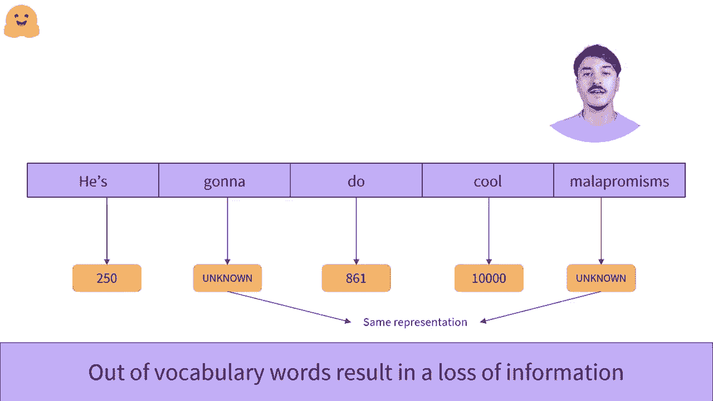

# 官方教程来啦！5位 Hugging Face 工程师带你了解 Transformers 原理细节及NLP任务应用！＜官方教程系列＞ - P13：L2.6- 基于词的分词器 

是的。让我们来看看基于词的分词。基于词的组织思想是通过在空格或其他特定规则（如标点符号）处分割原始文本来将其拆分成单词。在这个算法中，每个单词都有一个特定的编号或ID。

这里有 VI 250，Du 有 861，带有感叹号的分词是 345。😊。这个方法很有趣，因为模型的表示是基于整个单词的。单个数字所承载的信息量很大，因为一个单词包含了很多上下文和语义信息。然而，这种方法确实有其局限性。😊，例如。

单词 dog 和单词 dogs 非常相似，且它们的含义相近。然而，基于词的分词器会对这两个词赋予完全不同的概念。因此，模型将为这两个词学习到两个不同的嵌入。这是非常遗憾的，因为我们希望模型理解这两个词确实是相关的。

而 dogs 仅仅是单词 dog 的复数形式。这个方法的另一个问题是，语言中有很多不同的单词。如果我们希望模型理解该语言中的所有可能句子，那么我们需要为每个不同的单词分配一个ID。总的单词数量。

这也被称为词汇大小，可以迅速变得非常庞大。这是个问题，因为每个ID都映射到一个大型向量，该向量表示单词的含义。跟踪这些映射需要大量的权重。当词汇大小非常大时。😊，如果我们希望我们的模型保持简洁。

我们可以选择让分词器忽略某些我们不一定需要的单词。例如，在训练我们的分词器时，我们可能只想取文本中最常见的10,000个单词，而不是从文本中取所有单词或所有语言的单词。以创建我们的基础词汇。分词器会知道如何将这10个词转换为数字。

000个单词被转换为数字，但任何其他单词将被转换为超出词汇表的词。或者像这里所示，未知词。不幸的是，这是一种折衷。模型对所有它不知道的单词将具有完全相同的表示。😊。如果存在许多未知词，可能会导致大量信息的丢失。

是的。
