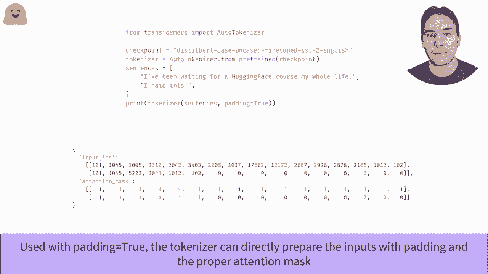

# 官方教程来啦！5位 Hugging Face 工程师带你了解 Transformers 原理细节及NLP任务应用！＜官方教程系列＞ - P18：L2.11- 批处理输入(TensorFlow) 

在这个视频中，我们将看到如何将两个批量输入序列结合在一起。一般来说，我们希望传递给模型的句子都具有相同的长度。这里我们使用的是在情感分析管道中看到的模型，想要对两个句子进行分类。当对它们进行标记并将每个标记映射到其对应的输入 ID 时。

我们得到两个不同长度的列表。尝试从这两个列表创建一个张量将导致错误，因为所有数组和张量应该是矩形的。克服这个限制的一种方法是通过添加一个特殊标记，使第二个句子的长度与第一个相同，必要时可以添加多次。

另一种方法是将第一个序列截断到第二个的长度，但这样我们将失去很多可能对正确分类句子必要的信息。一般来说，只有当句子超过模型可以处理的最大长度时，我们才会截断句子。用于填充序列的值不应随意选择。

模型已经用某个填充 ID 进行训练，你可以在 tokenizer 的 tokenid 中找到。现在我们填充了句子，可以用它们创建一个批次。如果我们单独或批量传递两个句子到模型中，我们会注意到有效句子（这里是第二个）并没有得到相同的结果。

所以，这就是变压器库的最佳表现，如果你记得变压器模型轻松使用注意力层。这不应该让人感到惊讶。当计算每个标记的上下文表示时，注意力层会查看句子中的所有其他单词。如果我们只有一个句子或带有多个填充标记的句子，我做的事情是外科手术。

我们得到的值并不相同。为了在有或没有填充的情况下得到相同的结果，我们需要告诉注意力层忽略填充标记。这是通过创建一个注意力掩码来完成的，该张量与输入 ID 具有相同的形状，包含零和其他值。一旦指示注意力层在上下文中应考虑的标记和应忽略的零标记。

现在，传递这个注意力掩码和输入 ID，将给我们与将两个句子单独发送到模型时相同的结果。 tokenizer 在你将它应用于多个句子时，会在幕后完成这一切，使用标志 padding equal through。

它将以适当的值对较小的句子应用填充，并创建适当的注意力掩码。

。

