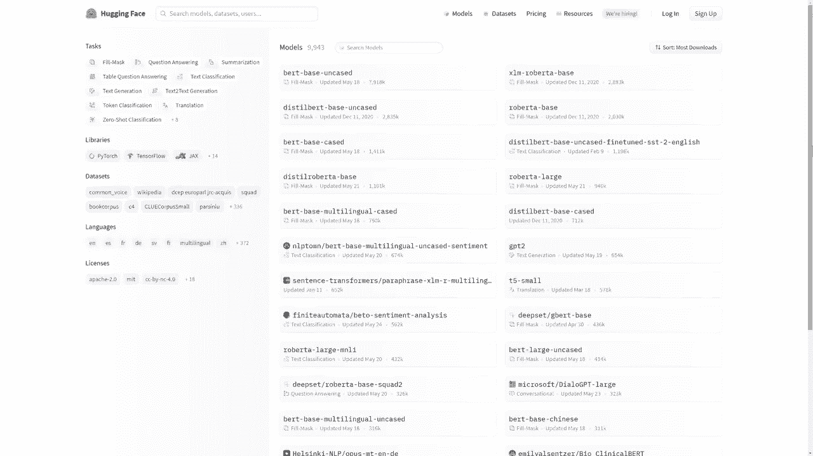
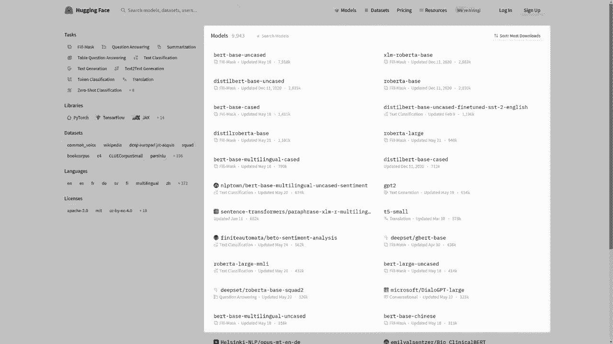
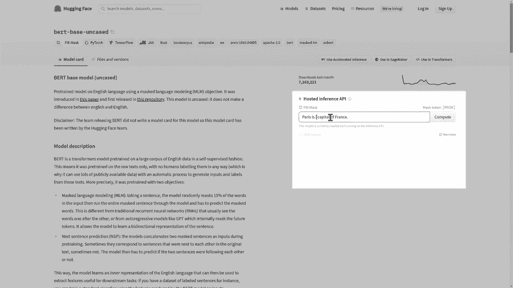
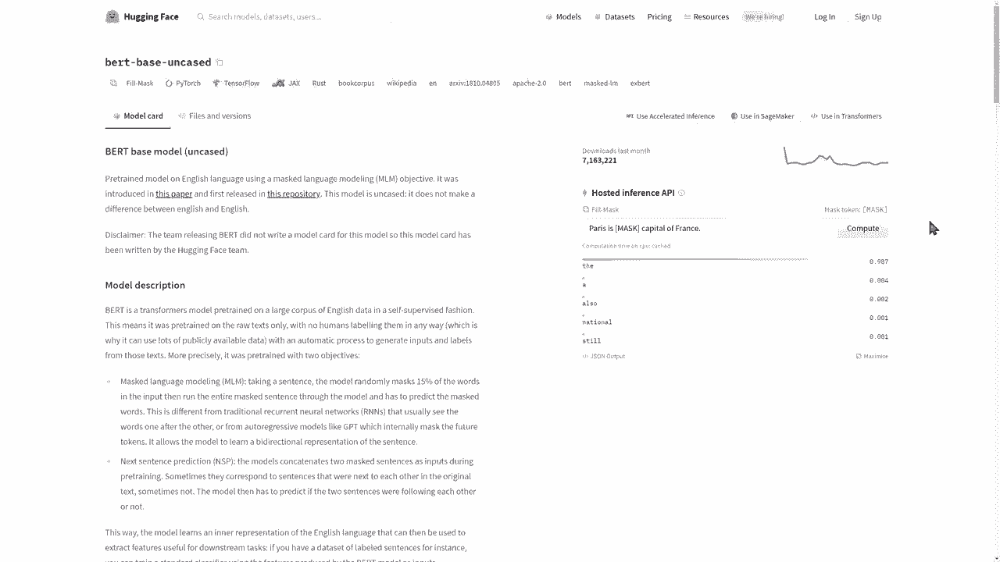
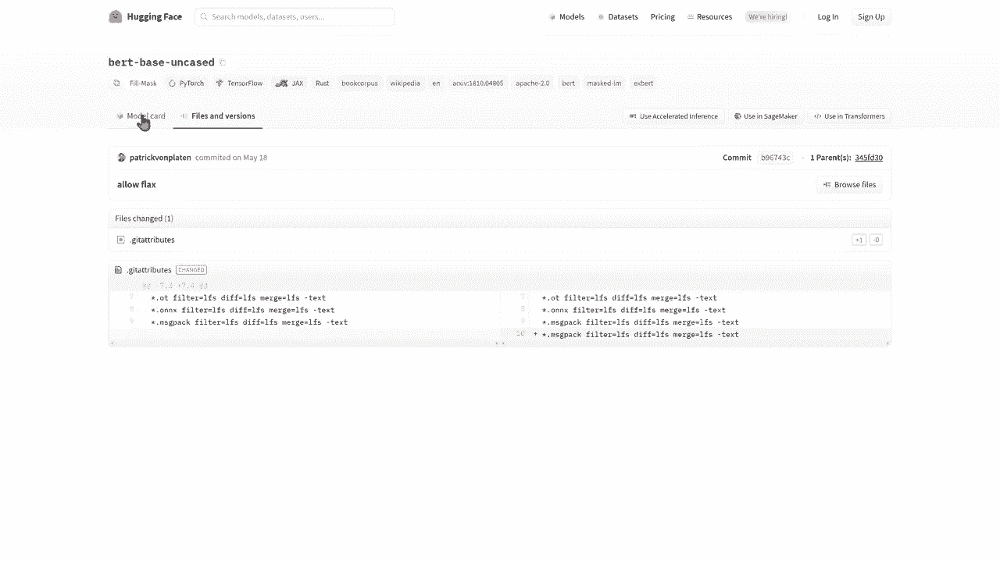
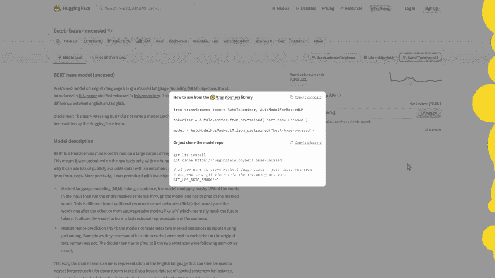

# 官方教程来啦！5位 Hugging Face 工程师带你了解 Transformers 原理细节及NLP任务应用！＜官方教程系列＞ - P30：L5.1- 模型Hub中心速览 

在这个视频中，我们将介绍 Huging F 模型 H 的导航。这是 Huging Face 的主页。要访问模型库，请点击右上角的模型选项卡。你应该会看到这个网页界面，可以分为几个部分。

在左侧，你会找到可以用来调整模型搜索的类别。第一类是任务。模型库中的模型可用于多种任务，包括自然语言处理任务，如问答或文本分类，但不仅限于此。其他领域的任务也可用。

如计算机视觉中的图像分类或语音中的自动语音识别。第二类是库。模型库中的模型通常共享三种骨干网之一：pytorrch、Tensorflowlow或jacks。然而，其他骨干网，如rust或onyx，也存在。最后，此选项卡也可用于指定模型来自哪个高层框架。

这包括变压器，但不局限于此。模型库用于托管许多不同框架的模型，我们也在积极寻找托管其他框架模型的机会。第三类是数据集选项卡。从该选项卡中选择数据集意味着过滤出在特定数据集上训练的模型。

第四类是语言选项卡。从此选项卡中选择一种语言意味着过滤出处理所选语言的模型。最后，最后一类允许选择与模型共享的许可证。

在右侧，你会找到可在模型H上使用的模型。

模型默认按下载量排序。点击一个模型后，你将看到其模型卡。模型卡包含有关模型的信息，包括其描述、预期用途、限制和偏见。它还可以显示如何使用模型的代码片段及任何相关信息，训练情况。

过程、数据处理、评估结果或版权。这些信息对模型的使用至关重要，越精心制作的模型卡，其他用户就越容易利用你的模型及其应用。

模型卡的右侧是推理API。这个推理API可以直接与模型进行交互。可以随意修改文本并点击Comp，查看模型对你输入的反应。

在屏幕顶部是模型标签。😊这些标签包括模型任务以及与我们刚才看到的类别相关的其他标签。😊。

文件和版本选项卡显示了该模型的仓库架构。这里我们可以看到定义该模型的所有文件。你将看到 getT 仓库的所有常规功能，包含可用的分支、提交历史以及提交的差异。

模型卡的顶部有三个不同的按钮。第一个展示了如何以编程方式使用推理 API。

第二个展示了如何在 SageMaker 中训练这个模型。最后一个展示了如何在适当的库中加载该模型，适用于 Bt。这就是 transformers。

嗯。
