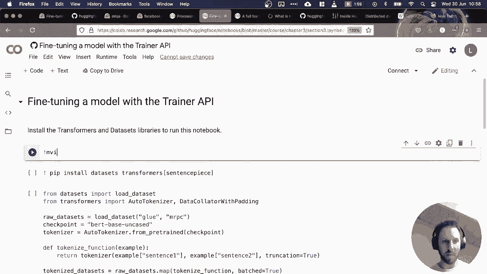
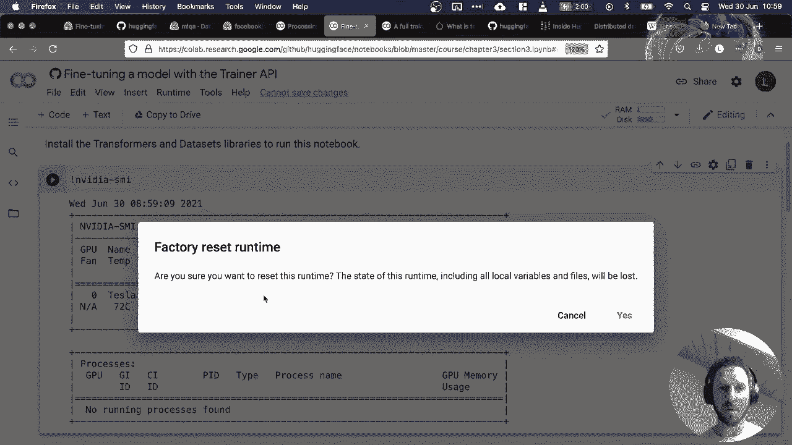
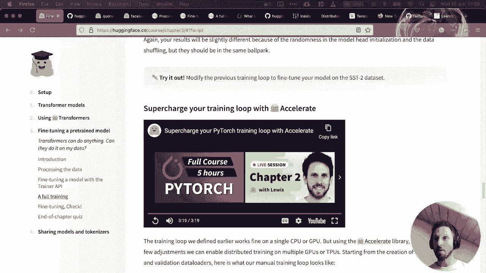

# 官方教程来啦！5位 Hugging Face 工程师带你了解 Transformers 原理细节及NLP任务应用！＜官方教程系列＞ - P36：L6.4- Lewis的在线直播讲解 

好的，也许我们可以开始了。那么，今天我们要看的是 Hugging Face 课程的第三章。这一章将把我们在前两章中看到的所有组件结合起来。作为回顾，在第一章中，我们探讨了与 transformer 相关的概念，以及与分词和预训练相关的一些概念。在第二章中，我们开始深入了解我们在第一章中大量使用的这个管道 API 实际上发生了什么，并试图真正解析如何训练一个模型，或者至少如何理解模型的输入和输出。

还有分词器的输入和输出。所以今天我们将把这一切结合起来，做几件事情。我们将查看数据集库，这是 Hugging Face 开发的一个非常方便的库，用于处理各种规模的数据集。

然后，我们将使用一个叫做训练器的东西来训练我们的第一个模型。训练器是一个 API，基本上封装了在 Pytorch 或 TensorFlow 中编写自己训练循环的许多复杂性。然后我们将尝试解析这个训练器中发生的事情，通过编写我们自己的训练循环来实现。

在 Pytorch 中，这将是一个很好的机会来介绍一个非常酷的库，Sylvanna 开发的 Hugging Face Accelerate。这个库旨在进行所谓的分布式训练。也就是说，当你有多个 GPU 或者甚至 TPU 时，如何加快训练速度。今天我们将在 Google Colab 中看到这一点。当然，如果有任何问题。

随时在聊天中问我问题，我会在不同的时刻暂停来回答。现在是回答问题的时候。所以，也许我们可以先开始。我们目前的生态系统大致围绕这些组件展开。因此，我们有中心，这一点我们已经看过好几次了。

我们使用中心来加载 transformers 中的模型，加载分词器，以及加载数据集。然后，transformers 与数据集库进行交互。正如我们今天将看到的，这是训练我们模型的一种方式。模型训练完成后，我们可以将其推送回中心，以便与同事分享，并使用 Hugging Face 团队开发的一些小部件与之互动。

所以，话不多说，让我们快速看看数据集库。数据集库是一种通用库，用于处理几乎任何类型的数据集。最初，它是专门针对 NLP 的文本数据集。但此后，它逐渐发展成可以处理图像、音频等多种类型的数据集。

我们将会有时间序列等功能。这个库的主要优势在于它提供了一种统一的API用于处理数据，对我个人而言，这在我作为数据科学家的职业生涯中是最大的生产力提升之一，因为以前我总是需要处理不同类型的数据。

CSV、JSON文本等，每次处理这些数据类型时总是有点独特，你必须为处理所有这些数据类型编写自己的自定义函数，而数据集库提供了一个非常简单的API，你基本上可以在一行代码中加载数据集。

然后你可以使用一个叫做map函数来处理它。我们今天会更详细地讨论这个函数。大致上，使用这个map函数，你可以对大型数据集进行极其快速和疯狂的处理，即使数据集的大小达到一TB。

你实际上可以在笔记本电脑上处理这个，因为它使用一种叫做Apache Arrow的聪明懒加载内存的方式。好的，让我快速看一下。太好了。😊，酷。也许我们可以从看这个DiocS库的介绍视频开始。

我要播放这个视频，如果你听不见，请告诉我。Egen F数据集库的快速概述。Eing F数据集库是一个提供API的库，可以快速下载许多公共数据集并进行预处理。这个视频将探讨如何做到这一点。加载数据集的资产功能使这部分变得简单。你可以直接从数据集应用中根据其标识符下载和缓存数据集。

在这里我们从G基准测试中获取M PC数据集，这个数据集包含句子对，任务是确定相似度。Lo数据集函数返回的对象是数据集字典，它是一种包含数据集每个分片的字典。

可以通过名称索引访问每个分片。这个分片是在数据集类的一个实例中，列有时为1，有时为2，标签为IDX和root。我们可以通过索引访问给定元素。Ugen Phase数据库的惊人之处在于，所有内容都使用Apache Arrow保存到磁盘。这意味着即使你的数据集很大，也不会耗尽R的内存。

只有你请求的这些元素会在内存中。访问数据集的一部分就像访问一个元素一样简单。因此结果是一个字典，其中包含每个案例的值列表，这里是标签列表、第一句话列表和上下文句子列表。数据的特征属性为我们提供了关于其列的更多信息。

具体来看，我们可以看到这里给出了整数与标签名称之间的对应关系。0代表不等价，1代表等价。为了处理我们数据集中的所有元素，我们需要对它们进行标记。查看视频中预处理的句子对以获取更多回顾，但你只需将这两个句子发送到解码器，并附上其他一些关键字参数。

在这里，我们指定最大长度为128，并且对比输入长度较短的进行截断处理。我们将这一切放在tokenized函数中，但我们可以直接应用到数据集的所有拆分上，使用map方法。只要函数返回一个字典类型的对象，map模式就会根据需要添加新列或更新现有列。

为了加速预处理，并利用所有tokenizer是由rust支持的这一事实，得益于Eging phase tokenos库。我们可以在autokenized函数中使用batch equal2参数同时处理多个元素。由于tokenizer可以处理第一句的列表和第二句的列表，因此tokenized函数不需要对此进行更改。

你还可以使用MA方法进行打印处理，查看下面的文档链接。一旦完成，我们几乎可以准备进行训练。我们只需使用remove columns方法删除不再需要的列。我们将label命名为labels，因为Uing phase transformforms库中的模型期望这样。

并设置所需的输出格式，dorch，流动性转换为imp。如果需要，我们还可以使用select方法生成数据集的短样本。

很好，这就是Do库的快速介绍。在我们深入代码之前，这个阶段有没有什么问题？好的，请随时在聊天中提出问题，我想提到的一点是，这可能会有用，在Hi phase hub中。我们在上一课中看过模型。

今天我们将更仔细地查看数据集。上周有一个问题，关于如何选择模型，比如多类与多标签？当时我们意识到没有简单的方法来筛选这些类型的模型，但事实证明，对于数据集来说，有一些更好的搜索方法，比如说。

如果我在进行一个新项目，获得早期结果的最快方法之一是基本上使用一些公共数据构建一个基线或原型。这通常比等待获得公司数据访问权限或等待一些领域专家帮助你进行标注便宜得多且快得多。

例如，如果我们正在查看多类的内容。也许我会选择文本分类。然后这里有其他标签可以进行过滤。所以如果我对问答感兴趣，我可以选择它。在文本分类中，我们可以查看一组子任务。例如。

在这里，我可以选择多标签分类。这将返回一系列数据集，作为多标签案例的候选项。因此，也许我正在处理假新闻，那么我可以查看一个名为假新闻英语的数据集，反之亦然，因此数据集中心是启动工作中机器学习项目的好方法。我发现这也是寻找一些有趣的数据集的好方法，可能超出你在NLP中常见的标准数据集。

几乎每个人都使用IMDB电影评论来展示他们的训练，但这里有很多额外的东西非常有趣和具有挑战性，因为许多数据集是社区提供的。顺便说一下，如果你有一个有趣的数据集。

如果你认为对社区有价值，你可以直接将其贡献给数据集库。因此，在数据集库内部，我们有一个数据集文件夹，里面有数百个基本上由Hugging Face团队审核和策划的数据集，你可以打开一个拉取请求，文档中有关于如何做到这一点的说明。

或者如果你想提供一个社区数据集，基本上是你不需要直接将其集成到库中。你也可以这样做，文档中有一些链接关于如何提交数据集到中心。

那么让我们看看到目前为止是否有任何问题。太好了。也许Oma可以将一些链接放到那个社区。诶。与规范的des相比。好吧，SRM sumUma有个问题，数据集库看起来非常具体于NLP，我找不到很多与视觉相关的数据集。是否有托管视觉相关数据的限制？简短的回答是没有。

库中没有限制，只是我们尚未投入大量精力整合视觉数据集，如果你有一些想添加的视觉数据集的想法，请随意在数据集库中打开一个拉取请求。

或者基本上在论坛上联系。在此时，如果我查看这里，看看。我能找到视觉吗？我们有标签修订吗？让我们看看。所以我不认为我们还有视觉标签。但我知道我们有，让我看看。我想我们有CFAR。我们没有CFfa，可能是imt。很有趣。

我相当确定我们有这些数据集。好的，那么。也许一些视觉数据集还未上线，因为我这好吧。CA，是的，好的。所以我们有CF 10，CF 100，这些数据集可以使用数据库。还有其他的，我想我很确定mnes也在这里。所以有时尚mnesist。

mist等等。所以这是个好问题。我想我可以在聊天中分享链接。这是。这个是Mist的链接。让我们放在这里。😔，酷。希望这能回答你的问题，消费者。嗯。😊，好的。现在我们可以做的事情是先看看数据集库的coabab。

所以我们开始动手操作。和往常一样，我想做的第一件事是安装数据集和变换器。我将使用捕获。

魔法命令来捕获所有输出的Pip垃圾。嗯。😊，所以这将花费几分钟。请记住，变换器工作流中的基本过程是，我们首先需要一个分词器来将原始文本转换为输入ID。然后我们需要一个模型来处理这些输入ID并将其转换为我们可以构建预测的数值输出。因此，在这里，我只是实例化了一个分词器和一个模型。

所以这将是基于Bt的无大小写模型，这是一个用于序列分类的自动模型。因此，这是我们在预训练模型上添加的文本分类头。这只是一个小代码片段，展示了如何处理基本的原始序列，将其转换为输入ID。然后通过模型传递这些和标签。好的。

但我们上周已经看过了，所以今天对我们更有趣的事情是开始查看它们读取的数据集。你将遇到的第一件事或最常见的事情是加载数据集函数？

如果我们看一下这个加载。哎呀。加载数据集函数。你可以看到它有很多不同的参数，你可以提供，我使用的最常见的参数是路径。它本质上是数据集的名称，这就是你在中心看到的内容，所以在这个案例中我们有glue，但它可以是MNIST，或者其他任何东西。

在中心上，许多数据集通常有配置，就像细分子集。例如，glue是一个基准，它有许多不同的任务，每个任务都有一个名称，这里我们有微软的同义句理解任务。如果你想访问给定数据集中的子任务或子集，你使用这个名称参数。然后我们将看到的另一个非常常见的参数是指定拆分。

所以很多时候默认情况下，它将返回库中定义的所有拆分。在这里，我们得到了训练、验证和测试拆分。但有时你只想要训练拆分，因此可以明确指定这些，我会告诉你怎么做。好的，现在当我们加载数据集时，我们得到一个数据集对象，通常你会看到两种类型的对象，最常见的是称为数据集的东西。

你可以把它想象成一个字典，键是对应于划分的字符串，值是称为数据集对象的东西。让我们来看看这里的一个示例。所以如果我索引训练键或训练集，我现在将得到一个数据集对象。

如果我查看该数据对象中的第一个元素，我有一个ID，一个标签，以及我需要判断一个句子是否是另一个句子的同义改写的两个句子。在这种情况下，我们可以看到第一个句子说“阿姆罗西指控他称为证人的兄弟故意歪曲证据”。而第二个句子则说，称他为仅仅是证人，阿姆罗西指控他的兄弟故意销毁证据。

所以这是一个相当好的例子，第二个句子是第一个句子的同义改写，或者也许第一个是第二个的同义改写。所以它稍微短一点，捕捉到了相同的信息。我们可以看到这里的标签是1，作为一个猜测，可能表示这是真的。它是可以改写的。好，所以为了稍微拆解一下这个数据集字典和数据集对象的区别，因为第一次看到这个时我觉得有点困惑。

所以我们知道原始数据集是由这个数据集字典对象给出的。这个数据集对象有这些键，对吧，所以我们有训练、验证和测试。如果我们像查看普通的Python字典那样查看它的值，那么我们现在得到的是一个字典，或者我们得到不同值的列表。

所以把数据集想象成一个字典，将键或划分映射到数据集，而你几乎所有的工作或重工作都是在数据集对象上进行的，所以如果我们查看一个数据集对象。这些原始训练数据，这个数据对象有很多操作可以执行。

今天我们将看到其中的一些内容。所以我们可以添加列。我们可以进行过滤。我们可以从不同格式加载数据。我们可以提取一些关于数据的信息。所以也许我们来看看这个。如果我们查看数据集的信息属性，这通常会告诉我们，也许我们可以打印出来。这就可以了，就这样。

所以这将告诉我们一些关于数据集本身的描述。还有关于数据类型等的信息。所以，是的，基本上只需记住数据集是我们将要做大部分工作的地方，而数据D只是收集所有划分在一起的一种方式。所以我们来看看有没有问题，暂时没有，好。

所以数据集的一个重要方面是它本质上有类型，所以你在工作中可能经历过的大部分数据是非常混乱的，或者也许它像一个CSV文件，里面混合了字符串、数字等等。

数据集库所做的就是明确地定义每一列在数据集中的类型。这非常有用，因为它允许你更早地捕捉错误，同时也能进行一些非常快速的处理。因此，如果你查看数据集的特征属性，你会得到一个字典，基本上显示列名作为键，然后是该列的数据类型，所以我们可以看到，确实，句子一是一个字符串。

我们得到一个叫做值类型的东西，这里它指定为字符串。但另一个有趣的可能是标签，因此这里的标签列不仅仅是一个整数，虽然它可以是一个整数，但数据集提供了一种叫做类标签类型的东西，这个类标签类型包含我们拥有的类别数量或唯一标签的数量的信息，以及这些标签的名称。这基本上就是你需要了解的两个要点：标签的名称和类别的数量。

然后我们可以看到，例如，ID的数据显示类型为整数32。因此，你可以对这些特征做的一件事情是，特征只是一个字典，所以我们可以通过键访问值。如果我们获取标签，这将给我们这个类标签类型。这个类标签类型有几个方便的功能。

所以我经常使用的一个功能是如何将我的数值特征转换为类似于人类可读的形式，所以我可以使用一个整数转字符串的函数。如果我在这里放入标签一，它应该告诉我，确实，它对应于等效值。

这意味着一句话是另一个的同义句。作为一个简单的检查，如果我们使用零，那么对于非等效的情况，它应该是相同的。因此，这个类标签特征在中心有一些文档以及其他你可以查看的功能，但我发现这是一个非常强大的方法，可以快速在数字标签和字符串标签之间切换，以便你能理解你的数据集中的内容。

那么我们来看看，有没有问题。好的，IM homess提了一个问题，是否有办法利用数据集库的便利，但使用可能是私有的数据集，例如客户数据？是的，这是个好问题，答案是可以的，所以之前在我加入Hugging Face之前，我为一家电信公司工作，一切都是完全封闭的，我们无法使用Hugging Face hub，因此我实际上必须解决这个问题。我通常使用的方式是利用pandas。

所以我会导入 pandas 为 PD。然后我会创建我的数据框。所以假设我打算创建一个虚拟的数据框。比如说我有。哎呀。我的数据框如下，我要说，好的。我们称之为文本。然后我会写。你好，世界。然后可能再添加另一个元素，今天。好的，然后我会添加另一列。

这可能是标签。然后这可能是正面的，正面的。所以这是一个超级简单的数据框，但这是我会本地加载的东西。当然，pandas 对数据处理非常棒。但如果你想使用数据集功能，你可以创建自己的数据集，自己的自定义数据集。所以从数据集开始。

你可以导入。数据集的目标本身。然后我们可以创建。数据集。我们看看，我想这是来自于 pandas，是吗？

然后这应该，祝好运，现在创建一个数据集对象。它具有文本和标签的特征，包含两行。如果我们现在，例如，查看所有元素，我们可以看到确实得到了我们自己的自定义数据集。所以这大致就是我工作 90% 的方式。

我希望这能回答你的问题，我想还有其他加载数据的方法。你可以从 CSV 加载，可以从 JSON 加载。我认为这大致涵盖了大部分用例。唯一让事情有点痛苦的情况是当你处理非常大的数据集时。

你知道，有些东西可能不适合放入 pandas 数据框中，但数据集库中刚刚实现了流式功能。所以是的，我认为这样可以基本覆盖几乎所有的用例。好的，酷，所以。嗯。到目前为止，我们只加载了我们的原始数据集。

我们希望做的事情是对其进行标记化，所以到目前为止我们在所有课程中基本上都是逐个字符串或者字符串列表进行标记化，如果我们看看这里的这个例子。

然后当我们进行标记化时。你可以看到。标记化第一句列现在给我们带来了一个输入 ID 的列表。所以我们现在基本上有一组输入 ID，嗯。是的。我们得到了一个与第一句和第二句对应的大输入 ID 列表。请记住，这些 ID 是我们用于输入到变换器的。

这些是进入嵌入层然后进入变换器堆栈的东西。最后，我们得到一些预算，可以用来进行预测。好的，所以。这就是我们一直在做的事情，你也可以，正如我想我们可能看到的那样，可以使用将 ID 转换为标记的功能。

但可能最有趣或最常见的事情是你如何基本上对整个数据集进行标记化？

最常见的做法是定义一个函数。你可以随意命名。在这里它被称为标记化函数。这个函数会在数据集的每一行上进行操作，并应用你在函数中定义的操作。

一旦你定义了你的函数，你就可以。对你的数据集应用映射。这将自动对你数据中的每一行进行标记。因此我们得到了所有的原始字符串，句子一，句子二。它们被自动转换为输入ID，以及我们上周看到的这个注意力掩码，我们需要找出如何禁用填充标记以适应注意力机制。

所以。😊这是一个非常强大的方法，可以在大约一到两行代码中，自动对数据集中每一个示例进行标记，速度非常快，基本上可以进行多进程处理，并且也可以在GPU上批量运行，以更快的速度处理。

但也许我们来看看一个非常简单的示例，以便更好地理解这里发生的事情。假设我想做一些比较常见的事情。也许添加一个列，现在在数据集中有更快的方法来做到这一点。但我将向你展示如何用一个函数来做到这一点。我们来添加一个列。

而这个列应该期望的是一个示例，或者说让我们假设这是一行。它是我们数据集中的一行。而这个函数主要需要返回的是，它必须返回一个字典。这样做的原因是，如果你查看。我们的训练集中的一个示例。你会看到它有点像一个字典，对吧，我们有列名的键和实际元素的值，或者说如果这是一个表格中的单元格。

所以我们需要做的是返回。奇怪。似乎协同应用了两次。所以我们需要返回一个字典，假设我随便编造一个。我将说这是一个新列。并且我会把新列的所有值都设置为。只是一个单词，hello，好吗。如果我们这样做。那么如果我拿我的原始数据集。

好吧，我们就用原始训练数据集来进行示范。为了简化起见。当我们应用映射时，我们只需要在这个函数中提供输入。然后它会自动创建一个新列。并将其添加到我们的原始数据集中。现在你需要注意的一点是，这个操作不是就地进行的。

如果你熟悉pandas，通常会有就地操作。这意味着你只需运行这一行，然后它会改变数据集对象的状态。大多数情况下，所有操作都不是就地进行的，这意味着如果你想将该列存储在内存中。你需要创建一个包含额外列的数据集，比如说“额外列一”。

你知道，这等于映射。然后，当你查看这个时。你现在会看到我们有一个新的列Ho。因此，这现在在这个新数据集对象的内存中存储了。好的，总结一下，你有一个函数，而这个函数必须始终返回一个字典，其中键是列的名称，值是你想要的那一行的值。好吧，让我们看看一个小的例子。我是Homemes，只是在询问。

请你再解释一下注意力掩码的作用，好吗？很好，非常好的问题。让我们看看这个例子。在这个例子中，我们有两个句子。我们可以看到，这可能不是一个好的例子，也许我们来添加一些填充。嗯。好的，实际上。我需要做的是给你展示一个例子。我要。是的，我要这样做。

所以我要在我的函数中应用截断，并且我要添加一些填充。然后这只是为了向你展示我们在这里讨论的内容。好的。在这里，我只是对原始数据集进行了分词，得到了这个分词数据集对象。然后列表。获取第一个元素，希望能显示给我们。哈哈。嗯。好的，这个有点混乱。好的。

但让我尝试总结一下，所以记住在上一章，我们看到了填充的概念，而我们需要填充的原因是我们在变换器内部进行的所有操作基本上都是矩阵乘法。当你进行矩阵乘法时，你想确保你操作的矩阵大致是方形的。所以如果我有一个句子，并且我将其表示为一个向量。

然后，为了比较一个句子和另一个句子，如果这些数组或向量的大小相同会更有帮助。因此，填充是一种技术，基本上在最简单的情况下，你可以查看批次中最长的句子，然后在每个其他句子的末尾加一个零，这样就填充到最长句子的长度，从而保证你的句子或批次中所有向量的大小相同。

然后，当你将它们堆叠在一起时，你会注意到它呈矩形。现在这就是填充，我们这样做多多少少是出于计算的原因。但它带来的问题是你可能还记得之前章节提到的注意力机制。它基本上取一个嵌入，也就是我们对序列的数值表示，然后更新它们以创建称为上下文化嵌入的东西，而这些上下文化嵌入本质上为序列中的每个标记包含信息。

它们包含与该标记相对于整个序列的意义相关的信息。例如，如果我有一个句子，比如，我不知道，时间像箭一样飞逝。然后在这种情况下，“飞”是一个动词。但如果我有另一个句子，比如“果蝇像香蕉一样飞”，那么“飞”就是一种昆虫。

因此，注意力机制使我们能够区分这两种情况，因为代表飞行的上下文化嵌入在这两种情况下是不同的，并且它使用整个序列来发展该表示。现在，由于注意力在序列中的每个单个标记上进行操作。

它也会作用于填充标记，这可能会有些问题，因为这些填充标记就像是我们注入的人工东西，以确保所有矩阵是方形的。因此，注意力掩码是一种告诉注意力机制的方法。

不要关注填充标记。那么注意力掩码看起来会是什么样子？在这里。它会有一堆一，所以这些将是序列开头的所有标记，这些正是我们希望开发上下文化嵌入的内容。

然后在某个时刻，你会达到填充序列的开始。所以你已经有了所有的单词，现在只是在你的标记嵌入中添加零。此时，注意力掩码将切换为零，这样它通过注意力层时。

它将禁用该部分的注意力计算。所以我希望这解释了你的问题，我的朋友。这个问题有点长。而且所有输入ID是完全正确的。没错，所有不为零的输入ID会是1，而所有为零的输入ID会是0，我们可以在这里查看。

所有输入ID为零，现在我们有了填充。嗯。好的，接下来有个问题来自Resh Mecheik，我们能否做map函数的反向操作？嗯。让我想想我是否理解你的意思。😔，那么你心中有什么样的例子，Rash？

我不确定我理解这个问题，但也许你可以把它写在聊天中，我稍后再回到这个问题。好的，所以。我们已经看到如何使用map函数对整个数据集进行标记化。我认为这大致是这个课程的主要内容。所以我将删除这一部分。还有另一件值得指出的事情是，有两种方法可以进行填充。

一种方法是在标记化步骤中明确定义填充。所以你可以设置填充为真，或者按你想要的方式实现它。当你用mat函数进行标记化时，它会根据你的定义自动填充所有序列。现在。

这样做的缺点是，当你进行训练时。也许你的填充，例如这里，选择了整个数据集中最长的句子，然后填充到整个数据集中的内容。但是当我们进行训练时，我们实际上是在对批次进行训练，因此常见的一种做法是进行动态填充。我们很快就会看到这是一种在运行时添加填充标记的方法，这让我们可以更有效地进行计算。

所以我想现在来看一下那个视频。

那么让我们看看如何在流上进行填充。

什么是动态填充？在批处理输入的同时，我们发现能够将不同长度的输入分组到同一个批次中。我们需要为所有短输入添加填充，直到所有样本都达到最长的长度。例如，这里最长的句子是第三个句子，我们需要添加五个填充。

为其他句子添加两个或七个填充，以使四个句子具有相同的长度。在处理词数据集时，有一些我们可以应用的策略。因此，最常见的一种是将数据集的所有元素调整为相同的长度，即最长样本的长度，这样就会得到所有形状相同的块，形状由最大序列长度决定。

缺点是由短句子组成的块中有很多填充标记，这会在模型中引入更多不必要的计算。为了避免这种情况，另一种策略是在将元素批处理在一起时，使用批次中的最长句子进行填充。这样，由短输入组成的批次体积变小，而包含数据集中最长句子的批次则保持较大。

这将提高 CPU 和 GPU 的速度。因此，缺点是所有批次将具有不同的形状，这会在像 TUs 这样的加速器上导致速度变慢。我们确实需要在实践中同时应用这两种策略。实际上，在我们提出 R PCC 数据集时，我们在一段视频的数据集中应用了固定填充，在处理数据集时，我们对所有数据集进行了带填充的标记化，并确保所有样本的长度为 128。

结果是，如果我们将这个数据集传递给一个 byy toch 数据，我们会得到形状为 patch size 的块，这里是 16 x 128。为了应用动态填充，我们必须将填充推迟到批次准备中。因此，我们将这一部分从标记化函数中移除，但仍然保留转换部分，以确保大于模型接受的最大长度（通常为 512）的输入被截断到该长度。然后我们通过使用数据策划者动态填充样本。

Tos 库中的这些类负责在形成批次之前进行所有最终的预处理。这里，带填充的装饰器将通过句子的最大长度传递样本。我们将其作为聚合函数传递给 Pythto，并观察到生成的各种长度的批次都低于之前的 128。动态填充几乎总是在 CPU 和 GPU 上更快，因此如果可以的话，你应该应用它。

记得如果你在TU上运行训练脚本或需要固定芯片批次，还是要切换回固定竞标模式。好的，刚才对动态填充的解释很好，所以总结一下。如果我有一个数据集，比如说一千个例子。假设其中一个例子的长度远远超过其他例子。也许是有错误或者其他原因。那么如果我只是对这个数据集进行了标记化。嗯。

就像我们之前在colaab中做的那样。我们只对最长例子的最大长度进行了填充。然后所有样本都会被推送到这个很长的例子上。因此我们会在需要计算的地方有很多零，这样会变得更慢。因此，替代方案是因为我们大部分训练都是以批次进行的，所以我们在批次级别进行填充。

所以，我们不是对整个数据集进行填充，而是只查看一个批次中的元素，并对该批次中最长的例子进行填充。这样做的结果是将需要更少的计算，因此会更快。

但正如Svan所解释的那样，每个批次的大小会有所不同。所以我们可能在一个批次中，最长的句子只有10个标记。因此所有的句子都是10个标记，也许第二个批次是30个，以此类推。在Transformers库中，我们有所谓的数据整理器。这些数据整理器基本上是允许我们聪明地将这些不同大小的批次打包在一起，以便我们可以高效地进行训练的函数。

所以让我们看看一些问题，然后再回到这个col datac的内容。有一个问题是，让我看看。好的，我们收到了一个问题，内容是“嗨，有一些有限的标注数据集不是英文的。将数据集机器翻译成某种语言或特定领域的类型进行微调是否合理？”是的，这是一个非常好的问题，通常是强烈推荐的。

一个很好的例子是有一个数据集叫做MLQA。

这是一个多语言问答数据集，该数据集的作者基本上将英语的S数据集翻译成了几种语言，所以我认为他们有德语、西班牙语、印地语、越南语和简体中文。这是创建你所在领域或语言数据的一种方式，你可以在其上构建模型。唯一的缺点是，如果你在训练非常大的变换模型时，通常会被认为有问题。

他们总能以某种方式学习到这一点。已经有一个翻译被做过，他们会采取捷径来获得良好的表现，因此最终你在翻译文本中得到的模型可能在翻译的上下文中表现良好。但如果你将其用于真实的人际交互，这可能就会超出领域，或许模型只是学会了检测出这是翻译过的，而不是如何真正解决你关心的任务。

所以你要对此稍微小心一些，但这值得尝试，我在瑞士住的时候也用过这一点。那里有四种国家语言加上英语，因此大部分情况下你没有英语的数据，都是意大利语或法语，因此你需要进行一些翻译技巧。

嗯。😊 最近出现的一件事情，我认为挺酷的是，Facebook发布了一个叫M2M 100的模型。这是一个翻译模型。所以它是一个序列或者是我们在第一章看到的编码解码变换器，它可以基本上进行100种不同语言之间的翻译。所以你可以想象，你有一个100乘100的所有语言的矩阵，对于每一个语言对你都可以进行翻译。

所以这给你提供了9900对可以翻译的内容，而且这是一个非常好的模型。如果你正在寻找翻译，我建议你使用这个，如果你的语言在他们涵盖的1000种语言中。好的，接下来也许可以回到俄罗斯的问题，如何恢复在地图中之前创建的列？

现在我明白你在问什么，所以问题是，假设我们添加了这一列。现在我们有一个数据集，新增了一列，显示“hello”。我会给你展示一个具体的例子，比如如果我想删除这一列。那么我可以移除列。接着在这里我只需提供一个列名的列表，所以我可以提供“new column”。

然后这将删除。新列，并恢复到我们原来的数据集。差不多，我认为这涵盖了你想要撤销映射操作的大多数情况。唯一的情况是如果你对数据集进行了其他操作。也许你改变了这些原始列的内容，那么你知道，撤销这一步就不那么容易了。

好的，然后我们有另一个问题，来自SRM Zuma，问题是。为什么在TUs上动态填充比在GPU上慢？这背后有什么直觉吗？好的，所以这考验我的有限TPU知识，但我的理解是，这是一种从根本上不同的架构，主要用于进行数值、数值线性代数或代数方程，或者矩阵的乘法。

我认为这仅仅是由于芯片设计的方式。如果所有内容都是固定大小的矩阵，它们会更有效，而不是试图对数据进行洗牌以进行聚合。但是在聊天中以Haka Lama身份出现的Omar曾在谷歌工作，所以他或许可以在聊天中提供一个更好的答案。😊，嗯。所以，是的，这是一个很好的问题。我也想知道详细的答案。

所以这里有几点需要注意。😊，好的，我想在开始训练模型之前，快速看一下这个数据聚合器在做什么。在transformers中，有不同的数据聚合器来处理这种动态填充。

而我们大多数时间使用的是带填充的数据聚合器。这将会……让我看看。我可以看到它吗？是的，如果我从数据集中获取几个样本，我这里的样本只是一个标记化输入的列表，它们的输入长度是相同的。

所以他们可能是因为我加了填充，抱歉，让我把这里的填充去掉。所以我只是想在分词器中对数据进行重新分词，而不加填充。因为我们想要做动态填充。有一件非常酷的事情我没有提到，就是在数据中你所做的所有操作都是缓存的，因此它们基本上是作为箭头表存储在你的硬盘上，所以当你想要重新处理时，它基本上会检查我是否之前做过这个计算，如果做过，它会直接加载缓存版本，这样非常快，你会看到这只用了大约一秒钟，如果你处理过像一百万个示例，然后重新启动笔记本，你就不必再等待重新处理它们。

缓存会瞬间完成这一切。好的，所以现在我已经对数据进行了分词，没有填充，因此所有示例的长度各不相同。那么，当我将数据传递给这些样本时，数据创建器会自动将该批次中所有样本调整为该批次中的最长长度。

你可以看到，最长的示例有67个标记。因此现在它创建了张量，每个张量本质上有67列，你知道的，针对每个最长的标记，其中一些会有填充。这就是数据聚合器为我们做的。当我们进行训练时。

它会为我们即时处理所有这些。嗯，没错，SRum问TPU的问题是，平方矩阵也是GPU喜欢的，是的，没错。所以如果我没记错的话，TPU的上下文是与动态填充的区别有关，而使用动态填充时，我们实际上是在创建平方矩阵。

在批处理级别上，我们还在移动数据，因此我们必须动态创建不同形状的数据。我怀疑这可能是减慢速度的原因，但这是个好问题，我应该在某个时候查看答案。

很好，你提出了一个非常好的问题，这让课程中的两位老师感到困惑。他们很棒。谢谢。😊 好吧，很好，这差不多就是数据集的分词处理。😊 现在让我们看看训练。我们要做的是查看训练器 API。我们将启动视频。Sotrino API。Transforms 库提供了一个训练器 API，允许你轻松地转换模型和数据集。

训练器类确保你的模型以及训练 IP 参数，并可以在任何设置上执行训练，包括 CPU、GPU、多 GPU、TPU。也可以在任何数据集上计算预测，如果你提供矩阵，可以在任何数据集上评估你的模型。

你也可以进行最终的数据处理，例如动态填充，只要你提供一个分词器或在 MRRPC 数据集中给定的数据计算器 World5 CP，因为它相对较小且易于预处理。正如我们在数据集中的视频集中看到的那样，我们可以提出这些。

你在预处理过程中不应用填充，因为我们将在填充数据器之前使用动态填充。请注意，我们不会进行最终步骤的重命名、删除或设置格式为 torch 张量。训练器将通过分析模型签名自动完成所有这些工作。在创建训练器之前的最后一步是定义模型和一些训练的超参数。

我们首先在模型 API 视频中进行了第一步。对于第二步，我们使用了训练参数类。它只需要一个文件夹路径来保存结果和检查点，但你也可以自定义训练器将使用的所有参数，例如学习率、训练次数等。创建一个训练器并启动训练非常简单。

这应该会显示你的属性栏，如果你在使用 GPU，过几分钟你应该就能完成训练。然而，结果可能会让人感到意外，因为你只会得到一个训练类别，这并不能真正告诉你模型表现得如何。这是因为我们没有指定任何评估指标来获取这些指标。

我们首先使用预测方法对墙评估集进行了预测。它返回一个名称，包含三个字段：预测，包含模型预测；级别 ID，包含级别；如果你让我们添加网络和矩阵，这里是空的。我们正在尝试做到这一点。预测是模型对数据集中所有句子的输出。

因此，有一个形状为408x2的数组。为了将它们与我们的标签匹配，我们需要对每个预测取最大值，以了解预测的是两个类中的哪一个，我们用max函数完成这一点。然后，我们可以使用数据集库中的矩阵，它可以像加载数据集一样轻松加载。

它返回用于数据集的评估指标。我们可以看到我们的模型确实学习了一些东西，准确率为85.7%。为了在训练过程中监控评估矩阵，我们需要定义一个计算矩阵函数。它的步骤与之前相同，接受一个名称来保存对标签的预测，并且必须返回一个包含我们想要跟踪的指标的字典。

通过将epoC评估策略传递给我们的训练参数，我们告诉训练器在每个epoch结束时进行评估。在你的笔记本中启动训练将显示进度条，并在每个周期结束时完成你在这里看到的表格。

好吧，这信息量很大，如果你从未见过训练器，这可能一下子有太多内容，所以我们将一起走过这个过程，希望到最后你将拥有开始训练自己模型所需的所有工具。

解决你自己的问题。因此，在Google CoLab中有不同的运行时可用。通常情况下，默认是CPU，没有加速，因此你需要做的是点击运行时，选择运行时类型，对于这个笔记本，我们将稍后使用GPU，看看如何使用GPU。

然后我们保存这个。现在这将在Google Coab中启动一种具有GPU的机器。你可以做的一件事。

检查你正在运行哪种GP的方法是执行NviDdia SMI。

让我们看看我们得到什么。如果它醒来。这里我们得到了Tesla Kaie，这些通常是你得到的默认GPU，虽然不是特别好，但如果你在网上查找，通常可以找到有人保存了像P100这样的协作状态，你可以直接使用它们，非常快。当然，如果你重置运行时，有时这是一个小技巧。

尝试获得更好的GP。你可以进行出厂重置。

然后这将清除整个后端，希望现在仍然是GPU。也许我们会得到一些与K有点不同的东西，看看我们得到什么。好的，我仍然卡在Katie，但有时如果你运气好，它会给你一个P100或甚至是Tesla。好的。😊，所以我们把我们的GPU恢复到coab了。再一次。

我们做同样的事情，安装我们的依赖项。我们在这段代码中所做的就是之前做过的事情。所以我们加载数据集。然后我们从检查点定义一个分词器，因此我们使用B basincased。我们有我们的分词函数。这个分词函数的作用是获取这两个句子。记住，这个数据集是关于尝试预测一个句子是否是另一个句子的释义。

所以我们将这两个句子传递给分词器。我们使用截断为真，这样如果其中一个句子超过了最大序列长度Bt（512个标记），它会将其截断为512。然后我们对所有内容进行分词，并定义这个数据集，以便我们可以进行动态填充。所以我就要运行这个了，应该会非常快。😔，好的，所以在它运行的时候。

我们先来看一下训练参数。这是你与训练师接触的第一件事，所以训练参数。你可以把它看作是一个配置，它基本上是一个类，你可以在其中定义各种超参数用于训练。你需要指定的唯一内容是一个输出目录，所有训练的信息都会存储在这里。

如果你保存模型，它将存放在这里，因此如果我们查看训练参数，我们可以看到，让我们看看，我们能否透过这里看到。你可以看到我们有这个输出目录，还有许多内容，确实很多。你可以指定学习率，也可以指定优化器的参数。

你可以定义优化器，你可以定义类似于fast AI的回调。这并不奇怪，因为Sil开发了这个训练器。这些回调可以以聪明的方式控制训练，例如提前停止等。所以我不会详细介绍所有这些，但基本上你可以设置大量参数，你可以在训练器的文档中找到。

并且它提供了一些相当不错的默认值，所以大多数时候它会直接开箱即用。现在我们需要加载模型，并且我们指定两个标签，因为我们只有两个类别。它是一个释义还是不是。再次强调，这是一个序列分类模型，因为我们正在进行文本分类。接下来是下一个阶段，这可能是更复杂的部分。

所以我们需要实例化一个训练器，一个训练器至少需要一些东西。它需要一个模型。这是我们要训练的模型，它需要训练参数。这些是定义训练如何运行的内容。它需要一些数据集，因此需要一个训练数据集或评估数据集或测试集，你可以有一个，而没有其他的。

但它至少需要一件事，基本上至少需要一个你想要训练的数据集。你可以在没有它的情况下实例化，但一般来说你想要指定一个。所以在这里我们传递了分词后的数据，这很重要，因为你不想将原始数据传递给你的训练器，因为它会将其喂给模型，然后模型就会开始处理。

我不知道你在做什么，我该如何处理这些字符串。还有另外两件有趣的事是传递数据协调器和分词器，因此提供这两个参数将实现动态填充，这样训练会更快。它的工作方式是你要求给我一个协调器。

数据协调器有不同类型，但我们使用的是最常见的一种。同时它也需要分词器，因此数据协调器的工作方式是将分词器与批处理结合起来，以确定如何安排输入。

因此，通过提供这两个参数，我们将会加快训练速度。嗯。这样就会实例化训练器。让我们看看它是否有效。好的，一切正常，所以在我启动训练之前，通常我会进行一个理智检查，确保我可以运行评估函数，因为很多时候发生的情况是，当你运行训练时，你会训练若干步，然后在一个周期结束时进行评估，这基本上是默认策略之一。

但如果你的评估，可能你的指标实现得不正确或者其他原因。如果评估失败，那么你在等待整个一个周期的训练后也会失败，这真的很让人烦恼。因此，我做的一个理智检查就是确保我可以运行评估。

如果这样有效，我相对有信心训练过程会成功，你可以看到这个评估提供了关于验证集中示例数量的信息，并且给出了损失值和一些运行时指标。

这种处理批次的性能如何？显然，目前这是一个随机模型。我们只是初始化了Bert作为骨干网络，然后堆叠了一个带有随机权重的线性层，所以这算是一个无用的损失，目标是在训练后使其下降。酷，所以我现在要运行训练。这需要几分钟。因此在它运行时。

然后我们会观看加速视频，它会向我们展示如何。嗯，也许不是。也许我会先运行这个，然后看看是否有任何问题。好的。DK crazy diviv问。我们正在使用Bt base uncased，文章提到Bt使用的是WordPiece，但我们通过pip安装了transformers的sentence piece，我们在这里使用它吗？

如果我想反向工程，我该如何以编程方式从检查点获取并弄清楚使用哪个分词器。这是个好问题。所以。我们的问题是。为什么我们要进行Pip安装transformers sentence piece？这是一个可选依赖项，它是XLM Robbaa等模型使用的不同分词算法。

它被列为可选依赖项，因为它有点重。因此，如果你不想使用任何不需要句子分片进行分词的模型，可以直接不安装，它仍然会正常工作。所以例如，如果我们仅通过transformers进行Pip安装，我们将免费获得wordpiece。

它会作为一部分，但如果我们想使用其他模型，就必须明确地定义句子分片依赖项。所以这可能澄清了问题的第一部分。我们始终与Bt一起使用wordpiece，仅在需要时才为模型安装句子分片。我们在课程中包含它的原因是，因为在未来的某些部分中，我们会使用句子分片分词器，因此如果我们始终能够访问它会很有用。

好的，如果我想反向工程，我该如何以编程方式从检查点弄清楚使用哪个分词器？

好的，所以也许我们可以。我将用两种方式来回答这个问题。所以最简单的方法如下，在transformers中。我们有一个自动模型。适用于不同类型模型的AClas，因此这个自动模型将进行编码，我们也有自动分词器。哦，哎呀。输入。这些类会进行配对。所以如果我从自动分词器获取。

预训练。我放入B基础。无大小写。它会自动分配与该检查点关联的分词器，然后加载到我的分词器对象的分词中。同样，如果我做自动模型。从预训练。然后我做同样的。嗯。检查点。

它会自动确定对于该检查点我需要这组权重。所以你需要知道的最重要的事情就是确保在使用from pretrained时，分词器和模型使用相同的检查点。因此，我在代码中经常会有一个显式变量。

这是Bt基础无大小写的内容。像这样，然后我会将这个变量加载到我的所有预训练调用中，这样我就知道它们是匹配的。🤧啊。好的，这就是我们将这些东西连接在一起的标准方法。嗯。😊，现在你在问。我们如何以编程方式从检查点获取到分词器？让我们看看里面有什么。

这些模型文件之一。这这这。让我们检查一下我的训练是否正常。😔，好的，很好。好的。在模型中，我们有一个配置。这个配置。让我们看看。好的。这个配置告诉我们检查点的名称。嗯。所以。如果你想以编程方式确保，我的意思是。

假设你从配置开始。我想你可以把这个属性用作传递给分词器的内容。因此，例如，我可以这样做：tokenizer 等于 auto tokenizer from pretrain。然后我会拿我的模型，我会拿我的配置，然后我会访问它是什么？

是名字吗？哦。我可以把这个当作一个属性吗？是的，我可以这样做。所以我可以这样加载我的分词器，这样可以保证检查点匹配。但老实说，这有点复杂，所以我更倾向于定义一个变量来保存检查点，然后把这个变量传递给分词器模型。我希望这能回答你的问题，D，crazyative。😔，但如果不清楚，请随时问。

我们的模型接近完成训练，你可以看到在训练器中默认每 500 步，模型将在验证集上进行评估并记录损失。默认情况下。这只是训练损失。但 Sylvan 在视频中解释的事情是我们真正想做的是计算像准确率或 F1 分数这样的指标。因此，实际上你这样做的方式是定义一个名为 compute metrics 的函数。

这个指标函数基本上必须返回一个字典，其中包含与指标名称对应的键，以及你从预测中计算出的值。因此在这里的这个例子中，Sylvan 利用 Datas 库，该库也有自己的指标。一旦你加载了该任务在 glue 中的指标。

你只需要提取预测和真实标签。然后你只需调用 metric.compute，这将自动为你创建这个字典，然后你可以将其传递给训练器，如下所示，因此你可以像这样计算指标，这样默认情况下每 500 步就会计算一次指标，除了训练损失之外，这非常方便，因为这就是你在训练时跟踪模型在验证集上表现的方法，从而做出决策。

是在变好还是？啊，这个。好的，我们来看看这个。所以，好吧，模型已经训练好了。嗯。你可以看到这里的训练损失大约是 0.35。当我们进行评估时，损失大约是双倍，并且那是随机权重。所以现在，如果我再运行评估，希望损失能降低。好的。

它升高了，这很有趣。😊，我不确定为什么会这样。所以我只能说这是演示之神在捉弄我。一般来说，这应该是降低的，反常，可能只是我们所做的随机波动。好的。为了深入探讨我们是如何构建这个指标函数的。

训练器有一个预测方法，您可以将数据集输入到该预测方法中。这个预测方法将返回一个名为predictions的对象。这个对象看起来是这样的。这个predictions是一个预测输出对象，就像一个具有属性的数据类，具有的属性是预测。因此，如果我们查看预测。哎呀，这不行。

这基本上是模型中所有逻辑单位的数组，我们也有真实标签。标签以ID的形式列出，因此这是你知道的同义句、非同义句、非同义句，等等。因此，构建计算指标函数时，您通常需要做的主要工作是将逻辑单位转换为整数或标签ID，因为这是您希望进行比较的内容。

所以，有一种方法是计算AGmax，这基本上会说，对于每个预测的逻辑，找到最大的或最高的逻辑索引。因此，一旦我们应用这个，我们的预测现在是一个整数张量。然后我可以将这些预测输入到我的数据集指标中。

然后我可以在此基础上运行计算，它应该希望给我们这些值。那么关于计算指标有什么问题吗？好的。😊，所以我不打算运行最后一个单元，它只是我们之前做的同样的事情，它将运行训练，但不是显示训练损失，而是显示我们使用的验证指标。不过，我鼓励您自己尝试一下，可能使用一个新的数据集，以便理解它是如何真正工作的。

好的，这就是训练器API，这大约是我90%的时间所使用的，它非常方便，能够正常工作，这意味着我不必过多考虑编写自己的低级训练脚本或训练代码，这通常容易出错。因此，使用像训练器、fast AI或Pytorch lightning这样的高级API的一个好理由是，它们抽象掉了很多模板代码，如果自己做可能会有错误。

而且这经过数千名用户的实际检验。好的，结束本次会议，我想现在看看一些对我来说非常令人兴奋的事情。至少是Silvan开发的一个库可以加速，说明，有时我真的需要控制训练循环。您可以在这些方面进行操作。

CPU和GPU的使用相对简单。有很多教程可以做到这一点。但在过去几年中，有一种趋势是访问多GPU或TU机器，这些机器原则上可以提供很多加速，因为您可以分配训练，从而将批次分配到这些设备上。

在这些设备上进行计算，然后在整个设备集群中进行反向传播。但实际上，作为初学者做到这一点非常困难，因为你需要理解PyTorch或TensorFlow中的所有分布式设置，再加上容易出错的多种方式，跟踪数据如何在节点之间并行分配也有点麻烦。

因此，这个加速库旨在让我们简单化，让我们看看最后的视频。是这个吗？Ter。通过Egging Face加速你的PyTorch训练循环。有多个设置可以运行你的训练，可能是在CPU、GPU或多个GPU上。分布在一台机器上或甚至多台机器上。

通常被称为具有多个设备的节点。此外，还有新的调整可以使你的训练更快或更高效，比如混合精度和dip速度。每个设置或训练技巧都需要你以某种方式更改训练循环的代码，并学习新的API。所有的设置都由训练器API管理，还有各种第三方库可以提供帮助。

这些的一个问题是，它可能会让人感觉像一个黑箱，且实现你所需的训练循环调整可能不容易。Accelerate被特别设计成让你保持对训练循环的完全控制，并尽可能不干扰，只需向你的训练循环添加四行代码，你可以在训练循环视频的示例中看到。

Accelerate将会在第一张幻灯片上安装所有的步骤和训练技巧。只需学习一个API，而不是10个不同的。更具体地说，你必须导入并即时创建一个加速器对象，它将处理你特定设置所需的所有代码。然后，你需要将其发送到模型、优化器和你在prepare方法中使用的数据。

记住这是主要的方法。Accelerate处理设备放置，因此你不需要将你的批量放置在你正在使用的特定设备上。最后，你需要用`Ac tall dot backward loss`替换丢失的`dot backward`行。就这样。加速器还涉及分布式评估。你仍然可以使用经典的评估循环。

就像我们在训练组视频中看到的那样，在这种情况下，所有过程将执行完整评估。要使用分布式评估，你只需将评估循环调整如下，沿着评估将错误传递给加速器，或像训练一样。然后你可以省略将批量放置在适当设备上的那一行。

在将你的预测和标签传递给你的指标之前，使用加速器来收集每个过程的预测和标签。一个分布式训练脚本必须在不同的进程上多次启动，例如，每个GPU一个，如果你熟悉它们，可以使用PyTorch工具来实现。

Acrate还提供了一个简单的API来配置你的设置并启动你的训练脚本。在终端中，运行accelerate config并回答一个小问卷，以生成包含所有相关信息的配置文件。然后你可以运行accelerate launch，后面跟上你的训练脚本。在笔记本中，你可以使用笔记本启动函数来启动训练。

好的。在我们查看Pytorch和加速器中的低级训练循环之前，有个问题来自EBtan，他问，我可以找出需要多少标记样本才能在迁移学习和微调中获得好结果吗？

这里有没有经验法则？这是个非常，非常好的问题。😊，至少在我看来，答案真的取决于你想要解决的任务，所以一般来说，你需要考虑你所处理的语言和领域，这些都是需要考虑的因素。从我的角度来看，粗略的层次结构是文本分类通常是最简单的任务之一，在标准文本分类的背景下，你可能只需要大约100个样本，通过迁移学习可以获得相当不错的结果。

当然，你应该始终做的事情是建立基准，因此构建一个非常，非常简单的模型，不要使用变换器，做一些像朴素贝叶斯或逻辑回归之类的事情。仅仅作为一个理智检查，看看在你的小数据集上，当你的结果是否能从训练集转移到验证集，因为确实存在。

这里有很大的过拟合风险。所以大致上，几百个样本对于文本分类来说至少对我来说效果很好，但随着你处理不同的任务，这会变得有点困难，比如如果你转向问答。

这里有两种策略可以选择。其中一种策略，可能是开始时的第一种，就是如果你在进行问答或抽取式问答，比如S，那么要寻找一个在你所在领域的SQUAD上已经训练好的模型。假设我在做德语的SQUAD，这与标准情况有些不同。

也许我在这里寻找SQUAD。让我们看看。我相信有一个德语SQUAD，也许我可以将语言指定为德语。好的，我们没有那个。让我们看看，我相信，有一家公司叫Deepset做了这个，它叫Quad，好的。所以德语在这里基本上是一个在德语版本的S上微调的语言模型。

这使你能够用德语回答问题。嗯，所以。😊。然后我会拿这个模型，如果我的语料库是德语，但它是定制的，可能是我的商业数据，我会尝试看看这个模型在那个数据集上的表现。通常，你会发现它的表现不如原始的SQUAD模型。

然后你将会从S模型到你的领域进行一些领域适配。所以你基本上只是对你的领域进行一些微调，通常你会看到模型适应你的语料库，并且你会获得更好的表现。在这个背景下，比如问答任务，通常你需要大约几千个示例，大约一千到几千个示例才能获得至少不错的结果。

但你必须非常小心，因为有时候在将一个模型的领域适配到另一个模型时，如果你过度拟合你的领域，你将会忘记微调模型起初具备的所有优良特征，因此在这个意义上通常是很棘手的。

嗯。😊 然后对于其他任务，比如命名实体识别，我认为这是非常问题特定的，真的取决于你拥有的实体，以及这些实体的频率，我觉得你可能需要几千个示例才能获得还不错的结果。

所以总结一下。😊 嗯。😊 好吧，简单总结一下我的回答。我们在谈论的可能是几百个标记示例用于像文本分类这样简单的问题，或者几千个。在标记的情况下，如果你做的事情非常小众，甚至可能需要更多。

我的意思是，如果我在做法律合同的法律分析，可能这个领域与现有的预训练模型有很大不同，我实际上需要对一个看起来像我拥有的法律语料库进行某种微调，因此你不需要标记数据，你只需要大量的未标记法律合同，然后可以微调一个语言模型，接着转移到你的领域。

好的，所以有一个后续问题，感谢你的回答。如果我有几百个以上的任务类别，好的，是的。那么这就变得非常困难。我认为这可以归入文本分类的复杂性层次中，最简单的情况是二分类，接着可能是多分类，然后是有很多标签的多分类，比如一百或一千个不同的标签或类别，然后多标签大致在这个范围内，所以我认为总体上会更难。如果你有一个数据集，有一千个或更多类别，你会发现模型会对主要类别非常自信，通常在这些类别中总会有一种分布，而大多数情况下是幂律分布，所以你会有一些非常常见的类别，还有一些非常稀有的类别，只因为这些标签或者其他人不常用。

所以模型在那些稀有任务、稀有标签或稀有标签上会遇到很多困难。因此，我建议你集中精力处理困难示例，尽量收集更多稀有示例的数据，以增强模型的信号。因此，你可能不需要多收集10个常见类别的示例。

你需要多100个稀有示例。但一般来说，只要在标签上有良好的覆盖，它应该就能工作，只是会比较困难，因为你知道，有100个选项，模型犯错误的几率更高。事实上，有一个很好的技巧我应该提到。

训练模型时，你可以提取或计算模型在每个样本上的损失。如果你这样做，这将大致告诉你模型在哪些示例上最困惑，而这实际上是FastAo中的一种技术。

嗯，我不知道他们是否已经输入了，但至少这是我第一次看到它的地方。

那么，让我们看看fast AI。如果我们看看。嗯。我想，叫做“最困惑的”。😔，但让我们看看。好的，V2中情况有所变化。😔，好的，我找不到它。但基本上在FAA库中，他们有一个功能，可以绘制模型遇到困难的最困惑示例，然后通过这些你可以找出需要收集更多数据的地方。但大致来说，发生的情况是它会混淆验证集中每个示例的损失，然后对它们进行排序，所以如果你手动这样做，你将能看到需要改进的地方。

好的，我们来总结一下，深入了解Acelerate库。所以这里的区别是，不是使用。

。

GPPU，我们将使用后端的TPU硬件。所以我们以这种方式激活它。

我们像往常一样安装transformers和数据集。

你现在需要做的主要事情是安装一些加速和TPU特定的库。因此，为了在TPU上运行PyTorch，我们需要一些特殊的轮子，他们基本上称之为二进制文件，我们可以在这里安装。

这将允许我们在TPU上运行PyTorch。我们要做的第一件事总是一样的，就像我们只是对数据进行分词。这现在已经很熟悉了。Sylvan在这里做的一件事是移除所有文本列或我们在训练时不需要的列。明确来说，这是为了让训练者在接收原始文本时不至于混淆。

他还将标签列重命名为 labels，这有助于训练器自动检测应该在哪一列计算指标。另一件他正在做的事情是将数据集中元素的格式设置为 Pytorch 张量。因此，我只是想快速给你展示一下。如果我们查看我们的标记化数据集，训练 oops。😔，我们查看一个元素。嗯m。现在，我们在今天的会议中看到的一切都只是一个 Python 列表。

但是你可以将数据集的格式从列表更改为张量。但你也可以将它们设置为 TensorFlow 张量，如果你运行 TensorFlow，甚至我认为你可以为 nu 数组执行此操作。因此，这实际上取决于你想要操作和修改的内容，但这是一个非常方便的切换格式的方法。哎呀，所以，是的，逼迫，真的不？

好吧，因为我们不使用训练器，而是使用自己的训练循环，我们需要被称为数据加载器的东西，所以在 Pytorch 中，有两个重要的概念，一个是数据集的概念。这些都是我们到目前为止大部分时间所做的事情。

不过，当你想要向模型输入批次时，有一个叫做数据加载器的 API，它会自动从数据集中抽样，然后将这些样本提供给模型，因此你基本上只需输入你关心的数据集，然后可以指定是否想要随机打乱元素，这对训练很重要，以防数据中有一些人为的顺序，你还可以指定批次以及动态填充的汇总方式。

好吧，你可以创建一个数据加载器，然后如果你查看数据加载器的一个元素，它基本上将是与每个批次关联的一组张量。然后我们像往常一样在这里站着我们的模型。一旦加载完成，我们可以做一个 sanity check，如果我们输入一个只有输入 ID 的单一批次。

注意掩码标签，以及我想谈论的其他想法。它返回一个张量，这是损失，因此这就像是一个 sanity check，确保我们的模型在工作。而且，因为我们进入训练循环的低层次，现在我们还必须指定优化算法，以基本上最小化损失函数。

所以我会说默认情况下，一个非常好的默认值是使用这个修改过的 Adam W，并且你可以使用默认的学习率。你只需传递你想要优化的模型参数。因此，只是为了快速展示，如果我们看看这个，这是一个生成器。所以我需要创建一个列表。如果我查看其中一个元素。

你可以看到模型的参数由张量组成。因此，这些就像我们的权重和偏置。还有一个名称告诉我们你知道我们在看哪个层，因此通过将这些传递给Adam，我们基本上是在说这是我想要你优化的权重和偏置的指令，然后在我们进行训练时它将继续进行优化。

还有一些额外的东西需要指定，比如epochs的数量、训练步骤的数量，以及我们想要控制训练期间学习率的调度器。因此，如果这些概念是你第一次见到，我们在课程笔记中提供了信息来帮助你理解。

但基本上说，在整个训练过程中使用恒定学习率是次优的，无论是在速度上还是在获得良好局部最小值方面，因此我们有调度器，基本上控制学习率在训练期间如何增加和减少。

因此我们可以定义调度器。我没有定义优化器吗？好的。那么，我只是要加载这个，这只是你在GPU上进行操作时的一个示例。你需要指定设备。这大致就是在Pytage中训练循环的样子。因此你说我们现在要进行训练，所以我们将在模型中激活dropout。

然后我们对每个epoch循环，对于每个epoch，我们将循环遍历训练数据加载器中的每一个batch，然后我们将这些张量设置到我们关心的设备上，我们将计算损失，然后我们将在Pywch中执行反向传播，然后我们基本上会与优化器和调度器一起采取一步，现在我们更新，这将以正常方式在GPU上进行训练。

或者是CPU。但有趣的是我们正在使用TPU，因此在TPU中，我们在coLab上有八个核心，因此我们想要基本上以这种方式进行分布式训练。这有一个关于分布式训练中发生的事情的不错的示意图。

我会把这个放在聊天中，你可以拥有一堆不同的机器，每台机器都有自己的进程，因此你可以把每个进程想象成一个处理数据的小控制器。因此，我们可以将TPU视为拥有八个不同进程，我们需要进行权重共享的通信。

本质上，我们如何在这些进程中进行反向传播。而accelerate库使我们能够非常简单地做到这一点。嗯。基本上，我们定义了一种叫做加速器的东西。然后我们必须使用这个加速器API准备数据加载器、评估数据加载器和模型。

这将自动计算我正在运行的硬件。我有多少核心，应该如何分配数据。我基本上应该如何在这些节点或设备之间复制模型，之后的其他一切与我们之前看到的完全相同。所以你实际上不需要更改。你的训练脚本基本上保持不变，只是准备数据的方式有所不同。

训练循环。所以如果你这样运行，这不会生效。我们需要做的是将所有的加速器代码包装在一个训练函数内。所以如果我们这样做。我们只需要。把这一切。放在一个训练函数里。而我昨天发现的一件事是，我们需要确保我们在这里使用的数据加载器。诶诶。

先快速看一下。嗯。你没有全局变量。这就是我想我该怎么做。好的。😊。所以在这里我只是初始化一个模型，初始化我们之前做的优化器，而这里“加速”的魔力基本上会为我们做这个分布式放置，所以它将给我们数据加载器、模型和优化器，然后其他一切正常运行，这也是为什么关于标记化数据的问题很重要，我们之前所做的是使用动态填充，因此我们在标记化器中并不直接使用填充。

事实上，在这里，如果你查看我标记化数据的时刻。在哪里。这里在我的标记化函数中，我只使用了截断。但是因为我们在TPU上运行。我想要激活填充，所以我需要设置padding equals true。我将指定我想要填充的最大长度，而不是整个模型的最大长度，因为那太大了。

我将任意指定为128个标记。所以一旦你填充了所有输入，我们就可以进行包装。我们需要在这里重新实例化数据加载器。现在，我们可以。创建一个训练函数。希望这样能让我们启动。TPU训练。

好的，在这进行的同时，我们快速看看问题。嗯。好的。那么有一个来自“I am Home”的问题。今天和明天都有一个关于Titch的拥抱会，所有标签都是第三章。主要的区别在于时区。所以我们尝试捕捉居住在地球东西两侧的人们。今晚还有一个与Matt Carrigan的TensorFlow会议。

所以这是为所有TensorFficionados准备的。嗯。有一个来自Uns的问题，关于文本分类的领域特定案例，在我为下游任务训练模型之前，预先微调语言建模以更好地理解上下文是否有意义？是的，通常来说，这是非常好的做法，你在性能上获得的提升与领域转移密切相关，因此如果我有一个在维基百科上预训练的Bt，而我的文本又有点像说事实性或类似于维基百科的内容，那么我从微调我的语料库中获得的提升就不会那么大，但如果我的语料库在领域上非常不同，比如可能是源代码之类的，那么通常会看到性能的更大提升。

所以这总是值得去做，并且通常比较容易做到。有一个问题是，如果我想对文章而不是句子进行分类，Bert和相关模型是否仍然有效，或者我是否应该考虑像长文本这样的模型，这个问题非常好。因此，Bert基本上是有限的，或者说大多数这种普通模型的限制是512个标记，如果你的文档长度超过这个，你将不得不做一两件事，使用一个可以处理更长序列的模型，比如longform或big bird，记得它们可以处理4096个标记，所以它们要大得多，大约是Bert的八倍。

但是如果这还不够，你就需要将文档基本上分块或拆分成多个段落，然后将这些段落输入到模型中，再进行一些聚合，以便构建出一个可以输入到分类头的完整文档的表示。

有一个问题是关于如何改进基线模型，使用Roberta模型进行训练。是的，没错，正是这样。我是Holmes，问道使用P Toch的默认Adam W和transformers的版本有什么区别？

这是个好问题，按理说我不太确定，我猜是有一些，我的意思是Adam有很长的历史，可能没有被正确实现。所以，😊，对，我的直觉是transformers的版本可能是正确的，而P Toch的那个可能不太准确，但。

也许做一些实验，找出答案，抱歉，我当下不太清楚。好的，酷。这些问题大致上就是这些。让我们看看出了什么问题。这时我可以进行一些调试。让我们看看。我收到了一个错误，提示你可能应该激活截断或填充，并将填充设置为true。

为了批处理具有相同长度的张量。好吧，所以我显然在数据加载器时做错了什么。让我们看看出了什么问题。首先，我对我的数据进行了标记，这是好的。然后我需要设置格式。啊。我想摆脱这个clay函数。这个co函数将是导致我们问题的所在。好吧，现在应该是我。

启动TPU训练。好的，现在在这八个TPU核心上启动。希望不会出错。谢谢你的反馈。我是Homeme和DK creativezative。希望你喜欢这个，谢谢你的提问。😊，所以这看起来在训练中。是的，太好了。哦不，没问题。好的，那么。Stack期望张量大小相等，但有96。😔。

好的，所以。嗯。好的，在这里我将进行一些，我知道我们超时了。对此我感到抱歉。我会看看，看看能否快速调试。如果不能。那我稍后会修复笔记本。好的，基本上我遇到了一个错误，这是一个很好的方式来看到TPU比其他的更有趣。它说堆栈期望每个张量大小相等，但在entry0有96，在entry1有100。所以这让我觉得我在分词时搞错了。因此，原本应该是相同形状的，现在却出现了一些问题。

好像出错了。让我们看看。我的数据加载器。好的，所以。我们先看看我的分词。当我进行分词时。我设置了padding为true和最大长度。所以现在。当我查看我的分词数据集。让我们看看。这这这。所以也许让我们看看输入是。输入ID。

我们希望它们都是相同形状。我会直接取。嗯。我们就取，比如说10个。然后我将说张量大小。对于这个张量。所以让我们看看得到的结果。好的，这告诉我所有的张量都有相同的大小。这很好。嗯。我们再做个完整性检查，如果我。从末尾开始。是的，这很好。好的。

所以我的张量都是相同大小的。应该再做一次。让我们看看。现在。关于这点有什么抱怨？😔，无效类型。吓。因为我需要。返回张量等于。相当恼人。好的，别这样做。太过麻烦。然后我们去掉这一列。设置格式，好的。😊，现在让我们看看这里得到的是什么。好的。

所以我们已经看到有个问题。有趣，所以。嗯。😊，呵呵。😊，很好，好的。所以我们要尝试调试这个，实际上，如果有人看到我做错了什么。这将很棒，所以这是一个问题，问题是我创建了一个数据加载器。😊，在这里。训练数据加载器，它抱怨当我尝试把张量放在一起时。

它们的形状似乎不一样。所以。让我们看看我做错了什么？好的，所以。我们来试试。😔。那么，让我们。看看第一批。然后我们来看。好的，看看我输入的内容。我，然后看看每个张量的大小。在这里。啊哈。😊，所以。看来我的分词数据集不是。我想要的那些。

那么让我们看看发生了什么。如果我查看的话。我们之前看到这些应该是89的大小。让我们看看这个。然后我们这里使用T.dot.size或T。嗯。好的。所以。你可以看到在我的分词数据集中，所有输入的大小都是89。但是。出于某种原因。在训练加载器的批次中，一切都是71。嗯。😊，所以让我们看看。Wch。

为什么会不同，为什么批次会不同。嗯。对对都。嗯。😊。别告诉我我需要这个合并函数。😔，不，这不是我想要的，因为现在。😔。它们将动态填充。嗯。😊，这很有趣，我要看看。う。所以，让我们看看我们有没有。就只是告诉你我做了什么。

所以我重新引入了一个合并函数到数据加载中。在这里。我相当确定我们不想这样做，因为我们想要固定的大小。但是，让我们看看。这是否有某种魔力来调试这个问题。好的，所以出于我不明白的原因，向数据加载器添加合并函数似乎是重要的。

让我们进行训练。你可以看到在一个TPU核心上，我正在运行。训练。所有这些消息对吧。你可以看到这些是你在实例化模型时经常收到的警告消息，所以加速器所做的就是将模型复制到八个TPU核心，但以相同的方式进行初始化，所以我们一开始得到了相同的模型。

然后它应该实例化另外七个并行训练。所以现在我们在八个核心上训练复制的模型，每个核心都会获得自己的数据批次，然后反向传播将被同步，这样当我们更新模型时，我们是基于每个设备计算的损失进行更新。

嗯。😊，所以这显然有点小技巧，我有点不高兴的是，我所说的需要使用填充的内容似乎和合并函数混淆在一起，但这就是生活编码的乐趣，也许你可以自己深入了解并尝试理解究竟如何设置这个，我脑中仍然有一些东西缺失。

😊，但是无论如何，那是一些。我们可以说在TPU上训练，我推荐你做的一个家庭作业是尝试在新的数据集上处理这些训练笔记本。所以你可以在中心找到许多选项，如果你去数据集。

你可以看看文本分类，大部分时间这将涵盖你现在学习这一切所需的所有内容。而你可以做的另一件事是，比如说，我们正在进行同义句检测。我们正在检查两个句子是否是彼此的同义句。另一个例子是Corera数据集。这是像Stack Overflow或Q&A网站上非常常见的问题，因为有人在提问，有时问题是重复的，你通常依赖社区标记问题是否重复。因此，这将是一个不错的数据集，可以使用，与我们做的非常相似，但会让你体验到处理不同列和不同输入的不同风格，所以我会把这个建议放在聊天中。

而且我也建议你看看能否让TPU训练运行起来。我认为TPU是一个非常令人兴奋的发展，因为它们原则上提供八倍的加速，但实际上大约是三倍。与传统的GPU训练相比，它们在Colab上是免费的。因此，现在你可以使用TPU来比正常情况下更快地训练，并进行非常酷的分布式操作。

好的，这有点长，对此我感到抱歉，这都是我没有调试代码造成的，希望你喜欢今晚的内容，Matt将做TensorFlow，如果你对此感兴趣，而我认为明天Sil将进行下一轮的讲解。

😊，下周我们将深入库的更高级部分。我们下周要做的事情是如何在中心共享模型，如何将所有内容推送到中心，以及如何共享指标。因此，这将是我们所做的一切的点睛之笔。

所以我还没回到第四章，但Omar回来了，Omar很棒。他现在在聊天中，所以你绝对应该来。我实际上也会在聊天中，所以这就像换身体一样。希望你们到时候能见到我。😊。好的，所以我现在要停止录制和直播，如果你有任何问题。

把它们放在论坛上，我们下次见。

。
