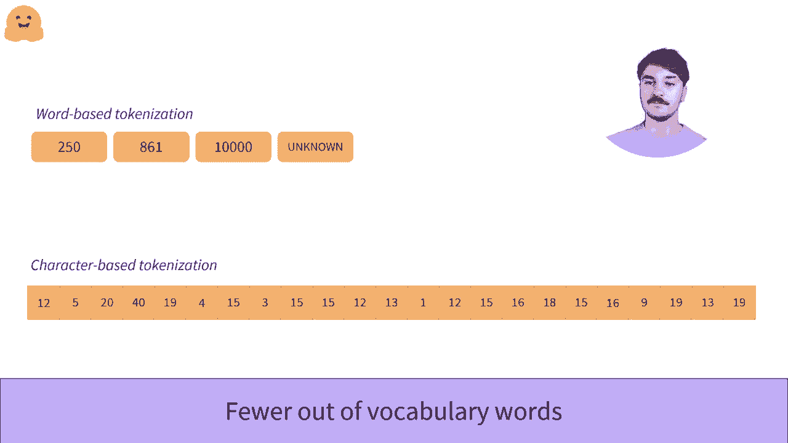

# 官方教程来啦！5位 Hugging Face 工程师带你了解 Transformers 原理细节及NLP任务应用！P14：L2.7- 基于字符的分词器 

在深入了解基于字符的分词之前，理解这种分词的有趣之处需要了解基于词的分词的缺陷。如果你还没有看到关于基于词的组织的第一部视频，建议你在观看这个视频之前先去看看。😊好的，让我们看看基于字符的分词。😊

我们现在将文本拆分为单个字符而不是单词。😊一般来说，有很多不同的单词和语言，而字符的数量相对较少。首先，让我们看看英语。它估计有170,000个不同的单词，因此我们需要一个非常大的词汇来涵盖所有单词。😊

在基于字符的词汇中，我们只需256个字符即可，这包括字母、数字和特殊字符。即使是字符众多的语言，如汉语，也可以拥有多达20,000个不同字符的字典，但不同的单词超过375,000个。

所以基于字符的词汇让我们使用比基于词的分词字典更少的不同令牌。😊这些词汇也比它们的基于词的词汇更完整，因为我们的词汇包含了语言中使用的所有字符，甚至在分词器训练期间未见过的单词仍然可以被分词。

所以我们的词汇令牌会更少出现。😊这包括正确标记拼写错误的单词的能力，而不是立即将其视为未知。😊然而，这个算法也并不完美。😊直观地说，字符单独所承载的信息不如一个单词所承载的信息多。😊例如，让我们持有比其首个数据L更多的信息。当然，这并不适用于所有语言。

因为一些语言（如表意文字语言）在单个字符中承载了很多信息。😊但对于像罗马字母这样的语言，模型必须同时理解多个令牌才能获取原本在单词中承载的信息。

这导致了基于字符的分词器的另一个问题。它们的序列被转换为大量的令牌供模型处理。这可能会影响模型携带的上下文大小，并减少我们可以用作模型输入的文本大小，这通常是有限的。😊

这个组织虽然有一些问题，但在过去取得了一些非常好的结果。因此，在面对新问题时，应考虑它，因为它解决了基于词的算法中遇到的问题。

嗯。
