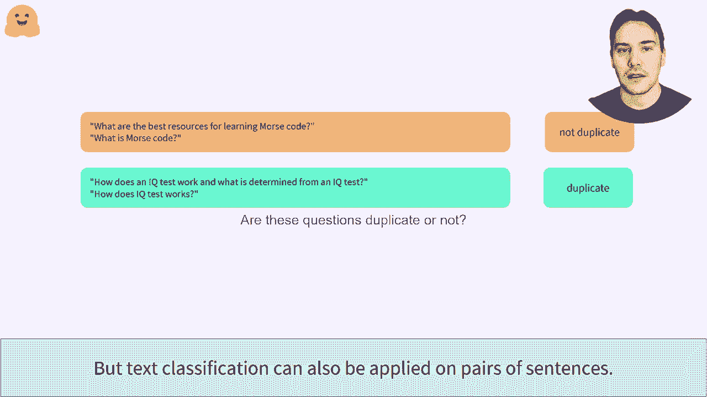
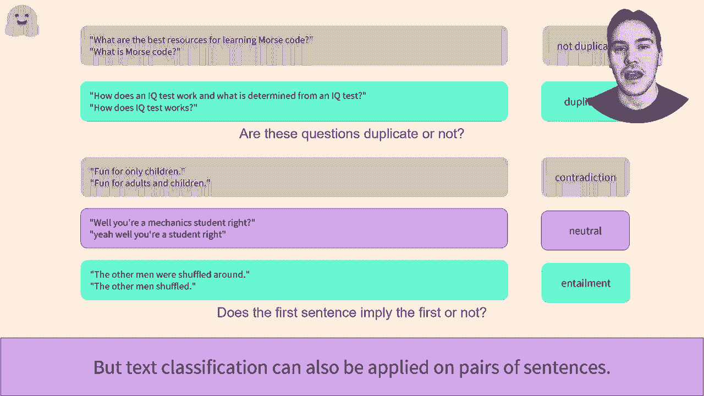
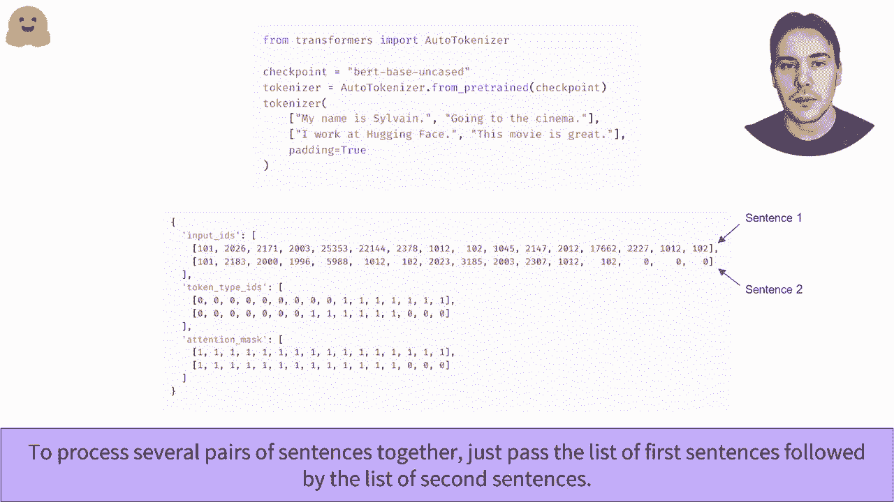
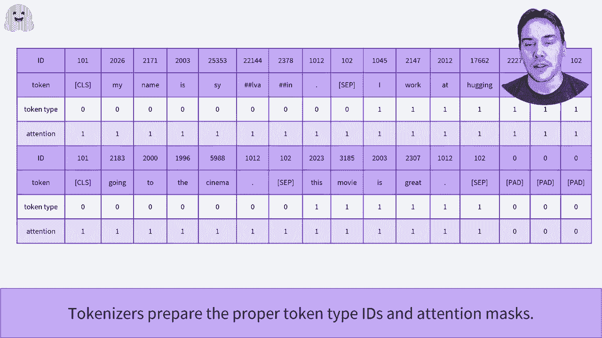
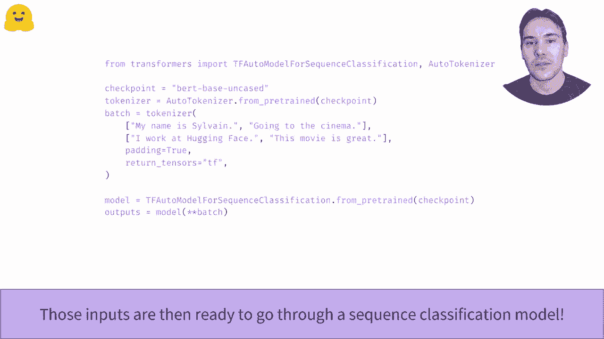

# 官方教程来啦！5位 Hugging Face 工程师带你了解 Transformers 原理细节及NLP任务应用！P25：L4.2- 预处理句对数据集(TensorFlow) 

如何处理句子对？我们看到将单个句子进行归类并在批量输入视频中一起批量处理。如果这段代码对你来说不熟悉，一定要再看一遍视频。这里我们将专注于分类句子对的任务。例如，我们可能想要澄清两个文本是否是短语。

这是来自Q问题P状态Det的一个示例，专注于识别重复问题。在第一个对中，这两个问题是重复的，在第二个面板中。

词分类问题是当我们想知道两个句子在逻辑上是否相关。一个名为自然语言推理（natural language inference，NI）的程序。在这个例子中，取自多分析数据集，判断每对句子是否符合可能的标签：矛盾、无关或蕴涵，这是一种 fancy 的说法，表示第一个句子暗示第二个句子。

因此，分类句子对是一个值得研究的问题。实际上，在小组基准测试中，这是一个学术性文本分类基准，10个数据集中的8个集中在使用句子对的任务上。这就是为什么像Pert这样的模型通常呈现出双重目标。

在作为语言建模目标的顶层，它们通常在句子拼写方面有一个目标。例如，在对比过程中，B会被展示一对句子，并必须预测随机新掩码的值，以及第二个句子是否从第一个句子推导而来。幸运的是，取自Toms库作为ICPI来处理句子对。

你只需将它们作为两个参数传递给分词器。而作为输入的 top 和我们已经研究过的注意力掩码，它会返回一个名为 token type ID 的新字段，告诉模型哪些 token 属于第一个句子，哪些属于第二个句子？在这里稍微看看输入 ID 如何与我们对应的 token type ID 对齐。

以及注意力掩码。我们可以看到分词器还添加了特殊 tokens，所以我们有 CS token，从第一个句子的 su tokens，一个步骤 token，来自第二个句子的 token，以及最后的步骤 token。如果我们有多个句子对，可以通过传递第一个句子列表和第二个句子列表将它们一起处理。

同时，关键词参数我们已经研究过，比如填充等于。

放大后，我们可以看到分词器如何为特定的句子对添加填充，使两个输出系统长度一致。它还恰当地处理了AD Ds和关注机制，以适应这两个句子。

这就已经可以从模型中传递出去。

。是的。
