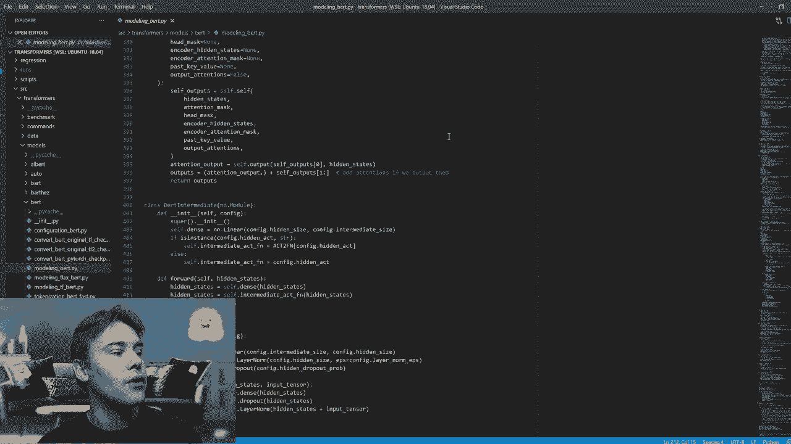
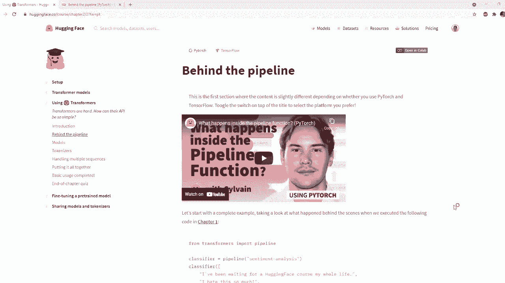
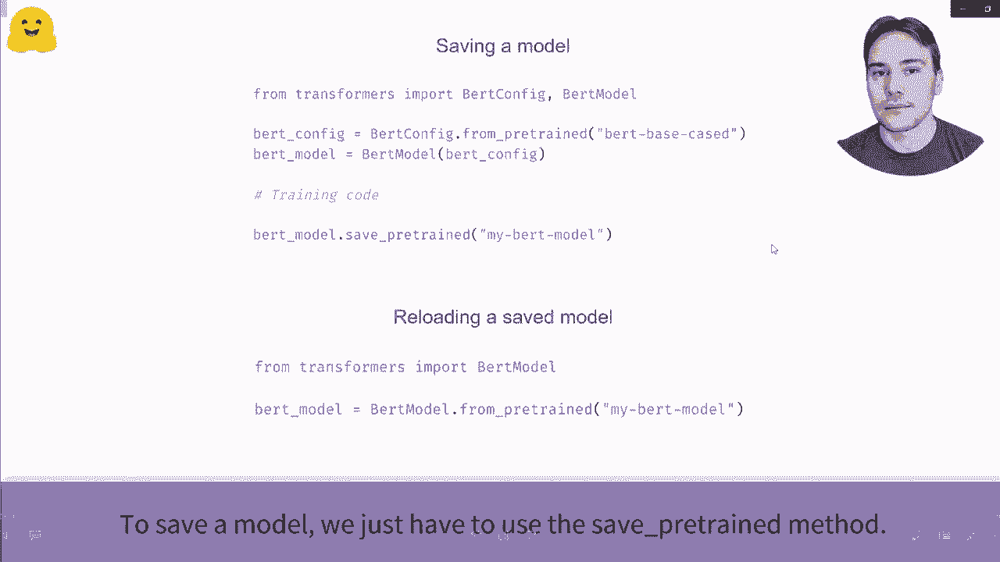
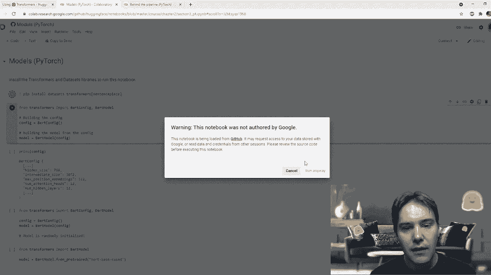
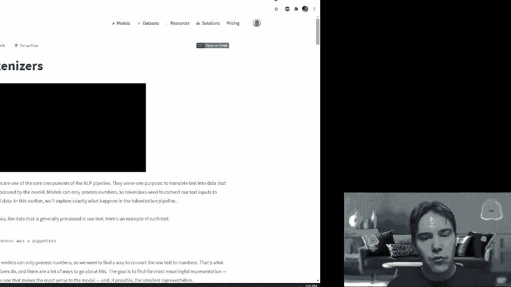
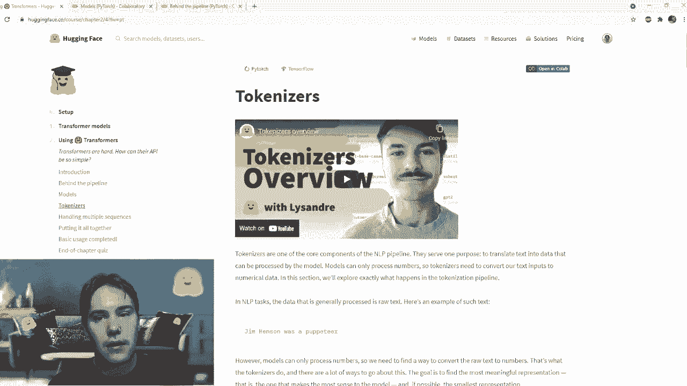
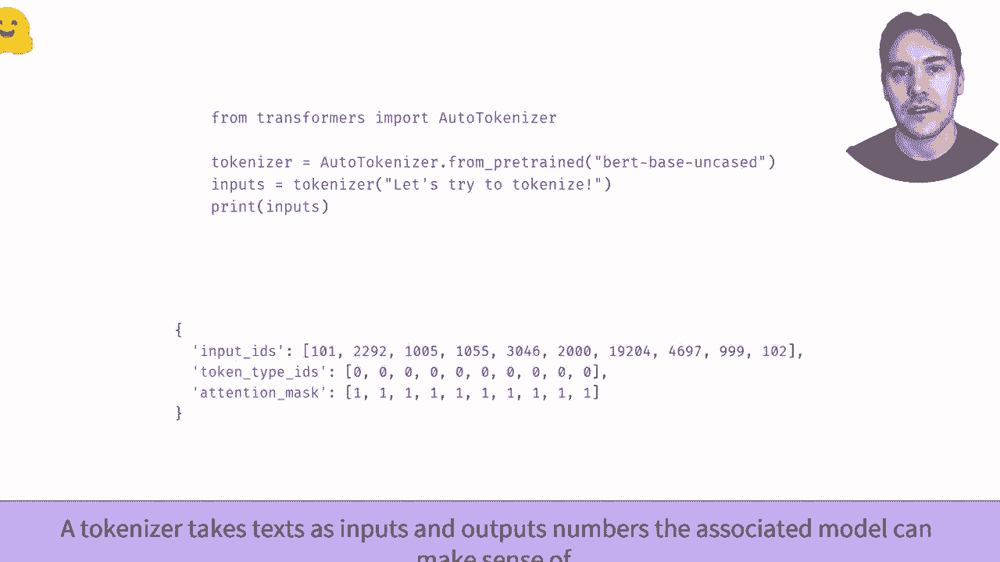
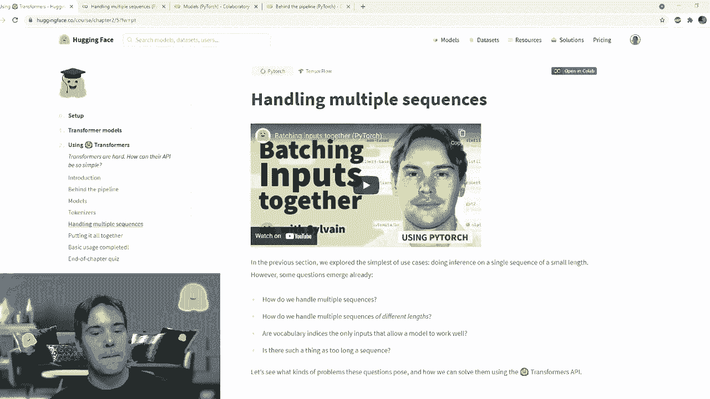

# 官方教程来啦！5位 Hugging Face 工程师带你了解 Transformers 原理细节及NLP任务应用！P35：L6.3- Sylvain的在线直播讲解 

是的，欢迎来到直播环节，我们将讨论本课程的第二章。我和聊天中的路易斯一起，他会比我更快回答你的所有问题，不要犹豫，尽量问出你的问题，因为我会在直播中阅读并回答它们，这也是跟随这个直播而不是自己观看课程的主要优势。

在第二章中，我们将详细查看在第一章中用于所有 NLP 任务的管道对象。我们将确切了解它是如何工作的，如何加载模型，如何使用分词器预处理输入，以及如何处理输出以获取我们在第一章中得到的预测和概率。因此，我们将观看一些视频，回答你所有的问题，并且我们会比第一章进行更多的现场编码。

因为第一章只是一个总体介绍，第二章包含了更多的代码。所以作为一个介绍，正如你所知，Hugging Face 主要以其 Transformers 库而闻名。这是一个包含众多变换模型的库，它提供了一个简单的 API 来下载预训练模型并使用不同的架构。

我认为现在库中可用的架构超过60个。它全部暴露了统一的 API，并提供了一个 torch 模块或大量的 Flu Care 模型，供你自行使用或通过库提供的 API 进行训练。目标是实现灵活性和简单性，库中没有任何抽象。

这不是一个由构建模块组成的库，每个模型、我提到的60个架构中的每一个都是在自己的建模文件中完全定义的。因此我们可以快速查看建模 B 文件，它也包含库内鸟模型的代码。如果你查看输入，你会发现只是一些 torch 导入，然后是它使用的一些内部类，但我们在所有模型中共享的主要是我们使用的输出类型。我们稍后会确切看到输出，但没有其他输入，像重用的注意力模块对于 B 模型的注意力块是在这个建模文件内部定义的，所以我们有 B 构建，你有 B 自注意力等等。

等等！

这个想法是，如果你想玩弄模型并修改模型内部的代码行，你不需要学习50个不同的文件。并不是要进行多重继承，每一层都要继承，我突然意识到我隐藏了一些东西，看来我只是要更快地滚动。你在建模带文件中拥有所有内容，可以随意玩弄和修改，如果你想实验的话。

这正是transformers库的一个优势，我们的用户表示这个功能非常准确。

这就是我想简要展示给你的原因。所以，是的，我们将看看管道API如何加载B模型。实际上，这是我们在第一章中使用的数字B模型及相应的分词器。并且如何手动执行这个管道函数所做的一切，以便你可以在自己的任务中调整这些步骤。

所以让我们开始第一部分，以及我们要观看的第一段视频，这段介绍视频将展示管道背后发生的事情。我不会直接从YouTube播放，因为这会使直播变得很复杂，我已经拥有所有视频。如果你给我一分钟时间。

我要提取它。

从我的电脑播放。

是的，管道函数内部发生了什么？在这个视频中，我们将看看使用transformers库的管道函数时实际上发生了什么。现在具体来说，我们将查看情感分析管道，然后我们将从以下两个句子获得相应的正面和负面标签及其分数。正如我们在管道演示中看到的，管道有三个阶段。首先。

我们将重写表达式转换为模型可以使用的数字，并通过分词器进行处理。然后，这些数字经过模型，输出大量内容。最后，最佳处理步骤将这些代表转化为标签和分数。让我们详细了解这三个步骤，以及如何使用Transform库复制它们。

从第一阶段的分词开始。这个处理过程有几个步骤，首先，文本被拆分成称为令牌的小块。它们可以是单词、单词的一部分或标点符号，然后分词器将添加一些模型所期望的特殊令牌。在这里，中间使用的模型在句子开始时期望一个CLS令牌，在句子结束时期望一个S令牌，以进行分类。

最后，令牌将每个令牌映射到专业模型词汇中的唯一ID。要加载分词器，transformers库提供了autotokenizer API。这个类中最重要的方法是from Pretrained，它会下载并缓存与给定检查点相关的配置和词汇。

在这里，补充分析管道默认使用的检查点是 distillbel baseline case5 tune SS2 English。这有点拗口。我们将实例化为 token，作为一个检查点，并将其输入到两个句子中。由于这两个句子大小不同，我们需要对较小的句子进行填充，以便构建一个数组。

这是通过将 padding 选项设置为 true 的 tokenizer 完成的。通过将 truncation 设置为 true，我们确保任何超过模型最大处理能力的句子都会被截断。最后，返回张量选项允许 tokenizer 返回批处理张量。最终结果显示，我们得到了一个包含两个键的字典，input ID 包含两个句子的 ID，并在填充应用的地方用零替代。

第二个关键注意力掩码指示了应用了填充的位置，以便模型不关注它。这始终是在 token 步骤内部。现在让我们来看第二步。这有点不明白。至于 tokenizer，或者说是一个基于预训练方法的 nottomod API，它将下载并缓存模型的配置以及预训练权重。

然而，autotomodl API 只会实例化模型的主体部分，也就是移除预训练头后的模型部分。它将输出一个高维张量，即句子的过去表示，但这对于分类问题并不直接有用。在这里，张量包含两个句子。

每个 16 个 tokens，最后一个维度是我们模型的输入大小，768。要获取与我们的分类问题相关的输出链接，我们需要使用用于序列分类的 Automodal 类。它的工作方式与 zero 到模型类完全相同，只是构建了一个带有分类头的模型。😊

在 transformformers 库中为每个常见的 NLP 任务表扬一个自动类。在这里，在给我们的模型两个句子后，我们得到了一个大小为 2x2 的张量，每个句子和每个可能的级别都有一个结果。这些输出尚未是概率，我们可以看到它们的总和不为一。这是因为 transformformers 库中的每个模型返回的是 logits。

为了理解这些 logits，我们需要深入分析管道处理的第三步和最后一步。为了将 logits 转换为概率，我们需要对它们应用 softmax 层。正如我们所看到的，这将它们转变为正数，总和为 1。最后一步是确定哪些对应于正标签或负标签。

这是由模型冲突的 ID2lipal 字段给出的。第一个概率是索引 0，代表负级别，第二个索引 1 代表正级别。这就是我们的分类器如何通过管道函数与标签结合并计算这些分数。😊 现在你知道每一步是如何运作的，你可以轻松调整它们以满足你的需求。

嗯。

是的。

嗯，对。哎呀。回来了。嗯。我觉得摄像头出了点问题。让我再检查一下。好的，我的头不见了。我不知道为什么。如果你能看到，请在聊天中告诉我。与此同时，有一个问题。来自“从激活导入 act 到 function”中的三重符号表示什么，在这些 PY 文件中展示？

很好的问题，这在构建包时是标准的 Python。在 Python 中，你尝试导入东西时，有几个层级。这是因为 transformer 仓库的结构。让我试着拉回去，退出我的 VS Code。

但是。好的，我们来了。所以你有一个 transformers 文件夹，然后里面是 transformer models，你有一个模型子文件夹，然后是 bird 子文件夹，模型文件就在这里。由于我们将代码组织成这样，以避免所有文件直接放在 transformers 文件夹中，因为正如我所说，我们有大约 60 种不同的架构。

所以这些文件的组织方式是这样的，当你尝试导入时，使用“from dot”是为了回到结构内部。因此，从“import blah blah blah”会在 bird 文件夹中，位于模型文件夹中，然后再返回到 transformers 文件夹。

所以这只是一种回到帖子目录根目录的方式。嗯。我没有看到任何问题，但在聊天中随时提问，我会尽力回答。而且正如我预期的，我的摄像头不再显示，我也不知道为什么。

我刚才看了这个视频，但它没有工作。让我尝试一下。这里我们来了，抱歉，刚刚把摄像头关掉再重启。所以我们可以继续讨论管道函数背后的表达式，我们将稍微查看一下视频中正在做的代码。我不会从代码部分展示，但请记住，在大多数部分，所有部分都有一个开放的按钮在顶部，就像这个，我稍早打开过，以执行第一个单元，安装所有内容，这可能需要一点时间，然后第二个单元是下载模型，我已经执行过了，所以我们这里有结果，我们准备查看笔记本的其余部分。就像在视频中一样，让我把自己移到屏幕的另一侧，因为代码。

大部分内容在左侧。所以像视频中一样，我们都准确查看了在对两句话使用情感分析管道时执行的代码。看看我们如何得到这些标签的结果。正如我们在视频中看到的。

第一步，预处理由令牌器完成，所以我们稍后将详细查看令牌，但你只需知道令牌器处理输入文本。这两句话是“我等着你面对我自己的生活”，我编辑了很多，它将这两句话转换成数字，因为模型不理解文本，它理解数字。所以在幕后，它将文本拆分成我们称之为令牌的小块，然后令牌器将每个令牌与一个唯一ID关联，这些数字就是我们将要看到的。

要加载令牌器，我们需要知道令牌器的标识符。所以这里是默认用于情感分析管道的模型标识符。然后我们只需调用autotokenize，顺序来自预训练的模型。如果你已经下载了文件，因为我执行了这个步骤，它会下载。

但是如果这是你第一次执行，它将下载令牌器的文件，特别是包含令牌与唯一ID映射的词汇表，并实例化它。一旦你有了那个目标，就可以像这样直接处理输入，将原始输入放入令牌器，我们将确切解释“spaing”和“tru”的含义。

有点不同，我们告诉它返回张量，由于我们在这里使用Pytoch，所以我们告诉它返回Pytoch张量和viPT。你也可以说TF，表示大量的张量。N表示N个数组，或者Fl表示flex，我想对于Fl，它也是N个数组。如果我们执行它，我们可以看到输出是一个字典，包含输入ID和注意力掩码，我们将在课程中稍后解释注意力掩码的含义。

在最后一个会话中，抱歉，输入的“I”是我所提到的唯一数字。所以它把文本转换成小块的petaccle令牌，每个令牌都被关联到唯一的数字。一旦我们有了这个，我们就可以作为模型使用这个输入。只要我们想回顾一下，为什么你要烦我，如果我们想回顾一下这些与一开始的文本是如何对应的。

我们可以使用autotokenizer的decocode方法，所以我输入tokenizer的Decode。然后，我将获取我的输入，抓取关键输入I。Ohello。D di。像这样，所以这是一个张量。我将其转换为列表。因为我在张量中有两个句子，所以这是一个列表的列表。举个例子，我只是获取第一个句子，如果我执行这个，抱歉，我可以看到我的原始文本经过了一些预处理。

现在“我”不再是大写字母了。例如，令牌器在开头和结尾添加了一些内容。这是完全合乎逻辑的，因为令牌器正在添加这些。令牌总是为令牌添加，因为模型期待它们。

在进入代码的模型部分之前，我将在这里暂停以便提问。Ututuanizer是什么意思？使用了什么类型的tokenizer？auto tokenizer类中的auto意味着你可以使用该API加载任何对应于任何架构的tokenizer。例如。

这里我们的模型是一个蒸馏鸟模型。所以tokenizer将是一个蒸馏鸟tokenizer，可以通过添加控制台进行双重检查。如果我输入tokenizer并打印输出，它会告诉我这是一个假tokenizer fast，这并不是特别有用。但表示形式不是可用的，类型应该是蒸馏鸟tokenizer fast。如果我使用了鸟checkpoint。

如果我使用了鸟tokenizer，我会有一个快速的tokenizer，不知道关于checkpoint的事。我会有一个糟糕的快速tokenizer等等。所以自动tokenizer中的U意味着该类将自动选择与使用的checkpoint对应的正确tokenizer子类。因此，你的代码这里tokenizer等于auto tokenizer，这将适用于任何checkpoint模型，只要它是transformers中实现的模型类。

而如果你在这里使用Distill B tokenizer，改变checkpoint类型时，你就需要更改使用的类。例如，如果你使用的是belt模型，你需要将其更改为鸟tokenizer；如果你使用GT2 checkpoint，则需要更改为GT2 tokenizer，等等。

我会被分解成I和M吗？答案是肯定的，我们稍后会看到一点。我将稍后更完整地推送答案，届时我们会看到不同类型的tokenizer。快速tokenizer和标准tokenizer之间有什么区别？非常好的问题。每个模型通常有两个token，一个叫慢token或突出token，另一个叫快速token。快速tokenizer基于cookingface tokenizer库，它不是用Python编写的，而是用Rust编写的。因为你可能知道，Python是一种较慢的语言，所以如果在纯Python中进行整个tokenization，当文本量非常大时，会稍显缓慢，而基于Rust的快速tokenizer则会非常快速。

主要区别在于，如果你只是处理一段文本，你不会看到任何差别，但如果你同时处理10000段文本，快速tokenizer将比Python tokenizer快得多。

这也是目前我们的问题。我将继续并查看模型。与我们有nout to kal API的方式一样，我们有一个新模型API，同样，automod API中的auto意味着这个类将选择正确的子类模型。

GT2模型、蒸馏模型等，具体取决于接收到的检查点，因此这里由于是蒸馏检查点，它会。我会放置蒸馏模型，我可以在这里给你展示。那个模型，它应该。我们可以看到这个蒸馏模型。嗯。我会删除那个单元，因为有点烦人。谢谢你。嗯。所以，那个模型。

再次说明，我们没有下载任何文件，因为当我们在一开始执行管道指令时，我们下载了所需的一切。所以模型已经被缓存。这就是为什么我们在这里看不到任何下载，以及我将要解释的警告，原因是这个automod类将给我们提供基础预训练模型。

这个空间预训练模型不输出句子的正负分类。它输出的是预训练模型的隐藏状态，维度为168。所以这里有一个警告，因为该模型的自动模型缺少分类头，正如警告所说，某些检查点的权重在初始化模型时未被使用。

特别是分类器偏置、分类器权重等，这些都是分类头的所有权重。因此，如果你只想获取预模型输出的张量或隐藏特征，Automod是有用的，但我们想将句子分类为正面或负面，因此我们需要一个带有分类头的模型，而这正是由用于序列分类的automod提供的。当我执行这个单元时，不会输出任何警告，因为所有权重都会被使用，检查点时不会出现任何问题。

如果我们将输入传递给该模型并查看形状，我们可以看到它将是一个2x2的大小。关于输出的小评论是，变换器模型的输出。那是我们在建模文件开头导入的内容。如果你还记得，我们从模型输出中进行了很多导入。

所以这些输出在名称和字典之间有点混合，因此你可以通过这样做来访问一切，即输出点logits。你也可以通过键来访问。嗯。通过问。使用键。所以，输出。当我们请求逻辑密钥时。

就像字典一样，这也能正常工作。嗯。如果我们只是请求基本表示，我们可以看到它是一个序列分类器的输出，包含Lu表和这个张量。因此这里只包含一项，但大多数变换器模型可以返回许多输出。例如，如果我在这里添加标签，它将返回损失。

我们也可以要求模型返回所有隐藏状态或所有注意力结果，这样我们的输出就变得有些冗长。这就是为什么它被组织为这种像 EDT 和一个 IMable 的规格类。所以那些合法性。因为我们得到的名称是一些看起来有些随机的数字。它们并不真正像概率，我们需要进行最后一步后处理，如视频中所示，将它们转换为概率。

这是应用 softmax。如果我们只是从 `torturer` 导入 softmax 函数板块。我们可以看到，现在得到的分数与一开始的完全相同。例如，对于第二个句子，我们得到了 0.99，即 99.95%。如果我们回顾管道的结果，可以看到我们得到了 99。

是的，确切的分数。所以要知道哪个是负面标签，哪个是正面标签。管道使用模型配置中的那个字段，因此对于每个模型，关联的配置文件可以通过配置属性访问，ID2级字段包含整数与级别之间的对应关系。那我们看看有没有问题。哎呀，第一个问题是。

使用标准 Python 有什么理由吗？

我在游戏阶段工作，所以我有点偏见，我要说不，使用快速的分词器总是更好。所以即使你没有很多文本，它的速度也至少与标准 Python 分词器相同，甚至可能更快。此外，它还有更多功能，我们将在课程的第二部分主要讨论这些功能，这些功能专门为像标记分类或问答这样的任务设计，让你知道例如。

token 来源于哪个单词，或两个 token 在原始文本中分别代表哪个文本跨度，这些功能的设计是为了克服慢速分词器的一些限制。另一个问题是，有没有类似的教程或资源用于多标签情感分析或序列的回归任务？现在没有，这是个非常好的问题，所以现在没有，我们确实应该对此进行一些工作。你需要改变的主要内容是最后的处理，而不是应用 softmax，对于回归来说，你可能不需要应用任何东西。对于多标签，每个句子可能有多个标签，你可能需要对结果应用一个 `sigmoid`。

最后一个问题是前两个输入ID，这两行是相同的，但单词不同，为什么会这样呢？我们需要回头看看解码，因为这两个词确实相同，因此这里的句子以101和101开始，这是CSO的概念。这就是为什么你有前两个输入ID相同，然后1045对应于I，因为这两个句子都以I开头，然后开始不同，因为你有两个句子的ver或8。

还有另一个问题，是否有可能做一个视频，解释库的代码结构和背后的ID，这样可能会更容易贡献？非常好的问题，实际上这已安排在课程的最后部分，在课程的一部分中，我们有一个章节将专门讨论如何为againface库贡献，特别是transformers库，然后我们将有视频解释again phase生态系统中所有库的良好结构。

再次，请不要犹豫，随时提问，我将定期提出问题来回答。所以，这就是管道背后的所有内容，我们在代码中详细看过了。现在，让我们看一下管道内的主要对象，也就是模型。所以，我们还有一个短视频，我将从我的电脑上展示，然后我们将详细查看代码，如果你有问题。

我可以回答这些问题并与你实时编程。让我先找一下视频。呃，当然，我找不到很容易，不然太简单了。为什么它消失了。还有一个是ver poormiss。我刚刚移动了它。最近。

而且。

如何实例化变换模型。在这个视频中，我们将探讨如何创建和使用来自Transformers库的模型。正如我们之前看到的，Automodal类允许你从I face应用中的任何检查点实例化一个表现模型。它会从库中选择合适的模型类以即时调整正确的架构，并加载预训练模型的权重。

正如我们所看到的，当给定一个bird检查点时，我们最终得到了一个bird模型，对于GPT2或part也是如此。在幕后，这个API可以接受U上的检查点名称，在这种情况下，它将下载并缓存配置文件以及模型权重文件。你还可以指定包含有效配置文件和模型权重文件的本地文件夹的路径。

为了实例化between模型，Automodal API将首先打开配置文件，以查看应该使用的配置类。配置类取决于模型的类型，比如B，GPPT2或Bt等。一旦有了合适的配置类，就可以实例化该配置，这是一种了解如何创建模型的蓝图。

它还使用这个配置类找到合适的模型类，当与根配置结合时加载模型。这个模型尚未是可训练模型，因为它只是用随机权重初始化的。最后一步是从模型文件中加载权重。

为了轻松从任何检查点或包含配置文件的文件夹加载模型的配置，我们可以使用自动配置类。就像自动模型类一样，它将从库中选择正确的配置类。我们也可以使用与检查点对应的特定类。

但是每次我们想尝试不同的模型架构时，都需要更改你的代码。正如我们之前所说，模型的配置是一个蓝图，包含创建模型架构所需的所有信息。例如，鸟类模型与基于出生的案例检查点相关联，具有12层，隐藏层为768，词汇表大小为28996。一旦我们添加了配置。

我们可以创建一个与检查点具有相同架构的模型，但它是随机初始化的。我们可以像任何标准模型一样，从头开始进行训练。我们还可以通过使用关键字参数更改配置的任何部分。因此，序列中的一段代码，瞬间生成一个随机初始化的B模型，层数为10，而不是12。

一旦模型的趋势稳定，保存模型非常简单。我们只需使用保存方法。在这里，模型将保存在当前工作目录中的名为“My belt model”的文件夹中。这样的模型可以通过使用从文件中加载的方法重新使用。要了解如何轻松将此模型推送到网络，请查看推送视频。

嗯。

好的，那么我们来看一下是否有任何问题，目前还没有。请随时在聊天中提问，我会定期回答。为了这个，我们打开代码应用程序，稍微看一下Automod API背后的代码。特别是，我们会看到，例如，我早些时候告诉过你，我们的模型可以返回更多的潜在结果，并且可以返回。

例如，所有的隐藏状态或类似的东西，我们将在这里看到如何做到这一点。

是的。

所以，如果你有任何问题，那将是非常必要的，因为我没有提前执行这个笔记本。因此，我们需要等它安装所有内容。好的，我不这样认为。嗯。所以，要创建一个看起来与之前模型完全相同的随机模型，我们只需实例化默认配置，并在模型中使用该配置。

就像我们在视频中看到的，配置包含许多与模型内部发生的事情相关的字段。例如，我们有配置好的隐藏层大小，我们有模型可以接受的单词数量，还有词汇表大小。模型类型，构建时使用的激活函数是Kiu，等等。嗯。所以，这个模型。

使用随机配置时，配置将被随机初始化，并且那里没有任何下载。如果我们想使用预训练模型，我们必须使用 `from pretrained` 方法。这将下载确切的配置和模型权重，正如我们在视频中看到的，它将首先使用配置来实例化一个随机初始化的模型，然后从我们拥有的那个检查点加载权重。

如果我们想要更改任何内容。更具体地说是在其配置中。我们可以在多个地方说出来。例如，我们可以从一个配置开始。呃。这个配置与鸟类完全相同。我们要从预训练的B `pesquiist`中获取，这个配置会下载，而且这里已经下载过了。

你是说 `two configurefig` 没有定义。哦，是的，我只使用了B配置。那我们继续这个。所以，B从 `between` 来的配置，将会重用这里下载的配置。这是每个模型的配置。如果我们想更改其中的任何内容，我们在视频中看到了，例如。

更改某些隐藏层的数量。但假设我想更改我希望我的模型返回所有隐藏状态的事实。我会用 `outputs` 的 `states` 等于某个值来实现。所以我可以在配置中做到这一点，然后用 `model` 等于 `bad model config` 来实例化我的模型。当我执行从 `betweentrained` 这里的模型时，我也可以直接更改这个。

因为如果我在这里更改隐藏层的数量，它将不再有效。命令会失败，因为我试图加载一个定义了12层的检查点，而模型只有10层。所以`bytoch`可能会工作，但我会收到警告，提示未使用的宽度，模型可能不会得到非常有用的结果。不过对于像 `outputed in states` 这样不真正改变预训练模型方式的内容，这将非常有效。

如果我尝试输入一些内容。那我们先定义一些随机输入，然后传递给分词器。我要使用部分分词器，然后用一个形式的 `betweentrain` 方法实例化它。嗯，应该是这里在找到它。应该执行先前的那个。

我不需要放置之前看到的填充和位置，因为这里只有一句话。我稍早一点会解释原因。所以一旦我完成了这一步，我就可以查看我的输出。现在应该有两个键。仍然是一个键。是的，多出了一点，因为鸟模型在luggit顶部有一个输出，但哦，不再是luets了，抱歉，隐藏状态更少，因为这不是分类模型，而是我使用的基础模型。我使用的是be模型，这与使用automod不一样，不是用于第二次分类的be模型，所以我得到的是最后的隐藏状态，而不是看键，puller输出是特定于B的，所以它总是这样，然后我可以说有一个最后的键，包含隐藏状态和与我的模型的所有隐藏状态对应的结果列表，这就是如何在创建配置时实时更改模型配置的方式，如果你尝试初始化一个随机初始化的模型，或者使用预训练的版本，如果你尝试使用。

特别是如果你使用的是分类模型，例如序列分类模型，你可以指定最重要的参数，即nu levels。因为当你添加分类头时，你想控制这个分类头有多少个输出。所以你可以通过new labels参数来实现。这样模型。

一旦你完成了训练或微调你的模型，你可以使用safe pretrain将其保存在你的硬盘上，并且你可以使用Pushtb。我们今天刚发布的实际上。所以在你的模型上直接上传到Higing face hub，以便全世界的人都可以使用它。如果还有其他问题，欢迎随时提问。

我会定期回答这些问题。这就是我们所需要的。关于模型的各种交叉点，然后我们来看一下负责处理输入的标记器，我将移动自己，哦，不要看屏幕。

回来吧。我要移动自己。回到左边。因为。我们。我们看看这里这一部分，并看看代码应用中的代码。嗯。所以标记器。哦，是的，我们先看一下带有标记的视频，然后我会评论这一部分发生的所有事情。这可以作为介绍视频。

是的。在接下来的几分钟里，我们将查看标记。😊 在自然语言处理领域，我们处理的大多数数据都是原始文本；然而，机器学习模型无法以原始形式读取或理解文本。它们只能处理数字。因此，标记器的目标是将文本转换为数字。

有几种可能的方法来进行此转换，目标是找到最有意义的表示。😊 我们将查看三种不同的组织算法，逐一比较，因此我们建议你按以下顺序查看视频，首先是基于单词的。

接下来是基于字符的，最后是基于子词的。

是的。所以我们不会看视频。实际上，我们将直接查看课程中的文本，我会进行评论，因为我们没有时间观看所有这些幻灯片中的视频。所以基于单词的标记器，你可以在闲暇时观看视频，但我们将更深入地解释我要做的事情。基于单词的标记器只是将你的句子按单词分割，因此最简单的方法是取所有空格，然后按这些空格拆分文本，更高级的方式是包括一些墙壁来分割和标点符号，例如感叹号将其从标记化中分离，或者在这里我们将其分割为“let”和“aworth”。

我们可以在这个例子中看到“Chi”和“Sun weather Preter”，它被分成了五个单词。所以基于单词的组织者是。之前在变换器中使用得很多，主要的优点是。你自然地将文本拆分成空格和标点，缺点是你最终会有相当大的词汇量，因为英语中有很多不同的单词，每次有人在某个单词中打错字，你就会在词汇表中增加一个新单词。

因此，每个单词从0开始分配一个ID，直到词汇表的大小，然后由于我们不能保证用户永远不会犯错，因此有一个特殊规则，如果我们遇到一个在词汇表中不存在的标记。

它通常被称为未知标记来替代，通常看起来像这样，并在括号中。因此，这是基于单词的标记器的另一个缺点，第一个是我们有非常大的词汇量，第二个是我们需要学习“Do”和“Dos”这两个单词非常相似。

他们不知道从头开始，因为模型是随机初始化的。它将有一组针对那个单词“dos”的约束，还有另一组针对“dogss”的约束，并且它需要通过看到大量数据来学习这两个词看起来有点相似。

最后一个缺点是Ung token，所以每个单词最终都会这样，更多的是在你的表示中学习。它的意思是，如果你删除句子中的某个单词会怎样。另一种方式是按所有字符来分割文本，这就是字符最佳组织的方式。在这种情况下，你的词汇量不会很大，因为只有256个字符。例如，如果你处理更大的词汇。

但你不会得到一个模型，其词汇量达到300,000或类似的数量。因此，这对于词汇量更好，你可能不会得到未知的token，因为你会看到所有可能的不同字符。但缺点是，现在表示基于字符，因此模型必须适应这一点。

例如，字母E在字母T之间的含义与字母E在字母K和N旁边的“组织”中的含义不同。因此，每个字母的表示意义较弱，这就是我想表达的。

与我们所拥有的相比，我们的工作有了进展。整体的缺点是句子变得非常长。例如，基于词的分词法将其分为五个词，而基于字符的分词法则分得更多，通常在15到20之间。

假设我们最终得到更长的句子，而我们的变换模型通常受到最大长度的限制。例如，构建的模型一次只能处理512个token。因此，使用基于字符的分词算法将确保最大句子长度相对较短。这就是为什么变换技术通常在基于词和基于字符的分词之间找到折衷。

这是tokenization。子组织，如其名称所示，会将你的文本拆分成子词，因此仍然在词之间拆分。但是某些词会被拆分，例如这里的lets do，然后token和Iization被分开。注意到你得到了小写的和。像动物在英语中会这样说。

但在较小和较大的符号之间有个特殊的符号斜杠W，表示这是一个单词的结尾。因此，token没有这个，因为我们希望模型能够区分单个单词的token和后面跟着其他东西的token，例如tokenization。所以Iization作为特定的表示，在其他单词中token并没有。

这取决于分词器使用的约定。有些token在单词的开头，有些则在单词的末尾。因此，这种方法允许你拥有一个不会太庞大的词汇，同时仍能保持某种语义上的意义，超过单纯的字符。

最后一点是，对于基于世界的令牌，例如，Doug和dogs。这两个单词应该被分开，Do和dogs可能会被拆分为Do和nest。令牌化的方式与token和Iization之间的分割类似，因此它可以学习它们具有相同的前缀，然后sization将在另一个词中使用，如modernization。模型可以理解后缀，并学习它们总是某种相同的。

在课程的下一部分，我们将详细查看不同的算法，因为有三种不同的子组织算法，按级别的word piece和sentence piece将在课程的下一部分中准确解释它们之间的差异。

在我们看看令牌器在实践中的工作之前，让我们看看是否有任何问题。是的。我只是想好好把自己放在这里。令牌器将句子分解为令牌，但在学习之前不会进行词形还原或stemming。嗯。你知道。是的。让我们不扯淡。我会说没有，但你应该向那些比我更有能力的人提问，因为我不完全确定。

你能提供关于word piece和sentence piece类型的直观理解吗？我可以。但这会花一点时间，所以我再次会引导你去那个可以让我好好回答你的地方，或许Louisis可以在这里分享他的tokenizer总结，以及在变换文档中解释word piece和sentence piece之间区别的内容，后者在后台使用Uniigram，二者之间的关键区别。

W slash W标签在子令牌化中添加了任何信息吗？是的。正如我所说的，这使得所有人都知道单个单词之间的区别，例如token作为单个单词或token在一个单词内部，如tokenization或tokenizer。

然后让我们看看令牌器在实践中的工作。呃。因此我们已经看到使用form预训练方法加载令牌器。它返回的内容是什么。现在我们将快速查看有关令牌化管道的视频，它将解释当我们像这样输入令牌序列时发生了什么，以及它如何返回那些数字。

让我从我的电脑上抓取一下，然后我将继续回答问题。嗯。因此，这是一个不错的管道。在这个视频中，我们将看看令牌器如何将文本转换为变换模型可以理解的数字。例如，当我们执行这个时。这里是令牌器对象内部发生的事情的快速概述。首先，文本被拆分成tuets，通常是单词、单词的一部分或标点符号。

然后tokenizer添加潜在的特殊token并将每个token转换为我们独特的相应ID，正如tokenizer的词汇所定义的。正如我们将看到的，这个过程并不是严格按照这个顺序进行的，但这样做更有利于理解。第一步是将我们的输入文本拆分成tokens，我们为此使用tokenized方法。

为此，tokenizer可能首先执行一些操作，比如小写或单词，然后遵循一套规则将结果拆分成小块文本。大多数可转换模型使用单词组织算法。这意味着一个给定的单词可以被拆分成几个tokens，像这里的tokens一样。

请查看下面链接的Tokenization算法视频以获取更多信息。我们在“I”前看到的ash ash前缀是鸟类用来指示该token不是单词开头的惯例。其他组织可能使用不同的惯例。举例来说，阿尔伯特tokenizers会在所有前面有空格的token前加一个长的结束分数。

这是一个所有基于句子的tors共享的惯例。tokenization管道的第二步是将这些token映射到相应的ID，正如tokenizer的词汇所定义的。这就是为什么当我们用form pre方法即时调用tokenizer时需要下载文件。我们必须确保使用与模型展现时相同的映射。为此。

我们使用converttugans到IDs的方法。你可能注意到我们与第一张幻灯片的结果不完全相同。或者说这看起来像是一串随机数字。在这种情况下，请允许我刷新你的记忆。缺失的就是开头和结尾的数字。那些是特殊的token。所以特殊token是通过适当的formalal方法添加的。

它知道token在词汇中的索引，并在输入ID列表中添加适当的数字。你可以使用decocode方法查看特殊tokens，以及更一般地查看tokenizer如何改变你的文本，借助tokenizer对象的输出。

至于单词开始部分的前缀，两个特殊token会根据你使用的tor而有所不同。所以belt tokener使用CLS，而Robertta tokener则使用类似于HTML的S和/lash S。现在你知道tokenizer是如何工作的，你可以忘记所有中间步骤，并记住必须在输入文本上调用它。

然而，decokenizer的输出不仅仅包含输入ID。要了解注意力掩码的位置，请查看batch input Together视频。要了解targettype的想法，你可以获得start视频的处理拼写。

是的。所以我们有一个问题，和我们在视频之前看到的有关，标记/ W和标记会有单独的表示ID吗？是的。我们会有单独的表示ID，因为我们不是同一个标记。正如所说的。

这整个可分割的意思是你能。对不起，具体一点。所以标记器或标记化管道，我不会实时编码，因为你实际上不应该学习它们。我们只是展示它们，以便你看到管道内部的步骤，记住的主要内容是你只需要像这样在输入上调用你的标记器，因为这是主要的E，这是最有用的。现在我们来看看什么是注意力掩码，填充和Fun意味着什么，这些都是我们在最开始时提到的参数，这样我们就可以完全解释所有标记器内部发生的事情。

哦，还有一个问题，你是否有理由保存一个项目组织者，或者说最好只是保留一个本地副本。非常好的问题。所以，是的，如果你不需要，实际上没有理由保存你的项目组织者。如果你没有对它做任何更改，并且你总是会有一个本地副本，因为自动标记器会从预训练中缓存文件，以避免你再次下载它们，因此没有理由去保存。唯一的例外是当你创建一个文件夹并希望推送到模型库时，在这种情况下，你应该将你的标记器保存在该文件夹中，这样当你推送用户时，你推送的是你的模型、配置和与之使用的标记器，我们有所有这三者。

A面网站将能够在你的模型前应用API，你将能够在线玩Wichat。除此之外，你真的不需要在标记器上使用安全预训练方法。这主要是针对将非常有用的模型，我们将在稍后接近此部分时看到。如果你从头开始训练标记器，因为你正在预训练一个模型，比如说在一种新语言中，那么你需要使用安全预训练方法来保存你的标记器结果。

所以我们将观看今天的最后一个视频，关于批处理输入的现场会议，然后我们将更仔细地看一下好的部分。让我先启动协作工具，这样我们就不用在视频之后等待，然后我们一起观看视频。

嗯。来吧。某些事情。是的，我想运行它。让我抓取视频、打补丁并整理在一起。

嗯。是的。在这个视频中，如何将输入一起批处理，我们将看到如何将输入序列批处理在一起。一般来说，我们希望通过模型传递的所有句子不会都是相同的长度。这里我们使用的是我们在情感分析管道中看到的模型，并希望对两个句子进行分类。当对它们进行标记化并将每个标记映射到其对应的输入时。

我们得到两个不同长度的列表。从这两个列表创建一个张量或新的数组将导致错误，因为所有数组和张量应是规则的。克服此限制的一种方法是通过添加特殊标记使第二个句子的长度与第一个句子相同，直到需要的次数。

另一种方法是将第一个序列截断到第二个的长度。但这样我们将失去许多可能对正确分类句子至关重要的信息。一般来说，我们只在句子超过模型能够处理的最大长度时才会截断句子。用于填充的值不应随意选择。

模型已经被描绘为具有特定的填充 ID，你可以在 tokenizer 中找到。现在我们有了更好的句子，我们可以用它们创建一个批次。如果我们单独将两个句子传递给模型并合并在一起，我们会注意到，对于填充的句子，即第二个句子，我们没有得到相同的结果，这是 transformer 库中的一个错误。如果你记得，transformers 会轻松使用注意力层。

这不应让人感到完全意外。当计算每个标记的上下文表示时，注意力层会查看句子中的所有其他单词。如果你只有一个句子或句子与填充标记，每个逻辑标记都不会获得相同的值。要获得相同的结果，无论是否有填充。

我们需要向注意力层指示忽略那些填充标记。这是通过创建一个注意力掩码完成的，该掩码与输入 ID 具有相同的形状，包含零和一。一旦指示了注意力层应考虑的标记，以及应忽略的标记。现在，将此注意力掩码与输入 ID 一起传递将给我们与单独将两个句子发送给模型时相同的结果。

这一切都是由 tokenizer 在后台完成的，当你将几个句子应用于标志填充等于真时。它会为较小的句子应用适当的填充值，并创建适当的注意力掩码。

。所以，让我们。看看在协作中的相同内容。有什么问题请问。没有，我没有看到任何问题。请随时在聊天中再次提出你的问题。接下来，让我们再次看看我们需要关注的代码，具体来说是什么填充和注意力掩码。正如我们在视频中看到的，如果我们尝试。直接应用我们的模型。

哦，不，它并没有像视频中那样精确。如果我们直接在一个被识别并转换为 ID 的句子上应用我们的模型，使用与前一个视频相同的代码，它会失败，因为模型想要输入的批次。因此，实际上即使你只有一个句子，tokenizer 也会添加一个维度。

你可以看到有两个括号包围着这个，所以这里是一个形状为1乘60的张量。如果你想将手动处理的单个句子传递给模型，你需要增加一个维度，例如，在这里添加一对括号。这是一个单独的示例，现在来看两个句子一起，所以如果我们有两个列表。

假设我们同时有id和ID，并且想要形成一对句子。我们可以创建一个列表的列表，但不能创建一个包含这两个句子的数组，因为它们的形状不一致。所以我们需要添加一个填充索引，这样我们就可以在开头隐藏它。大多数Transal模型期望填充应用在右侧，ExcelNe则期望在开头。

但tokenizer应该负责应用填充，因为tokenizer知道模型需要什么，并将其应用在右侧。所以一旦你有了这些pat I，你就可以创建。对不起，从中创建源，然后传递给模型。如果我们像在视频中看到的那样查看输出。

如果我们分别传递句子，仍然需要添加括号，如果我们希望模型对它们进行处理，因为模型期望一个批次。因此，批次内部可以只有一项，但它需要是具有两个维度的东西。

因此，如果我们传递sequence1和sequence2，就会得到这两个结果；如果我们传递这两个句子的patch，第一次句子的结果是相同的，但第二句的结果不同。我们可以看到这里的Ph2有所不同，这是由于填充的上下文。如果我们不做特别处理，模型不会计算出相同的结果，它不会正确忽略填充。所以在视频中提到的就是由于注意力层，注意力层被称为transformers模型，我们在第一章详细解释过。这些层不仅计算单词的表示，还计算单词在其上下文中的表示，因为transformer模型一开始就是为翻译设计的。如果我们想翻译一个单词，就不仅需要关注那个单词，还需要关注周围的所有单词，例如了解“hard”的性别。

它是一个单一的或已知的符号之类的东西。因此，如果我们不告诉注意力层这不是一个真实的标记，而仅仅是一个影响标记，我们需要一个矩形来形成一个批次，注意力层将会关注这个标记并计算上下文表示，这样就考虑了该标记。为了告诉注意力层这不是一个真实的标记，不要关注它，我们必须创建所谓的注意力掩码，因此在这里，我们在想要注意力层关注的地方放置1，而在想要注意力层忽略的地方放置0，因此它与我们使用的批次的形状相同，而0放置在我们有标记ID的地方。

如果我们这样做并将这些传递给模型，现在我们看到我们得到了相同的输出。因此，第一个句子仍然是相同的，因为没有填充，但这里的输出与这里的输出是相同的，后者是模型处理第二个句子的输出。这就是标记器所完成的工作。

如果你还记得我们传递的两个句子，它返回了带有两个键的内容。一个是输入，它对应于这里的内容，另一个是注意力掩码，它对应于这里的内容。截断参数，因此当我们将这两个句子传递给自动模型时，正是这样。

我们说填充为真，截断为2，所以截断为真将会截断非常非常长的句子，因为对于模型来说，例如，只能处理长度最大为512的序列。因此，如果我们有一个比这更长的序列，模型将会失败，我们需要截断它。在使输入短于模型能够处理的最大长度时，不应该因为其他原因而进行截断，因为当你截断时，会丢失信息；而对于填充，我们是添加一些东西，并且可以告诉注意力层忽略它，因此最后我们得到的结果与是否填充是完全相同的。通过截断，你是在忽略信息，但你无法恢复，所以没有截断的情况下，你将永远无法得到相同的结果。

但遗憾的是，这是必要的，因为变压器有最大长度。因此，如果你有非常长的输入超过最大长度，你需要将其定位。如果我们回到课程中并查看“把所有东西放在一起”的部分，我们有各种填充策略。因此在这里。

所以如果我们回到一开始这段对话中使用的两个句子并传递它们，我们可以将它们传递给筛选器，它将输出一个列表的列表，但我们无法将它们拼接在一起而不应用填充。因此，我们有各种策略来应用填充。当我们填充为真时，它与填充为最长是一样的，都是将序列填充到你所传递的样本中的最大长度。

我们有两个序列，填充等于最长，这会将第二个句子添加到较长句子的长度。如果我们回到管道后面的笔记本，我们可以看到这里。所有这些零被添加，以确保批处理中的句子长度与第一个句子完全相同。

你还可以说填充等于最大长度，最大长度指的是模型的最大长度，所以例如，对于be或distber，它是512，因此这会将每个句子添加到模型的最大长度512。对于短句子而言，模型的采用不应被视为固定形状，通常最好是添加到你拥有的最长句子，除非出于某种原因需要使用固定形状。例如，TPU更喜欢固定形状，在这种情况下你会使用最大长度选项，尽管这有点低效，但对于TPU加速器而言是如此。

这是获得真实速度的唯一方法，因为它们需要所有输入具有完全相同的形状。你也可以指定一个你想要的最大长度，所以例如，如果你知道在你的数据集中，所有句子都短于大约28，你可以说填充等于最大长度，最大长度等于1028。因此，你还应该使用截断。

正如我们所说，因为当输入超过模型可以处理的最大长度时，你需要进行截断。你也可以指定希望截断输入的最大长度。所以关于填充就这些。我们有任何问题吗？嗯，没有问题，Lewis分享了一些小链接。所以，最后一件事是，正如我们之前看到的，你可以告诉你的标记返回bytoch张量和软流张量在整个数组上。

正如我们在其中一个视频中看到的，特别是tokenizer视频，tokenizer会在句子的开始和结束添加特殊标记。因此，这完全取决于你使用的模型，但tokenizer会知道模型期望的特殊标记，并将它们放在句子的开始和结束。为总结这一章节，这里是代码，只是缺少后处理。

但这是管道后台执行的代码。嗯。所以你导入用于序列分类的auto tokenizer和automod。auto beam意味着你可以从中心使用任何检查点。它会为你选择正确的架构。

管道使用的检查点是this1。你可以使用我们模型中心上任何对应于情感分析任务的检查点。我们可以通过betweentrain方法加载tokenizer。我们可以通过betweenttrain方法加载模型，如果我们有两个句子。

我们可以将它们与填充一起标记为equal2 con equal2，这在张量源上等于piy toch，如果我们使用py toch张量流，然后将标记传递给模型以获得加法过程的结果，这里只是缺少soft max，以便得到与管道完全相同的结果。

最后一个问题，我对你提到的最长填充和动态填充感到困惑。它们相似吗？是的，非常相似。我们将在下一章中学习动态填充的内容，但对于那些不知道它是什么的人来说，动态填充是在你遍历训练数据时进行的。

动态填充意味着每次你需要构建一个批次时，你将句子填充到该批次内的最大长度。因此，如果你传递一小批句子，填充equal longest将会创建一个包含例如八个句子的批次，第二个维度将是该批次内的最大长度。而填充equal max length则会将所有内容填充到一个固定的最大长度。

这个最大长度可以是模型所能处理的最大长度，也可以是你传递给解码器的最大长度。这就是模型和标记器的基本用法。感谢你关注这次直播，现在我们一起看完这一章后，你应该能够完成手头的问卷，然后在进入第三章之前，如果你尝试再次运行我们一起看到的批处理输入的pipeline colab，并试着理解每个单元的功能，甚至尝试自己重新做一遍，那将是很有用的。

然后尝试想一个你想要解决的分类问题，特别是文本分类问题，并尝试在该问题上使用基本模型和组织器，以便从一些输入中获得输出。我们将在下一章中实际找到适合你给定问题的模型，并在第四章中看到如何将结果上传到bundle hub，以便你能与社区其他成员分享该模型，并在线使用推理API的小部件进行演示。

关于你的模型。在我们结束这次直播之前，让我看看问题。哦，接着上一个关于填充equal whole longest的问题。我们不需要在填充时使用那个装饰器。这并不完全正确。我们将在下一章中确切地看到原因。

我们需要处于训练模型的动态中，但如果你在整个数据集上执行最长填充时进行标记化，它将增加数据集中的最长元素。所以这与动态填充并不完全相同。

不过，我们将在下一章深入探讨这个问题。谢谢大家关注这个直播，下一周在Cha 3将有四个不同的直播，因为Cha 3对于Pytch和Tensorflow非常不同，主要是关于训练和功能。到目前为止，代码有一些小差异，你可以看到这里有一个切换选项，可以在Pytch和Tensorflow之间切换，如果你想了解它们的具体区别。不过下一章将会非常不同，所以会有专门针对Pytch的直播和专门针对Tensorflow的直播，务必查看一下表格，选择你想参加的课程，并记在你的日历上。

嗯，让我们先结束这一段。非常感谢大家的到来，再见！

。

