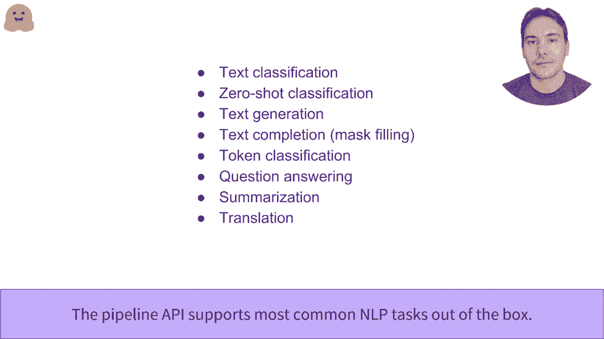

# 官方教程来啦！5位 Hugging Face 工程师带你了解Transformers原理细节及NLP任务应用！＜官方教程系列＞ - P2：L1.2- Hugging Face流水线功能 - ShowMeAI - BV1Jm4y1X7UL

它的类型是端到端功能。管道函数是Transformers库中最高级别的API。它将所有步骤聚合在一起，从输入到可用预测。我们使用的是管道的核心，但管道还包含所有必要的预处理，因为模型并不期望文本而是数字。同时还进行一些后处理，使模型的输出更易于人类理解。

让我们来看一下保罗在情感分析管道中的第一个示例。这个管道对给定的输入进行文本分类，并确定其是正面还是负面。在这里，它将正面标签归因于给定文本，置信度为95%。你可以将多个文本传递给同一个管道，这些文本将作为一个批次一起处理并传递给模型。

输出是一个与输入文本顺序相同的个体结果列表。在这里，我们发现第一个文本的标签和分数是相同的，而第二个文本的标签是负面的，置信度为99.9%。零样本分类管道是一种更通用的文本分类管道。

它允许你提供所需的标签。在这里，我们希望根据教育、政治和商业的标签对输入文本进行分类。管道成功识别出它更侧重于教育而不是其他标签，置信度为84%。接下来，我们的任务是文本生成管道，它会完成给定的提示。输出是带有一点随机性的，因此每次调用生成器对象时，生成的结果都会有所变化。

到目前为止，我们已经使用默认模型的Bplan API与每个任务相关联。但你可以将其与任何已经预训练或微调过的模型一起使用。接下来是模型H，再次是F的slash模型。你可以根据任务过滤可用模型。我们之前示例中使用的默认模型是GPT2。

但还有更多模型可用，不仅仅是英语。让我们回到下一个生成管道，并用另一个模型dist GPT2加载它。这个模型是由Hugging Face团队创建的更轻量版GPT2。在将管道应用于给定提示时，我们可以指定多个参数。

例如生成文本的最大长度，以及我们希望返回的句子数量，因为生成中存在一定的随机性。生成文本的目标是X2的推测，这是GPD2的目标。在这种情况下，我们询问模型两个最有可能的缺失单词的值。

并获得尽可能的数学或计算答案。任务转换模型的功能是对句子中的每个单词进行分类，而不是将整个句子视为一个墙壁。这方面的一个例子是命名实体识别。其任务是识别句子中的实体，如人、组织或地点。在这里，模型正确找到了人，sva。

该组织，再次面对，输入文本中的布鲁克林位置。该组实体的 equal2 参数用于将管道组合在一起，连接到同一实体的不同墙壁，例如这里的 eggging 和 face。与 byg API 相关的另一个可用任务是提取式问题和抱歉。提供上下文和问题后，模型将识别上下文中包含答案的文本跨度。

获取非常简短的摘要也是 Transers 库可以通过摘要 bike 帮助实现的事情。最后，管道 API 支持的最后一个任务是翻译。在这里，我们使用在 Mo hub 上找到的法英模型来获取输入文本的英文版本。以下是我们在本视频中探讨的所有任务的简要总结。Drave my mode。

因此，受现代中心的影响切换喷气机。

。

