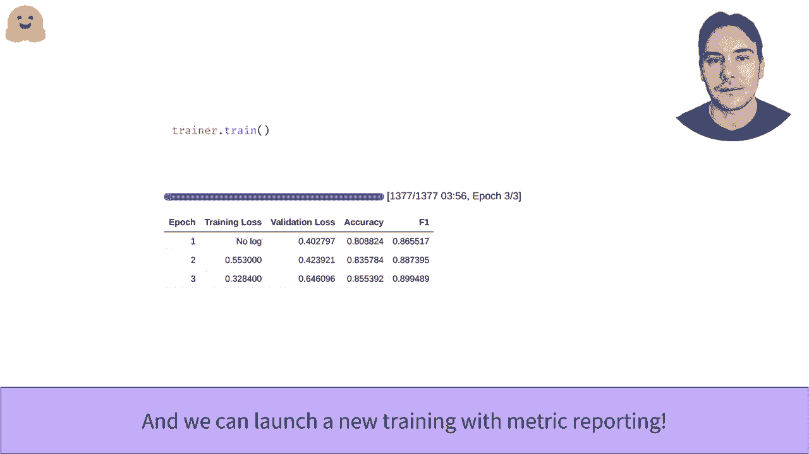

# 官方教程来啦！5位 Hugging Face 工程师带你了解Transformers原理细节及NLP任务应用！＜官方教程系列＞ - P21：L3.4-训练器Trainer API - ShowMeAI - BV1Jm4y1X7UL

Saattrino EPA。所以Transforms库提供了一个Trainer API，允许你轻松地在你的数据集上微调变换模型。因此训练你的类，确保设置你的模型，以及训练IP参数。可以在任何类型的设置上执行训练，CPU、GPU、多GPU、TUus。还可以在任何数据集上计算预测，如果你提供了矩阵。

在任何数据集上评估你的模型。只要你提供了一个分词器或给定数据处理工具，你也可以安装最终的数据处理，如动态填充。在MRRPC数据集中调用API，因为它相对较小且易于预处理。

正如我们在数据集的视频集中看到的，或者我们可以提出。你在预处理期间不应用填充，因为我们将在数据处理之前使用动态填充。请注意，我们不执行重命名、移除ins的最终步骤，或者将格式设置为torch tensils。因此，训练器将通过分析模型签名自动为我们完成所有这些。

创建训练器之前的最后一步是定义模型和一些训练参数。我们在模型API视频中看到了如何做第一步。对于第二步，我们使用训练参数类，它只需要一个文件夹路径，结果和检查点将被保存，但你也可以自定义训练器将使用的所有参数学习率。

训练次数等。创建一个训练器并启动训练非常简单。这应该显示你的进度条，如果你在GPU上运行，几分钟后你应该完成训练。然而，结果可能会让人失望，因为你只会得到一个训练类，这并不能告诉你模型表现得如何。

这是因为我们没有指定任何评估的指标。要获取这个矩阵，我们首先将使用Preic方法覆盖墙评估集上的预测。它返回一个包含三个字段预测的名称，其中包含模型预测，label Is，它包含你在那个时刻的标签，以及这里为空的矩阵。

我们正在尝试这样做。预测是模型对数据集中所有句子的预测结果，所以是一个形状为48乘以2的数组。为了将它们与我们的标签匹配，我们需要对每个预测取最大值，以知道预测的是哪两个类中的哪一个。我们用max函数来完成这个操作。然后我们可以使用数据集库中的矩阵。

它可以像加载数据集一样轻松加载，并且返回用于数据集的评估指标。我们可以看到我们的模型确实学到了一些东西，因为它的准确率为85.7%。为了在20个评估矩阵中进行监控，我们需要定义一个计算矩阵函数，但与之前的步骤相同。

需要一个名称来对标签进行预测，并且必须返回一个字典，以跟踪我们想要记录的指标。通过将周期评估策略传递给我们的训练参数，我们告诉训练器在每个周期结束时进行评估。在笔记本中启动训练将显示一个进度条，并在你通过每个周期时完成你在这里看到的表格。

。

