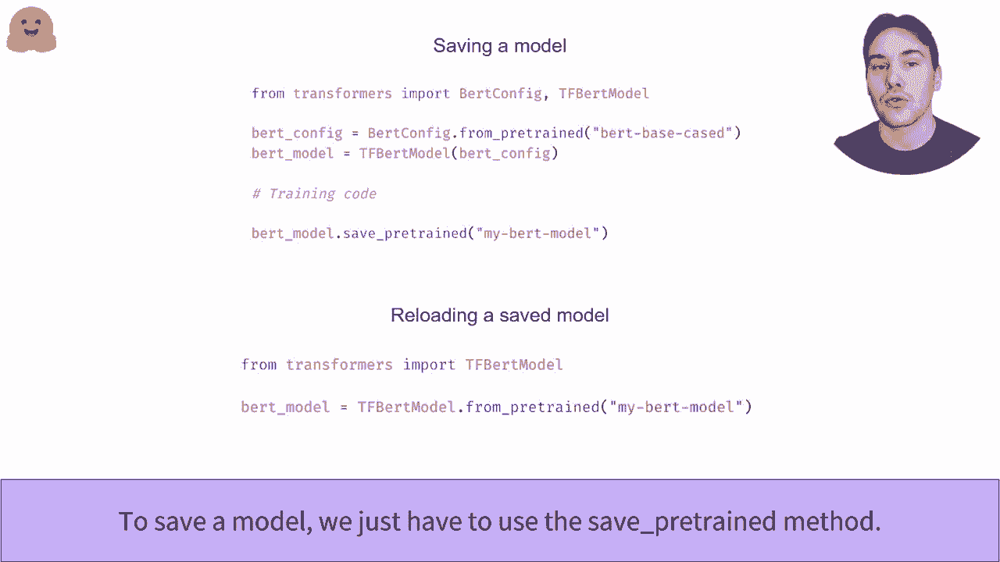

# 官方教程来啦！5位Hugging Face工程师带你了解Transformers原理细节及NLP任务应用！＜官方教程系列＞ - P11：L2.4- 实例化transformer模型(TensorFlow) - ShowMeAI - BV1Jm4y1X7UL

如何实例化下面的transformers。在这个视频中，我们将看看如何从Transforms库创建和使用模型。正如我们之前看到的，TF照片模型Gla允许你从任何检查点即时创建一个所需模型。它将从库中选择正确的模型类，以即时创建适当的架构并加载所需模型的权重。

正如我们所见，当给定一个鸟类检查点时，我们最终得到一个TF B模型，GPT2也是如此。在后台，这个API可以接受E中的检查点名称，在这种情况下，它将下载并缓存配置文件以及模型权重文件。你还可以指定一个包含有效配置文件的本地文件夹的路径。

为了即时创建预训练模型，TF Automod API将首先打开配置文件以查看应该使用的配置类。配置类取决于模型的类型，例如，GPT2或其他。一旦测试出适当的配置类，它就可以即时创建该配置，这是了解如何创建模型的蓝图。

它还使用这个配置类来找到适当的模型类，该类与加载的配置结合以加载模型。该模型尚未完成或处于模型之间，因为它刚刚用随机权重初始化。最后一步是从模型文件中加载权重。

要轻松加载来自任何检查点或包含配置文件的文件夹的模型配置，我们可以使用autoconft类。像T for tomod类一样，它从库中选择正确的配置类。我们也可以使用与检查点对应的特定类。

但我们每次想尝试不同的模型架构时都需要更改代码。正如我们之前所说，模型的配置是一个蓝图，但包含创建模型架构所需的所有信息。例如，与基于鸟类的案例检查点相关的鸟类模型有12层，隐藏层大小为768，词汇表大小为28,996。一旦我们有了配置。

我们可以创建一个具有与检查点相同架构的模型，该模型是随机初始化的。然后我们可以从头开始训练，制作任意数量的模型。我们还可以通过使用关键字参数来更改配置的任何部分。第二段代码实例化了一个具有10层而不是12层的随机初始化模型。

一旦训练完成，微调是非常简单的，你只需使用安全的假装方法。在这里，模型将保存在当前工作目录中名为My beltt model的文件夹中。这样的模型可以通过形式之间的方法重新加载。要了解如何将此模型推送到头部，请查看推送视频。

是的。
