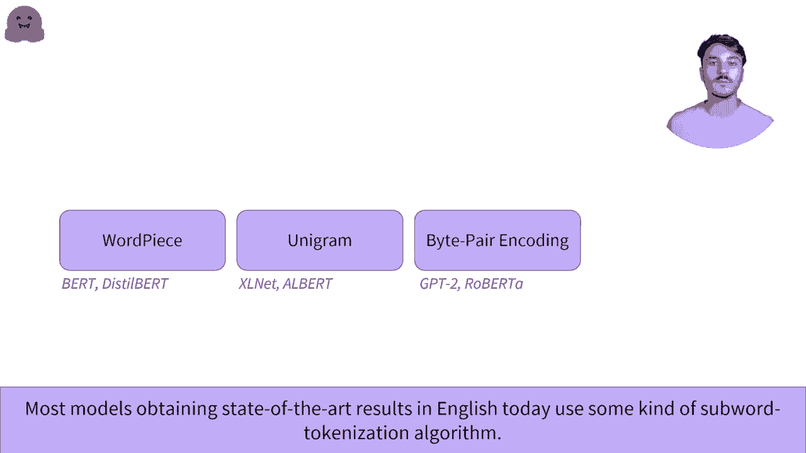

# 官方教程来啦！5位Hugging Face工程师带你了解Transformers原理细节及NLP任务应用！＜官方教程系列＞ - P15：L2.8- 基于子词的分词器 

让我们来看看基于子词的分词。理解为什么基于子词的分词有趣，需要理解基于单词和基于字符的分词的缺陷。如果你还没有看过关于基于单词和基于字符的分词的第一部视频。

我们建议您在查看此视频之前查看它们。基于子词的分词处于基于字符和基于单词的分词算法之间。其想法是在非常大的词汇量、较大量的超出词汇的标记以及在非常相似的单词之间丧失意义之间找到中间地带。

对于基于单词的标记和非常长的序列，以及基于字符的分词器的单个标记，这些算法依赖于以下原则。常用词不应被拆分成较小的子词，而稀有词应被分解成有意义的子词。一个例子是单词dog。我们希望我们的分词器为单词dog保留一个唯一的ID。

而不是将其拆分成字符DONG。然而，当遇到单词dogs时，我们希望我们的分词器理解，根本上，这仍然是单词dog，加上一个S，这稍微改变了意义，同时保持了原始想法。另一个例子是像tokenization这样复杂的词，可以拆分成有意义的子词。😊。

单词的根是token，iization完成根部，赋予其稍微不同的含义。😊，将单词拆分成两个token是合理的，将标记为单词开头的词根和标记为单词完成的附加信息的ization。

反过来，模型现在能够在不同情况下理解token。它将理解单词token、tokens、tokenizing和tokenizations具有相似的含义并且是关联的。它还将理解tokenization、modernization和immunization，这些都有相同的后缀，可能在相同的句法情况下使用。

基于子词的分词器通常有办法识别哪些标记是单词的开始，哪些标记是完成单词的。这里的token是单词的开始，hash hashization是单词的完成。这里的hash hash前缀表示iization是一个单词的一部分，而不是它的开头。😊，hash hash来自于基于单词peace算法的鸟类分词器。

其他标记使用其他前缀，可以放置在这里表示部分单词或单词的开始。有很多不同的算法可以用于基于子词的分词，而如今大多数模型在英语中取得了最先进的结果，都使用某种基于子词的分词算法。这些方法通过在不同单词之间共享信息，帮助减少词汇量。

具备将前缀和后缀理解为这样的能力。通过识别相似的标记，它们在非常相似的词汇中保持意义，构造出新词。

是的。
