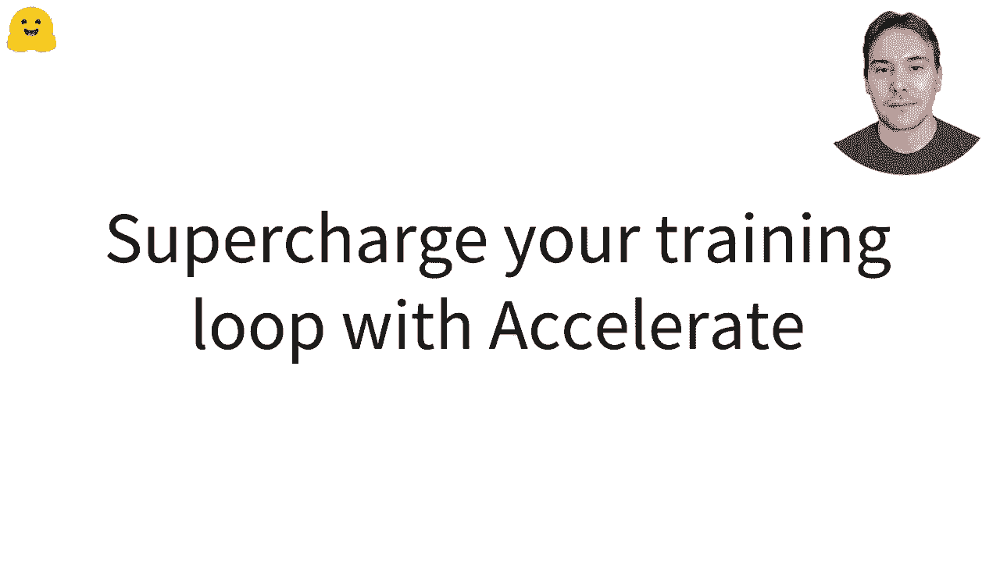
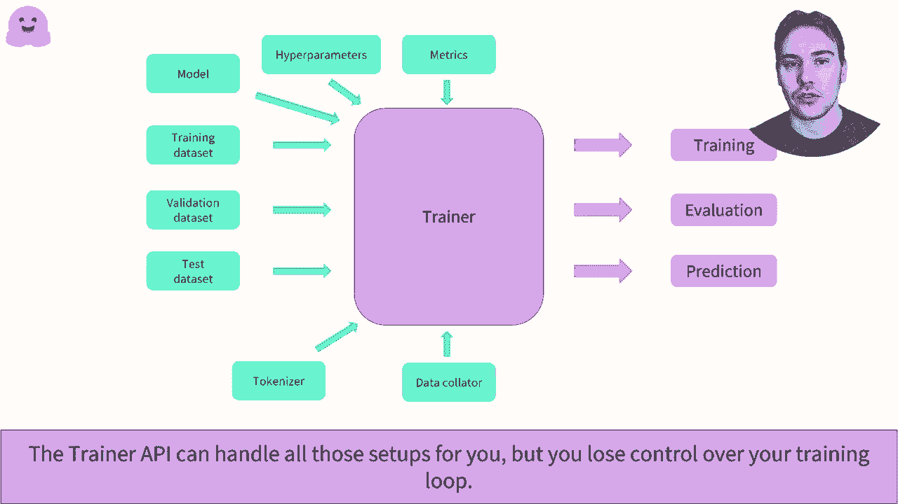

# 官方教程来啦！5位Hugging Face工程师带你了解Transformers原理细节及NLP任务应用！＜官方教程系列＞ - P23：L3.6- 使用Accelerate增强您的PyTorch训练流程 - ShowMeAI - BV1Jm4y1X7UL

用Hugging Face Accelerate为你的训练循环提速。

你可以在多个环境中运行你的训练。可以是在CPU、GPU、或多个GPU上。分布在一台机器上有多个设备，或者甚至是多台机器，通常称为节点，配备多个设备。此外，还有新技巧可以让你的训练更快或更高效，例如混合精度和动态速度。每种设置或训练技巧都要求你以某种方式修改训练循环的代码，并学习新的API。

所有的设置都通过训练API找到，并且有所有第三方库可以提供帮助。问题在于我们可能会觉得这是一个黑箱，并且可能不容易实施你需要的训练循环的调整。

加速器专门设计让你对训练循环保持完全控制，并尽可能不干扰。只需在你的训练循环中添加四行代码，你就能展示训练循环视频中的示例。加速器将在第一张幻灯片上安装所有设置和训练技巧。

只需学习一个API，而不是10个不同的。更具体地说，你需要导入一个瞬时表加速器对象，它会处理特定设置所需的所有代码。然后，你需要将其发送到模型、优化器，以及你在准备过程中使用的内容。这是需要记住的主要方法。在这些设备上加速。

所以你不需要将批次放在你正在使用的特定设备上。最后，你需要将最后一行替换为加速器的反向损失。就这样。加速器还涉及分布式评估。你仍然可以使用经典的评估循环，例如我们在训练组视频中看到的那样，在这种情况下，所有过程都将执行完整评估。要使用分布式评估。

你只需适应一个评估循环，如此。这就是加速器或每次训练的方式。然后，你可以省略将批次放置在正确设备上的那一行。在将预测和标签传递给你的指标之前。

使用加速器从每个过程获取预测和标签。

分布式训练脚本必须在不同进程上多次启动。例如，每个你使用的 GPU 启动一次。如果你熟悉 PyTorch 工具，可以用它们来实现。`accelerate` 还提供了一个简单的 API 来配置你的设置并启动训练脚本。在终端中，运行 `accelerate config`，并完成一个小问卷以生成包含所有相关信息的配置文件。

然后你可以运行 `accelerate launch`，后接过去的或你的训练脚本。在笔记本中，你可以使用笔记本启动器功能来启动你的训练。

。
