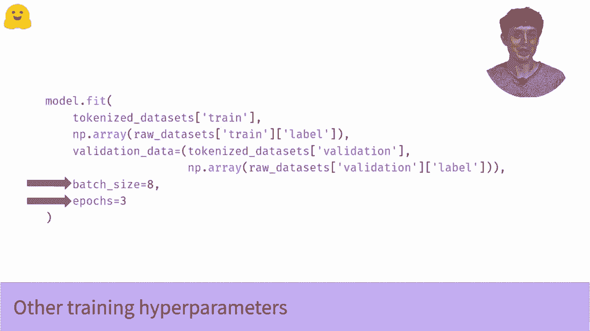

# 官方教程来啦！5位Hugging Face工程师带你了解Transformers原理细节及NLP任务应用！＜官方教程系列＞ - P27：L4.4- 使用TensorFlow进行微调（迁移学习） - ShowMeAI - BV1Jm4y1X7UL

在这个视频中，我们将看到如何加载和微调一个预训练模型。过程非常快。如果你看过我们的管道视频，我会在下面链接，过程非常相似。😊不过这次，我们将使用迁移学习并进行一些训练，而不仅仅是加载模型并直接使用，就像我们在管道视频中所做的那样。

如果你想了解更多关于迁移学习的内容，而你对此了解不多，你可以去看一下“什么是迁移学习”的视频。我会在下面链接。😊但现在，让我们看看这段代码。首先，我们选择要使用的模型。在这种情况下，我们将使用著名的塑料Bt。但这行代码到底是什么意思呢？

这个TF自动模型用于序列分类，这意味着什么呢？好吧，TF代表Tensorflow，其余部分是指如果语言模型还没有序列分类头，就将其添加上去。所以我们要做的是加载Bt，这是一种通用的语言模型，没有序列分类头。我们将使用from pre traineded方法，这个方法确保我们所有的权重都来自预训练模型。

除了我们将要添加的新序列分类头外，它们并不是随机初始化的。😊所以这个方法需要知道两件事。首先，它需要知道你想加载的模型的名称。其次，它需要知道你的问题有多少个类别。如果你想跟随我们数据集视频中的数据，我会在下面链接。

那么你将有两个类别，正类和负类，因此nu标签等于2。但是这个编译的东西呢？如果你熟悉Caris，你可能已经看过这个。如果没有，这是Caris中的核心方法之一，你总是需要在训练模型之前编译它。编译需要知道两件事。

首先，损失函数，基本上是我们想要优化的内容。在这里，我们导入稀疏分类交叉熵损失函数。听起来复杂，如果你以前从未遇到过。但这是任何进行分类任务的神经网络的标准损失函数。它基本上鼓励网络输出大的值。

这样对于正确类别的概率会很大，而对于错误类别的概率则很小。注意，你可以像我们在这里对optr所做的那样，以字符串的形式指定损失函数。但这里有一个常见的陷阱。默认情况下，损失函数假设输出是来自softmax层的概率。

但我们模型实际输出的是softm之前的值。这些通常被称为逻辑值或逻辑量。你在关于管道的视频中见过这些。😊如果你搞错了这一点，你的模型将无法训练。而且搞清楚为什么会非常麻烦。实际上，我甚至敢说，如果你从这个视频中什么都不记得。

请记住，始终检查你的模型是否输出逻辑值或概率，并确保你的损失设置与之匹配。这将为你在职业生涯中节省很多调试的麻烦。否则这些问题将很难追踪且非常烦人。但撇开这一点，编译所需知道的第二件事是你想要的optr。在我们的案例中，我们将使用atom。

这是现在深度学习的标准优化器之一。你可能想要改变的唯一一点是学习率。为此，我们需要导入实际的optr，而不是仅仅通过字符串调用它。就像我们之前处理损失时做的那样。不过我们可以在另一个视频中讨论这个问题。

现在我会在下面链接这个，先试着训练模型。😊那么，如何训练模型呢？

好吧，如果你以前用过Kais，这一切对你来说都会很熟悉。但如果没有，让我们看看我们在做什么。Fit几乎是Kais模型的核心方法。它告诉模型将输入分成批次，然后进行训练。所以第一个输入是令牌化文本。你几乎总是会从一个令牌器中获得这个。

如果你想了解更多关于这个过程的信息，这些输入到底是什么样子，请查看我们关于令牌的视频。再次强调，下面会有相关链接。所以这些是我们的输入。但第二个参数是我们的标签，这真的很简单。这只是一个一维的nuy或tensorflow整数数组。

它们对应于样本的类别。就这样。😊所以如果你在跟随我们数据集视频中的数据，只有两个类别。因此这将只是一个零和一的向量，但你可以根据自己的问题拥有更多的类别。一旦我们有了输入和标签，我们对验证数据做同样的事情。

我们以元组的形式传递验证输入和验证标签。如果我们想指定训练的批量大小等细节，就可以这样做。然后你只需将整个内容传递给model.dot fit，放手去做。如果一切顺利，你应该会看到一个小的训练进度条，随着损失的降低而下降。

当这个运行时，你知道，你可以坐下来，给你的老板打电话，告诉他们你现在是一名高级NLP机器学习工程师，并且下个季度你会想要薪资审查。所以这是，开个玩笑，但这真的就是将一个大规模预训练语言模型的力量应用于你的NLP问题所需的一切。😊但我们能做到更好吗？像，是否有任何我们可以做的改变？当然有。

还有一些更高级的careis功能，比如调度的学习率。我们可以得到更低的损失，因此模型会更准确。此外，当拟合完成后，我们该如何处理训练好的模型。这些都是我将在视频中探讨的主题，还有更多内容。

我将把后续视频链接在下面。😊。

。
