# 官方教程来啦！5位Hugging Face工程师带你了解Transformers原理细节及NLP任务应用！＜官方教程系列＞ - P37：L6.5- Omar的在线直播讲解 

好的，我想我们可以开始了。所以一如既往，欢迎大家。如果你有任何问题，可以在聊天中询问，Le会在这里帮助我。这是课程的第四章，也是最后一章。这与之前的三章有所不同，这一章会让你更深入地了解如何使用平台以及如何利用Hugging Face的所有功能。

这是今天的快速议程，首先我们将稍微了解一下平台。然后展示如何使用现有的预训练模型，接着如何将模型推送到hub，包括使用push to Hub方法和Hugging Face客户端命令行界面。然后我们会谈谈模型卡，最后我们会展示一些不是课程一部分的额外内容。

关于女孩的问题。所以是的，Co hub你在前面的章节中已经稍微使用过了。它是一个中央平台，使任何人都能发现、使用和贡献新的最先进的模型和数据集。它托管各种各样的模型，目前有超过10,000个公开可用的模型，我们现在可以检查一下它的数量，目前有11,000个可供任何人使用的公开模型。

所以Hub支持模型和数据集，在这一章我们完全专注于hub的模型方面。因此，hub中的模型不仅限于Hugging Face的transformers，甚至不限于自然语言处理。还有来自Flare和ALP的NLP模型，语音模型。

这里有asteroid和P note，还有一些视觉模型，这只是其中的几个。如果你想查看hub中支持的所有模型，这就是Hugging Face。你可以访问资源。在这里，你可以去模型hub。在左侧，你可以查看库。在这里我们有支持库的完整列表，以及它们根据不同特性支持的程度，所以显示了phase transformers。

但也有适配器变换器，所有NLP，asteroid，SPNe，Flare，by note。中心变换器，Spacey，Tensorflow TTS，和Team。所以这些模型作为Git仓库存在，因此如果你之前使用过GitHub，这对你来说将非常简单。在hub上使用模型意味着将其开放给所有社区成员。

这使得模型对任何想要轻松使用它的人都可用。反过来，这将消除或需要自己运行模型的需求，并简化模型的共享和使用。此外，hub还有一个叫做推理API的功能。因此，当你将模型上传到Hub时，将自动部署一个托管的推理API，允许你或社区中的任何人直接在网站上尝试该模型，视频会展示更多的内容，但你可以先了解我所说的内容。

我想我们在第一章已经做了一点这个。但是如果你打开一个存储库，在这里你可以在朋友API中托管，所以你可以尝试这个查询。如果你点击计算，这是一个填充掩码模型。它会预测应该放入那里哪些单词。因此，生活的目标就是生活。好吧，这并不太好，但你明白我的意思。

而且它并不限于字段掩码，实际上还有很多其他任务。好的，我会向你展示这一点。本章的第一个视频，但如果你有任何问题，请随时在聊天中提问。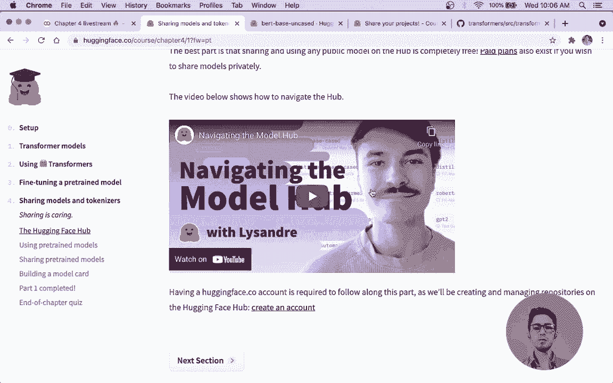

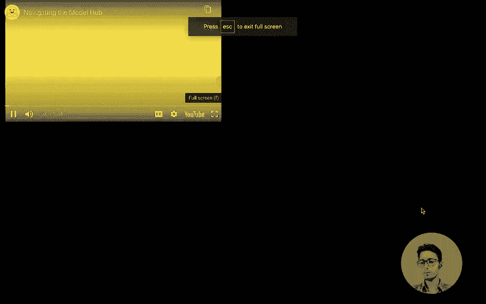

在这个视频中，我们将讨论Hugging Face模型的导航。这是Hugging Face的官方网站。要访问模型中心，请点击右上角的模型选项卡。你应该面对这个网页界面，可以分为几个部分。在左侧。

你会找到可以用来定制模型搜索的类别。第一个类别是任务。平台上的模型可以用于各种任务。这些包括自然语言处理任务，如问答或文本分类，但不仅限于此。其他领域的任务也可用。

比如说计算机视觉中的图像分类或语音中的自动语音识别。第二个类别是库。平台上的模型通常共享三种基础架构之一：PyTorch、TensorFlow或JAX。然而，还有其他基础架构，如Rust或Onyx。最后，这个选项卡还可以用来指定模型来自哪个高层框架。

这包括变换器，但不局限于此。模型中心用于托管许多不同框架的模型，我们也在积极寻求托管其他框架的模型。第三个类别是数据集选项卡。从这个选项卡选择一个数据集意味着过滤出那些在特定数据集上训练的模型。

第四个类别是语言选项卡。从这个选项卡选择一种语言意味着过滤出能够处理所选语言的模型。最后，最后一个类别允许选择与模型共享的许可证。在右侧，你会找到可用的模型。模型默认按下载排序。点击一个模型时，你应该看到它的模型卡。

模型卡包含有关模型的信息，包括其描述、预期用途、限制和偏见。它还可以展示如何使用该模型的代码片段，以及任何相关信息、训练、过程、数据处理、评估结果或版权。这些信息对模型的使用至关重要。

模型卡制作得越精细，其他用户就越容易利用你的模型及其应用。在模型卡的右侧是推理 API。这个推理 API 可以直接与模型进行交互。请随意修改文本并点击 Comp，查看模型对你输入的反应。

在屏幕顶部是模型标签。这些标签包括模型任务以及与我们刚才看到的类别相关的其他标签。文件和版本标签显示该模型的仓库架构。在这里我们可以看到定义该模型的所有文件。你将看到一个 git 仓库的所有常见特征，包括可用的分支和提交历史。

还有提交的 diff。在模型卡的顶部，有三个不同的按钮。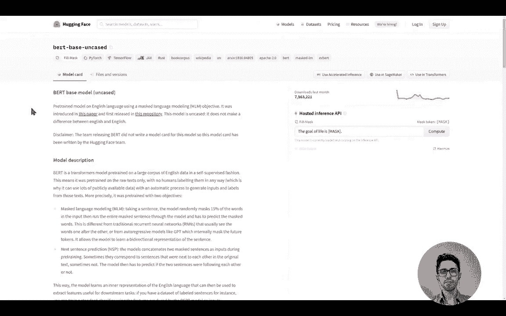

第一个示例展示了如何以编程方式使用推理 API。第二个示例展示了如何在 SageMaker 中训练该模型。最后一个示例展示了如何在适当的库中加载该模型。对于 Birt，这里是 transformers。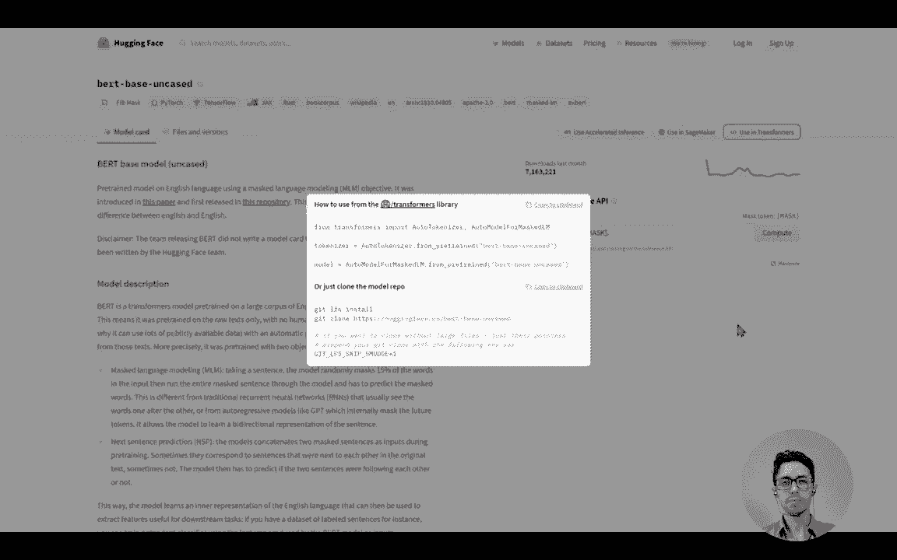

好吧，我觉得这非常简单。也许让我稍微扩展一下某些要点，让你们有所了解。但是如果你现在点击部署加速推理，你将获得这个代码片段，以便你可以在 Python 中进行请求，但这并不仅限于 Python。这就像一个普通的 API 调用，因此你可以使用 JavaScript 或任何你使用的语言。

然后在右侧，如果你点击使用 transformers，你会得到一个可以使用的代码片段。但正如我们之前讨论的，这并不限于 transformers。所以，如果你转到母版页面，在左侧，你可以点击这里的加号，这里可以看到所有支持的库。例如。

如果我们转到句子 transformers，将过滤出所有句子 transformers。这里的代码片段将发生变化，因此例如，这里的代码片段特别针对这个库，这样就与他们的库实现了非常好的集成，如果你在这里点击计算，这将是很好的。

用于句子相似性，因此你会得到一个源句子，然后是目标句子。你将获得源句子与其他句子之间的距离。这样可以了解它们的相似程度。因此，对于这个模型，最接近的表达是“一个快乐的人”与“一个非常快乐的人”，这样是有意义的。这里有一个问题，我们能否使用基于关键字的搜索来寻找特定任务的模型？

如果你对某个特定任务感兴趣，可以去模型，然后点击文本生成，例如，然后你可以进行额外的搜索，例如GT。你还可以有额外的过滤器，比如库数据集、语言。但我们现在正在改进搜索功能，请继续关注，未来会有更好的模型发现功能。

是的，好的问题。所以这是如何使用和浏览hub。让我们快速讨论一些你可能已经熟悉的内容，因为你在第一和第二章中做过。假设我们对一个可以执行填充掩码的法语模型感兴趣。好的，我来去掉这个，所以我们说填充掩码。你选择了法语。

我们可以使用这个comm face，通常你应该阅读描述。模型卡以理解这个模型的用途以及是否存在任何偏见或限制。我们将在几分钟后详细讨论这个。好的，所以有三种不同的使用模型的方法。

所以第一个就像我们在第一章做的那样。我们使用管道。这是一个非常高层次的功能，从transformers导入pipeline，只需指定。我们要解决的任务是什么，也就是填充掩码？我们指定了名称。gun member bird base。正如你所看到的，我们得到了一个预测。

你也可以使用特定的模型架构来加载模型，这与第二章中的做法类似。这是一个commem bird模型，它有一个commem bird架构。你可以导入commemered组织者和用于掩码语言模型的commem bird。如果你去GitHub Transformers源代码中的Transformers模型，你会看到。

你可以看到在Transformers库中实现的所有架构，确实有很多。因此，通常建议使用Auto类来组织和自动模型，因为这些是架构无关的。这样你就不需要担心具体的架构。

让我简要回顾一下管道，这我认为是重要的。你需要确保所使用的模型和检查点是适用于这个任务的。比如说你想使用文本分类。模型并不是为此训练的，所以这当然没有意义。

它会给你输出，但会抱怨。它会说你可能需要在下游任务上训练模型，就像你在第三章中做的那样。而且，这里的预测几乎没有意义。好的，所以这没什么新鲜的。但我认为更有趣的是下一部分。

这就是如何共享预训练模型。因此，这大概是课程第一部分的最后两个视频。第一个视频将向你展示如何管理一个仓库以及如何上传文件。通过命令行界面，第二个视频将展示如何使用推送到中心的方法。这里有三种不同的操作方式，一种是网页界面，一种是使用transformers或命令行接口的coding F hub，第三种选项是推送到中心的API。

所以让我们跳到视频中，记得在聊天中提出任何问题！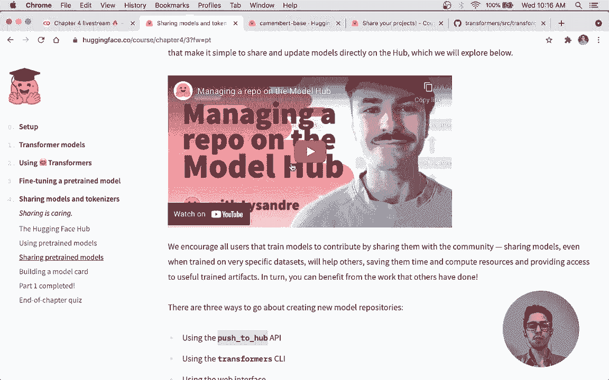

在这个视频中，我们将了解如何在Hugging Face模型中心管理模型仓库。为了处理仓库，你首先需要有一个Hugging Face账户。创建新账户的链接在描述中可用。一旦你登录，你可以通过点击新模型选项来创建一个新的仓库。

你应该面对一个类似于下面的模型。在所有者输入框中，你可以放入你自己的命名空间或任何组织的命名空间。模型名称是将用于标识你模型的标识符，最终选择是公共或私有。公共模型对任何人可访问。

这是推荐的免费选项，因为这使得你的模型易于访问和共享。只有你的命名空间的所有者可以更新和更改你的模型。更高级的选项是私有选项。在这种情况下，只有命名空间的所有者才能查看你的模型。

其他用户将不知道它的存在，也无法使用它。让我们创建一个虚拟模型来玩。模型创建后，接下来就是管理这个模型。有三个选项卡可供选择。你现在看到的是第一个，即模型卡页面。这是你用来向世界展示你的模型的页面。

我们稍后会看到如何完成这个。第二个是文件和版本。你的模型本身就是一个git仓库。如果你不知道什么是git仓库，可以把它想象成一个包含可以版本控制的文件的文件夹。如果你从未使用过Git，我们建议查看这个视频描述中提供的介绍。

git仓库允许你查看这个文件夹随时间发生的变化，因此称为版本。我们稍后会看到如何添加文件和版本。最后一个选项卡是设置选项卡，它允许你管理模型的可见性和可用性。😊，让我们先开始将文件添加到仓库中。

文件可以通过网页界面通过添加文件按钮添加。添加的文件可以是任何类型的，Python，J文本，随便你。除了你的文件及其内容之外，你还应该命名你的更改或评论。一般来说，使用命令行添加文件更简单。我们将展示如何使用Git来实现这一点。

除了 Git，我们还使用 Git L F S，这代表 Git 大文件存储，以便管理大型模型文件。首先，我确保在我的系统上正确安装了 Git 和 Git LFS。安装 Git 和 GiLFS 的链接在视频描述中提供。然后，我们可以通过在本地克隆库开始工作。我们有一个包含单个文件的库。

我们刚刚通过网络界面添加到库的文件。我们可以编辑它以查看该文件的内容并更新它。原来我有一个可以用于情感分析的模型。我会把内容复制到这个文件夹中，包括模型权重。

配置文件和分词器已添加到库中。我可以通过 `gett add` 命令跟踪这些文件。然后，我提交更改，并为此提交命名为“添加模型权重和配置”。😊，最后。我可以将新的提交推送到 hugging phase dot co 远程库。😊。

当返回到网络界面的文件和版本选项卡时，我们现在可以看到新添加的提交及更新的文件。我们在这里有两种添加文件到库的方法，第三种方法在有关推送到 Hub API 的视频中探讨。

此视频的链接在描述中。不幸的是，我们模型的主页仍然非常空荡。让我们添加一个 README Markdown 文件，让它看起来更完整。这个 README 被称为模型卡，它的重要性不亚于模型和分词器文件，是模型库的核心定义，确保其他社区成员能够重用并复制结果。

提供一个平台，让其他成员可以构建他们自己的工件。为了简化，我们在这里仅添加一个标题和简短描述，但我们鼓励您添加与模型训练相关的信息，包括其预期用途、局限性，以及识别出的潜在偏见。

评估结果和代码示例，说明您的模型应该如何使用。😊。出色的工作，向模型中心贡献了一个模型。现在，只需指定您的模型标识符，该模型即可在下游库中使用。😊。

好的，请随时在聊天中提问，我会尽力回答。如果我们与组织合作时，才能发挥作用。我想您是指身份验证令牌。因此，通常在您使用 Ho 界面通过 Ho phase 命令行接口登录计算机时。

每个用户都有一个令牌，保存在本地，然后在您推送文件时保存到服务器。后端确保您对特定文件的访问权限，因此如果您是某个组织的成员，并且您推送模型或创建报告。

你总是需要的。你的令牌将是请求的一部分，但这是针对任何请求的，因为我们需要知道是谁在发起请求。如果这不是很清楚的解释，或者如果你指的是其他令牌而不是身份验证令牌，请告诉我。好的，那么让我给你展示最后一个视频，然后如果你觉得可以，我们就开始编写代码。

同时，欢迎在聊天中随时提问。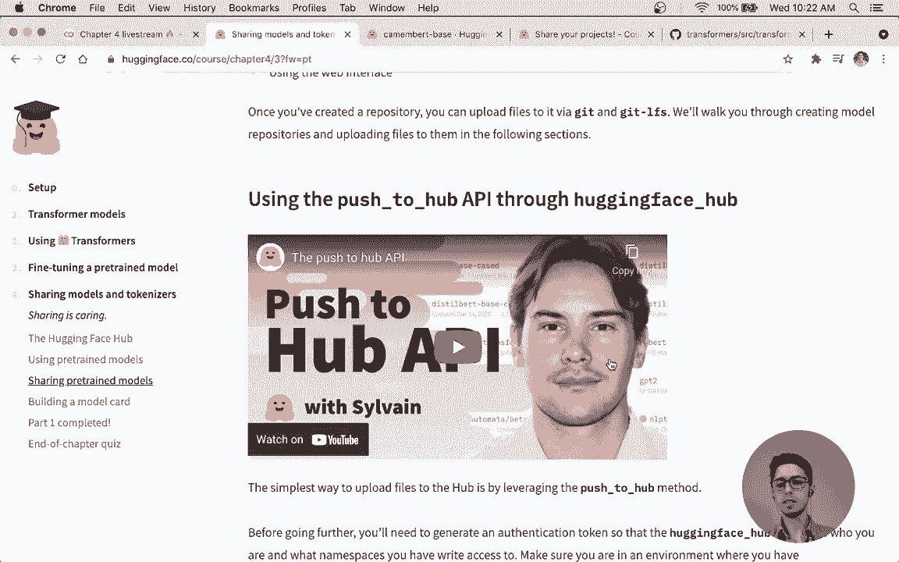

让我们看看每个API的推送。在录制这个视频之前，我提到过坏模型和给团队M PC。我们这里不讨论查找引擎的代码，因为你可以在任何转换器教程中找到它，或查看下面的视频链接。

我们这里感兴趣的是训练完成后发生了什么，以及我们得到了令我们满意的指标。这个视频要求你在Eingfeaz.go网站上注册一个账户，并且要将你的音频上传到该网站存储。这可以通过在终端输入Eringface CLI login，或在Coab笔记本中使用感叹号这样做。

如果你使用的是普通的Jupiter笔记本，这个命令将无法工作。因此，如果你使用的是Jupiter并且没有终端访问权限，你需要从Ugingfeest.go网站复制你的访问令牌到训练参数中。稍后我会告诉你确切的位置。完成后，

push API将会向Eingface推送我们的模型、其配置和关联的分词器。要在训练者内部使用它，你必须确保在训练参数中将push设置为true。我们可以为库指定一个模型ID。如果不做任何说明，它将默认为输出的名称。

只要我们是该组织的成员，就可以推送到该组织。这是你的Eingfeaz账户应该用来操作的地方，如果你需要的话。不管怎样，一旦完成，我们可以在训练结束后调用训练者的push函数。在未来的开发中，我们将增加在每个epoch结束或每隔一定步数自动推送到应用程序的功能。

所以请保持关注。该命令返回一个特定提交的URL。如果我们在浏览器中复制它，就可以进行检查。需要注意的是，如果你不使用训练者API，可以直接通过使用push2have方法将模型和分词器推送到该位置。通过在我的浏览器中输入提交信息，我可以访问我预期的名为Fine Tru Belt M PCC的库。

并查看所有文件是否已添加。一个模型卡，模型的配置。模型权重，绑定运行的吨数，以及作为分词器所需的所有文件。训练者起草了一个模型类，包含了评估集上的最终结果，训练输出参数和中间训练结果。

还有其他框架。如果我点击编辑模型卡以查看原始内容。我可以看到训练者还生成了一个元数据表，Ugingfaceco网站将使用该表来正确应用字段到我的模型。我还可以通过点击此处的训练指标直接访问模型中心的tonawboard运行。现在模型在欧洲，我们可以通过from between方法从任何地方使用它。

我们只需使用E中的标识符，就可以看到模型配置和权重被自动下载。我们可以像使用任何变换模型一样使用这个模型，例如，通过在管道中读取它。由于MRPC数据集是一组平行句子的集合，其任务是确定两个句子是否相互对应。

我们使用它，并通过步骤将两个句子分开。看到它预测标签为零有点令人失望。这是因为我在创建模型配置时没有指定任何标签。用pushure API修复这个问题非常简单。首先，我们可以通过将标签设置为a并将8设置为带有适当值的标签来本地修复配置。

然后我们可以通过推送到方法把修复的配置推送到我们的reportpo。再次请返回提交的URL，我们可以检查并查看配置的具体内容。请注意，命令执行得非常快，因为我使用的是之前的同一个本地文件夹，而我的报告已经克隆过了。一旦完成，我们就创建一个新的管道。

我们可以看到新的配置自动下载，这得益于构建人员系统，我们得到了新的标签。我们还可以直接在模型卡上玩模型。通过更改我使用的文本并点击Comp。我只需稍等一下，模型就会加载到推断API并显示结果。当模型加载后，我们可以再次检查，确认在Weget上得到的结果与之前相同。

今天试着把你的模型推送到VPA上。好的，是的。回到I am Hols关于认证令牌的问题，现在我看到这个例子，我觉得我更明白你的问题来自哪里了，所以通常当你进行Hoging阶段的清晰日志记录时，你的认证令牌会被存储在缓存中，然后你就不需要再做了。

但例如，如果你在goL工作，或者，是的。我不知道在一个可能不想登录的环境中。相反，你可以指定一个特定的认证令牌。这就是out token参数的用例。好的，那我们开始编码吧。

因此，如果你在Git中做配置，如果是你的正常git配置，我之前已经登录过。哦。如果这里的表。ho。系音。抱歉，是谁。是的，那个去。所以我在开始会话之前已经登录，所以我的用户名是Haarte，我给你展示了一些例子，因此推送到API的好处在于，变压器中的一切都具有这种方法。

所以模型tokenrs，是的，你说的就是这样。如果你先做前三行。它将推送模型文件和tokenizer文件。非常好的是，如果你使用Tra API。好的，现在我正在获取神经元，让我快速一下。嗯。好的，这是新的。好的，让我再试一次。诶。与此同时。

让我给你展示一个通过训练API上传的示例，如果你跟随Piytorch教程的第3章，你会非常熟悉，所以只需指定push to H，你将获得一堆非常好的东西。因此，你会得到一个描述，你会得到loss accuracy或其他指标。你会得到占位符部分，可以稍后完成。

你将获得在训练过程中使用的所有训练超参数。你将获得一张很不错的表格，显示每个epoch的训练结果。你还会得到框架版本。这对于可重复性非常有用。除此之外，还有一个非常好的功能，就是托管的Tensor bird在中心。

所以如果你在仓库中有tensor board的痕迹，并且不限于hogen phase transformers。就像可以是任何tensor board的痕迹，你将自动获得一个tensor board供你使用，在这里你将能够查看矩阵。

几。E，看起来像。

我仍然有问题，不知为什么。抱歉，所以让我还是在终端中操作。

这将是一个。え。一。那么，让我们先。导入。我们关心的内容。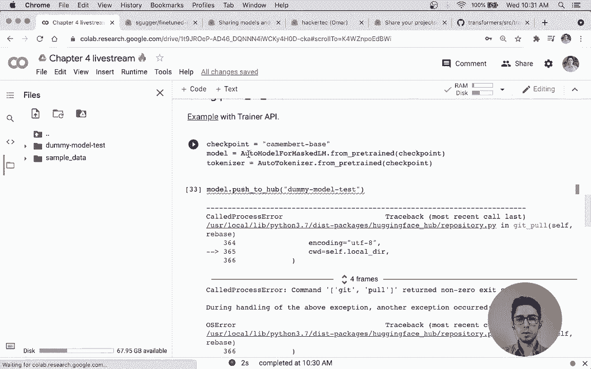

所以我们只是初始化一个mod learned organizer。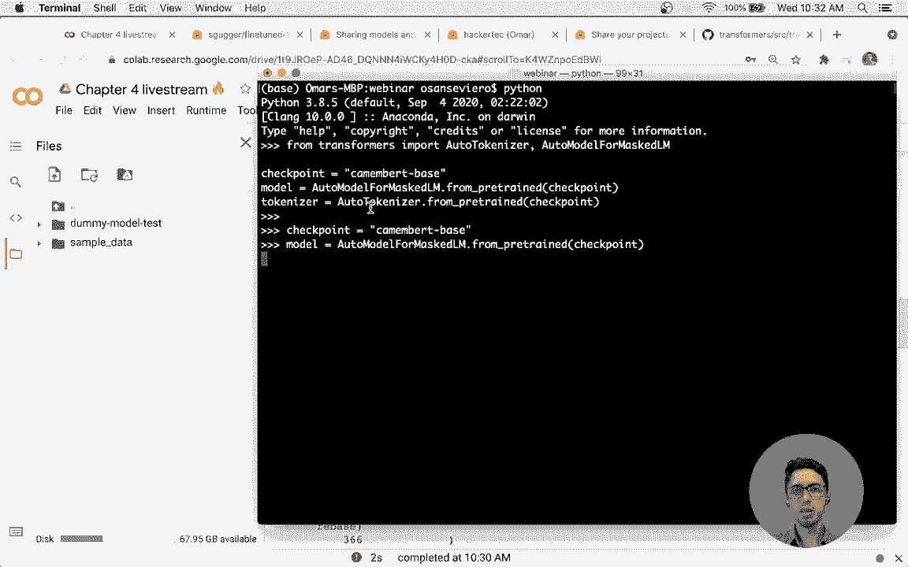

正如我们之前所做的一样，有些nothingia。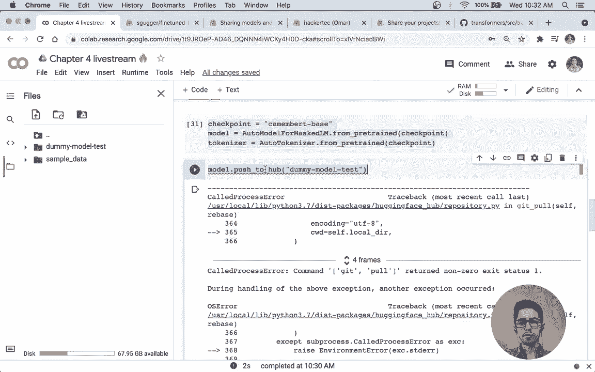

好的，可能需要一点时间。然后他们会尝试做模型，推送给她。然后命名所有的。所以让我来做这个。是的，花几秒钟。这条命令正在为你上传很多模型。

我实际上不确定你为什么去服务器，因为我在大约10分钟前尝试过。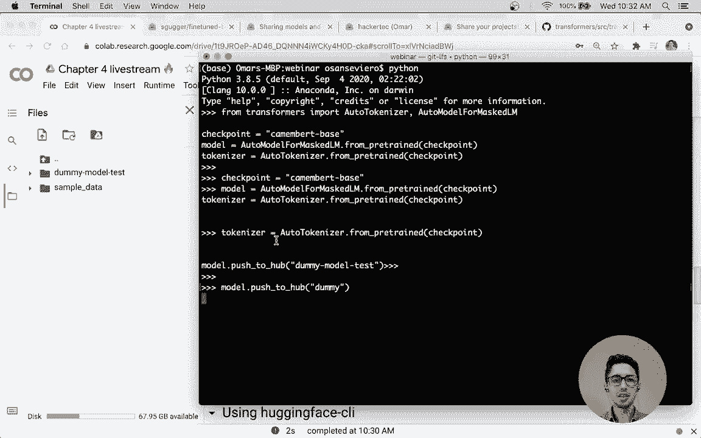

我没有决策，找不到仓库。嗯。好的，这有点麻烦。我觉得我的电脑在同时处理直播时有点吃力。是的，期间。如果你还想指定一个组织，你可以这样做，就像我们之前讨论的那样。如果你想的话，你也可以指定一个Token。

好的，另一个选项是使用Hook阶段。我不知道。Doganer。推送到她。好的。报告是自动创建的，因为它之前不存在。让我们看看文件是否仍在上传。诶。是的，通常不会这么久。我不确定这是我的电脑还是现在有任何连接问题。

Hping the face。

嗯。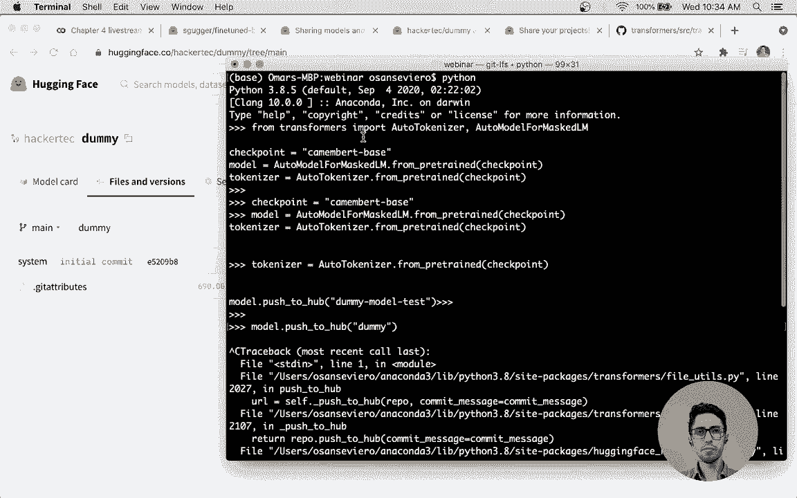

好的，等它运行的同时，让我给你展示第二种方法。就是使用Hook阶段的Clay。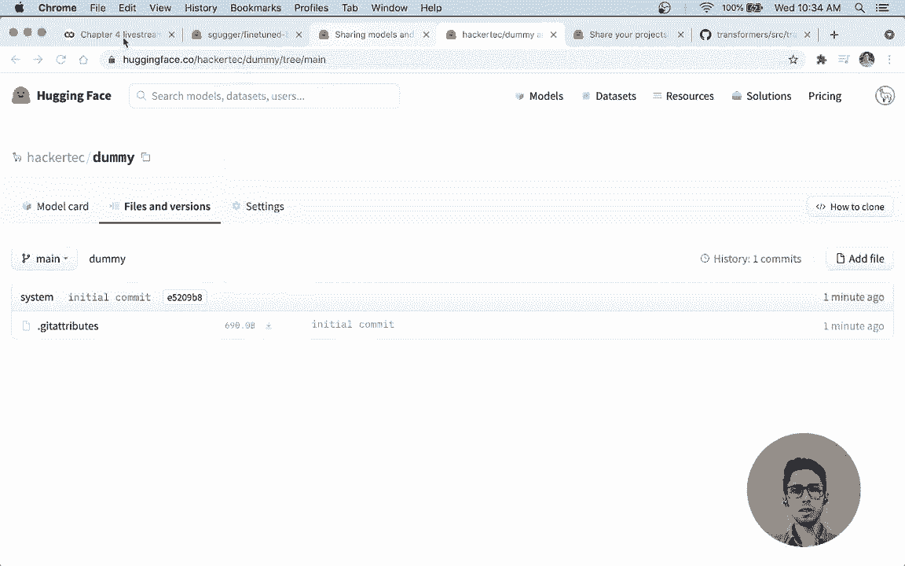

所以如果你只是基本上在拥抱。Reipple grade Doit2。它通常会为你创建一个记录。诶。언디 가？

是的，所以我们问你，是否想创建repohyite doit2？我说是。然后它给了你一个链接，可以在浏览器中查看。

这也告诉你如何克隆它。这类似于Listen制作的第一段视频。在这里你可以做到。是的，比如正常的事情，例如，你可以创建一个模型卡。这是一个正常的马拉松文件，所以这是一个测试。你可以获取它。你可以执行它。当你提交时。是的，你会得到这里，这就是测试，这就是我在模型卡中写的内容。

你可以查看所有文件。你可以查看仓库的历史。是的。正如你所看到的，有一个提交是在14秒前。我进行了这个更改，所以这非常好，因为如果你只是使用GitHub的工作流。你可以用这个创建分支，例如。

你也可以非常容易地恢复更改，所以这个人来说非常好。え。是的，好的。那么回到之前的分词器。在我看到推送到Hub的地方。如果你去文件和版本，你可以看到文件现在已经上传。诶。一。所以让我快速检查一下历史。是的，我觉得那里有一些连接错误。

正如你所看到的，实际上模型和分词器都已经上传，所以这很好。诶。那么，诶。主机阶段基础设施通常对变换器所做的是分析配置。配置指定了一些像架构这样的东西。是的，这种东西，基于此，它已经告诉你这是一个电影面具模型。

这是一个kberg模型，它是变换器，使用byytor。这一切都基于文件和配置，你可以在这里看到。托管推理API。你需要等待，尤其是第一次，你需要等待模型在后台加载。如果你想部署，可以在加速推理API中使用这个，尽可能多地进行。

对。玩一个模型，你可以很容易地将其整合到自己的产品中。好吧。是的。这是对她的推动。好的，我们回到命令行界面。就我认为。糯面都咩啲。是的。现在我们没有任何东西，对吧？我们还没有创建模型卡。

所以，让我知道。

好吧，让我们制作一个非常慢的电脑。那么我们现在可以做的是。

像正常的 Github 工作负载，你可以执行 get clone。然后是名称。所以现在，例如。我已经有。这个 repo 只是下载了 Briy，它是唯一的文件。 gate 属性也在那里，但它是一个隐藏文件。所以。你不会看到它，除非你指定隐藏文件。正如 Leandra 在视频中提到的。

除了 Git，我们还使用 Git LFS，也就是 Git 大文件存储。这对机器学习中常见的非常大的文件非常有用。所以这是针对大于 10 兆字节的文件。

通常我们做的是你可以指定想要使用的扩展名。你想要和 elephantphis 一起使用。所以是的，所有这些。

所以通常你需要做的是执行 Gi F install 以确保它被初始化。让我来。

给你展示一个不错的例子。假设我们想要在本地处理一个模型。也许训练它，然后不是使用推送到她，而是希望将其保存在本地，然后推送。这就是安全预训练方法的用途。所以让我只用正确的名称，就是我。做。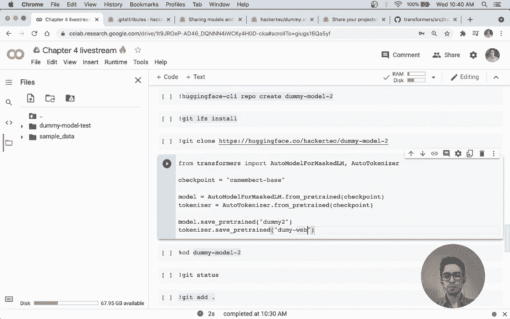

让我现在只是复制基础。这些都叫做片段。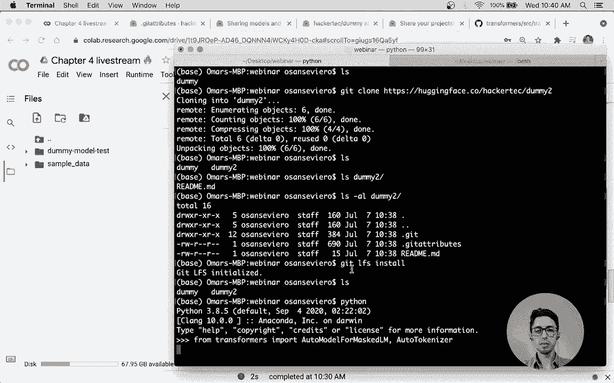

所以这个是什么，让我逐行解释它为什么运行。它将执行相同的操作。我们加载模型，我们加载 tokenizer，然后将模型保存在目录 toittu 中。这就是我们克隆机器人并且我们还保存 tokenizer。

但正如你所看到的，我的电脑在处理 icestream 时遇到了一些困难，所以有点慢。抱歉。给给送包。如果你现在查看 Domit2，你已经可以看到所有文件。所以我们进入仓库。如果你执行 gi status，这是正常的 gi，你会看到，好的。这些文件都是要添加的，它们不是对的你。所以如果你执行 Gi。

这将允许跟踪所有文件。然后你可以执行`git status`，你会得到一些信息。还有另一件事，你可以使用`git lfs`。这很好，因为现在你可以看到哪些文件将由普通的Git处理，哪些文件将由Git大文件存储处理。这只是额外的信息，不是你需要过于担心的事情。如果你有一个非常大的新扩展名文件，确实需要关注，但只需简单地添加一个新扩展名，例如你可以更改git属性。

无论如何。让我们提交。我的第一次。我不。所以非常简单。然后你只需执行`git push`。由于这些是非常大的文件，通常需要一点时间。所以，我会稍微继续一下，展示给你看。

好的，这几乎就是关于Sching预训练模型部分的所有内容。让我快速回顾一下，我们已经看到如何使用网页界面。这就是我们刚才所做的，上传一个模型的方式。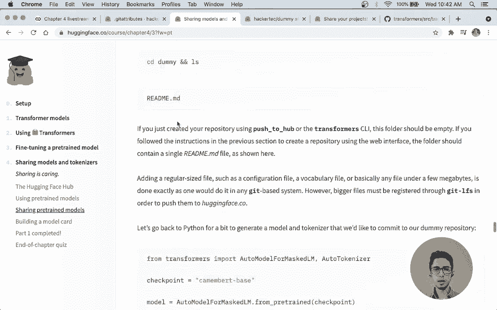

是的。所以如果你看到80多兆字节，这就是为什么即使在相对较快的连接下也会有点慢。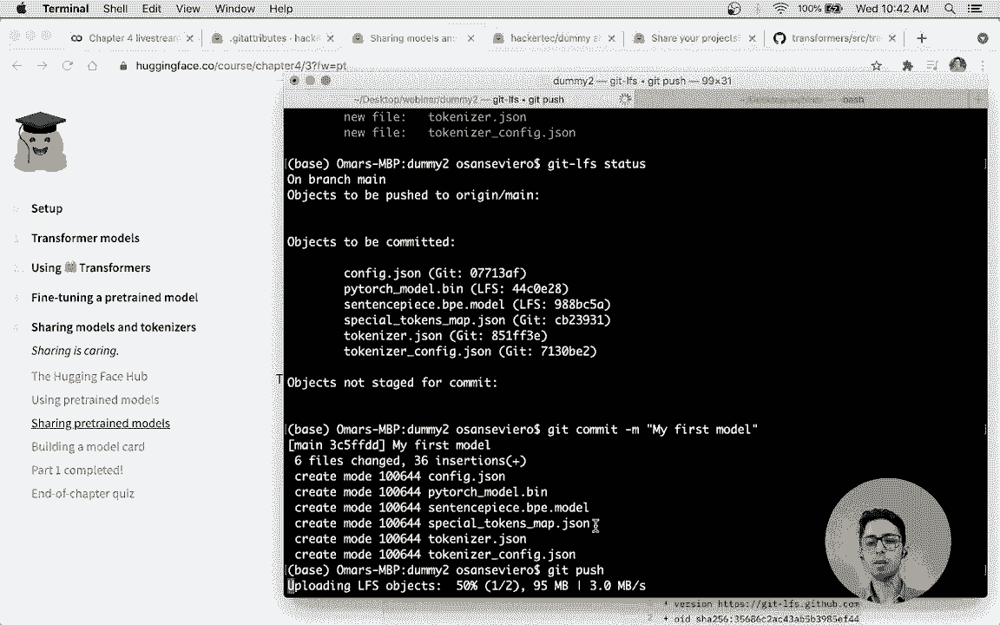

好的，最后一部分有点不同，是关于如何构建模型卡的。我们已经看过几个模型卡，简单回顾一下，模型卡就是这个文件。这非常重要。它解释了模型，确保它可以被社区其他成员复用，并提供了一个平台，让其他成员可以在其上构建他们的成果。

记录训练和评估的过程有助于其他人了解模型的期望。此外，它还将提供关于使用的数据、预处理和后处理的充分信息，以确保了解模型的限制、偏差和不适用的上下文。

模型可以被识别和理解，因此如果你上传一个没有任何内容的模型卡，没人会使用它，因为他们不知道这个模型是做什么的。相反，如果你有一个非常好的模型卡来解释它的功能、训练方式、目的以及限制和偏差，这将对其他人非常有用。此外，正如我们将看到的，你可以添加一些特殊的元数据，使你的模型更具价值。

让社区其他成员能够发现。因此，正如我们所见，这只是一种节奏。如果你对此更感兴趣。模型卡的概念源自谷歌的一个研究方向。该论文名为《模型卡用于模型报告》，作者是**Margaret Mitchell等**。这篇论文包含了许多非常有用的信息。

因此我们推荐你去看看。有一些我们推荐的部分。模型描述、预期用途和限制、如何使用限制和偏见、训练数据、训练过程和评估结果。这些不是严格要求的，我们不强迫任何特定部分。因此，模型卡片确实有很大的灵活性。

这里有一段解释这些部分的段落。我认为你可以自己阅读，但更有用的是快速浏览一下。快速浏览一个非常好的模型卡片。这是基于BERT的案例。可能到现在为止你对这个报告有些厌倦了。

所以它有几句话来解释模型以及它是如何引入的。嗯，是的。然后它有一个模型描述，解释模型的高级概述。它是如何训练的，目标是什么。模型学习了什么，比如说，模型学习了英语的内部表示，可以用来提取特征。

对于下游任务非常有用。因此它还有一个预期用途和限制的部分。所以是的。它告诉你可以将其用于大规模语言建模或下一个句子预测，但这个模型的意图是针对下游任务进行微调。你还可以在这里获取类似的代码片段。虽然现在使用部分是关于使用transformers的。

你也可以直接点击这里使用transformers，并从这里加载。是的。然后它向你展示如何在PyTorch和TensorFlow中操作。这里实际上有一个错误。这是针对TensorFlow的，它应该只是BERT模型，这里应该是the BERT model。但你明白这个意思了。然后有一个限制和偏见部分，这非常有用。

我认为这非常重要。所以我们就来读一下，即使这个模型使用的训练数据可以被描述为相当中性，这个模型仍然可以进行预算预测，这与我们在第一章结束时所做的管道非常相似，因此人类的工作及预测都是律师。

服务员、侦探、医生。正如你所看到的，女性的职业是护士、服务员、助理。所以你可以看到，这个模型有一些偏见，正如这里提到的，以及我们之前看到的。这种偏见也会影响这个模型的所有精细版本。因此，重要的是如果你选择一个模型，你需要理解这些偏见，因为这些偏见很可能也会转移到你自己的模型中，特别是在下游任务中。

抱歉，当你进行微调时。它还解释了训练数据，训练是如何进行的。包括预处理、预训练、评估结果的表格。最后，是的。如何引用它。模型卡片非常灵活。嗯，是的，让我快速展示一下。元数据。所以在顶部，人们可以添加有用的元数据，例如你可以指定语言是什么。

许可证是什么？在需要模型时使用了哪些数据集？你也可以添加任意数量的标签，这样人们就可以在这里点击“专家”，找到所有带有该标签的模型。如果你想了解更多关于元数据的信息，可以去资源页面。Mugel hot duck。然后你可以在这里搜索。我们有几个关于元数据的部分。

但这个链接特别有一个模型卡的示例以及其结构。你可以查看你拥有的语言、许可证、你想要的文本。所以，比如说，你可以用这个来指定第三方库或特定任务、数据集、指标。此外，你还可以添加特定的指标，这些指标可以稍后由其他管道处理。

我想差不多就是这些，随时可以问任何问题。如果没有，我就给你展示一下，是的。所以这就是章节的结束。我想给你展示两件非常小的事情。这些都是Hugging Face Hub的一部分。

一。所以第一个部分。让我先展示这两个。

如果你已经安装了transformers，很可能我们已经有了Hugging Face Hub的连接。

这实际上是一个客户端库，提供了许多功能。所以这使得任何人都可以将文件上传到Hub，你可以做很多相当不错的事情。如果你想将其集成到自己的代码中，过程非常简单。

除了有上传和下载内容的包装器之外。

你还可以访问图。信息。来自Hub的信息。所以，比如说，如果你想获取所有针对特定库的模型，让我实际展示一下。这将返回相当多的信息，而不是实际模型。假设在电影掩码中，我认为这样会更清楚。所以这将向后端发起调用。

这将返回关于所有字段掩码的所有信息。正如你所看到的，Hub上有1000A掩码填充模型。所以，让我给你展示一下第一个项目。正如你所见，模型名称是Albert based V1，它给你所有的标签。它还告诉你这个模型报告的任务是什么。

所以社区里有一个人正在上课，他们决定实际创建一个Hugging Face数据集，收录Hub上的所有模型，所以这非常不错。如果你想进行模型探索等，这就像是一个任何人都可以进行的项目。

实际上，你想了解更多关于这个的内容。这个仓库是佢件 face hood。这是与 theHub 相关的开源地方，所以你可以下载和发布客户端库到 hub。你可以获取第三方库的推理 API。你会得到小部件。

所以小部件是在模型右侧的东西，在模型卡中，你可以直接在网页上尝试模型。

更多的东西。这非常不错。这是一个非常新的功能。E，让我先。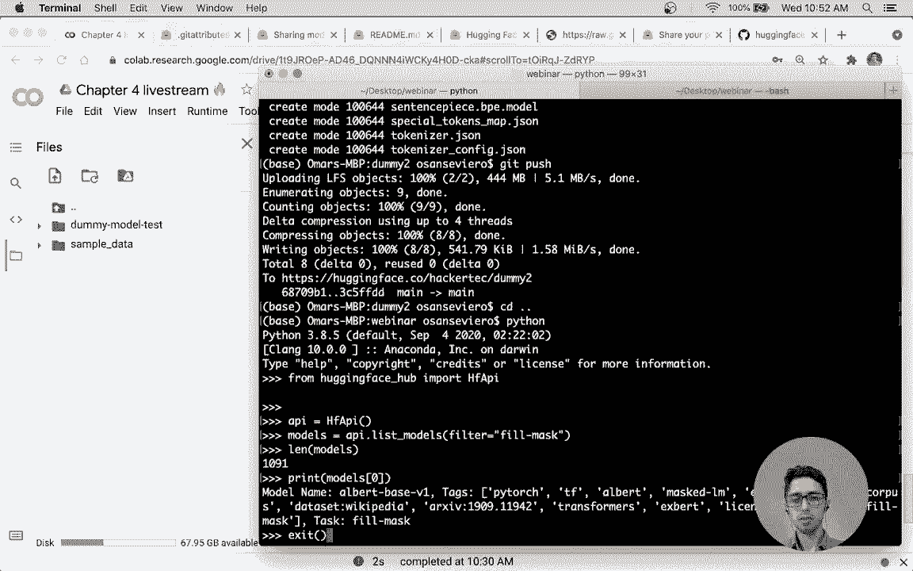

诶，Cooking face，清除。

太好了。Nome3。好的，我先抓个 ripa。我需要指定。Re 各一份。Aam Holmes 问是否有选项通过 Hoing F API 认证星星的数量。是的，也许等下周，会有一些相关公告，所以请继续关注。诶，一。所以让我测试一下，现在我创建了一个 ripa。

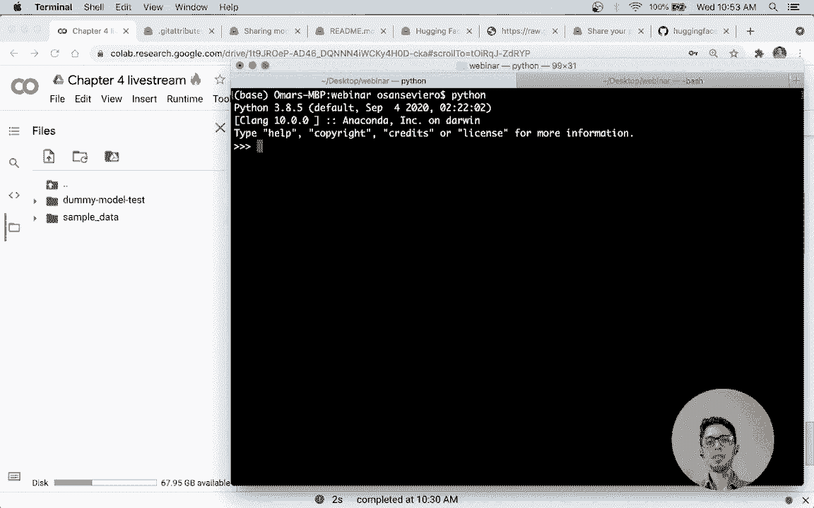

假设这是一个上下文管理器，也许我们先解释一下代码。Hogan phase hook 有这个类，它是 repository，允许你在特定目录中克隆一个仓库。所以我刚做了 Do3。如果我错了，它会克隆，是的，从我这里。这是一个上下文管理器。

所以你可能已经做过类似的文件处理，所以你可以用 repo。comm 我的第一个文件。你现在做的任何事情都会提交到 hub，所以这就像一个非常好的 proper，可能会让你的生活更轻松。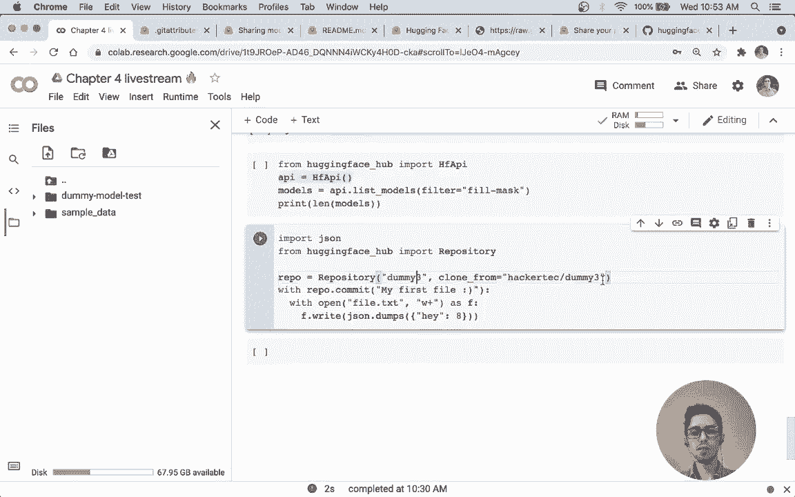

让我快速检查一下这个是否可行。风鸟，好的。是的。这一初始说明仓库，现在你可以用红色产品提交。

所以，这是我的第一部手机。嗯，好吧。这是一个。我是说。这部分网格对不起，打开文件作为文件 bla blah。这个可以是任何东西，不仅限于文本文件，你可以做任何伟大的事情，所以你可能对此非常熟悉。唯一的新事物是这个 grper 与 repo dot commit 我的第一个文件。

现在如果我们去 theH，去我的。Profi。是的，这里我们有 Domin3。如果我们去火。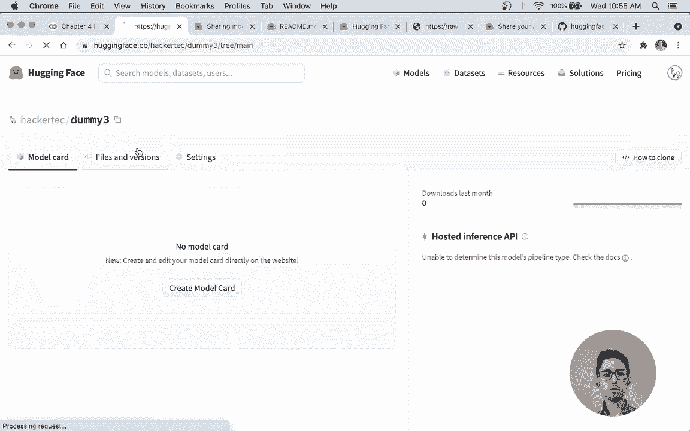

我会看到我刚创建的文件。用这个打开文件 lalalah。实际上并不是本地完成的。是提交到仓库。这样处理文件是一个不错的方法。F 在 hub 上写入。

正如你所看到的，值已经在这里。好的，所以这两个是我想给你展示的两个额外内容。这就像最后一章。但我们在接下来的几周里会有一些不同的活动进行。我们在论坛中还有这个分享你的项目部分。

到目前为止，你已经拥有了很多工具来进行微调，例如针对特定任务的文本分类。因此，你现在可以在中心搜索一个有趣的数据集。在中心，你可以去数据部分，搜索有趣的数据。你可以在一个分类项目，文本分类项目上工作。这非常简单。

分享这个非常简单，欢迎随时在这里评论，比如说，“嘿，我用我在课程上学到的内容进行训练，这太棒了。”我们有一个问题，就是therepo.com的联系人管理器的优势是我们不需要每次都进行gi commit，是的，这是一种轻松的编程方式来处理所有联系人管理器的事务。

这主要像是一个方便的包装器。我希望这样能让你理解。好的。还有其他问题吗？谢谢，感谢你的欢迎。好的，感谢每一个能够参加的人，我们下次在公司见。

。
