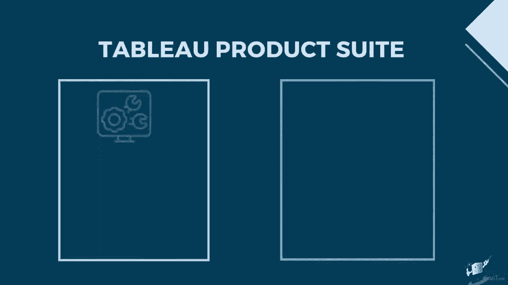
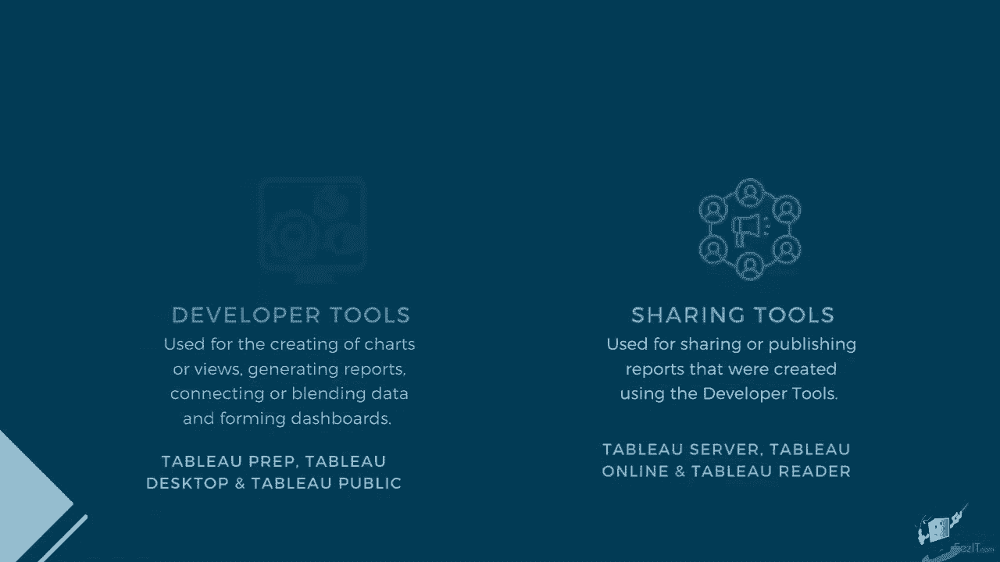
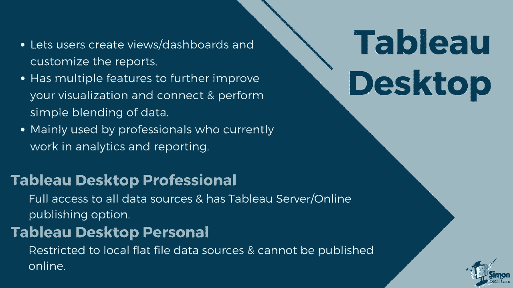
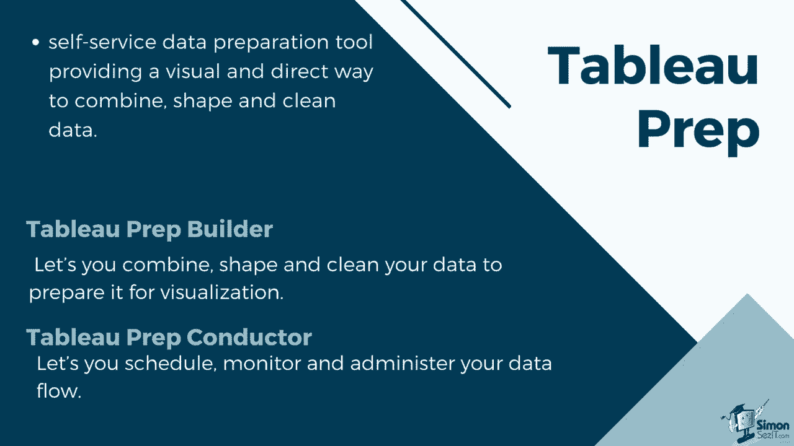
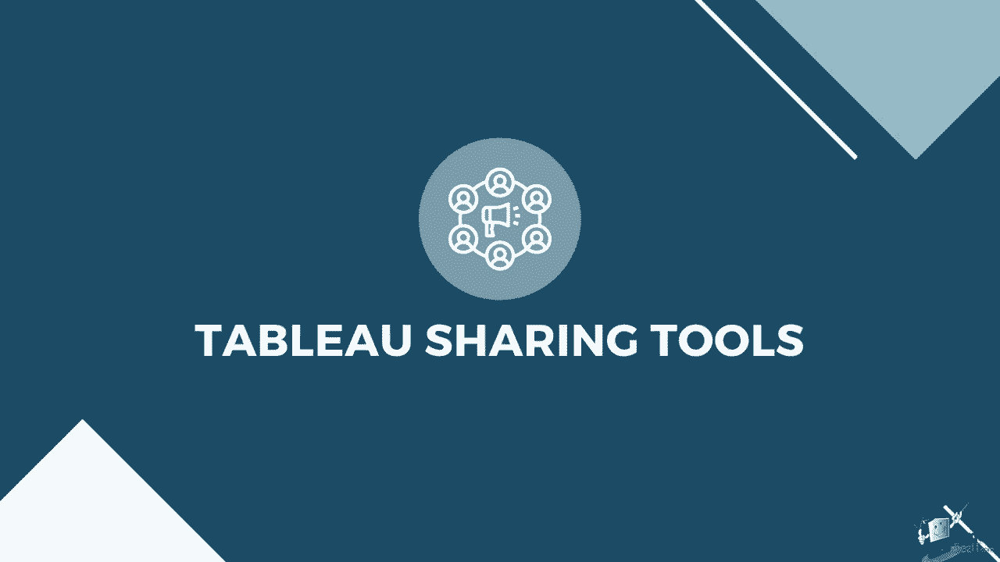
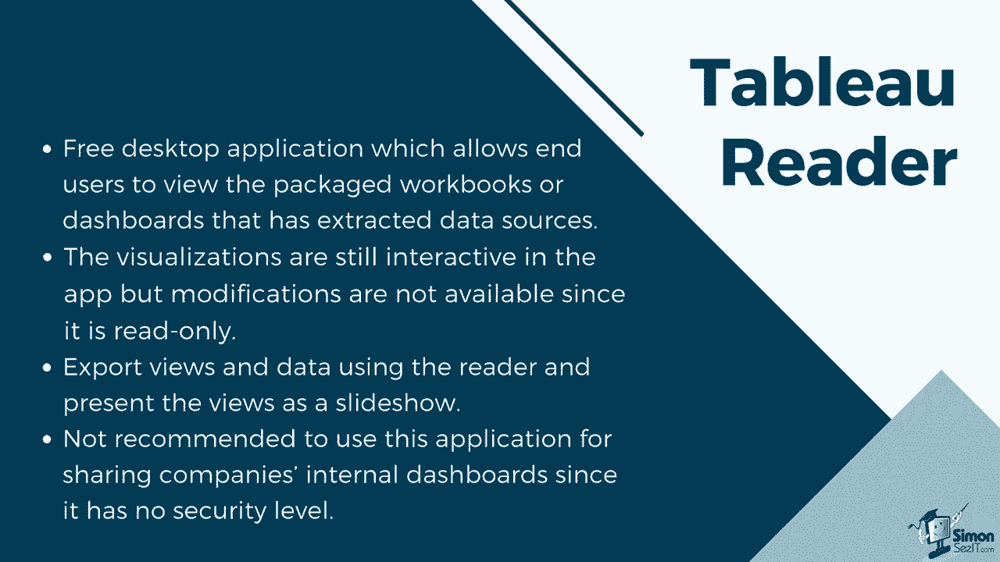
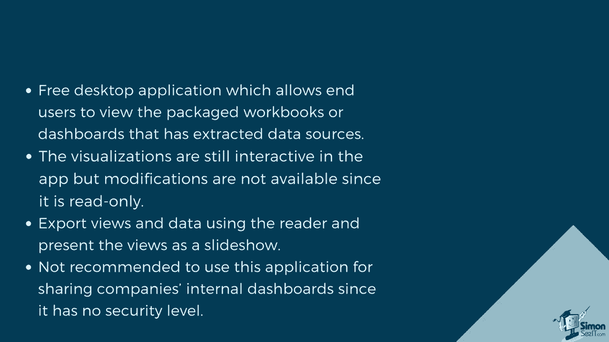
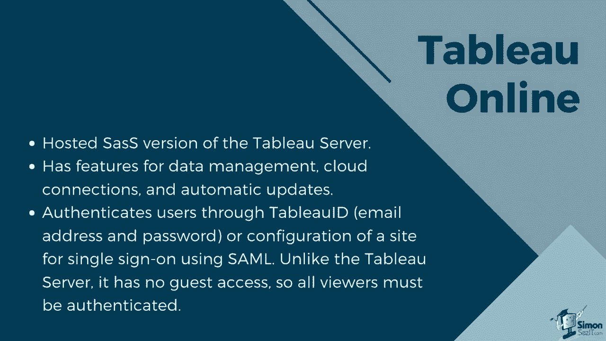
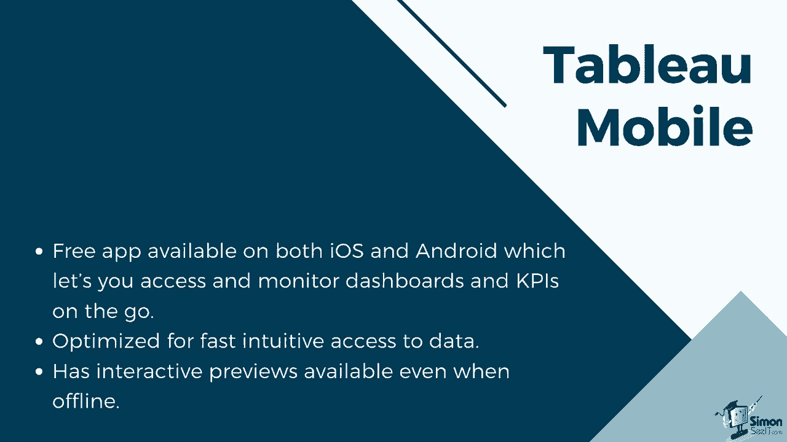

# 数据可视化神器 Tableau！P2：2）Tableau 产品套件介绍 

Tableau 产品套件由几款软件组成，可以分为两个部分，开发工具。用于创建图表或视图，以及生成报告，连接或合并数据并形成仪表板。Tableau Prep。

Tableau Desktop 和 Tableau Public 属于这一类别。共享工具，主要用于共享或发布使用开发工具创建的报告。Tableau Server、Tableau Online 和 Tableau Reader 是共享工具。

让我们从开发工具开始。Tableau Desktop 允许用户创建视图和仪表板，并允许用户自定义报告。它有多个功能，允许用户进一步改善他们的可视化，并且还可以连接并执行简单的数据合并。它主要由目前在分析和报告领域工作的专业人士使用。

Tableau Desktop 有两种类型，基于其连接和发布选项。Tableau Desktop 专业版可以完全访问所有数据源和数据类型。专业版还允许你通过 Tableau 服务器在线共享你的仪表板。另一种版本是 Tableau Desktop 个人版。

与专业版相比，Tableau Desktop 个人版限制更多。它仅能连接平面文件，例如 Excel 和 CSV，且其仪表板不能发布到 Tableau 的服务器上，但你可以将工作簿保存在本地或发布到 Tableau Public 网站。

Tableau Public 是免费的版本，仍然可以让你创建和自定义仪表板。你可以用它连接平面文件，但无法连接实时数据库。与 Tableau Desktop 个人版相比，它不允许你将工作簿保存到本地，但你可以将创建的仪表板发布到 Tableau Public 网站。

它也有 100 万行的限制。这个版本最适合想要尝试产品并探索数据分析的初学者。在本课程期间，我们将利用 Tableau Public。Tableau Prep 是一个自助数据准备工具，提供了一种直观且直接的方式来组合、整理和清理数据。它由两个产品组成。

Tableau Prep Builder 和 Tableau Prep Conductor。Tableau Prep Builder 为你的数据分析提供了一个完整的视图，允许你组合、整理和清理数据，以准备可视化。它有三个协调视图，可以让你查看每个字段或列的行级数据概况以及整个数据准备过程。Tableau Prep Builder 还允许你连接到本地或云中的数据。

另一方面，Tableau prep conductor 让您可以安排、监控和管理数据流。数据流可以发布到 Tableau 服务器或 Tableau On，管理员可以安排何时运行以及何时更新数据，并监控计划的流。

现在，让我们来看看在从开发工具创建工作簿或仪表板后可以使用的共享工具。Tableau reader 是一款免费的桌面应用程序，允许最终用户查看打包的工作簿或提取数据源的仪表板。

在应用程序中，视觉化仍然是互动的，但由于它是只读的，因此无法进行修改。

您仍然可以使用阅读器导出视图和数据，并将视图呈现为幻灯片。 不建议使用此应用程序共享公司的内部仪表板，因为没有安全级别。

Tableau Ser 允许用户在组织的本地服务器或云服务器内共享仪表板。仪表板可以通过浏览器查看，并且可以安排数据刷新和提取。它还支持连接到实时数据源。可以配置本地身份验证、活动目录集成、受信任的身份验证或使用 SML 或 Kber 的单点登录。

它还提供了核心许可选项，允许访客访问。它允许创建和维护多个站点，而无需额外费用。配置用户和权限。Tableau On 是 Tableau 服务器的托管 SaaS 版本。仪表板和数据将保存在 Tableau 组提供和维护的服务器上。

这消除了您管理服务器的需要。与服务器相同。它具有数据管理、云连接和自动更新的功能。您可以通过 Tableau ID、电子邮件地址和密码来验证用户，或者配置一个站点以使用 S Ml 的单点登录。但与 Tableau 服务器不同，它没有访客访问权限。因此，所有观众必须经过身份验证。

Tableau Server 和 Tableau On 都可以与 Tableau Mobile 一起使用。Tableau Mobile 是一款在 iOS 和 Android 上均可用的免费应用程序，可以让您随时随地访问和监控仪表板和 KPI。它经过优化，以便快速直观地访问数据。它具有交互式预览。

这会在您连接到服务器时下载您喜欢的工作簿，以便您可以稍后访问，即使在离线状态下。由于 Tableau desktop 针对移动布局进行了改进，您可以在较小的移动屏幕上以清晰可读的格式查看仪表板。😊。

