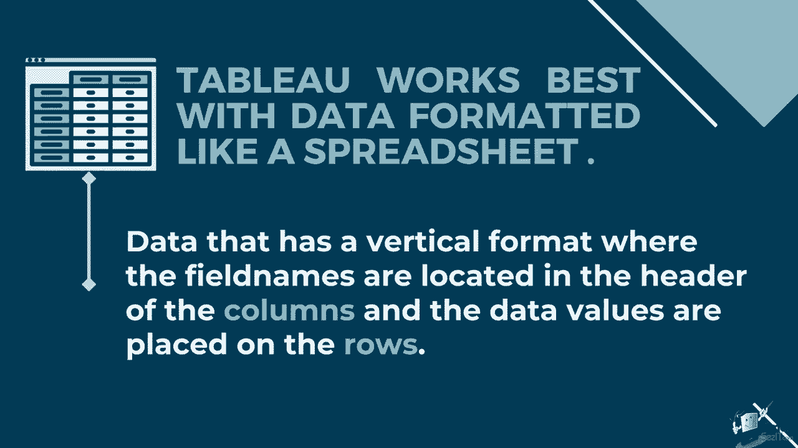
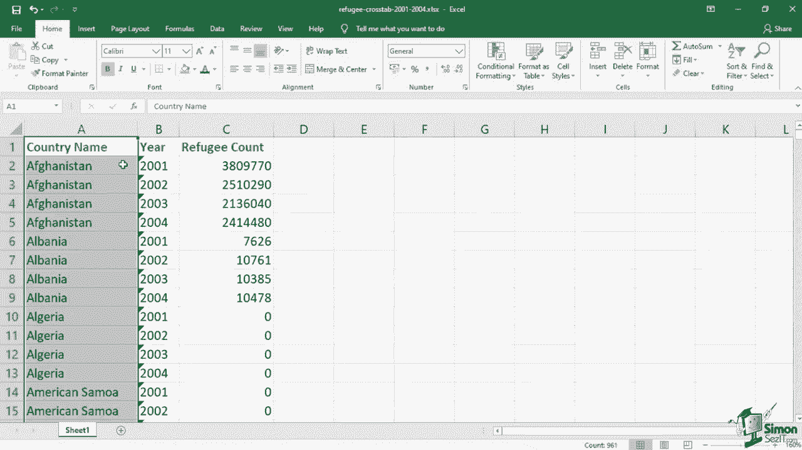
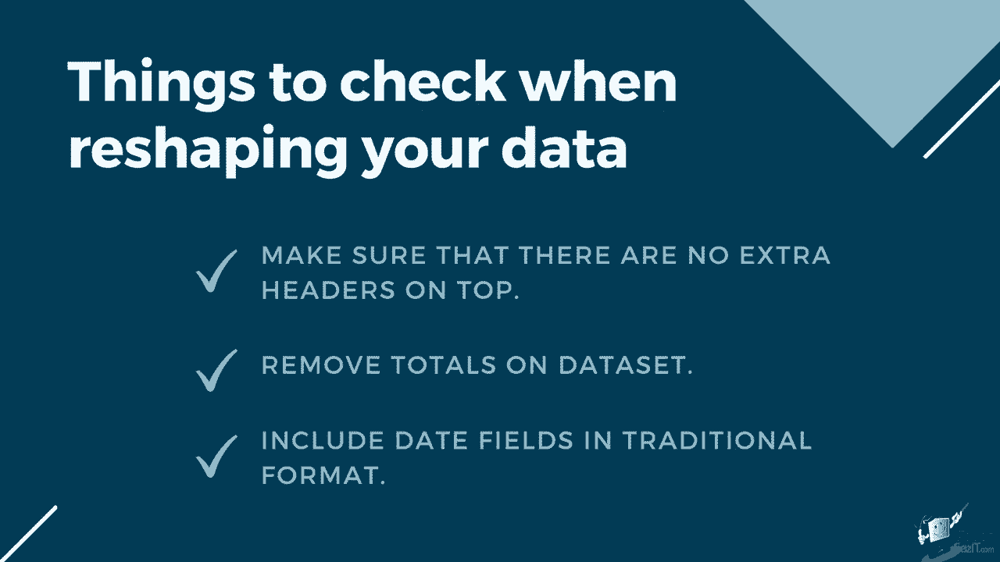
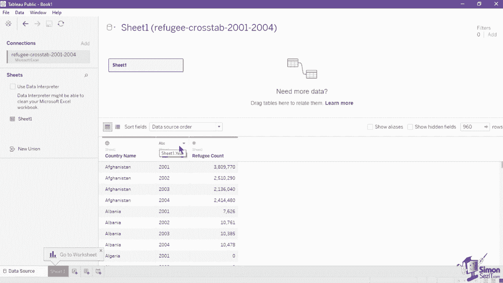
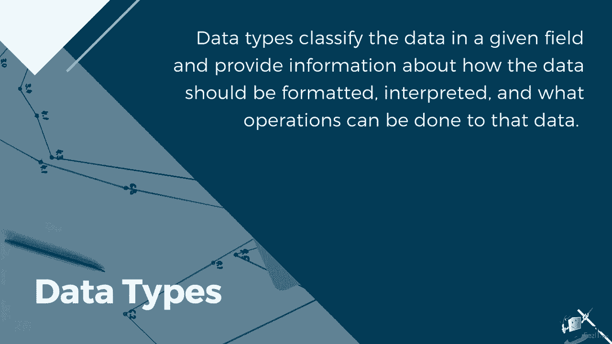
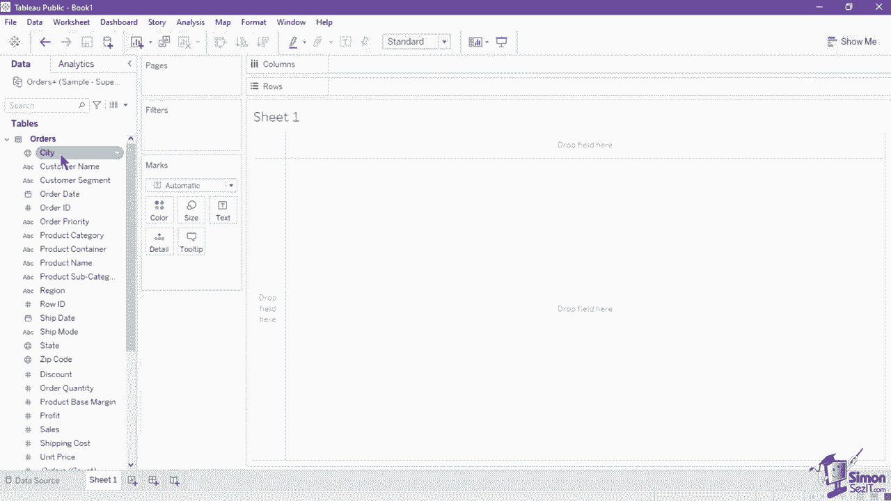
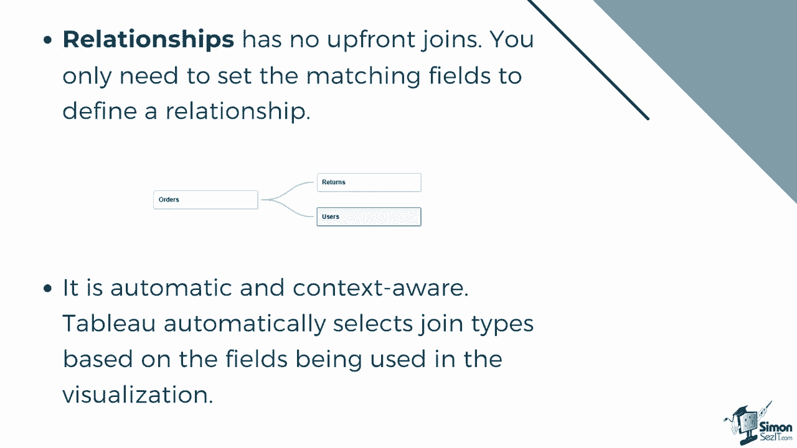
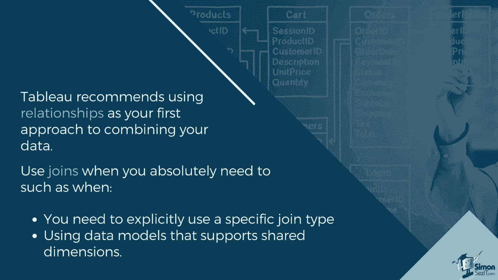

# 数据可视化神器 Tableau！P5：5）Tableau 数据概念 

理解数据概念和正确的结构对高效使用 Tableau 平台至关重要。与您非常熟悉的数据一起工作，可以让您正确可视化并突出您的分析。让我们开始学习应该使用哪种数据结构。

Tableau 最适合格式化为表格的数据，类似于电子表格。即数据采用垂直格式，字段名称位于列的标题中，而数据值则放置在行中。知道这一点后，数据分析的初学者可能会问，如何区分是行还是列？一行或记录包含数据值。

1条数据记录意味着表格中的一行水平行。例如，在这个超市销售的 Excel 文件中，行中的每条数据对应单独的记录。而列则是表格中的单个字段或垂直组。

在这个表中，我们有客户名称列和城市。每列的标题或标签称为字段名称，以避免混淆。只需记住，列是垂直的，行是水平的。有些数据源可能采用宽格式，例如这个难民统计数据集。

这种格式可能更容易让人阅读和理解，但在将这些数据导入 Tableau 时，每一年将被视为单独的列。因此，我们将有2001、2002、2003和2004的独立字段。这使我们很难进行跨时间的分析，因为每个数据存储在不同的字段中。

另一个问题是值没有自己的字段名称或上下文。由于数据采用宽格式，每行代表不同的国家，列显示年份值，因此我们没有任何指示来说明阿尔巴尼亚的数字76、26和2001所对应的内容，以解决此问题。

我们可能需要在将数据导入 Tableau 之前将其重新塑造成高格式。在这种格式下，我们现在有国家名称、年份和难民数量作为每行的字段名称。使用这个数据集进行分析要容易得多，因为每个字段现在代表数据的独特特性。

重新塑造数据集时，有一些额外的检查项。确保顶部没有多余的标题。前两行对 Tableau 理解数据源至关重要，因此最好删除插入在正确字段名称上方的标题和标题。删除数据集中的“总计”。Tableau 可以自动为您计算总数。

因此，保留这些总列是没有必要的，可能会导致重复计算。最好使用传统格式的日期字段，而不是转换为年份、月份或其他日期聚合的格式。Tableau可以自动聚合日期，因此使用传统格式可以更有效地解锁日期字段的全部功能。

现在，让我们看看Tableau如何读取和分类字段。你可能会注意到，在将Tableau连接到新数据源时，每个字段名称上方会出现一个符号。这些符号表示每一列的数据类型。数据类型对给定字段中的数据进行分类，并提供有关数据应如何格式化的信息。

解释以及可以对这些数据执行哪些操作。例如，数值字段可以进行数学运算，而地理字段可以进行地图映射。ABC图标用于文本或字符串字段，如客户名称和产品类型。

日历图标指的是日期字段，如发票日期和发货日期。而带时钟的日历图标指的是日期和时间字段，如上次系统刷新。井号图标指的是数值字段，如利润和订单ID。TF图标显示布尔值，仅包含关系值，或真或假。

最后，我们有Gbe图标，它指的是地理字段，如邮政编码和国家。当你创建新视图时，所有这些字段及其相应的数据类型图标也会列在数据窗格中。这些字段随后会被Tableau分类为维度或度量。维度有蓝色数据类型图标和蓝色胶囊。

当你悬停在字段名称上时，会显示该图标。度量有绿色数据类型图标和绿色胶囊。

维度包含定性值，意味着它们无法测量，而是被描述。维度通常是城市或国家、眼睛颜色、类别、团队名称等。你可以使用维度对数据进行分类、分段并揭示细节。此外，维度会影响视图中的详细程度。度量包含数值。

定量值可以用数字进行测量和记录。度量可以进行聚合。

在数据平面中，维度默认首先列出，后面是通过一条线分隔的度量。为了显示维度和度量之间的区别，我们将在此表中创建一个显示每个产品类别销售情况的条形图。将销售字段拖入行架上。由于销售具有数值，因此被视为度量。

正如我们所见，Tableau自动使用默认聚合度量（求和）对其进行了聚合。聚合是将值聚集成一组，以便将其作为整体进行可视化，而不是使用每个单独的值。由于聚合方法设置为求和，我们现在可以看到柱状图标记为总销售额，接近1500万。我们将在本课程的后续学习中了解更多不同的聚合方法。

接下来，我们来看看维度如何影响这个可视化。我们将产品类别字段添加到列架上。由于产品类别字段是一个维度，它将数据分为三个产品类别。你还可以将产品类别小药丸移动到颜色标记卡中，以按颜色对柱状图进行分段。

Tableau根据维度和度量是离散还是连续来以不同方式表示数据。离散值是单独分开的，彼此不同，因此只能包含某些可计量的值。例如，不同类型的产品是离散的。每个产品的销售也被视为离散的。

连续值可以是无限的。它可以在特定范围内取任何值，包括时间或间隔。一个人的年龄被视为连续的。比赛时间和冰箱的温度也是连续值。

在这个柱状图中，我们有一个利润的连续度量和一个订单日期的离散维度。正如你所见，图表没有X轴线，因为订单日期的年份被设置为离散或独特的年份值。年份被视为每个柱子的标题或标签。现在，让我们将其与这个使用相同数据的第二个图表进行比较。在这个折线图中，我们仍然使用利润的连续度量。

但订单日期的季度被设置为连续，如其绿色小药丸所示。请注意，现在X轴线是可见的。这个订单日期不可排序，因为它遵循从左到右的时间顺序，从最早的日期到最近的日期。

如果你想创建一个显示趋势随时间变化的图表，你可能会选择连续类型的值，但如果你需要一个可以排序的图表，你就必须使用离散值。维度通常是离散的，而度量通常是连续的。然而，这并不总是如此。你可以通过右键点击小药丸显示其菜单，选择离散或连续选项来更改小药丸为离散或连续。

在使用多个数据源时，您可能会遇到术语“关系”和“连接”。这两者都将来自多个表的数据结合在一起，但功能并不相同。数据关系是一种动态、灵活的数据结合方式。可以把它想象成表之间的一个合同。Tableau使用该合同从这些表中提取数据，以构建包含适当连接的查询。

关系没有前期的连接。您只需设置匹配字段来定义关系。该关系在数据源画布的逻辑层中可见，其中一条灵活的线连接或显示表之间的关系。

在上下文感知的Tableau中，它会自动选择基于可视化中使用的字段的连接类型。在分析过程中，Tableau智能地调整连接类型，并保留数据的原生细节级别。您可以看到可视化中字段的细节级别的聚合，而无需考虑底层连接。

连接是一种更静态的数据结合方式。连接必须在分析前在物理表之间定义，并且可以更改而不影响使用该数据源的所有工作表。连接表总是合并为一个单一表。它们在数据源画布的物理层中以维恩图标识连接类型。它还要求您设置连接类型和相关条款。

Tableau建议将关系作为结合数据的首选方法，因为这使数据准备和分析变得更简单、更直观。当您绝对需要时可以使用连接，例如在明确使用特定连接类型或使用支持共享维度的数据模型时。

