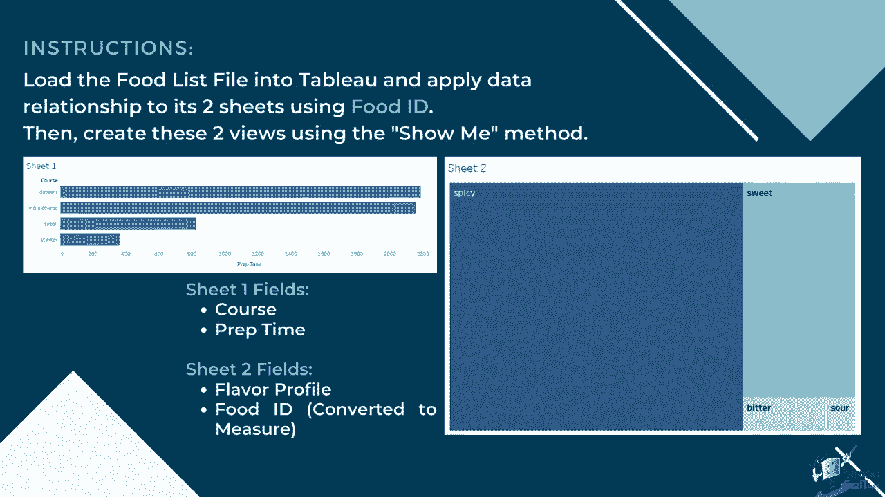
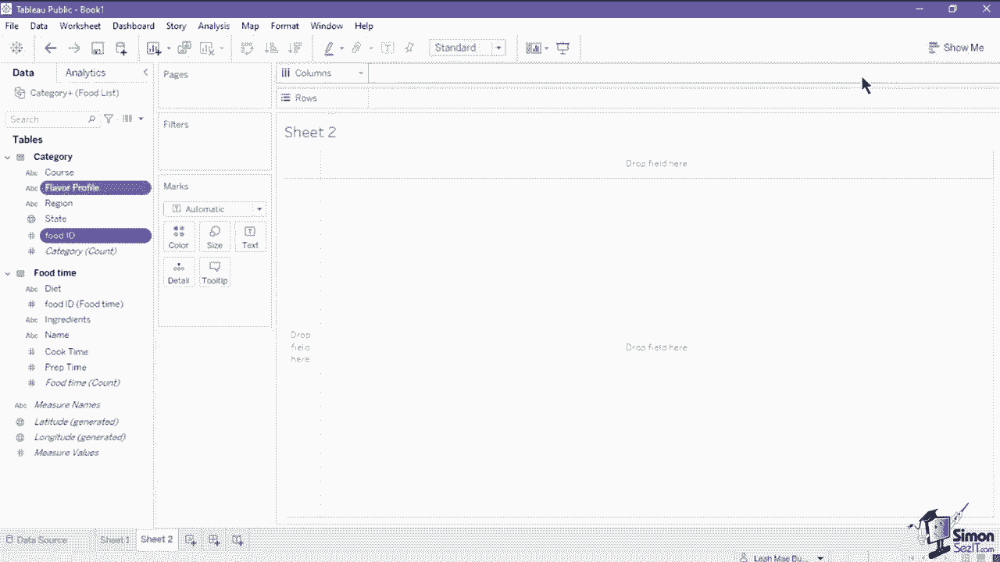
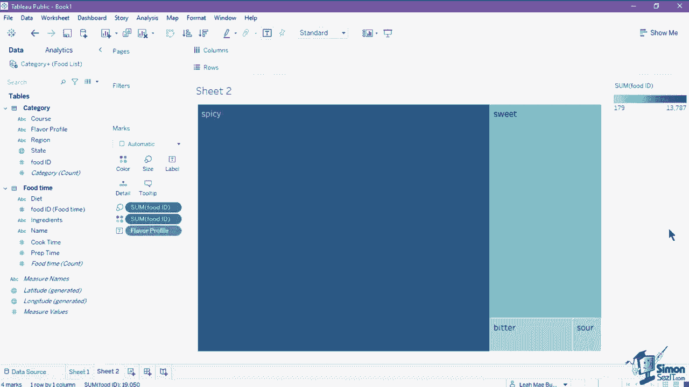

# 数据可视化神器 Tableau！无需编程，使用拖拽和点击就能做出超精美的图表。1小时新手教程，从安装到做图一气呵成~＜快速入门系列＞ - P11：11）Tableau 练习 

在这个练习中，你将把食品 L 文件加载到 Tableau 中，并使用食品 ID 为两个工作表应用数据关系。然后你将使用 Showmi 方法创建两个视图。工作表 1 包含课程和准备时间，而工作表 2 包含风味资料和食品 ID，这将被转换为度量。

让我们开始加载数据集。将 Excel 文件食品清单拖入开始页面。加载数据后，这将引导你进入数据源页面，在那里你可以将工作表拖入画布。将类别工作表拖入画布，然后连接食品时间工作表以创建关系。将字段设置为食品 ID。一旦设置了关系字段。

现在我们可以关闭编辑关系窗口，然后打开一个新的工作表。因为我们将使用 Showmi 方法。我们需要选择适合在图表中使用的字段。点击课程，然后按住键盘上的控制键，点击准备时间。一旦选择了字段，点击右上角的 Showhow me 按钮。

然后从选择中选择横条形图。这将从我们选择的字段生成横条形图。通过拖动课程轴上的一个字段来调整条形的大小。这完成了我们的第一个视图。点击添加工作表按钮以创建另一个工作表。首先。

我们需要将食品 ID 转换为度量。右键单击食品 ID 字段，然后点击转换为度量。这会将食品 ID 字段变为绿色，这意味着它已被转换为度量。接下来，点击食品 ID，然后按住控制键选择“个人资料”。

然后导航到“显示我”按钮并选择树图。这将从我们选择的两个字段生成树图。你可以进一步根据树图中的框调整标签或字段的大小。进入标签卡，选择字体大小，然后点击应用进行更改。

这完成了第二个视图和我们的第一次练习。
