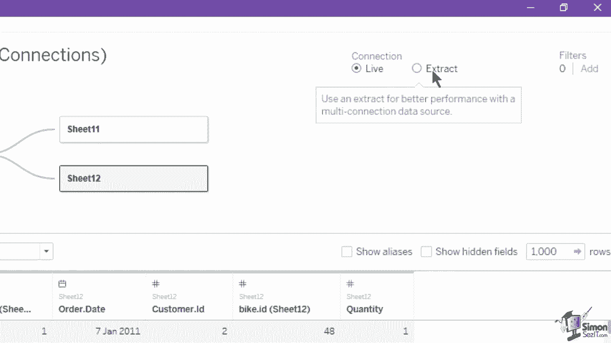
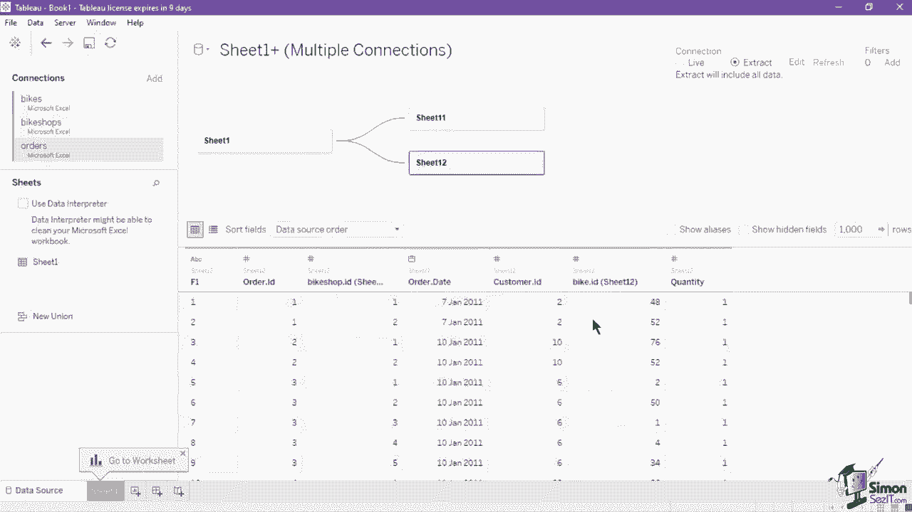
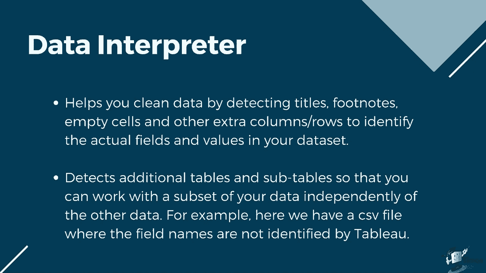
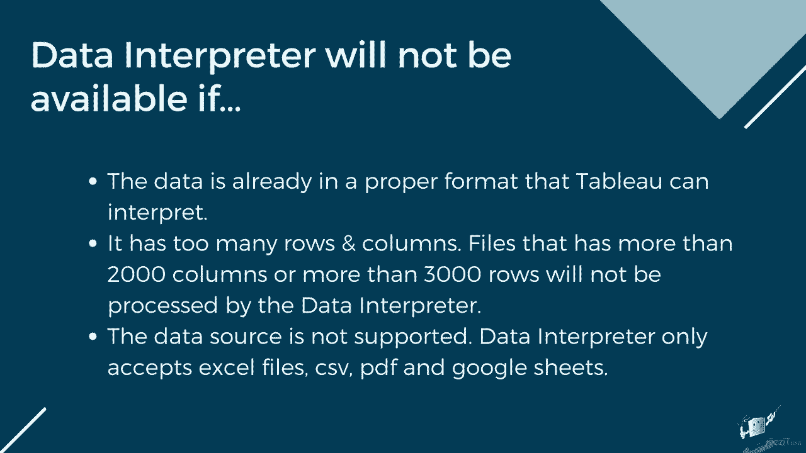

# 数据可视化神器 Tableau！无需编程，使用拖拽和点击就能制作出超精美的图表。1小时新手教程，从安装到做图一气呵成~＜快速入门系列＞ - P7：7）Tableau 中的数据源 

我们在创建 Tableau 数据源连接时利用了数据源页面。让我们看看它提供的其他功能，这些功能可以帮助我们修改数据并为可视化做准备。首先，让我们查看左上角的连接部分。数据库部分列出了你已连接到 Tableau 的当前文件或数据库，具体取决于数据源。

此列表包含数据源的标题和数据连接的类型。你添加的第一个数据源将标记为蓝色。请注意，如果我们再添加第二个数据连接，新的连接将有不同的颜色标签。这是为了方便识别和区分每个独立连接。你还可以观察到在数据预览和元数据网格上应用的颜色方案，其中来自不同连接的选定工作表或表格将有不同颜色的标签。使用连接部分的添加按钮添加新数据连接，就像我们之前演示的那样。

不会替换列表中的当前数据连接。相反，它将插入第二个可以与您链接的第一个连接相关联或连接的连接。如果你想替换其中一个连接，请导航到你想要替换或编辑的连接，然后点击其下拉按钮。在菜单中选择“编辑连接”。

要打开文件 B 或数据库连接菜单，在这里你可以选择新的连接。请记住，这里列出的连接列表并不代表工作簿中所有可用的数据源。这仅适用于工作表 1 数据源，如画布上的数据源名称所示。一个数据源可以始终包含一个或多个数据连接。

你可以通过点击左上角的圆柱图标并在列表中选择“新数据源”来拥有一个与此连接分开的新数据源连接。

这将打开一个窗口，显示 Tableau 支持的所有数据源的完整列表。

如果你希望删除已创建的数据源，请确保该数据源当前已被选中，如画布上数据源名称所示。然后在功能区的“数据”菜单中选择“关闭数据源”。除了数据源名称外，我们在画布右上角也有使用单选按钮的连接类型。

你可以选择使用提取连接或实时连接到你的数据源。默认情况下，Tableau 将连接类型设置为实时。实时连接意味着它与底层数据直接连接。实时连接提供了实时更新的便利，数据源中的任何更改都会自动反映在 Tableau 中。

但是实时连接也依赖于数据库进行所有查询。因此，它并不总是优化为快速性能。您的数据查询速度将仅与数据库本身一样快。工作簿的速度也可能受到您的网络速度、流量和任何自定义SQL的影响。具有实时连接的复杂工作簿也可能对一些传统数据库造成压力。提取。

另一方面，提取是针对聚合优化的数据快照，加载到系统内存中以便快速回调进行可视化。当您使用提取连接类型时，Tableau会创建一个TDE或Tableau数据提取文件。当您从本地文件（如CSB或Excel工作簿）或本地数据库创建提取时，您通过优化加快了工作簿的速度。因此。

Tableau不需要数据库来构建可视化。相反，Tableau的内存数据引擎直接查询提取。提取通常比实时连接快，尤其是在具有大型数据集、过滤器和计算的复杂可视化中。

由于提取已嵌入，因此即使在离线状态下也可以使用您的数据源。这种连接类型的一个缺点是数据需要刷新才能接收来自原始数据源的更新。如果您的数据结构有太多行和列，提取刷新可能会变得缓慢。

在画布中选择提取连接类型将显示两个新按钮，以编辑和刷新当前提取。点击编辑会打开一个新窗口，您可以设置提取数据的存储方式。定义过滤器，汇总数据，并选择要包含在提取中的行。在连接类型之后是添加过滤器的部分。在您的数据。

这将根据您指定的过滤器减少数据源中的数据量。数据源过滤器在您发布工作簿或数据源时，对于限制用户能够看到的数据非常有用。当您将数据源发布到Tau服务器时，数据源及其任何关联的文件或提取都会移入服务器。

在发布数据源时，您可以定义下载或修改数据源的访问权限，还可以选择能够通过Tableau服务器远程查询该数据源的用户和组。在数据源页面上点击添加按钮将打开一个新窗口，您可以在其中添加、编辑和移除应用于数据源的过滤器。要添加新的过滤器，点击添加按钮，然后选择一个字段作为过滤器基础。一旦您选择了字段。

现在，您可以通过从列表中选择可用值来指示过滤器值，设置通配符，指示条件或通过字段或公式的顶部记录进行过滤。数据源页面上的另一个实用功能是数据解释器。数据解释器通过检测标题、脚注来帮助您清理数据。

空单元格和其他多余的列/行用于识别数据集中实际的字段和值。

它甚至可以检测到额外的表和子集，以便你可以独立处理数据的一个子集。例如，这里我们有一个字段名称未被Tableau识别的CSB文件。我们通过勾选工作表列表上方的数据解释器复选框来启用数据解释器，观察数据如何变化。这样，F1到F5列现在已被以前在第二行的正确字段名称替换。

它还将国家名称的数据类型从字符串更改为地理类型。要查看数据解释器所做的所有更改，可以点击查看结果，这将输出一个Excel文件，列出使用原始数据副本的变化，并带有颜色编码的单元格。

数据解释器功能并不总是适用于所有数据集。如果数据已经处于Baau可以解释的正确格式，它将不会在数据源页面显示。具有超过2000列或超过3000行的文件将不会被数据解释器处理。

数据源不受支持。数据解释器仅接受Excel文件、CSB、P和Google表格。

如果数据解释器所做的修改不足，你可以随时使用数据面板中的功能进行基本的数据格式化。例如，让我们继续使用我们通过数据解释器清理的CSV文件。由于列处于宽格式，我们需要以一种方式透视数据，使年份在一列中，数值在另一列中，以便于可视化。

为此，选择将被透视的字段。在这种情况下，我们将选择2001到2004列。点击2001，同时按住键盘上的Shift键，然后点击2004列以选择这三列。然后右击鼠标，在菜单中选择透视。

这将使用选定的数据创建两个新列，字段名称将作为透视字段名称，透视字段值。现在，你只需重命名它们。要重命名一列，选择一个并点击其下拉按钮，选择重命名功能，然后输入新的列名称。

你也可以通过双击字段名称并输入新字段名称来重命名字段。如果你希望恢复原始文件名称，请点击列的下拉菜单并选择重置名称。除了重命名功能，你还可以应用排序。将鼠标悬停在特定字段名称上，直到排序按钮出现在右侧。

点击排序按钮一次将数据按升序排序，如图标所示。再次点击排序将其排序为升序和降序。第三次点击排序按钮将移除排序。正如我们在早期课程中讨论的，Tableau 会根据一系列常用模式自动分配数据类型给数据。

这些数据类型在数据面板和元数据视图中以图标的形式显示。要更改字段的数据类型，点击数据类型图标并从菜单中选择新的数据类型。应始终观察正确的数据类型，因为它将决定可以应用于该字段的可视化、计算和功能。你还可以使用数据平面上的功能将字段拆分为单独的列。

点击串联字段的下拉菜单，选择拆分功能。默认情况下，Tableau 使用空格作为分隔符将其拆分为两列。如果你想指定符号作为分隔符，可以在字段下拉菜单中使用自定义拆分功能，选择自定义拆分功能。这将打开一个新窗口，你可以在其中指示特定的分隔符或定界符，以及将从第一列、最后一列或整列拆分的列数。

最后，我们有别名功能。别名是维度中成员的替代名称，以便它们在视图中以不同的标签出现。要创建别名，选择字段并点击菜单中的下拉菜单，选择别名。这将显示一个新窗口，列出所选字段上可用的所有成员或值。要创建别名，请在值列下重命名别名。这样，Tableau 将使用别名作为图表标签中可见的值。

但是你仍然可以在数据平面上看到其原始值。😊请注意，别名仅为离散维度创建，因为这些类型的数据具有有限的值。此功能不适用于连续字段和度量。我们学到的基本格式化功能都在 Tableau 内部完成。

这些都不适用于原始数据源。数据库部分列出当前连接到 Tableau 的特定数据源下的文件或数据库。这列出了数据源的标题和数据连接类型。你添加的第一个数据源将被标记为蓝色。

请注意，如果我们为其添加第二个数据连接，新的连接将有不同颜色的标签。这是为了便于识别和区分每个独立的连接。你还可以观察数据预览和元数据网格上应用的颜色方案。

在不同连接中选择的工作表或表将具有不同的颜色标签。使用连接部分的添加按钮添加新数据连接不会替换列表上的当前数据连接，而是将插入第二个连接，可以与第一个连接相关联。如果你想替换其中一个连接。

导航到你想要替换或编辑的连接，然后单击其下拉按钮。选择编辑连接以打开文件浏览或数据库连接菜单，在这里你可以选择新的连接，如果你希望删除已创建的数据源。

确保源当前被选中，如画布上数据源名称所示，然后导航到功能区的数据菜单并选择关闭数据源。除了数据源名称外，我们在画布的右上方还有连接类型，使用单选按钮。

默认情况下，你可以选择使用或提取连接到数据源。Tau将连接类型设置为实时，选择画布中的提取连接类型将显示两个新按钮，用于编辑和刷新当前提取。单击编辑会打开一个新窗口，你可以在其中设置提取数据的存储方式。

定义过滤器，聚合数据并选择在连接类型后包含在提取中的行，是用于在数据上添加过滤器的一个部分。这将根据你所指示的过滤器减少数据源中的数据。数据源过滤器在发布工作簿或数据源时，对于限制用户可以看到的数据非常有用。当你将数据源发布到Tau服务器时，数据源及其任何相关文件或提取将被移动到服务器中。

发布数据源时，你可以定义下载或修改数据源的访问权限。你还可以选择哪些用户和组可以通过Tableau的服务器远程对该数据源发出查询。单击数据源页面上的添加按钮将打开一个新窗口，在那里你可以添加、编辑和删除应用于数据源的过滤器，以添加新过滤器。

单击添加按钮，然后选择一个字段作为过滤器的基础。一旦你选择了字段，现在可以通过从列表中选择可用值来指示过滤器值。设置通配符，指示条件或根据字段或公式按顶部记录过滤。

数据源页面上的另一个便捷功能是数据解释器。让我们通过勾选工作表列表上方的数据解释器复选框来开启数据解释器，并观察其如何改变数据。这样做后，F1到F5列现在已被原来的适当字段名称替换。

在第二行，它还将国家名称的数据类型从字符串更改为地理类型，以检查数据解释器所做的所有更改。你可以点击查看结果，这将输出一个Excel文件，列出使用原始数据的更改，并带有颜色编码的单元格。

