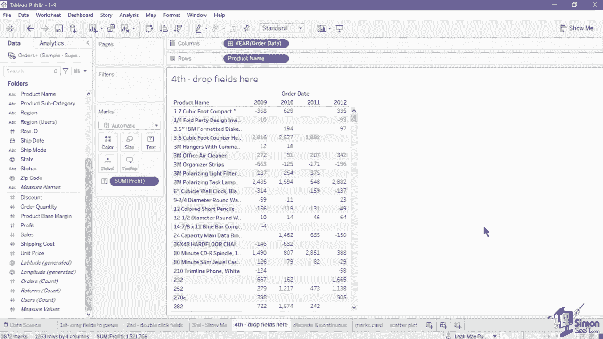
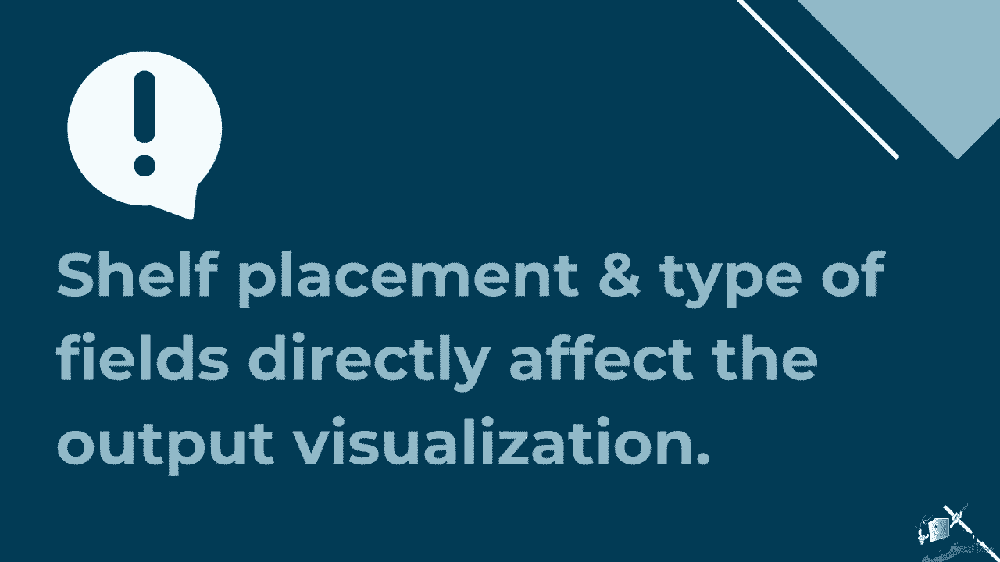
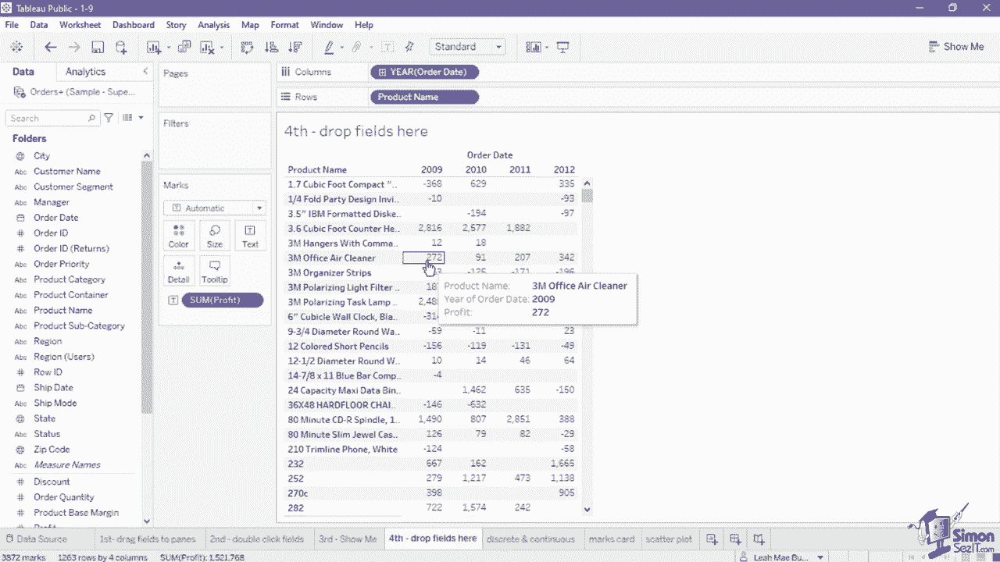

# 数据可视化神器 Tableau！无需编程，使用拖拽和点击就能制作出超精美的图表。1小时新手教程，从安装到做图一气呵成~＜快速入门系列＞ - P9：9）在 Tableau 中创建新视图 

在创建视图时，你应始终从一个将通过可视化回答的问题开始。你想知道今年的销售增长是多少吗？你可以将客户分为哪个类别？一旦你心中有了问题，就可以开始构思你的视图。

在 Tableau Desktop 中创建视图有四种方法。首先是从数据面板拖动字段并将其放置到卡片和货架上。在这里，我们将销售度量拖动到颜色和标记卡中。然后我们将产品类别添加到标签中。完成后。

现在我们的视图中有一个树形图，矩形显示每个类别的销售额，并且根据销售额的多少进行颜色编码，从最少的淡蓝色到最多的深蓝色。😊如果你已经熟悉字段和卡片的位置如何影响可视化，这种方法非常适合使用。

创建视图的第二种方法是双击数据面板中的一个或多个字段。在这个第二个工作表中，双击维度字段邮政编码。这将执行查询以处理邮政编码并生成其纬度和经度。完成后，双击度量字段运费。

运费决定了在创建的符号图中每个点或圆圈的大小。如果你对使用的图表或图形类型没有特别要求，这第二种方法非常实用。因为 Tableau 会根据你选择的字段类型自动生成视图。第三，你可以通过选择数据面板中的一个或多个字段来创建视图。

然后使用“显示我”来设置图表。在此视图中，选择维度客户细分。然后按住键盘上的控制键并选择度量订单数量。一旦需要的字段被选中，导航到右上角的“显示我”按钮并选择水平条形图。选择图表后，Tableau 会生成按客户细分分组的水平条形图，每个条的长度基于总订单。

使用“显示我”方法对于初学者来说非常好，可以让他们熟悉基于所选字段可用的图表类型。第四种方法是将字段拖入画布的字段拖放区域。将订单日期拖到列标题区域。一旦完成，将产品名称拖到行区域的最左侧。

显示出一个折线指示器。最后，将利润字段添加为值。结果创建了一个文本表。请注意，这第四种方法仅限于表格视图。

理解字段的放置和类型如何影响输出可视化也是至关重要的。

正如我们从数据概念中讨论的那样。我们将数据分类为维度或度量，然后再进一步分类为离散或连续。让我们看看每种类型如何创建不同的图表。离散维度创建值的类别或组。例如。

我们在这个表格上有一根条形，标记了销售的总和。观察当我们添加一个离散维度时会发生什么。将产品类别拖到列架上。正如你所看到的，它使用产品类别将条形分成了三个，这是一种离散维度字段。

大多数情况下，维度被分类为离散，因为它们包含单独的、唯一的值。但例外的是日期数据类型字段。日期可以转换为离散或连续。让我们看看它在这个表格中的可视化效果。我们仍然使用销售作为度量值。

将订单日期拖到列架上，然后单击字段下拉并将其转换为连续。这会生成一个根据销售数据按年份自动排序的折线图。连续维度在可视化中创建一个数字轴。现在，让我们看看连续度量的外观。在我们创建的相同折线图上。

在行架上放置的销售数据设置为连续度量。正如你在图表的纵轴上观察到的，它创建了一系列值，从0到400万。度量大多被分类为连续，因为它们的值范围。但这并不意味着你不能使用离散度量。

让我们清除此表格上的项目并创建一个新图表。将产品子类别的离散维度字段拖到行架上。然后我们加入度量，拖动销售数据并将其放在产品子类别后的行上。请注意，由于这仍然是一个连续度量，它创建了一个条形图。

每行都有各自的轴。当我们将其转换为离散度量时，会发生什么呢？在销售字段的下拉列表中，将其设置为离散。由于转换，条形被替换为普通文本。离散度量在可视化中显示为标签或普通文本。创建视图时另一个重要的部分是标记卡。

标记卡提供了控制点或标记在视图中外观的能力。它可以为图表的标记应用不同的属性，从而增加附加的含义和细节。标记卡的第一部分是一个下拉列表，你可以控制在视图中显示的标记类型。默认标记设置为自动，Tableau会生成最适合数据的标记类型。

在此工作表中，我们在列中有一些销售额，在行架中有一些利润。由于这两个字段在架子中都是连续度量，Tableau 会自动生成一种形状标记类型，以绘制这两个度量之间的总值。自动选择的标记类型符号在下拉菜单中可见。

当我们将销售总额更改为离散维度时，请观察变化。我们先移除销售总额的胶囊，然后拖入客户细分字段。现在每个值的标记设置为条形。标记卡的符号也更改为条形。将标记类型设置为自动将让 Tableau 根据我们拖入行和列架的字段类型选择标记。这并不意味着您不能根据自己的喜好更改标记。

如果您需要不同的视图，您总可以在列表中选择不同的标记类型。例如，如果我们将标记类型设置为区域，则可以轻松将此条形图更改为面积图。标记类型下方是使用不同颜色的颜色，让用户轻松区分视图中的不同标记。默认颜色设置为蓝色。

但您可以根据静态颜色自定义此项，通过从调色板中选择新颜色，或将字段拖到颜色卡中。例如，让我们将标记类型更改回条形，然后将客户细分字段从数据面板拖到颜色卡中。这为每个客户细分的条形应用个别颜色，以更改所使用的颜色。

您可以点击颜色卡并在新窗口中选择编辑颜色按钮。您可以从下拉菜单中分配不同的调色板，或使用当前调色板为每个细分选择新颜色。接下来，我们在当前条形图中有大小卡。这调整条形的宽度。您可以使用滑块增大或缩小标记的大小。与颜色一样。

您还可以通过将字段拖到大小卡上来设置动态大小。形状卡仅在卡片设置为散点图、符号图或圆形视图时可见。在此工作表中，我们有一个散点图，目前只有一个单一的点，显示总销售额与利润的交集。

让我们在形状卡中添加一个字段，看看会发生什么。将产品类别字段添加到形状卡中。在之前我们将离散维度指定为形状的指示器。单一的点现在根据维度的成员划分为三种不同形状的标记。

点击形状卡片将打开一个新窗口，您可以选择使用的形状或更改为不同的形状调色板。此外，Tableau 在画布右侧提供了一个图例作为参考。另一种向视图添加单独标记的方法是使用详细信息卡片。将另一个维度拖放到详细信息卡片中会为视图添加另一个粒度级别。

例如，让我们将产品子类别添加到散点图的详细信息卡中。这会在网格中添加额外的产品点，但不会改变结构，并且点仍然通过形状卡分开。在形状卡上方是标签。简单来说，它决定了在视图中显示的标签或文本值。例如。

让我们继续处理这个散点图，并为每个点指示一个标签。从数据窗格中拖动另一个产品类别字段到标签卡。这为每个点添加了产品类别名称。点击标签卡时，可以使用额外选项更改字体颜色和标签对齐。

在处理类似于这个第四个工作表的表格数据时，标签被文本替换。它允许你将纯文本值插入表中。你可以通过点击文本卡并点击三个点打开文本编辑器窗口来向表中添加额外的字段或文本。在这个窗口中，你还可以设置字体、大小、样式和颜色。

表格中文本的对齐。最后，我们有工具提示。当你悬停在视图中的一个或多个标记上时，工具提示会显示信息。默认情况下，工具提示将包含我们添加到视图中的字段信息，例如列和行上的字段，以及用于标记的字段。

工具提示可以包含动态和静态文本，以在工具提示中添加字段信息。将字段拖入工具提示卡。例如，让我们将度量订单数量设置到工具提示中。将其拖动到工具提示卡中作为度量或维度的聚合值。

你可以通过点击工具提示卡编辑文本格式和排列。在 Tableau 桌面中创建视图的方式有四种。第一种是将数据窗格中的字段拖动并放置到卡片和货架上。在这里，我们将销售度量拖入颜色卡和标记卡。

然后我们将产品类别添加到标签中。这样做后，我们的视图中现在有一个树状图，显示每个类别带来的销售额，并且根据销售额从最少的浅蓝色到最多的深蓝色进行了颜色编码。

创建视图的第二种方式是双击数据窗格中的一个或多个字段。😊在这个第二个工作表中，双击维度字段邮政编码。这将执行查询以处理邮政编码并生成其纬度和经度。完成后，双击度量字段运费，运费决定了在符号图中每个点或圆圈的大小。

第三，你可以通过在数据面板中选择一个或多个字段来创建视图。然后使用“显示我”来设置图表。在此视图中，选择维度客户细分。然后在键盘上按住控制键并选择度量订单数量。一旦所需的字段被选择，导航到右上角的“显示我”按钮并选择水平条形图。

一旦选择了图表，Tableau会生成按客户细分分组的水平条形图，每个条形的长度基于总订单数量。第四种方法是将字段拖入画布的下拉字段网格。将订单日期拖入列标题网格。一旦完成，将产品名称拖入行网格，放在最左侧。

这显示了一个折线指示器。最后，添加字段利润作为值。因此，创建了一个文本表。请注意，这第四种方法仅限于表格视图。当我们创建视图时，学习标记卡也是另一个重要部分。标记卡提供了对视图中点或标记外观的控制。

它可以为图表的标记应用不同的属性，从而增加额外的意义和细节。标记卡的第一部分是一个下拉列表，您可以在其中控制视图中显示的标记类型。默认标记设置为自动，Tableau会为数据生成最佳标记类型。在此工作表中，我们在列中有销售总额，在行架中有利润总额。

由于架子上的两个字段都是连续度量，Tableau自动生成一个标记类型来绘制两个度量之间的总值。自动选择的标记类型符号在下拉菜单中可见。当我们将销售总额更改为离散维度时，请观察变化。

让我们删除销售总额药丸并拖入客户细分字段。每个值的标记现在设置为条形。标记卡的符号也更改为条形。将标记类型设置为自动，让Tableau根据我们拖入行和列架的字段类型选择标记。如果需要不同的视图，你始终可以在列表中选择不同的标记类型。例如。

我们可以轻松地将这个条形图更改为区域图。如果我们将标记类型设置为区域。在标记类型下是颜色，使用不同的颜色，让用户能够轻松区分视图中的不同标记。默认颜色设置为蓝色，但你可以根据静态颜色自定义，从调色板中选择新颜色。

或通过将字段拖入颜色卡。例如，让我们将标记类型更改回条形图，然后将客户细分字段从数据面板拖入颜色卡。这为每个客户细分的条形图应用了不同的颜色。接下来，我们有大小卡。在当前的条形图中，这会调整条形的宽度。

你可以使用滑块来增加或减少标记的大小。形状卡仅在设置为散点图、符号图或圆形视图时可见。在这个表中，我们有一个散点图，目前只有一个单一的点，显示总销售额和利润的交集。

在详细信息卡中添加另一个维度会为视图增加一个粒度层级。例如，让我们将产品子类别添加到散点图的详细信息卡。这会在网格中添加额外的产品点，但不会改变结构，点仍然通过形状卡按形状划分。

形状卡上方是标签，简单来说，它决定了在视图中显示的标签或文本值。将另一个产品类别字段从数据窗格拖入标签卡。这为每个点添加了产品类别名称。最后，我们有工具提示。工具提示是在视图中悬停在一个或多个标记上时出现的信息。

默认情况下，工具提示将包含我们已添加到视图中的字段信息，例如列和行上的字段。
