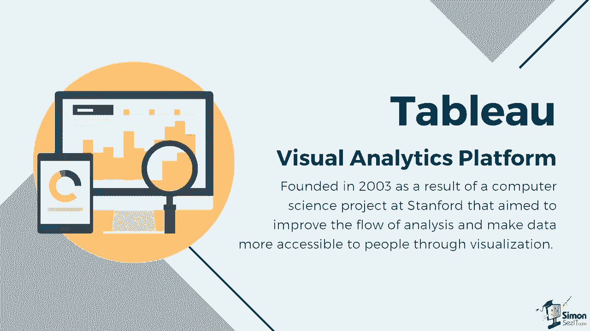
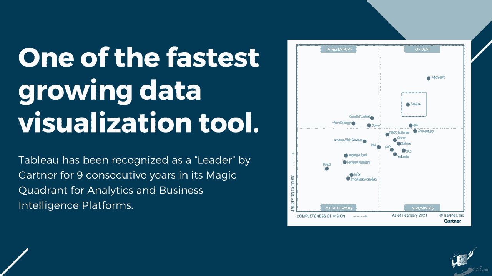
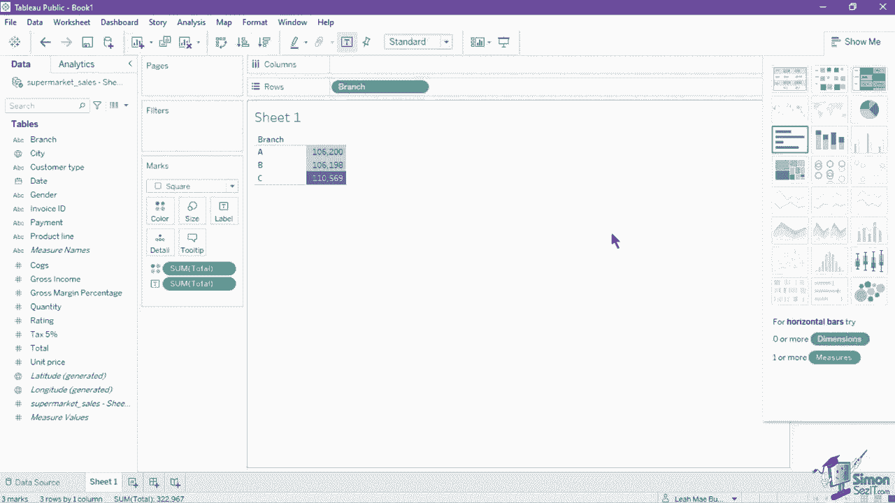
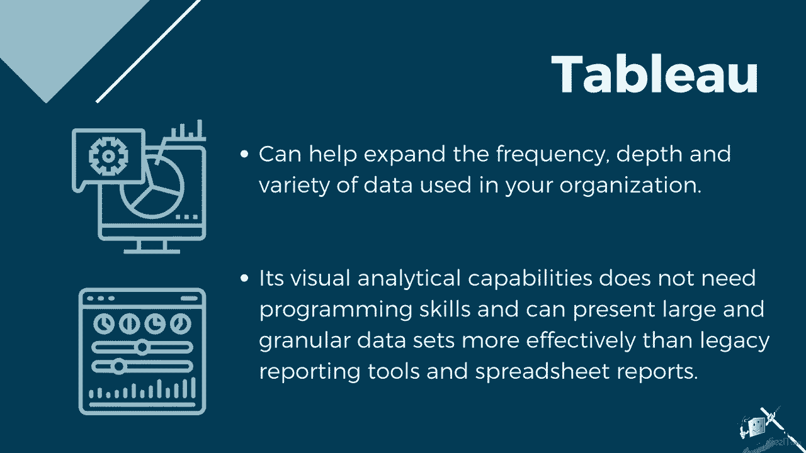

# 数据可视化神器Tableau！无需编程，使用拖拽和点击就能做出超精美的图表。1小时新手教程，从安装到做图一气呵成~＜快速入门系列＞ - P1：1）Tableau简介 - ShowMeAI - BV1T341117q7

订阅。并点击铃铛图标以开启通知。我们为本教程提供的练习文件可以免费获取。只需点击视频详情中的链接即可下载这些文件。

许多领先行业使用Tableau将现代商业智能应用于他们的系统。Tableau是一个视觉分析平台，成立于2003年，源于斯坦福大学的一个计算机科学项目，旨在改善分析流程，并通过可视化使数据对人们更易于获取。

它目前是增长最快的数据可视化工具之一，功能强大、易于使用，并且可以轻松集成。Tableau已连续九年被Gartner评选为分析和商业智能平台的领导者。

Tableau拥有灵活的前端和直观的界面，通过将拖放操作转化为数据查询来可视化数据。该软件可以连接、融合和提取来自各种来源的数据，例如Excel等平面文件。它还可以连接不同类型的数据库或实时连接，甚至从网络获取数据。Tableau将数据层与展示层分开，并使更新电子表格数据源成为向源电子表格底部简单附加的操作。

Tableau帮助将原始数据简化为易于理解的格式。只需几次点击，你就可以创建既互动又可分享的图表和视图。它易于学习，任何Excel用户和非技术人员都能掌握，但它仍然强大到足以处理复杂的分析过程和高级可视化。

它还可以处理大量数据，而不会影响仪表板的性能。它的仪表板具有响应式设计，可以让你在多种手持设备上查看和操作，例如手机和平板电脑。Tableau可以帮助扩展你组织中使用的数据的频率、深度和多样性。最重要的是，Tableau的可视化分析能力不需要编程技能。

而且它们比传统的报告工具和电子表格报告更有效地展示大规模和细粒度的数据集。
