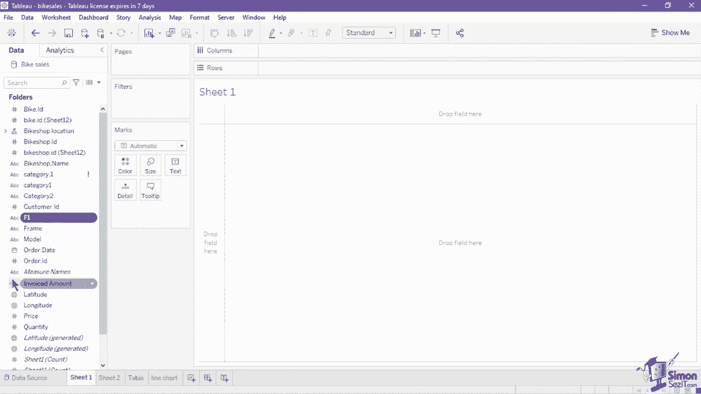
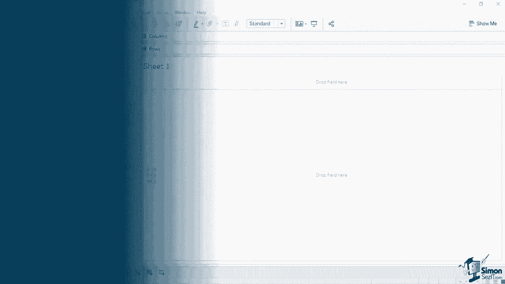
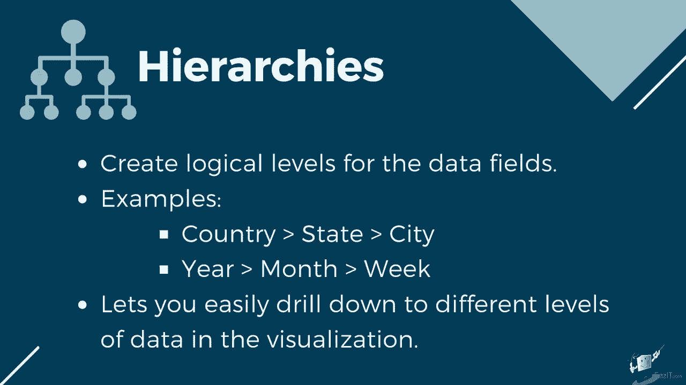
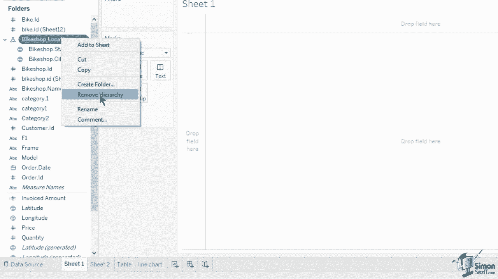
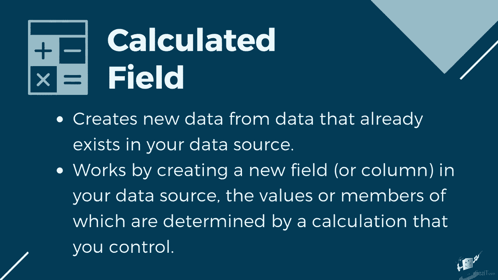
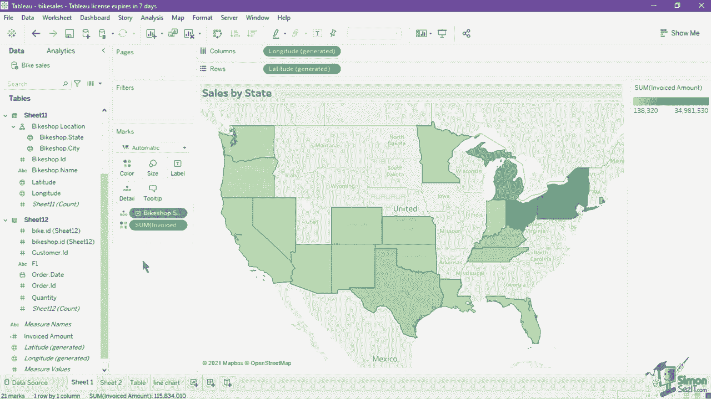
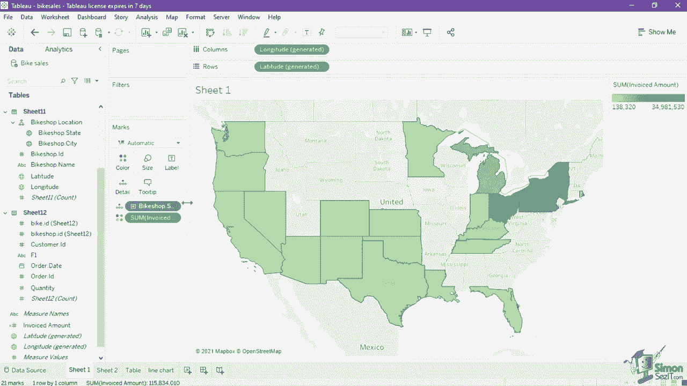

# 数据可视化神器Tebleau！P8：8）Tableau的工作区介绍 

Tableau工作区将是我们创建可视化和分析的主要界面。如我们在早期课程中讨论的Tableau工作区，它由多个卡片、架子和窗格组成，我们可以拖放字段以形成图表。首先，让我们看一下数据窗格，它保存我们的数据字段、集和参数。

窗格的顶部包含数据源名称。如果您创建了多个数据源，可以使用此视图在数据源之间切换，每个数据源将在数据窗格上有单独的数据字段列表。您还可以右键点击数据源名称以显示其他功能，例如提取数据。

编辑别名、过滤器和发布数据源。要查看数据而不返回数据源页面，您可以点击搜索框右侧的查看数据图标，过滤器应显示数据窗口。此窗口右上角的数字限制了视图中的行数。

您可以编辑指示的值以增加或减少显示的行数。行数限制的最大值为10000。除了行数限制外，您还可以通过使用显示别名功能的复选框来隐藏或显示别名。由于我们使用了三个通过数据关系链接的表。

窗口底部可见三个标签。每个标签代表一个单独的表或工作表，您可以通过点击显示的数据的标签来切换。您可以通过拖动列名将列移动到左侧或右侧。如果您希望复制或导出选定的行或预览中的所有数据，可以通过点击列名对数据进行排序。您可以选择行或列，并点击右上方的复制或导出所有按钮。现在，让我们看一下可用字段。您可以通过查看数据图标旁的下拉按钮，基于数据源或文件夹对字段进行分组。按数据源分组将根据各自的表或表单列出字段，而按文件夹分组将默认列出数据源中所有可用字段。

您可以通过右键点击一个字段并导航至文件夹来创建自己的文件夹以分组字段。创建文件夹。在这两种按视图分组中，维度在度量之前列出，其中用灰线分隔这两者。

您可以使用数据窗格创建层级，层级为数据字段创建逻辑级别。

例如，您可以通过使用层级创建国家、州、城市的地理层级，或按年份、月份、周的日期层级，您可以轻松深入到可视化中的不同数据级别。让我们尝试为此数据集创建一个两级层级。

在这里将一个字段拖到另一个字段上，我们将使用“自行车商店城市”和“自行车商店州”。将“自行车商店城市”拖入“自行车商店州”。

这创建了一个层级，你可以在弹出的窗口中命名。我们将这个新层级命名为“自行车商店位置”。输入名称后，它将在数据窗格中显示。首先列出的字段将是更高的层级。因此，我们的第一层设置为“州”，然后可以向下钻取到“城市”。

你可以在层级中上下拖动字段以改变它们的层级。要删除创建的层级，右键点击层级名称并点击“移除层级”。

接下来，让我们尝试创建一个新的计算字段。计算字段允许你从数据源中已有的数据创建新数据。当你创建计算字段时，实际上是在数据源中创建一个新字段或列。

这些值是由你控制的计算确定的成员。

例如，我们在数据集中没有可用字段来说明我们在自行车购买时向客户开具了多少发票。但我们有字段“价格”，即自行车的价格，以及“数量”，即客户订购的自行车数量，以创建一个计算字段。

点击数据窗格的下拉菜单，选择“创建计算字段”。这将打开一个新窗口，你可以在其中指明计算字段名称及其表达式。我们输入“开票金额”作为名称。然后输入计算，价格乘以数量。

将这两个字段相乘。完成计算后，请确保左下角的消息指示计算有效。然后点击“应用”或“确定”。新的计算字段现在已插入到数据窗格的度量列表中。当原始数据源中的字段名称已更新或移除，并且在图表中需要该字段时。

数据窗格中将看到一个红色的感叹号，与字段平行。要映射修正后的字段，请点击“写入”并选择“替换引用”。这将打开一个新窗口，其中列出了数据源中的所有字段。选择正确的字段并点击 O。这将把正确的字段映射到使用它的架构和属性上。现在。

让我们尝试从计算字段和我们创建的层级中创建图表。在数据窗格中，选择层级“自行车商店位置”。然后按住键盘上的控制键并选择计算字段“开票金额”。一旦选择了这两个字段，将它们拖入画布。

这将自动创建一个符号地图，指示美国每个自行车商店每个州的销售额。正如你所观察到的，Tableau自动从我们的数据集中州和城市字段生成了经度和纬度，并将其设置为行和列，以标记地图上的X和Y轴。

你还可以在火星卡上看到层次结构和开票金额如何影响可视化。当前状态被设置为细节，指示圆圈的位置。而开票金额则作为地图上的标签。让我们将其转换为热图。导航到“显示我”按钮并从列表中选择地图。

请注意，这改变了字段在标记卡上的应用方式。状态仍然在细节上，但开票金额现在设置在颜色卡上。这将地图从符号转换为热图，因为开票金额现在决定了每个状态的颜色饱和度。

如果你希望格式化标记，例如，你想将开票金额的渐变颜色更改为绿色阴影。点击颜色卡。这将打开一个新窗口，你可以设置其他属性以更改标记的外观。在这里，我们可以更改所用颜色的调色板，以及改变颜色的透明度，并添加边框和光环等额外效果。窗口中提供的每个选项将取决于卡片类型。因此大小。

标签和工具提示有自己独特的设置或属性进行自定义。我们将通过在课程后面创建不同图表来深入了解不同的标记卡。让我们通过双击地图上方的默认工作表标题来为此图表指明一个标题。这将打开编辑标题窗口，我们可以在其中输入新标题。将其设置为按状态销售。

从此窗口，我们还可以对标题应用文本格式。我们可以更改字体大小，使文本加粗、斜体或下划线，并更改字体颜色及其对齐方式。你还可以插入字段值，以使用插入按钮的下拉菜单使标题动态。点击应用以在画布上显示更改。获取额外的格式选项。

右键单击标题并点击格式标题。这将在标题面板中显示格式标题，你可以为标题和说明设置阴影和边框。除了标题，你还可以格式化可视化中大多数可见的内容。只需点击字段的药丸或图表的某个点。

然后右键单击并选择格式。这将打开格式面板，你可以设置整个工作表或仅特定字段的字体属性、对齐方式、阴影和边框。如果你希望隐藏工作区中的某些架子和面板，可以使用每个架子右上角的下拉菜单选择隐藏卡片。

这可在过滤器、标记、页面或列、行和图例架上使用。如果您希望取消隐藏卡片，请导航到工作表菜单，显示卡片，并选择您希望放回工作区的卡片。数据和分析的窗格不能被隐藏，但如果您单击右侧的箭头，它将被最小化。

除了将其从工作区移除外，您还可以更改界面中卡片的放置位置以移动卡片。拖放卡片到新位置。

最后，让我们看看构成视图的不同元素。确定视图每个部分的名称以便在创建和自定义自己的图表时容易格式化和区分它们非常重要。首先，让我们看看这个表的元素。模型和订单日期值被称为标题。

标题是在您将维度或离散字段放入行架或列架时创建的。标题显示每个字段在架上的成员名称。由于我们显示的是模型和订单日期的每个成员或值，它们都被分类为标题。字段名称。

模型和订单日期被称为标题的字段标签。您可以通过右键单击其在架上的图标并在字段标签菜单中取消选中“显示标题”来隐藏标题。您还可以通过右键单击标题或字段标签，并在菜单中选择“隐藏行或列的字段标签”来隐藏它。接下来，我们有单元格。单元格是您可以在 Tableau 中创建的任何表的基本组件。

它们由行和列的交点定义。26,60的值位于一个单元格内。一组单元格横向或纵向排列称为窗格。标题也是视图的元素之一。默认情况下，它设置为工作表名称，但您始终可以编辑它，以提供有关视图的更多上下文，就像我们之前在地图上所做的。如果您希望进一步解释视图，可以添加一个标题。

所有视图都可以有一个标题，该标题可以是自动生成的或手动创建的。要显示自动生成的标题，请在画布的空白处右键单击并在菜单中选择标题。这将显示标题卡片在视图下方。您可以双击标题卡片以编辑标题的格式和文本。接下来，我们有坐标轴。当您将度量或连续字段放入行或列架上时，将创建坐标轴。

在此折线图中，我们有一个水平和一个垂直坐标轴，因为我们有两个都是连续度量的字段。悬停在标记或数值上会显示工具提示。它们包含视图的附加数据详细信息。当您选择一个或多个点或标记时，工具提示还包括过滤标记、排除或仅保留的选项。

显示具有相同值的标记，创建组，创建集合，或显示基础数据。视图的最后一个元素是我们之前创建的地图上的图例。图例会自动创建，以显示地图上每种颜色的值，范围从100到38320，再到3400万的州销售额。

图例指示视图如何与数据编码。它可以使用颜色，也可以使用符号、大小和形状作为图例。Tableau工作区将是我们创建可视化和分析的主要界面。首先，让我们看一下数据窗格，其中包含我们的数据字段、集合和参数。

窗格顶部包含数据源名称。如果你创建了多个数据源，可以使用此视图在数据源之间切换。每个数据源将在数据平面上有一个单独的数据字段列表。你还可以右键单击数据源名称以显示其他功能，例如提取数据。

编辑别名和过滤器并发布数据源。现在，让我们尝试从已创建的计算字段和层级创建一个图表。在数据窗格中，选择层级“自行车商店位置”。然后按住键盘上的控制键并选择计算字段“开票金额”。

一旦选择了这两个字段，将它们拖到画布上。这将自动创建一个符号图，指示美国各州每个自行车商店的销售额。正如你所观察到的，Tableau自动从数据集中州和城市字段生成了经纬度，并将其设置为行和列，以标记地图上的X和Y轴。你还可以在Mars卡上看到层级和开票金额如何影响可视化。

状态目前设置为圆圈所在的细节，而开票金额设置为地图上的标签。让我们将其转换为热图。导航到“显示我”按钮并在列表中选择地图。注意，这改变了字段在标记卡上的应用方式。

状态仍然处于详细信息中，但开票金额现在设置为颜色卡。这将地图从组装符号转换为热图，因为开票金额现在决定了每个州的颜色饱和度。如果你想格式化标记，例如，想将开票金额的渐变颜色更改为绿色的色调。

点击颜色卡。这会打开一个新窗口，你可以设置其他属性以更改标记的外观。我们可以更改所使用的颜色调色板，并且可以改变颜色、不透明度，添加边框和光晕等额外效果。窗口中可用的每个选项将取决于卡片的类型和大小。

标签和工具提示有各自独特的设置或属性可供自定义。
