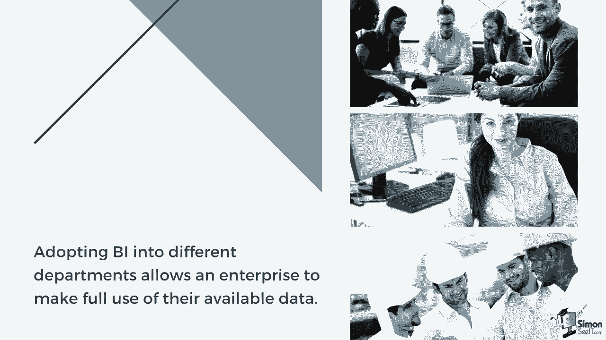
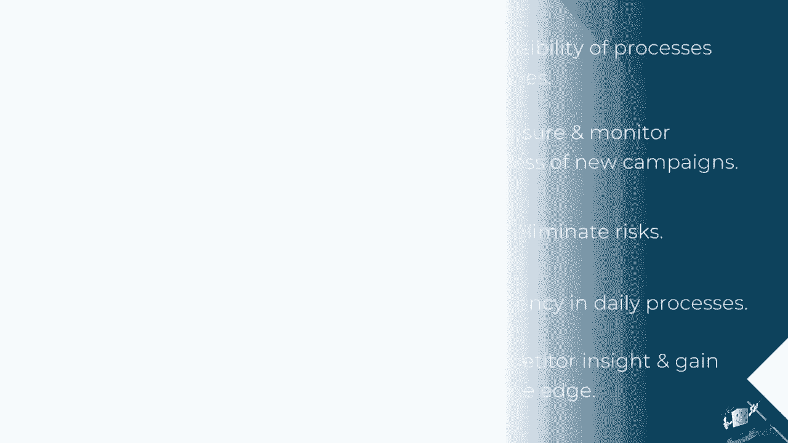
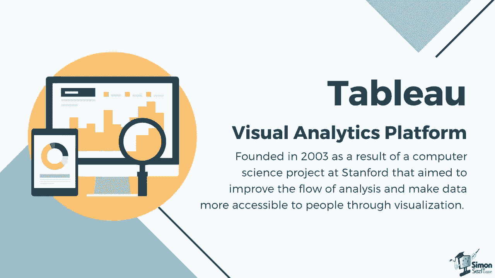

# 数据可视化神器Tebleau！无需编程，使用拖拽和点击即可制作超精美的图表。1小时新手教程，从安装到制作图表一气呵成~＜快速入门系列＞ - P3：3）商业智能简介 

商业智能指的是企业利用的过程和技术，用于收集、整合、分析并以易于理解的格式呈现相关商业信息。

它提供了对业务运营的历史、当前和预测视图，将原始数据转化为可操作的洞察。商业智能工具分析数据集，并使用报告、摘要、仪表板、图形、图表和地图呈现其发现，以向用户提供有关业务状态的详细情报。商业智能的关键目的在于支持企业最终用户评估当前的业务状态，并促进更好的商业决策。

将商业智能（BI）引入不同部门，使企业能够充分利用现有数据。例如，销售团队可以应用商业智能来可视化他们的季度KPI，并有效跟踪当前业绩的表现。

它还可以用于创建收入分析和比较销售表现。人力资源可以实施BI进行工资追踪，同时获得员工满意度的洞察。财务部门也可以通过商业智能帮助进行费用管理。

他们可以利用BI工具进行财务规划和分析。投资于一个可靠的BI战略和系统有助于提高高管对流程的可见性，因为他们可以使用实时数据在仪表板上主动做出决策。使用有效的可视化方法突出洞察，使他们能够快速理解数据，而不是浏览数页年度报告来评估业务。这也有助于衡量和监控新活动和流程的有效性。

BI使企业能够获得关于业务的详细洞察和分析。这些数据帮助他们识别风险和制约因素，以及不利于业务增长的元素。BI系统还推动日常流程的效率，例如自动处理和提取数据。

这反过来可以提高生产力和收入。商业智能可以提供对竞争对手所做事情的洞察，从而使您的组织能够做出明智的决策，并规划未来的努力，以获得竞争优势。

许多领先行业使用Tableau将现代商业智能应用于他们的系统。Tableau是一个可视化分析平台，成立于2003年，源于斯坦福大学的一个计算机科学项目，旨在改善分析流程，并通过可视化使数据更易于人们获取。

