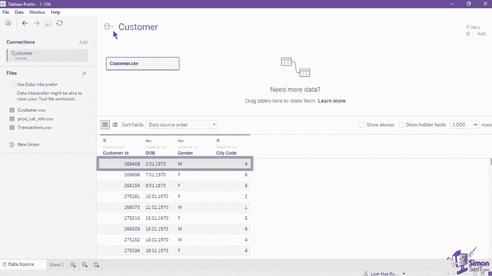
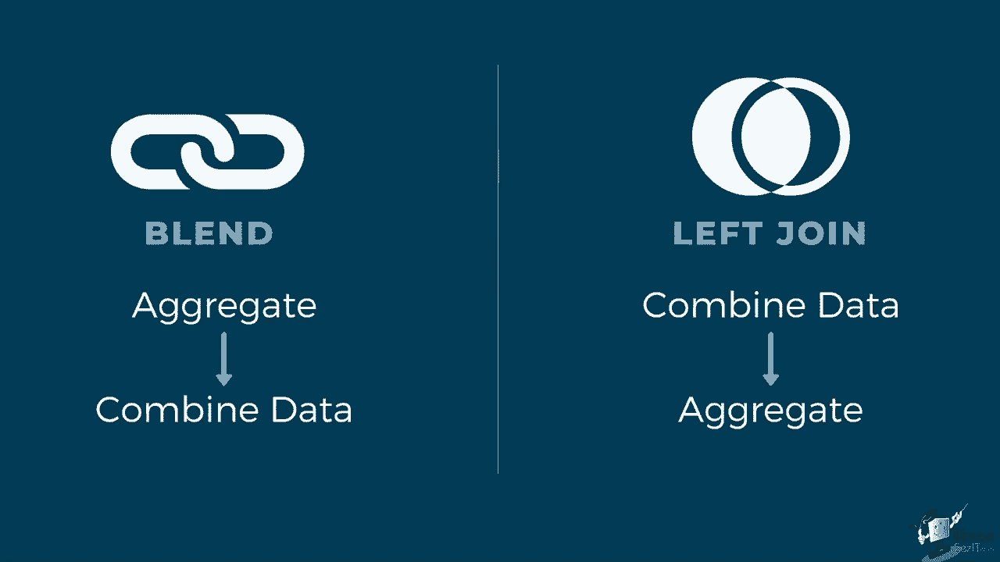
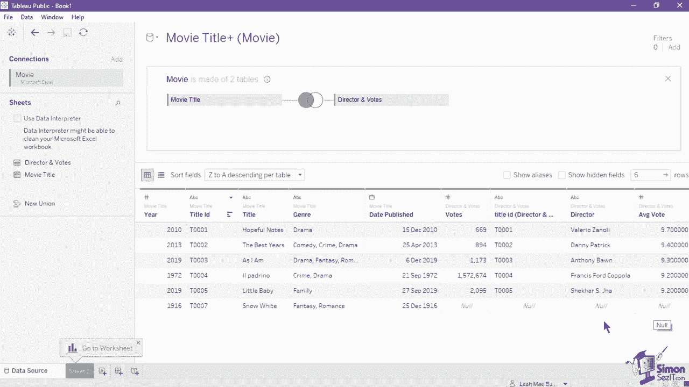
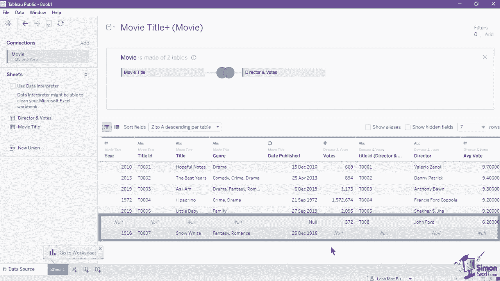
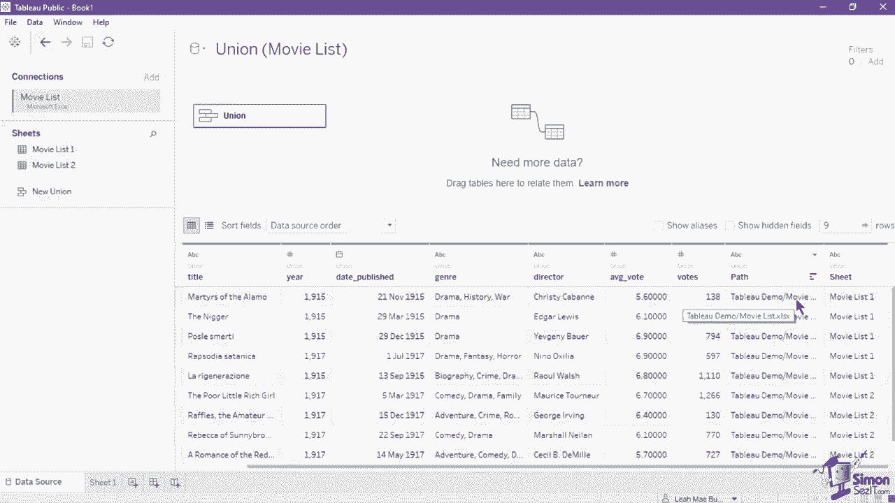
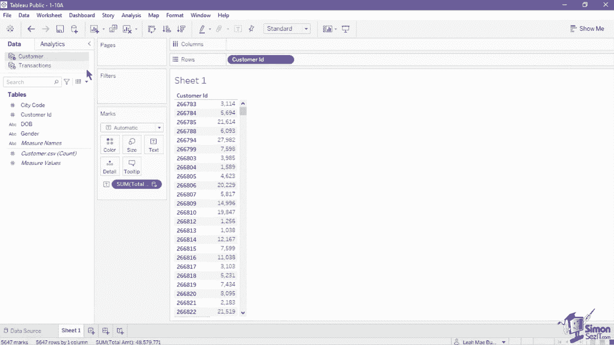

# 数据可视化神器Tebleau！无需编程，使用拖拽和点击就做出超精美的图表。1小时新手教程，从安装到做图一气呵成~＜快速入门系列＞ - P10：10）在Tableau中使用多个数据源 - ShowMeAI - BV1T341117q7

在早期的课程中，我们已经识别了连接和关系方法的不同。这两种方法在组合来自一个数据源的多个数据连接时应用。但是，如果我们需要来自不同数据源的数据呢？

Blens与关系或连接不同，数据从未真正结合。相反，blends独立查询每个数据源，结果被聚合到适当的级别。然后，结果在视图中以视觉方式呈现。因此，lenses可以处理不同的细节级别，并且它们与发布的数据源协同工作。例如。

在这个工作簿中，我们有两个数据源。第一个是客户数据源，包含客户信息。第二个是交易数据源，包含交易信息。这两个数据源都有客户ID字段，但细节级别不同。如果顾客多次在商店购买，交易数据源中可以包含多个客户ID。

虽然客户数据源包含唯一的客户ID。

在数据混合时，您的数据源将被识别为主要或次要数据源。这是按每个工作表进行的，意味着新工作表可以有不同的主要和次要数据源。

主要数据源将始终是视图中使用的第一个数据源。例如，在这个视图中，我们将客户ID作为行架上的第一个字段，因此客户数据源被标记为sheet1的主要数据源。在数据窗格中，主要数据源的名称上会有一个对勾。

让我们在这个视图中提供blend。点击交易数据源，然后选择总金额度量字段，将其设置为视图中的文本值。这样一来，就创建了blend，并将交易数据源标记为次要数据源。次要数据源的名称在数据窗格中会有一个橙色对勾指示器。

请注意，在交易数据源的客户ID字段中有一个红色链条图标。这意味着Tableau自动将客户ID作为主要和次要数据源的连接字段。如果字段在两个数据源中具有完全相同的名称，它将自动设置为连接字段，以使blend工作。

连接字段的值必须具有相同的值或成员。您可以通过导航到数据菜单并点击编辑blend关系来编辑连接字段。新菜单让您指定哪个数据源将被设置为主要源，以及将用作链接的字段。如果连接字段处于活动状态，它将以红色链条标记，表示它当前在视图中使用。

如果字段未被使用，将被替换为灰色断链图标。观察如果我们移除客户ID并将其替换为出生日期会发生什么。在这样做后，数据面板中的客户ID字段现在显示为灰色链条图标。它还移除了数据源之间的链接，因此表格中的值变为单一值。

这是汇总金额。灰色链条图标也作为标记，表明该字段可以作为链接字段使用。让我们点击该图标以建立链接字段。一旦激活，正确的值将显示在表格中。在借用数据时，主数据源定义了我们创建的此表格视图的汇总方式。

总金额，最初是按订单或交易汇总的，现在已汇总到客户级别，显示每个客户ID支付的总金额。次要数据源将仅限于那些与主数据源有对应匹配的值，因此在客户数据源中没有记录客户ID的客户将不会包含在视图中。

这个过程类似于传统的左连接，但两者之间的主要区别在于应用汇总的时机。连接是在应用汇总之前先组合数据，而混合则是在组合数据之前先进行汇总。

每个工作表上的混合是单独建立的，无法发布，因为没有真正的混合数据源，仅仅是来自多个数据源在可视化中的混合结果。相反，你需要分别发布数据源，然后在之后混合已发布的数据源。数据混合特别有用，当混合关系链接字段需要在工作表之间变化，或者在组合已发布的数据源时。尽管数据混合一直是使用不同来源数据的唯一方式。

在 Tableau 版本 2020.01 及更早版本中，采用了一种更高效的方式来使用关系组合数据。关系是推荐的组合数据方式，尽可能使用，并且只有在前者不可用时才应使用混合。

之前，我们提到混合类似于左连接。作为复习，连接是在数据源页面的物理层面上应用的。你需要建立一个特定字段用于连接和特定的连接类型。让我们看一下可以在 Tableau 中应用的不同类型的连接。

内连接表将包含在左表和右表中都匹配的记录。如果左侧或右侧的任何行不匹配，它将被完全移除。

让我们看看内连接在这个电影数据源中的应用。该数据连接有两个表。第一个是电影标题，包含六条记录，并包含电影信息和类型。第二个表是导演和投票表。

其中有六条记录，包含导演姓名、平均投票和总投票数。两个表都有标题ID字段，我们将在应用连接时使用。打开物理层，将第二个表拖入此层。Tableau会自动在这两个记录之间应用内连接，因为它识别出标题ID的相似字段。内连接的结果仅包含从标题1到标题5的五条记录。

从左表和右表中各删除了1条记录。删除的记录是t 0，0，0，7，来自左表的《白雪公主》，和t 0，0，0，8，由约翰·福特导演。这两条记录被删除，因为它们在另一张表中没有匹配记录。

接下来是左连接。当你使用左连接来组合表格时，结果是一个包含左表所有值及其在右表中对应匹配的表格。当左表中的某个值在右表中没有对应匹配时，你将在数据网格中看到一个空值。

在示例Tableau数据源中，让我们将连接更改为左连接，并观察输出中包含哪些字段以更改连接类型。点击连接图标，在连接窗口中设置连接类型。选择左连接，并保留使用的连接子句。输出有六条记录。相同的标题1到5在左右表中都有匹配记录。

还有一条ID为T 0007的记录，这是左表中的唯一记录。你可以看到该记录在左表中是唯一的，因为在右表的字段中有空值，包括投票、导演和平均投票。由于这是左连接，因此包括左表的所有记录，即使是那些与右表没有匹配值的记录。

右连接的结果包含右表中的所有值和左表中对应匹配的值。当右表中的某个值在左表中没有对应匹配时，你将在数据网格中看到一个空值。

让我们将此数据源中的连接类型更改为右连接。右连接的结果是五条与标题ID值匹配的记录，以及来自右表的唯一记录t 0，0，0，8。请注意，与左连接相同，该记录在左表中没有匹配值。

所以，年份、标题、类型和发布日期为null。右连接将包括右表中的所有记录。

最终的连接类型是全外连接。当你看到全外连接合并表时，结果是一个包含两个表所有值的表。当任何一个表的值与另一个表没有匹配时，你将在数据网格中看到空值。让我们将连接类型更改为全外连接并观察输出。

结果包含两个表中的所有记录，甚至那些没有匹配值的记录。注意，两个表中的唯一记录仍然有空值，因为它们在另一表中没有匹配。

除了混合、关系和连接，还有另一种将多个来源的数据结合起来的方法。联合以一种依赖于一个表的值到另一个表的方式合并表，与其他方法相比，联合应用或垂直组合值，而不是水平组合。为了在Tableau数据源中应用联合。

使用的表或工作表必须在相同的数据连接中。让我们在这个电影列表上创建一个联合。数据源。

我们有两个工作表，电影列表1和电影列表2，它们具有相同的字段和数据类型。建议在结构相同的表中使用联合。它们应具有相同数量的字段，具有匹配的字段名称和数据类型，以创建联合，双击工作表或表部分的新联合按钮。这会打开一个新窗口，你可以在其中手动或自动指定工作表。

首先尝试使用手动方法，将电影列表1从工作表部分拖到联合窗口。然后将电影列表2从相同部分拖到联合窗口中，放置在电影列表1的下方，完成后点击应用。数据面板现在显示来自两个工作表的所有记录。联合是无缝的，因为它们具有完全相同的结构。

注意表的末尾有额外的字段，称为工作表和表名。这些新字段提供有关联合中原始值来源的信息，包括工作表和表名。当关键的独特信息嵌入在工作表或表名中时，这些字段非常有用。让我们在尝试自动方法之前，移除之前创建的联合。

点击联合的下拉菜单并选择移除。一旦画布被清除，双击新联合以返回联合窗口。在此窗口中选择通配符自动选项卡。你可以设置一个标准，以在联合中包含多个文件。这样。

默认情况下，你不必将所有文件拖入联合窗口。这将搜索我们没有为第一次创建的数据连接指明的路径中的可用文件。你可以启用下面的两个复选框，以扩展搜索到子文件夹和父文件夹，以捕获更多文件。你可以设置的标准仅限于设置通配符或要从该数据源找到的表格或工作簿的确切值。

我们将设置表格的标准以包含电影列表，星号表示电影列表名称后有字母数字字符的组合。在表名中。如果你希望排除带有这种名称的表格，可以在下拉菜单中设置排除。对于工作簿标准。

我们已将其设置为包含 movie list.dot XLSX。由于我们有确切的工作簿名称，你可以在工作簿名称中指明通配符。如果你要包含多个文件，完成后一次应用。与手动联合输出相同，它还包括根据设置的标准从两个表中找到的所有9行。请注意，包含的两个字段是路径和表。此次使用路径而不是表名。

因为我们正在搜索整个文件夹以找到文件。这是为了排除每个文件的确切路径，包括工作簿名称。

与关系或连接不同，混合从未真正结合数据。相反，混合独立查询每个数据源。结果会聚合到适当的级别。然后，结果在视图中一起以可视化形式呈现。在这个视图中，我们使用客户ID作为行货架中的第一个字段。

因此，客户数据源已被标记为表1的主数据源。主数据源在数据面板的名称中标记有勾选标记。让我们在此视图中提供混合。单击交易数据源，然后选择总金额度量字段，并将其设置为视图中的文本值。这样做后。

这创建了混合，并将交易数据源标记为次要数据源。次要数据源在数据面板的名称中会有一个橙色勾选指示器。请注意，在交易数据源的客户ID字段中有一个红色链图标。这意味着 Tableau 自动将客户ID设为主数据源和次要数据源的连接字段。

如果两个数据源的字段名称完全相同，它会自动设为链接字段，以使混合工作。链接字段值必须具有相同的值或成员。

连接在应用聚合之前先合并数据，联合则是垂直地附加或组合值，而不是水平地。我们来创建一个关于这部电影列表的数据源的联合。我们有两个工作表，电影列表1和电影列表2，它们具有相同的字段和数据类型。建议在结构相同的表中使用联合。

它们应该具有相同数量的字段，匹配的字段名称和数据类型。要创建联合，请在工作表或表部分双击“新联合”按钮。这会打开一个新窗口，你可以手动或自动指定工作表。

我们先尝试使用手动方法，将电影列表1从工作表部分拖入联合窗口，然后再将电影列表2从同一部分拖到联合窗口中电影列表1的下方，完成后点击应用。数据面板现在显示来自两个工作表的所有记录。由于它们具有完全相同的结构，联合过程非常顺利。

注意到表的末尾有额外的字段，称为工作表和表名。这些新字段提供有关联合中原始值来源的信息，包括工作表和表名。当分析中嵌入了对你至关重要的唯一信息时，这些字段非常有用。

在下一个部分，你需要下载课程练习文件。点击视频描述中的链接获取这些文件。你也可以滚动查看详细信息，以找到本课程每个部分的时间戳。如果你喜欢这次培训，请给我们留言。

