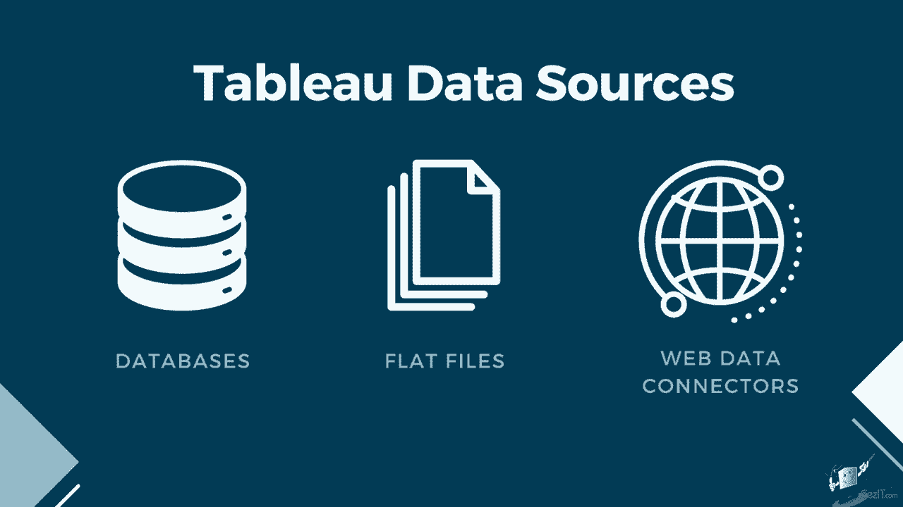
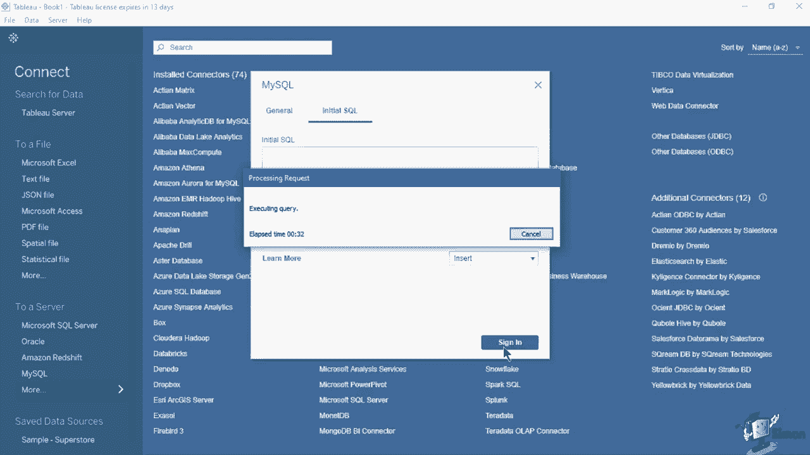
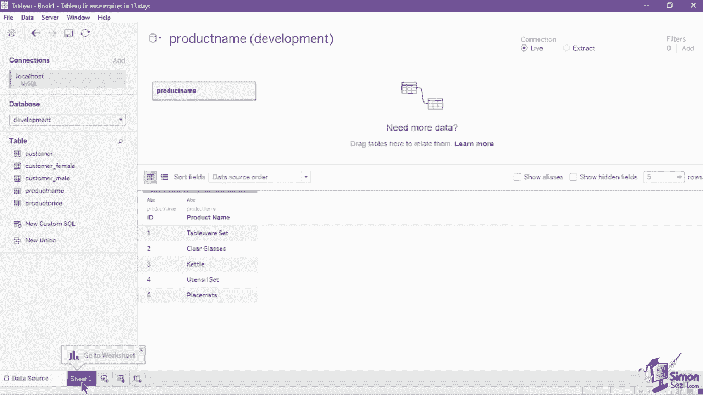

# 数据可视化神器Tebleau！无需编程，使用拖拽和点击就能做出超精美的图表。1小时新手教程，从安装到做图一气呵成~＜快速入门系列＞ - P6：6）连接到Tableau中的数据源 

嗯。既然我们已经学习了如何为Tableau构建和准备数据集，让我们尝试将工具连接到不同类型的数据源。创建可视化需要有效的数据连接！

Tableau数据源是源数据与Tableau之间的链接。它本质上是你的数据总和、连接信息、包含数据的表或工作表名称，以及你将在数据上进行的定制。

Tableau数据源可能包含多个对不同数据库或文件的数据连接。连接信息包括数据的位置，例如文件名和路径或网络位置，以及如何连接到数据的详细信息，例如数据库服务器和服务器登录信息。

连接到Tableau数据源之前需要考虑几个因素。首先是位置和访问。你的用户能否访问数据？是否需要用户过滤和行级安全？接下来是形状和整洁度。源数据是否为Tableau良好结构？是否有多余或缺失的数据？

在Tableau中，哪些计算或操作最适合原生执行？

第三是数据模型和数据组合。数据是否分散在多个系统中？

结合每个数据表的最佳方式是什么？

你还应该考虑元数据和定制化。表格和字段名称是否易于理解？是否需要计算？第五是可扩展性、安全性和可发现性。数据源是否应该嵌入工作簿中？源数据会有多大？最后，查看性能和新鲜度。

数据连接是实时的还是提取的？数据刷新计划是什么？

考虑这些因素后，你可以正式创建用于可视化的高质量数据源！

Tableau支持存储在不同位置的多种类型数据，但这将取决于你安装的Tableau产品类型！

Tableau Desktop Professional具有完整的数据源连接，包括对服务器托管数据源的原生连接。它提供多种关系型、多维和基于云的数据库和存储库选项。而Tableau Desktop Personal和Public只能连接到平面文件。

Google Sheets、O数据和Web数据连接器。如前所述，Tableau可以使用来自数据库、平面文件和Web数据连接器的数据。数据非常好用，因为它们已经具有定义的结构，数据类型已经定义，而格式错误的数据会被自动阻止。

这使 Tableau 能够准确理解如何使用每个字段中的数据。然而，有时平面文件被用作数据源。平面文件可能容易出现数据格式错误，并且对列名的变化敏感。确保遵循我们在上节课中提到的数据结构提示，以正确将数据加载到 Tableau 中。但除此之外，平面文件因其灵活性而非常优秀。

您可以轻松调整列并向文件中插入行。如果您决定使用平面文件来更新仪表板，请始终注意格式的一致性。最后，我们有网络数据连接器。网络数据连接器是一个包含 JavaScript 代码的 HTML 文件。您可以使用网络数据连接器连接到可以通过 HTTP 访问且没有现成连接器的数据。它允许开发人员创建自己的数据源连接，以从在 Tableau 中未包含的网页中获取数据。

在本课中，我们将演示如何连接到平面文件和数据库。

在 Tableau 中连接平面文件有两种方法。第一种方法是直接将文件从文件资源管理器拖到平台的起始页面。当加载完成时，会显示一个小进度窗口，并引导您进入数据源页面。第二种方法是通过从起始页面的连接窗格中选择您的数据集的文件类型来插入平面文件。

这将打开一个新的文件浏览窗口，您可以在其中导航到数据源的文件路径。一旦找到文件，选择它并点击打开。这将加载数据，并引导您进入数据源页面。一旦进入数据源页面，您现在可以根据需要为数据添加更多格式。如果您的平面文件只有一个工作表。

它应该在画布的逻辑层中自动可用，但如果它有多个工作表，您仍然需要通过从工作表窗格中拖动工作表名称或表名称到画布中来指明您将使用哪个。

如果您需要使用多个工作表或表格，您需要在平台中使用连接或数据关系。我们将在以后的课程中进一步讨论这些功能。

要连接到数据库，请在起始页面的连接窗格中选择类型。这将打开一个新的对话框，您可以在其中输入必要的连接凭证，例如服务器名称、端口、数据库名称、用户名和密码。您还可以在第二个选项卡中指定一个将在连接到数据库时运行的初始 SQL 命令。您可以使用此命令设置会话期间可访问的临时表或设置自定义数据环境。完成后点击登录按钮以连接到数据库。

一旦成功连接到数据库或服务器，它将引导你到数据源页面。从表格部分选择你将用于可视化的表，并将其拖入画布以查看所选表的数据。

点击数据预览下方的“立即更新”按钮。

如果你需要使用不同的数据库，可以从左侧面板的数据库部分选择新的数据库。对于 SQL 数据库连接的额外功能是能够创建自定义 SQL 查询。当你确切知道所需的信息并理解如何编写 SQL 查询时，使用自定义 SQL 查询非常有用。只需点击表格部分下方的新建自定义 SQL 按钮。

你可以使用自定义 SQL 查询来垂直合并数据，应用于数据库连接，减少或重构你的数据，以及其他许多操作。在创建数据连接并选择要使用的表或工作表后，你现在可以前往 Tableau 工作表窗口开始可视化。

