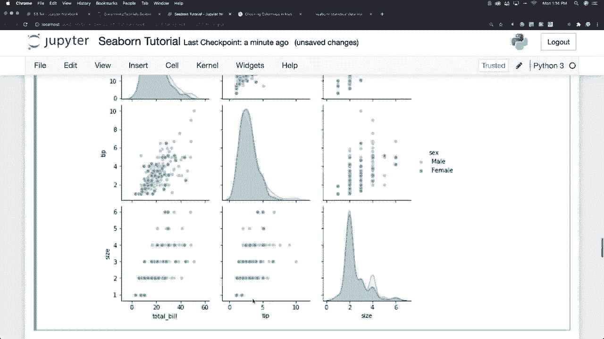
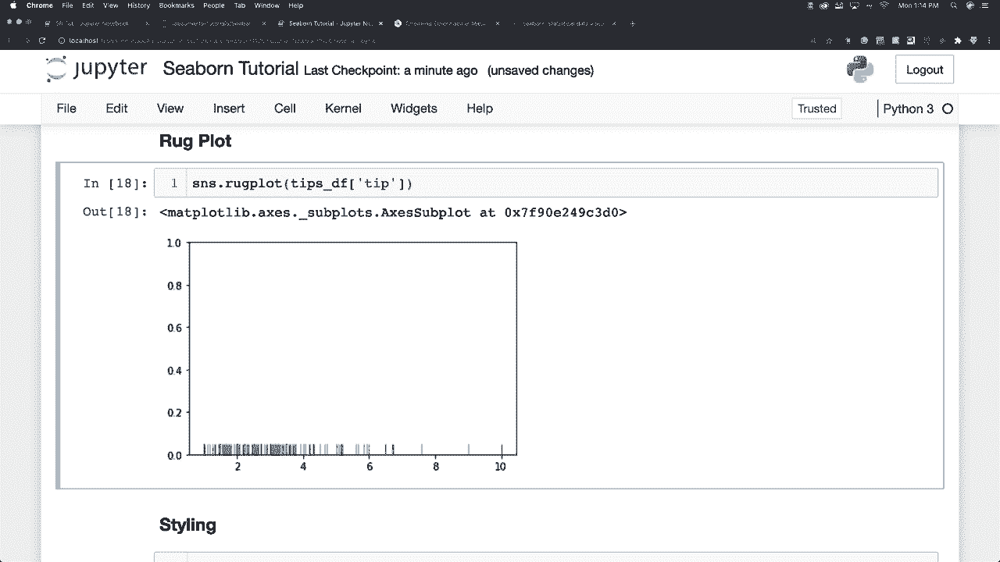
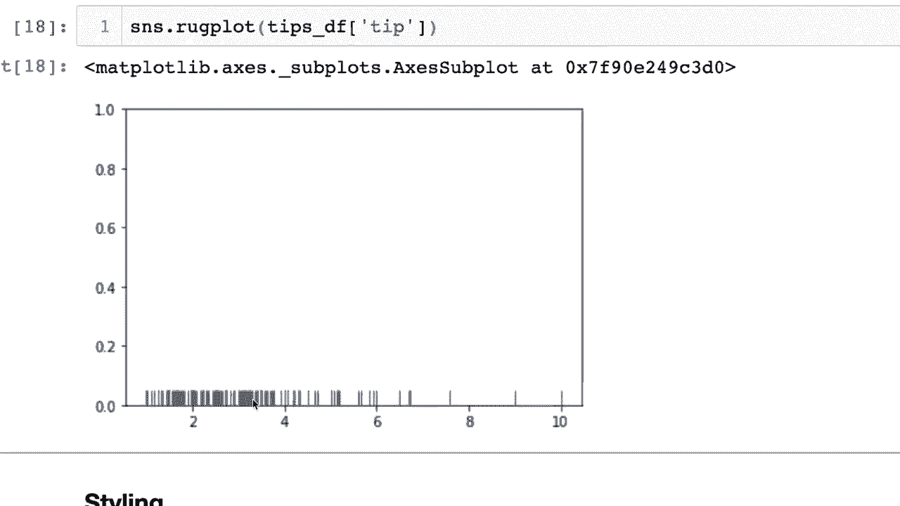
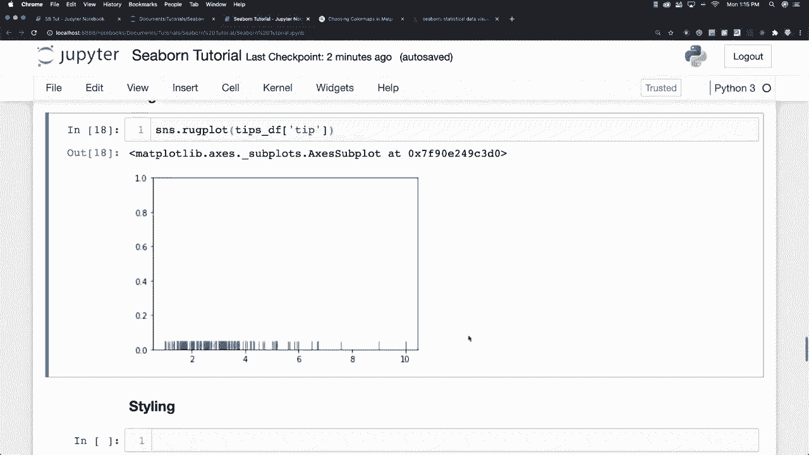

# 更简单的绘图工具包**Seaborn**，一行代码实现Python可视化！1小时教程，学会20种常用图表绘制~＜实战教程系列＞ - P9：L9- Rug图 

好的，我们来创建一个**rug图**，具体来说，我们将再次查看小费数据集，尤其是小费金额。基本上，rug图会将数据框中的单列数据点绘制为棍棒。因此，您会在这个轴的底部看到这些不同的棍棒。在rug图中，您会看到数量较多的地方会有更多密集的线条，这有点像直方图在值较高的地方更高，而rug图则在值更常见的地方更密集。好的，rug图并不常用，但我在这里玩弄这些图形，我现在想要专注于样式，以便我们可以制作。

