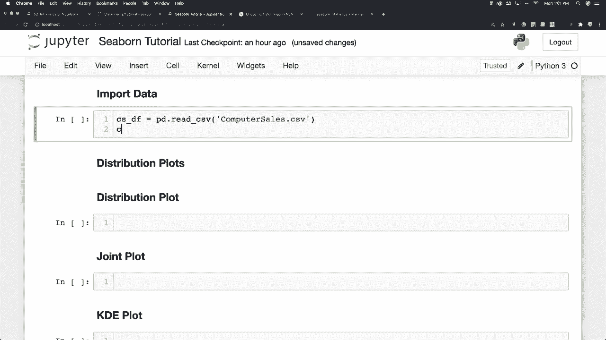
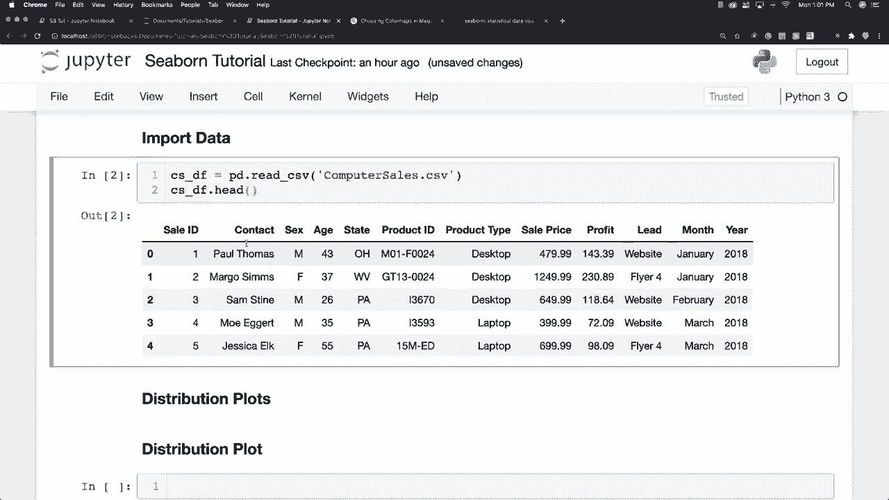
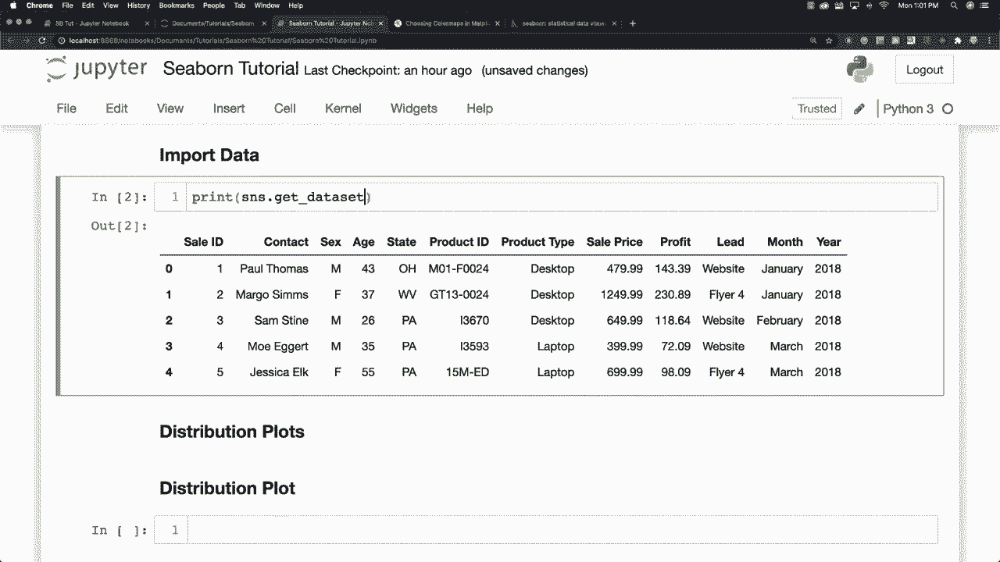
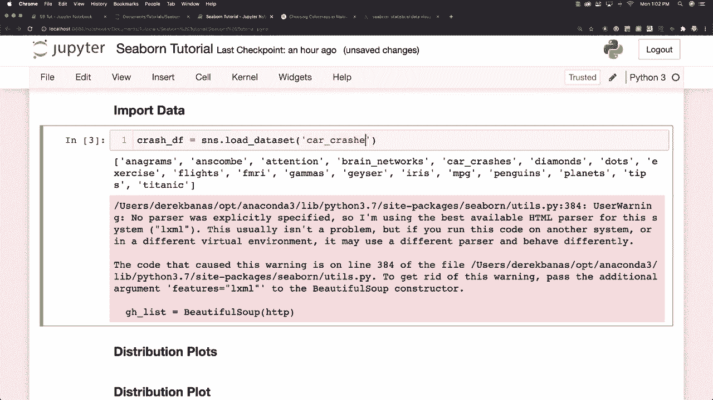
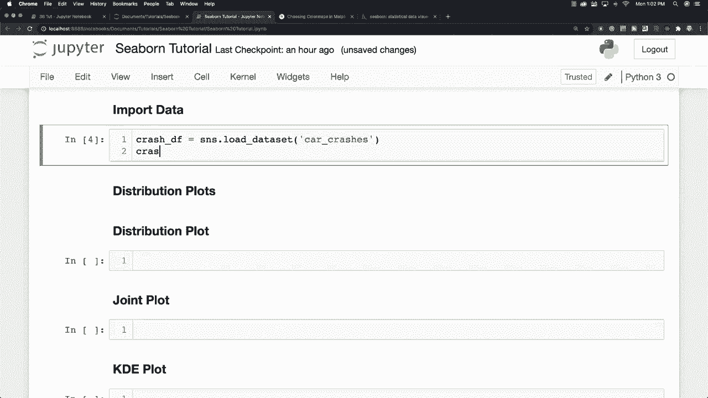
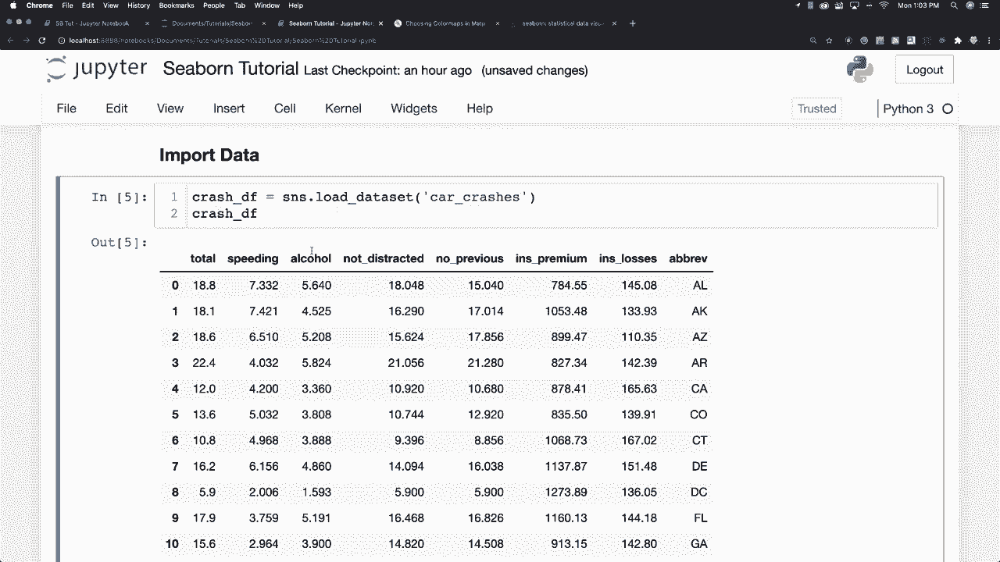

# 更简单的绘图工具包 Seaborn，P3：L3- 导入数据和数据集 

关于加载数据，你将能够进入并加载 CSV 文件以及通过使用 pandas 提供的无数其他不同文件类型。这就是我在这里使用的，因此我可以进入计算机销售，这是我以前使用过的 CSV 文件，你可以看到它的样子，没问题，但在这个教程中，我不会这样做，为了让每个人都能更容易，我主要将使用 seaborn 内置的数据集，你可以通过输入 git data set names 来查看内置的内容，那里你可以看到这些数据集的名称。只需忽略这个，它是一个错误，有时在我们调用这些数据集时会出现，如果我们没有正确使用它，它不知道我们在使用什么类型的数据，只需不担心它。所以有各种各样的内置数据集，我将在这个教程系列中使用至少三个。

因此，你可能会问自己，如何加载这些数据集呢？首先，我将使用一个交通事故数据集，你只需输入 load data set，然后键入它的名称，即 car crashes，你可以看到它的样子在这里。所以你可以看到这些是交通事故的总数，这些是州。阿拉巴马州、阿拉斯加州、亚利桑那州、阿肯色州、加利福尼亚州。

他们分析的总事故数，包括人们是否超速、是否饮酒、是否没有分心，是否没有以前的事故以及保险费用和保险损失。好吧，这就是我们将要分析的内容，并且在视频下面的描述中，你将找到一个 Jupyter notebook。

我在这里做的所有事情，除了我要包含。

有大量的注释来帮助你，所以这是一个巨大的备忘单，当然，这都是免费的，因为。
