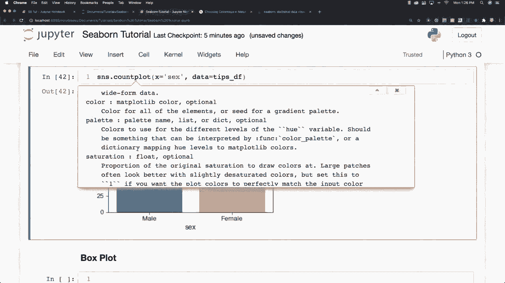
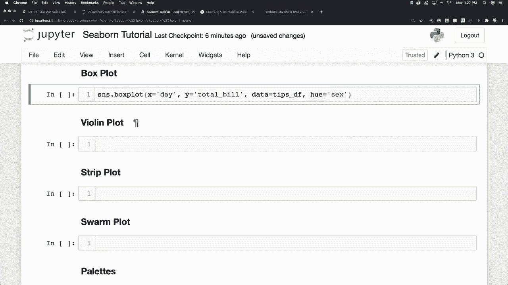
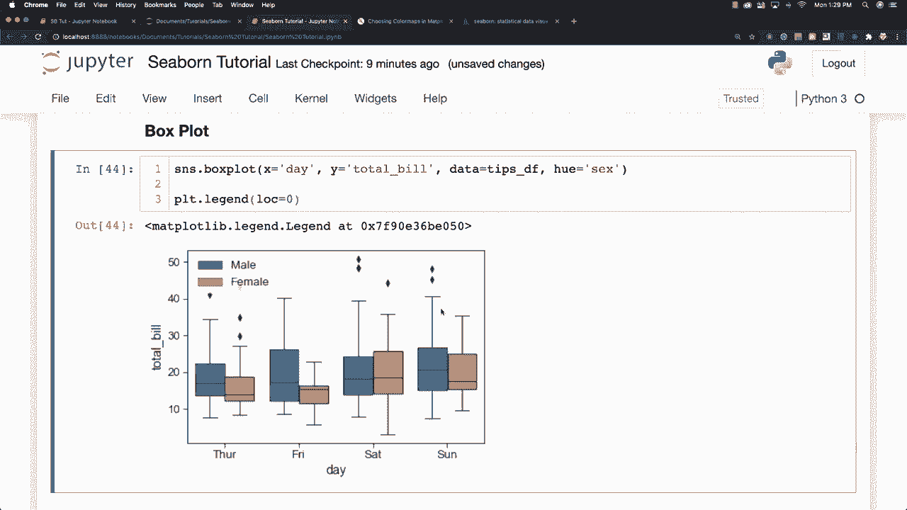

# 更简单的绘图工具包 Seaborn，一行代码做到 Python 可视化！1小时教程，学会20种常用图表绘制~＜实战教程系列＞ - P13：L13- 箱形图 

现在，箱形图将允许你比较不同的变量，它会显示数据的四分位数。所以我将打印一个，然后解释它所展示的内容。我非常喜欢箱形图。假设天数，我们要在这里查看男性和女性在多个不同天的总账单变化。所以我将说 Y 是总账单，当然数据将来自我们的提示数据框，这也是你第一次看到 hue 在这里，它将引用性别。

男性或女性，这是我们的箱形图。正如我所说，箱子将显示我们数据的四分位数，你可以在这里看到图例等等。现在，这条横跨中间的线是中位数，箱子将延伸一个标准差，这就是箱子所代表的内容。这些点被称为胡须，它们将延伸到所有其他数据，除了我们的标准差范围内的点，另外那些被认为是异常值的点。这些点被认为是异常值。基本上，hue 为我们提供了一种额外的方式来添加另一个类别。所以我们在查看天数和总账单时，加入性别这个 hue，也将允许我们创建。

对于每一天的男性和女性的多个箱形图，这样我们可以进行比较。我们可以看到，男性在星期五的支出往往高于星期六，而女性的支出则相对较高。如果你想移动这个图例，因为有时这些图例会挡住视线，比如说你想移动它，你可以去绘图和图例位置，这通常几乎总是有效的，如果你只输入位置 0，它会保持在同一位置。我将在几秒钟后更详细地讲解图例。

但基本上它允许你重新定位图例，以便它不覆盖你的数据，稍后我将更详细地讲解我们的分类绘图选项！

