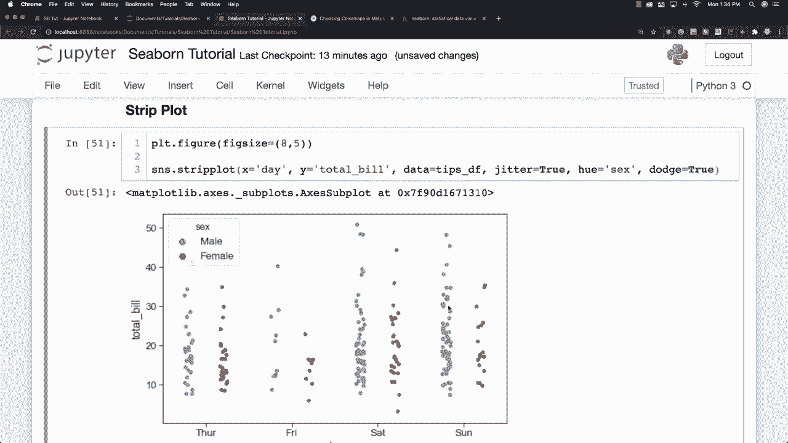

# 更简单的绘图工具包 Seaborn，一行代码做到 Python 可视化！1小时教程，学会20种常用图表绘制~＜实战教程系列＞ - P15：L15- 带状图 - ShowMeAI - BV1wZ4y1S7Jc

讨论条形图。好的，我们在这里可以做的另一件事是改变图形大小，使其更大。我们再次使用 matplotlib，所以假设八和五的尺寸相当大，然后我们放入这个条形图，看看效果如何。要创建一个，你只需调用 strip plot，条形图将绘制一个散点图，表示所有不同的数据点，其中一个变量是分类的，通常用于显示与箱线图不同的观察结果，该箱线图代表平均分布。所以我们设定 X 为 day。

总和 y 等于总账单。而且数据将成为我们的提示。

数据框出错了。这是图形，你可以看到条形图的工作方式，我们可以加入一个名为 jitter 的属性，它将使我们的数据点分散开来，而不会堆叠在一起，只需设置 jitter 为 true，你就会看到它们稍微分开。假设我们想将数据进一步分为男性和女性，我们再次使用 H。

现在你可以看到男性和女性之间的差异，此外，你可以使用 Dodge，这将完全分离男性和女性的数据，因此每个都有自己的条形图。好的，这就是带有许多酷功能的条形图。现在我想谈谈另一种图形，它结合了多种其他图形的能力，称为。

