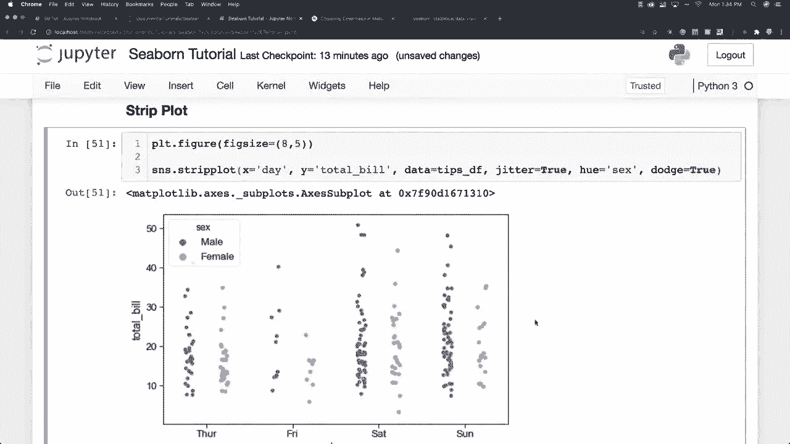
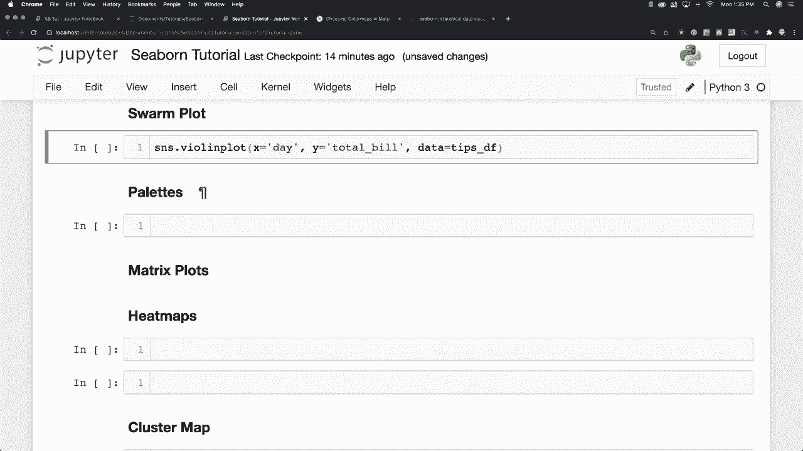
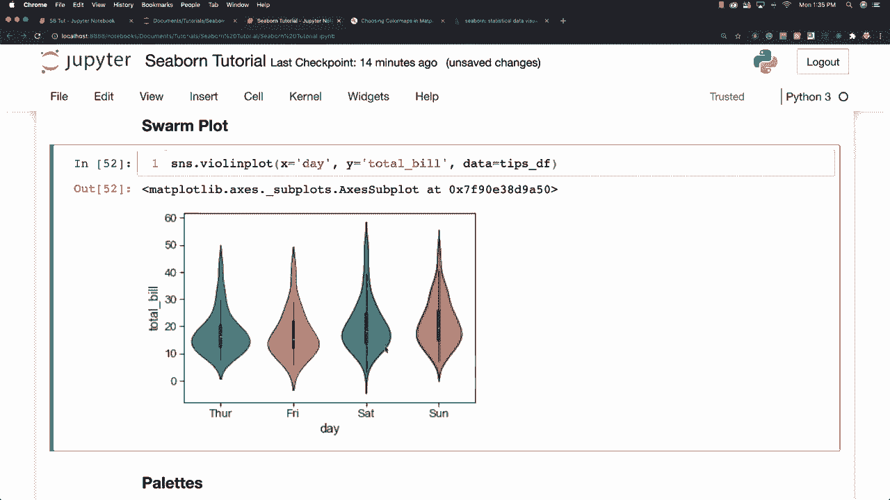
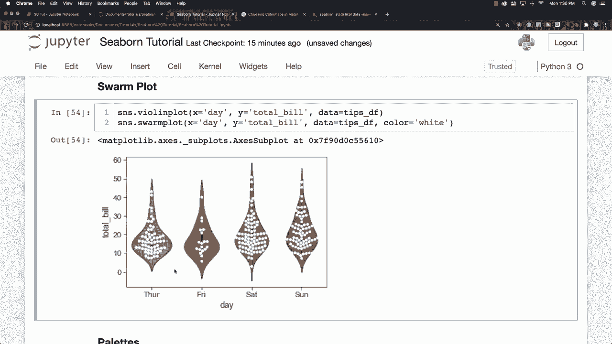
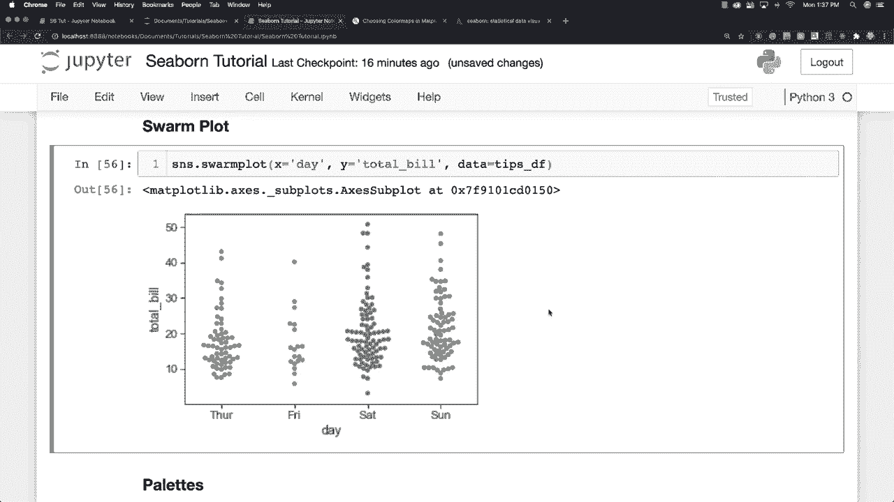

# 更简单的绘图工具包 Seaborn，一行代码做到 Python 可视化！1小时教程，学会20种常用图表绘制~＜实战教程系列＞ - P16：L16- 群图 

群集图，好的，我想在这里做的是创建一个小提琴图，然后在它上面叠加一个群集图。所以我会说 x 等于 day，y 等于 total bill，数据将来自我们的 tips 数据框。正如我所说，群集图有点像条形图，但点会被调整，以便它们不会重叠，创建时看起来就像小提琴图和条形图的结合。我将把所有这些数据从这里复制出来并运行，你可以看到，因为它对这里所有不同点使用了完全相同的颜色，但你可以轻松修复，只需将相同颜色设置为白色，现在你可以看到里面所有不同的图形，好的。

所以有点酷，停。

如果你只想像这样单独查看它。 显然你不能让颜色是白色，你可以清楚地看到它的样子。 好的，所以有很多很多不同的绘图选项可供选择。 现在我想谈谈调色板。

