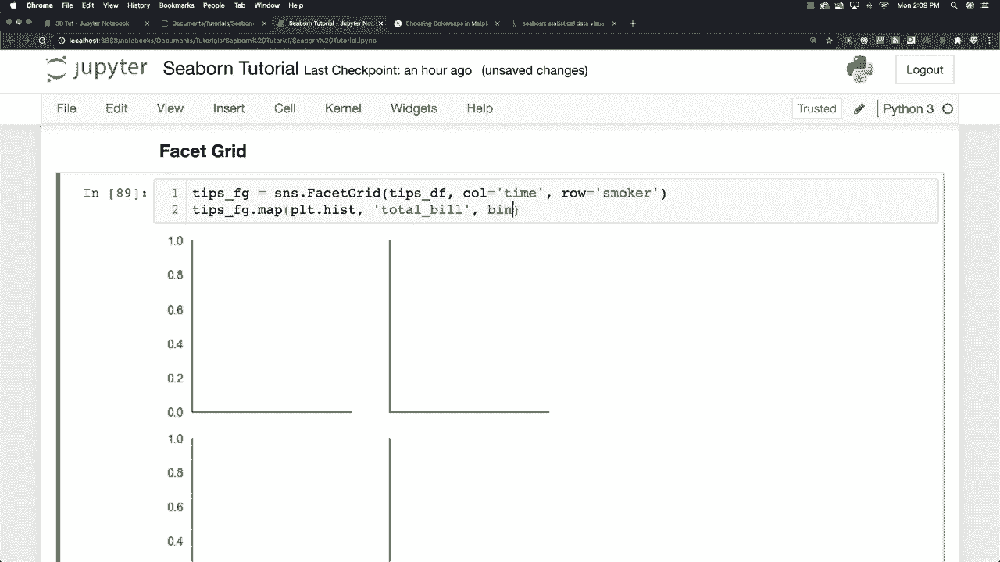
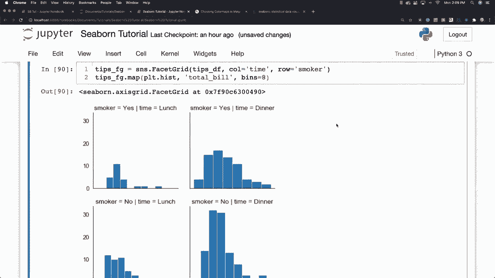
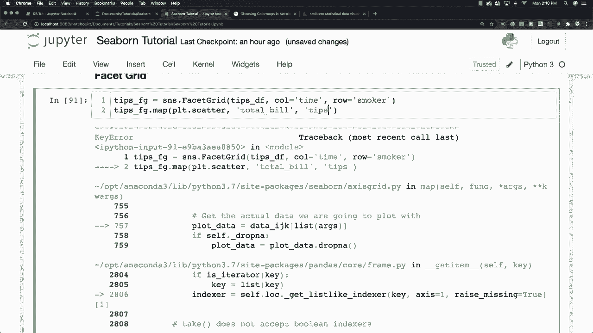
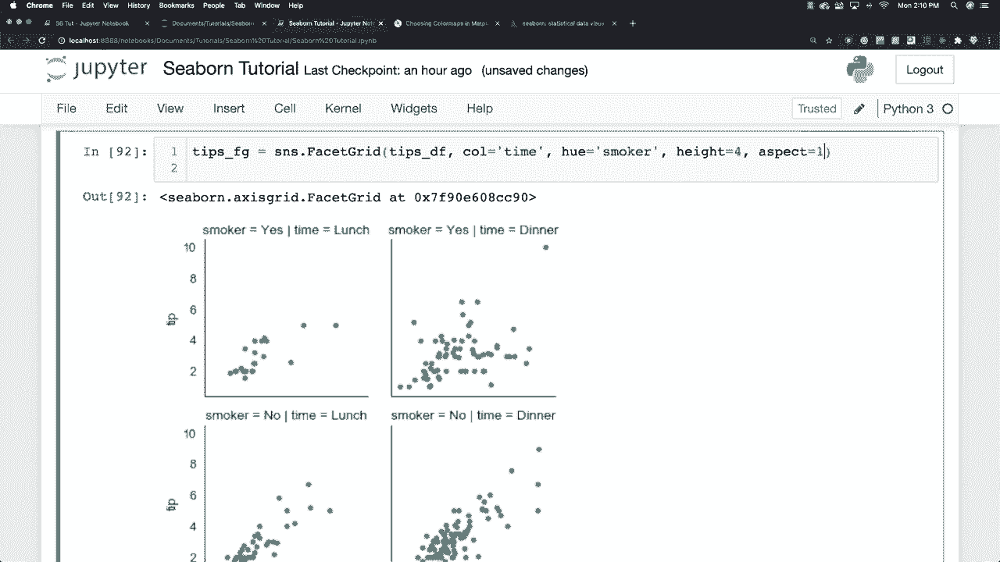
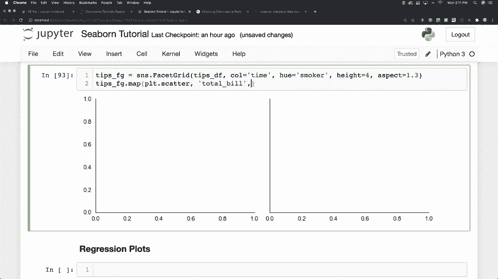
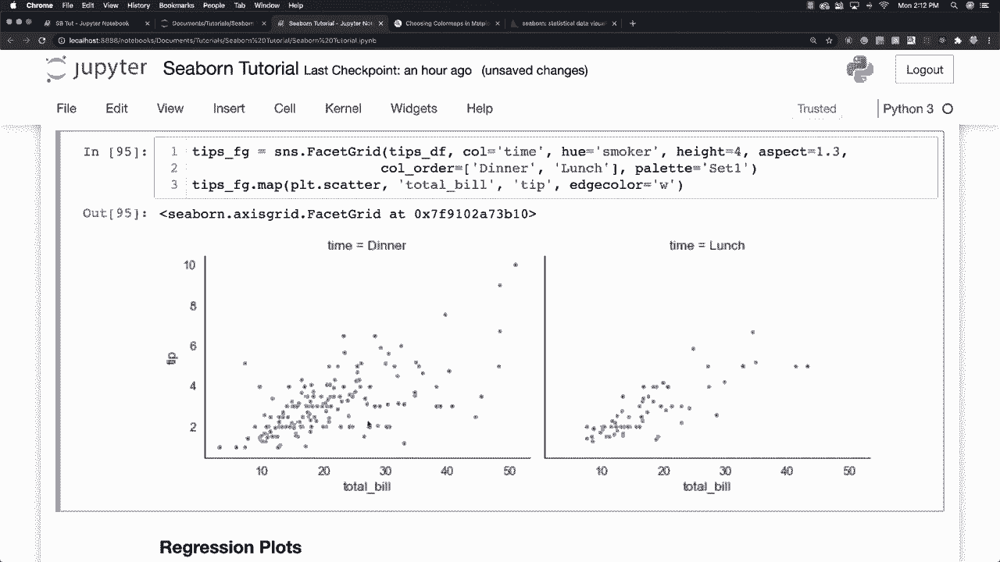
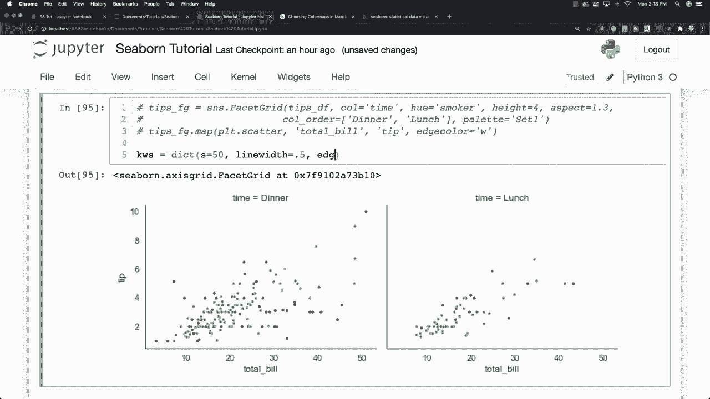
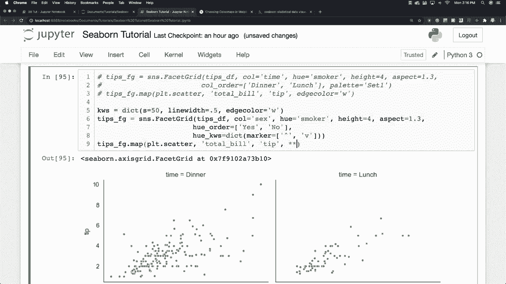
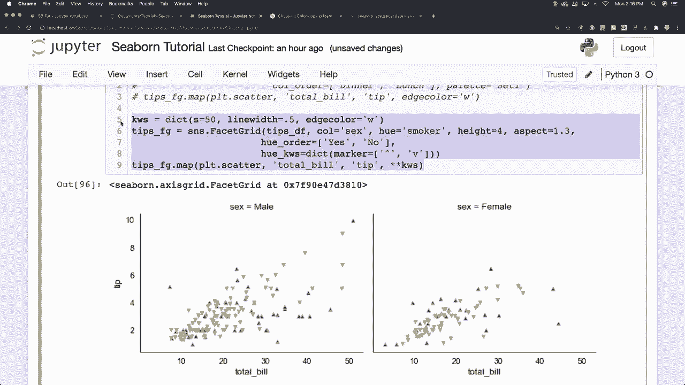
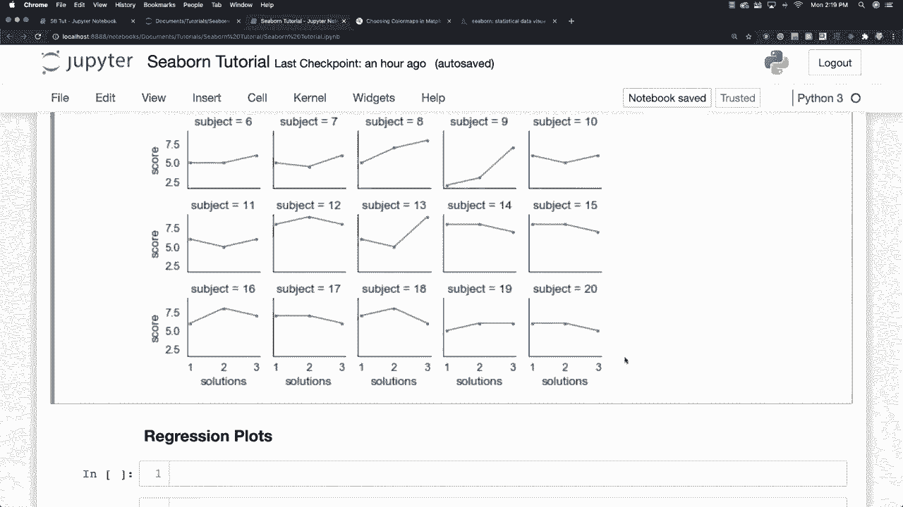

# 更简单的绘图工具包 Seaborn，一行代码做到 Python 可视化！1小时教程，学会20种常用图表绘制~＜实战教程系列＞ - P21：L21- Facet网格 

Facet网格。那么，使用facet grid，你将能够在一个网格中打印多个图，其中你可以定义列和行。假设我想要获取吸烟者和非吸烟者的直方图，基于午餐和晚餐的总账单，我将使用tips数据框来完成这个。

我在这里放入FG以表示facet grid。然后调用sns.FacetGrid。我将使用tips数据框，当然，列将由时间表示，行将由吸烟者表示。

你可以看到我们在这里创建了一个类似网格的系统。我现在想做的是为我的直方图传入属性。所以我将说使用tips、FG、map，并绘制一个直方图。基于总账单。我将把它放在八个桶或箱中。

你可以看到它自动为我们生成了这些直方图，真是不错的东西。你也可以进来，比如说你想创建一个散点图，那将是总账单，我们来试试tips。

比较这两个图，这个是小费，不是小费，好的，你可以看到我们创建了一个散点图。我们还能够做的另一件事是，去掉这个，并说我们想为不同的颜色分配变量，可以这样做。所以我们仍然使用tips数据框，我将设置列B为时间，但我将把h改为吸烟者，你还可以改变高度，然后我们将高度改为4，并且可以改变一个叫做aspect的东西，这将基于高度来决定宽度，所以我将把它设为1，让它们相等，让我们把它稍微放大一点，设为1。

然后我们可以下来，看看tips FG。

让我们尝试map，这里我们就用散点图，因为这样做一些疯狂的事情最有意义。所以我将把它设置为总账单和小费。

你可以看到我们的两个散点图。我们可以添加一些不同的选项，比如说我想让晚餐在午餐之前，出于某种未知原因。我可以这样做。所以我将说列顺序等于晚餐。

还有午餐，让我们去更改我们的调色板。所以我们将说调色板等于。我将使用一个叫set one的调色板。我还将更改我们散点图中点的边缘颜色为白色。你可以看到我们所做的更改。好吧，真是不错的东西。

现在让我们展示一些其他选项，因为这个家伙有很多选项。假设我们想更改大小和线宽，并为标记分配不同的颜色，使用不同的标记。这些点称为标记。我可以更改所有这些。我要做的是创建一个字典。

这将代表我们标记的大小。然后我将把线宽定义为0.5，边缘颜色定义为白色。接着我会来。

facet grid将等于SN S facet grid tip stat frame。让我们的列等于性别，我们的Hue变化将基于这个人是否吸烟。让我们将每个的高度定义为4，宽高比为1.3。

让我们继续添加各种疯狂的东西。假设我们想更改我们的H顺序，让吸烟者是“是”，非吸烟者是“否”。好的，这就是它所指的。然后我们还可以通过说h KWs等于字典来更改我们的标记。

我们将定义我们的标记符号，像这样用这个尖头符号做一个向上的三角形。然后我们用一个V放在里面，做一个向下的三角形。好的，我在试图弄清楚所有不同的参数，然后我们将为标记分配一个字典形式的数据。

所以我要说tips facet grid。

映射，并根据总账单、提示金额来创建我们的散点图，然后传入我们在标记方面制作的其他数据，你可以看到我们刚才做的所有疯狂的事情。好的，如果你想看到几乎每一个可想象的选项，最后我想在facet grid上展示一些有趣的东西，我将去获取不同的数据。这是出席数据，所以SS dot load。

数据集。以及注意力。这是数据框，将提供不同学生在测试阶段能够提供的注意力水平下所获得的分数，这些有点奇怪的东西。我将去S和S，我将再次创建一个面格网，我想在这里做的是把每个人放在他们自己的图中。

每行5个主题，并根据他们在测试阶段能够集中注意力的程度绘制每个主题的分数。好吧，这有点像是玩弄数据的乐趣。所以列将是主题。我将说我每行只想要五个主题，所以列换行5，我将定义高度为1.5。然后我将做一个常规的传统绘图。所以我将说Tt FG图，并做一个常规绘图。

不。🤢，我们会有解决方案。然后是分数，我们还可以定义自定义标记。因此，我们会说在这种情况下我们的自定义标记是一个非常简单的点。哦，我在列换行而不是列包裹和分数中输入了。这应该是分数，运行它，你可以看到所有正在测试的个别主题或学生。

他们的分数以及他们的分数如何根据他们能集中多少注意力而变化。好吧，有这么多不同的方式来看待和玩弄数据。为了结束这个教程，我想谈谈你将一直使用的东西，那就是。

