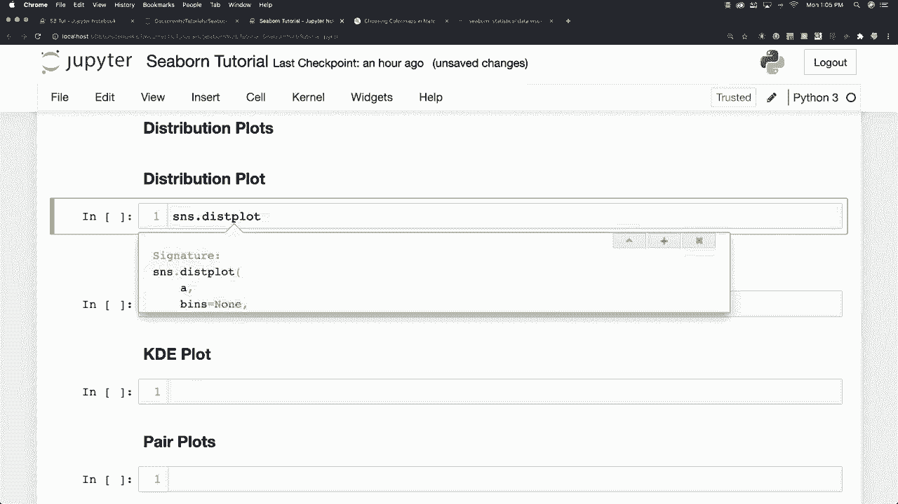
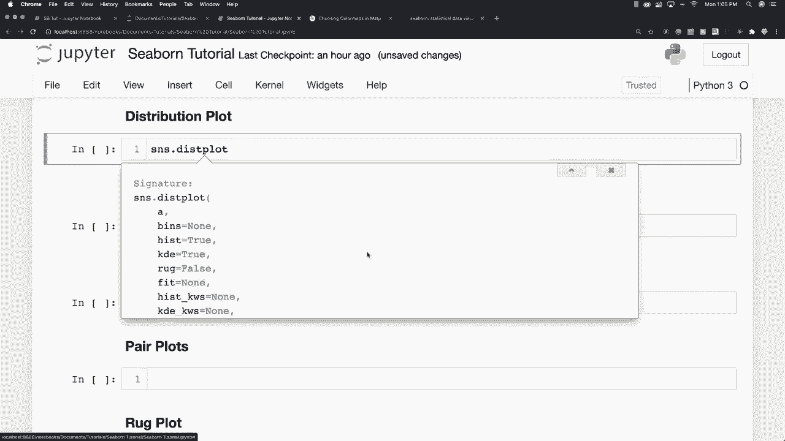
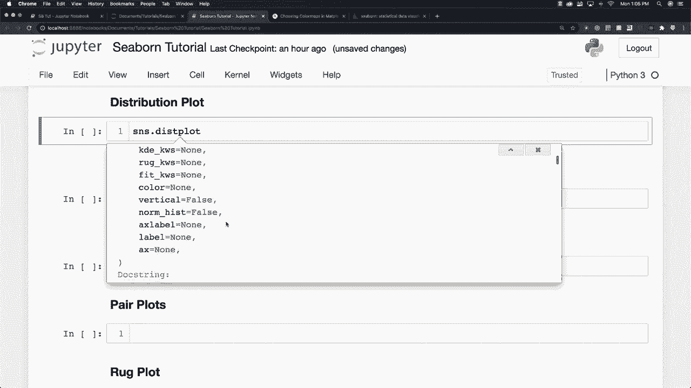
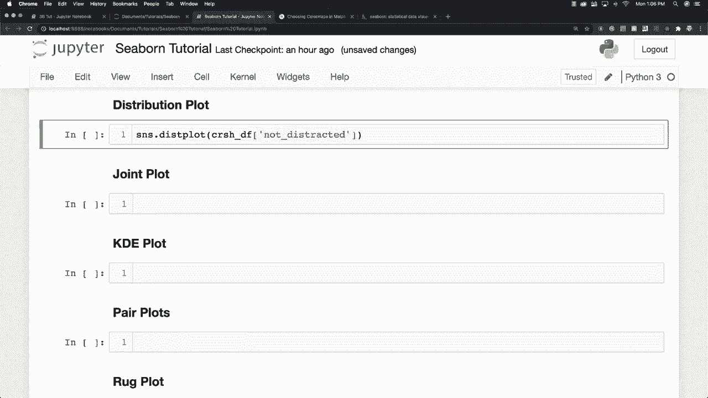
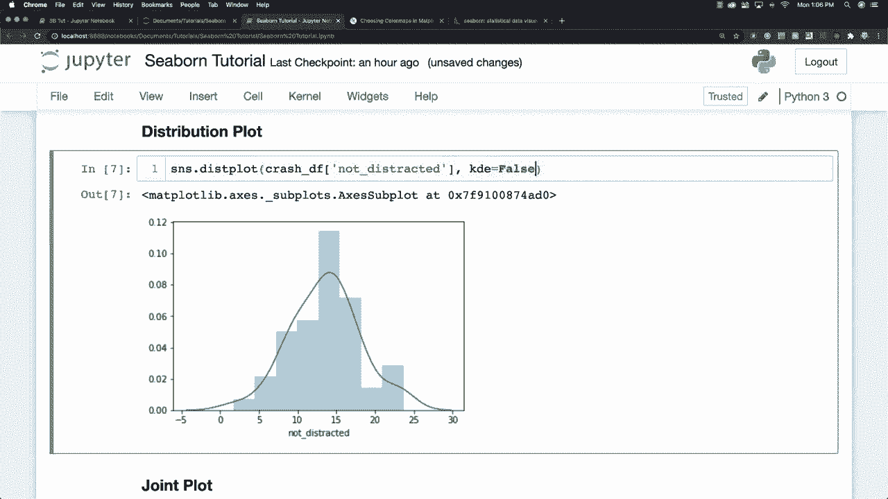
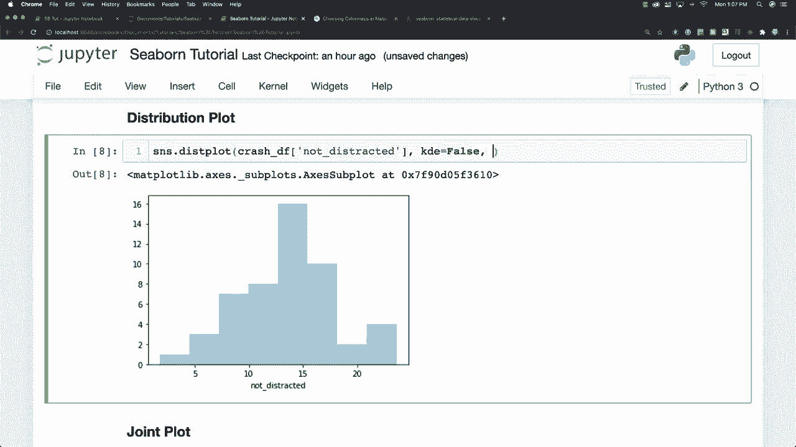
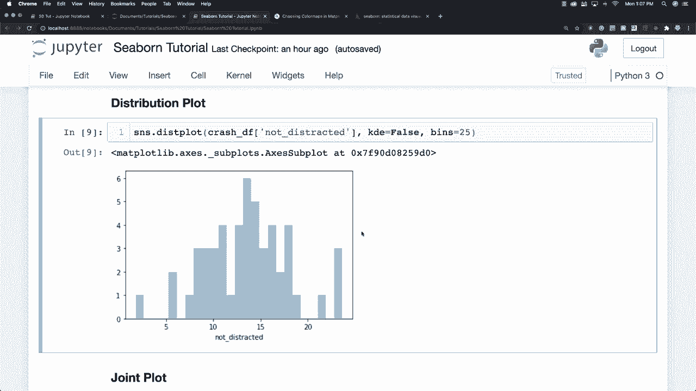

# 更简单的绘图工具包 Seaborn，一行代码做到 Python 可视化！1小时教程，学会20种常用图表绘制~＜实战教程系列＞ - P4：L4- 分布图 

在 GiHub 好的，现在我想谈谈你可以使用的不同分布图，第一个我们要看的图叫做分布图，基本上它们提供了一种查看单变量分布的方法，你可能会问什么是单变量分布？它只是为一个变量提供分布，获取它们的方法是说 S 和 S。

分布图，当然你可以通过按 shift 和 tab 找到更多关于这个具体命令的信息，它会向你展示所有关于可用属性的不同信息，我将覆盖其中一些内容，而一些我不会，我会尝试在提供你会经常使用的内容与深入每个你不会用的内容之间找到一个平衡点。好吧，假设我们对没有分心的事故感兴趣，我们可以在这里看到一张图，这条线或者说这是一个直方图图，这就是它的名称，而这个图是所谓的核密度估计。

如果你进来这里不想要那个，你可以直接说 KdeE 等于 false，看看它现在消失了，基本上它只是提供你数据集总结果的估计，没什么复杂的，还有我们能在这里做些什么呢？

我们还可以定义区间，所以我们可以说区间等于 $25，看看这如何改变我们的数据，基本上区间就像一个桶，用于将数据分隔成不同的区间。例如，如果你在做利润方面的分析，可以说把10到20之间的所有利润放在一个桶或区间里，这只是决定你在数据中会看到多少条这样的柱状图，基本上这就是分布。

