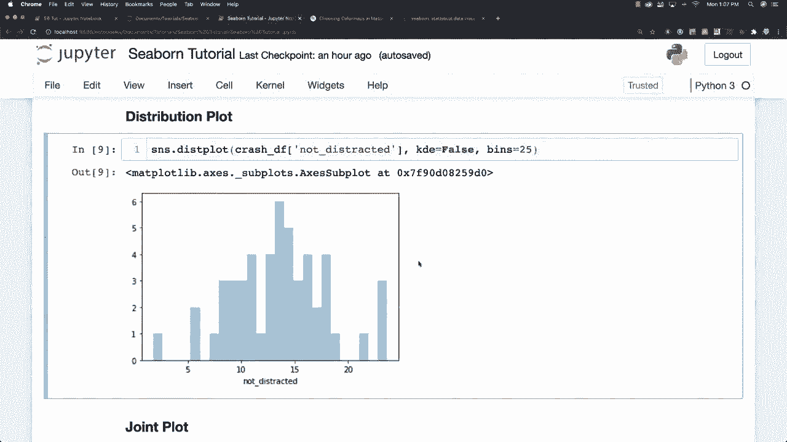
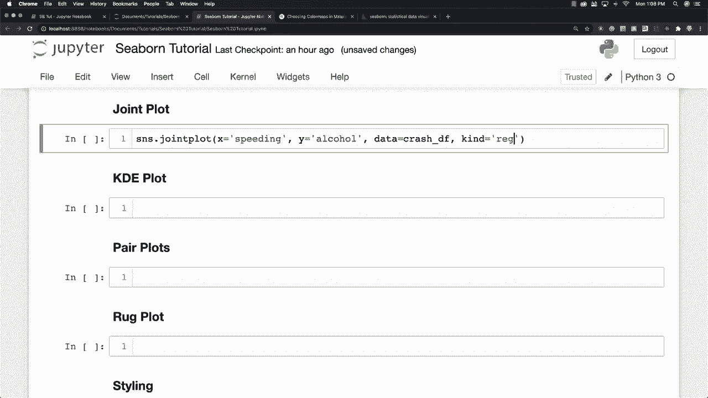
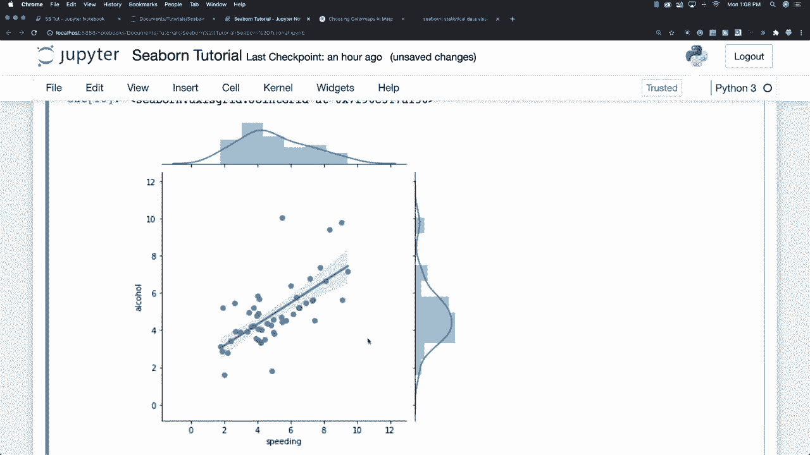
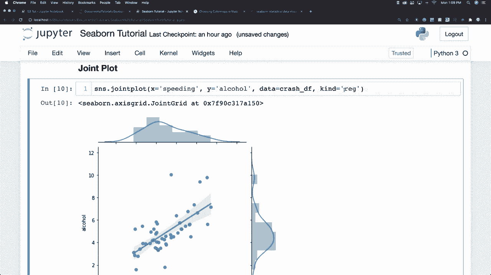
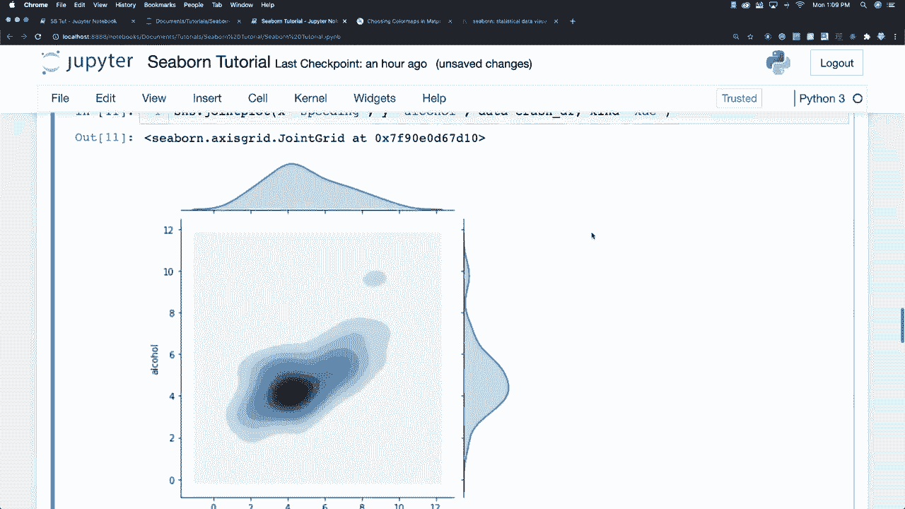
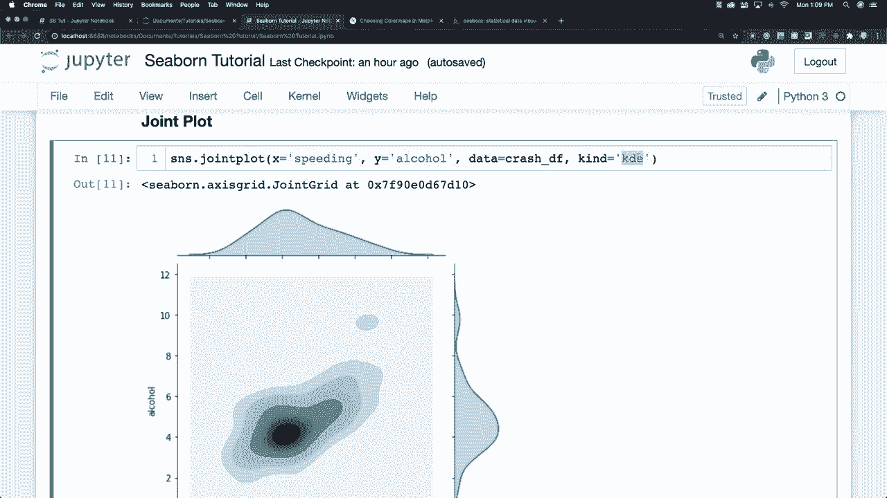

# 更简单的绘图工具包 Seaborn，一行代码做到 Python 可视化！1小时教程，学会20种常用图表绘制~＜实战教程系列＞ - P5：L5- 联合图 

现在我们也进入了分布图的领域。我们有叫做联合图的东西，联合图将用于比较两个分布，默认绘制散点图，所以我们可以使用联合图，假设我想在 X 轴上接收与人员是否超速相关的数据。

并且在 Y 轴上与人员是否醉酒或酒后驾驶相关。

你可以说数据是相等的，我们正在使用碰撞数据框，假设我们想生成一条回归线。我们可以设置类型为回归，然后你会看到它在这个地方绘制了所有这些疯狂的东西。

你还可以通过进入类型区域并设置 KdeE 来创建这样的 KdeE 图，看看我们可以在这里制作的各种酷炫图表，KdeE 再次指的是核密度估计，正如我之前所说的。

只是估计数据的分布，你也可以创建一个六边形图。

